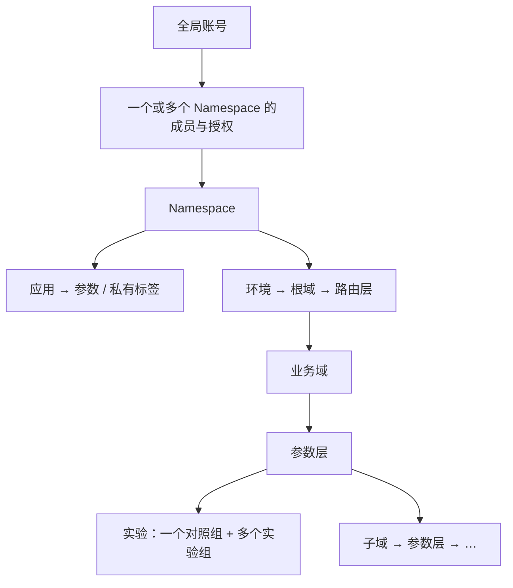

# EXP Lab · 企业 AB 实验平台

统一管理前端、后端和策略实验的中文交互原型。

- **原型 v23**：React + TypeScript + Vite，本地浏览器运行，配置保存在 localStorage。
- **生产设计 v1.3 · 2026-09-23**：一期控制库收敛为 30 张表，覆盖 Namespace、细粒度权限、API、SDK 和指标元数据；服务端能力尚未实现。

## 启动

```bash
npm ci
npm run dev -- --host 127.0.0.1
```

打开终端给出的地址，通常为 `http://127.0.0.1:5173`。`localhost` 与 `127.0.0.1` 是不同浏览器来源，不共享本地数据。

```bash
npm test
npm run build
npm run preview
```

测试命令使用 Node 的 `--experimental-strip-types`；运行环境需支持该选项。

## 先读什么

| 目的 | 入口 |
| --- | --- |
| 操作当前原型 | [使用手册](docs/平台文档/03-平台使用手册.md) |
| 理解产品与页面 | [产品设计](docs/平台文档/01-产品设计.md) |
| 看整体技术结构 | [技术架构](docs/ARCHITECTURE-企业AB实验平台.md) |
| 理解 Namespace 和资源授权 | [Namespace 与权限](docs/服务端技术方案/05-Namespace与权限设计.md) |
| 开始服务端实施 | [服务端技术方案](docs/服务端技术方案/README.md) |
| 查看全部文档及适用范围 | [文档导航](docs/README.md) |
| 核对实际验证结果 | [原型验证记录](docs/VERIFICATION.md) · [文档交付校验](docs/服务端技术方案/交付校验记录.md) |

## 核心模型



图中 Namespace 和权限是生产设计，当前原型仍是一个本地演示工作区。

一期采用直接用户／机器授权，用户组授权留待后续。配置版本、分组和分析计划按不可变快照保存，不为每个协议 ID 单独建表。30 张表指 PostgreSQL 控制库；业务事件、资格快照和分析事实沿用相应数据设施，详见[数据库清单与存储边界](docs/服务端技术方案/01-数据库设计.md)。

| 概念 | 规则 |
| --- | --- |
| Namespace | 资源、配置和授权边界；承接旧方案的“项目”，不再叠加另一层空间 |
| 账号权限 | 用户可加入多个 Namespace；按角色、资源范围和环境授权 |
| 域 | 划分流量；子域继承父层完整参数范围 |
| 层 | 划分参数；同域唯一归层，跨层独立分流 |
| 桶 | 每层 10,000 桶，自动组合空闲桶段，保留既有分配 |
| 参数 | 在应用下注册；标签应用私有；完成归层后才能用于实验 |
| 受众 | 按固定版本筛选资格；与祖先条件相交，未命中不换桶补量 |
| 实验 | 2–20 组、唯一对照组、各组参数 Key 一致；组合约束已下线 |

不同 Namespace 的资源隔离不等于用户流量互斥。同一用户可参与多个 Namespace 的实验；需要共同控参的实验应放在同一 Namespace，通过层域处理冲突。

层域依据 [Google 2010 论文](https://research.google.com/pubs/archive/36500.pdf)。10,000 桶、受众桶复用、根路由治理及本平台 API 是工程选择，不是论文规定。

## 原型体验顺序

1. **应用管理**：登记应用，在应用内注册参数、维护标签。
2. **层域管理**：为参数完成归层；建子域时自动生成承接全部参数的初始层。
3. **受众管理**：登记画像属性，组合 AND／OR 条件；保存为固定受众版本。
4. **实验管理**：新建全页草稿，填写范围、分组参数和指标配置；检查问题后提交审核。
5. **参数工作台**：批量选参，编辑长 JSON，搜索定位并查看组间差异。
6. **分流验证**：输入模拟用户与固定画像，查看完整递归路径和参数覆盖。

草稿可保存未完成字段和错误 JSON。源码、配置区和所选分组可刷新恢复；光标、滚动和撤销仅保留在当前编辑会话。参数目录和差异视图只读，不自动合并配置。

## 已实现与待实现

| 能力 | 当前状态 |
| --- | --- |
| 应用参数、私有标签、参数注册与归层 | 本地实现 |
| 递归层域、碎片桶、受众条件和分流解释 | 本地实现 |
| 多分组、全页草稿、JSON 工作台、结构差异 | 本地实现 |
| 层域负责人、临时期限与到期提醒 | 本地实现；负责人不是权限，到期不自动回收 |
| 实验审核、状态流转、报告图表 | 演示流程；已有结果为示例数据，新实验不虚构收益 |
| Namespace 切换、全局账号、细粒度权限 | 生产设计，未实现 |
| 服务端事务、真实审批、配置发布、SDK | 生产设计，未实现 |
| 真实画像、曝光采集、统计分析 | 生产设计，未实现 |
| 参数表格、可编辑 JSON 树、固定基线与覆盖 | [后续方案](docs/多分组与批量参数配置方案.md) |

## 本地数据边界

- 拓扑、应用、参数和受众：`exp-lab-topology-v1`。
- 正式实验：`exp-lab-experiments-v3`；旧版键保留。
- 草稿：`exp-lab-experiment-draft-v1:<draftId>`，包含乐观 revision 检查。
- 存储失败或已检测到的版本冲突会保留输入，不以空白内容覆盖旧数据。
- 这些保护不构成跨标签页原子事务、多人协作或跨设备同步。
- 原型参数 Key 在整个演示工作区唯一；生产设计改为 Namespace 内唯一。
- 原型分流只返回命中实验的显式覆盖；完整基线、签名快照和 hash v2 由生产 SDK 方案定义。

旧参数认领、标签迁移、路由兼容和完整操作限制见[使用手册](docs/平台文档/03-平台使用手册.md)。各版本验证结果是历史证据，本次文档更新不代表重新执行原型测试或浏览器验收。
