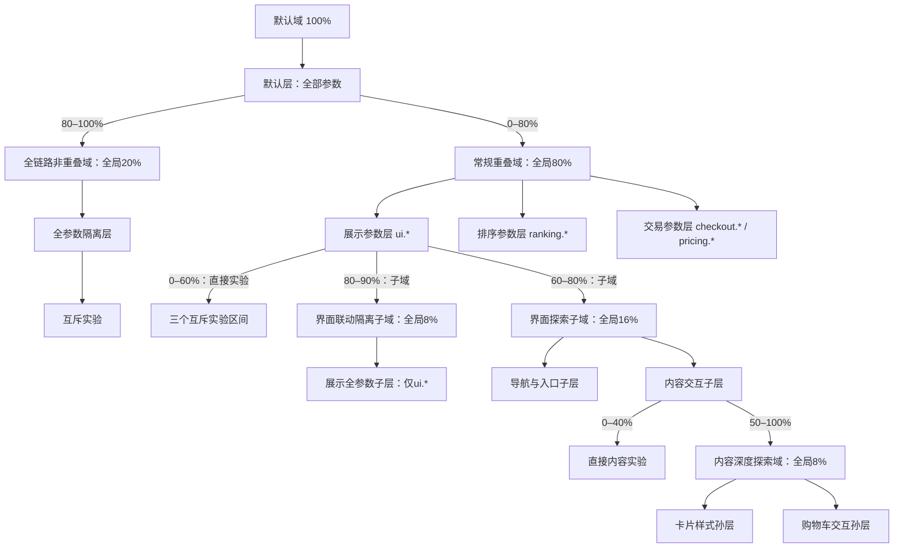
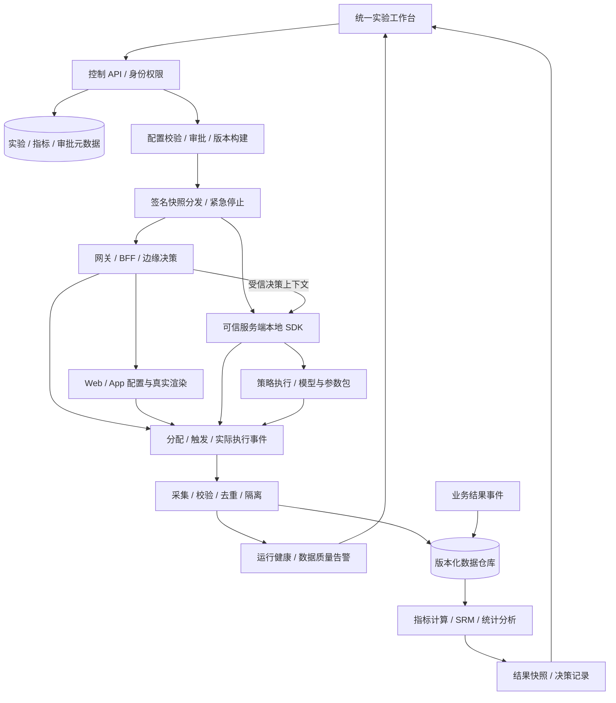

# 企业 AB 实验平台 · 架构评审方案

版本：v23 · 2026-09-16。分组参数引入按需加载的 CodeMirror 6 源码工作台、只读目录、严格 JSON 分析和组间结构差异，保持完整原文草稿模型。v22 层域管理元数据、到期提醒和拓扑过期快照检查继续保留。实验草稿、递归层域、应用参数、固定受众版本、10,000 桶和多分组不变，组合约束维持下线。生产架构仍为规划建议，层域依据 Tang 等人的 Google 2010 论文；此前交付与验收记录保留。

配套文档：[产品方案](./PRD-企业AB实验平台.md) · [研究依据与设计取舍](./research/architecture-notes.md)。

## 1. 目标与交付边界

以 Google 论文的 Domain → Layer →（Experiment 或子 Domain）递归结构为核心：域切分流量，层切分参数，实验在指定流量上覆盖参数值。服务唯一拥有参数，注册后待归层、完整分配后激活；标签在所属应用内分类，实验保存固定参数集合；涉及服务从参数归属推导。统一随机化、决策上下文、曝光、指标与治理是生产目标；应用类型不能代替层域模型。

当前可运行交付为 React / TypeScript 浏览器交互原型：应用目录及应用内参数维护、本地服务目录／环境模式、参数归属与标签、层域负责人和使用期限、全页实验草稿工作区、多个实验分组、长 JSON 源码／只读结构差异、分流模拟、localStorage 保存和导出。它没有生产鉴权、服务端分流、SDK、事件采集、真实统计、审批或配置发布能力。

本文中的生产服务、运行时协议、生产门禁和 SLO 均是待实现方案；原型中的数字不能证明性能、显著性或业务收益。本方案面向单企业部署，保留项目与环境权限边界，不设计多租户能力，也不预先承诺合规认证。原型内的分流模拟器在浏览器计算固定桶位、域归属、各层实验命中及参数合并，仅验证规则，不处理生产请求；受众资格以同一用户的固定入组快照判断；条件为未知时不执行，也不换桶补量。

## 2. Google 论文模型与实现边界

**论文事实。** 已核对完整 PDF 的 §3–4（PDF 第 3–6 页）及 Figure 2–3。Domain 是流量切分；Layer 是系统参数子集；Experiment 是能覆盖零或多个参数值的流量切分。域包含层，层包含实验，也可以包含子域；嵌套域能继续细分父层参数。默认域和默认层覆盖全部流量与全部参数。[Google 论文原文](https://research.google.com/pubs/archive/36500.pdf)

Figure 2b 先将请求分到非重叠域或重叠域：非重叠域只有一个覆盖全部参数的层，每请求最多进入一个实验，可改变任意参数；重叠域有多个参数层，每请求在每层最多进入一个实验，跨层可以同时命中。不同互斥域可采用不同参数分区。（PDF 第 4 页，§4，Figure 2b/d）



树中每条“层 → 子域”边都是相对于该父层的流量份额；“域 → 层”边划分的是参数，不再切分域流量。同一层的直接实验与子域共用一个桶轴，所以用户不会同时命中父层直接实验和它的子域。进入界面联动隔离子域后仍可执行常规重叠域的排序、交易层实验；隔离只作用于展示参数分支。

**论文约束。** 同一域的普通层构成参数分区：一个参数只能归属其中一层，实验只能覆盖所属层的参数。不同域可以对同一参数采用不同分区；“参数在全平台只许归一个层”会过度限制模型。前端、后端、策略参数可按依赖关系分到一层，不能仅按部署端命名后认为安全。（PDF 第 3–4 页，§4）

**发布层的特殊语义。** Launch layer 位于默认域，覆盖全部流量；它另有参数分区，提供替代默认值。普通实验的显式参数覆盖优先于发布层，再优先于系统默认值。它不是与非重叠域、重叠域争抢份额的第三个流量域。（PDF 第 4 页，§4，Figure 2c/d）

**自研封装与简化。** 平台的一个 Experiment 管理对象把对照 / 处理封装为 variants；论文中 control 本身也称 experiment。决策必须保证每请求每层至多命中一个分流单元及其管理实验。本次原型已实现可递归层域树、下钻、父层共桶、完整分流轨迹、继承作用域与新建子域。初始配置有 6 个域和 10 个层，包含孙域；表单在父层空闲或已证明资格互斥的桶区间创建子域，并保存到浏览器。v18 的重叠与非重叠子域均先生成一个“初始参数层”，承接父层全部继承参数。重叠域可在后续通过“新建层”拆分，非重叠域继续保持一个完整参数层，允许继续嵌套至多一个并行实验的非重叠分支。16 级域深度上限、参数必须完整分区、80%/20% 根配置、固定 user_id、10,000 个固定桶、多段分配和演示 hash 都是本平台的实现选择。共享对照和发布层完整执行仍未实现。

**容量分母。** 同一父层的兄弟域与直接实验配额共用父层流量并互斥；每个普通层可使用其域内全部流量；层内实验占比针对域流量；组内分组占比针对实验准入流量。示例：80% 常规域 × 20% 界面探索子域 × 50% 内容深度探索域 = 全局 8%；其卡片层 50% 实验 × 50% B 组 = 全局 2%。20% 根非重叠域 × 50% 层内实验 × 50% B 组 = 全量 5%。重叠域多个层的使用量不应相加成全量占用。

### 2.1 递归决策、受众资格与桶复用

配置结构为 `Domain.parentLayerId → Layer.domainId → Domain` 交替连接。根域父层为空，唯一默认层负责根流量路由；域的 `traffic` 以父层为分母，实验的 `traffic` 以所属层为分母；实际桶集合由 v19 的 `bucketRanges` 表达，旧起点字段按兼容规则解释。`*` 只继承激活父参数范围。受众是资格条件，独立于参数层：最终条件包含所有祖先域条件及当前域／实验受众，不能因桶复用放宽参数分区。

```text
walk(domain, fixedUserEligibility):
  require domain's inherited AND local eligibility == true
  for each nonempty layer in domain:
    bucket = stableHash(unit, layer_id, epoch)
    candidates = direct reserved experiments + child domains covering bucket
    eligible = candidates whose full inherited eligibility == true
    if more than one eligible: fail closed
    if eligible domain: walk(domain, same fixedUserEligibility)
    if eligible running experiment: selectVariant; mergeParameters
    otherwise: useDefaults; do not move bucket or backfill
```

根路由、各层及变体保留旧 hash 命名空间；受众版本、画像属性和估算值不加入 hash。资格未匹配或未知只影响是否执行，不更换桶或尝试其他桶。待审和暂停继续预留区间，但不执行。空层、待归层参数及同层参数覆盖保护继续生效。

同父层的实验与子域统一为带有效资格条件的区间，所有相交区间必须逐对比较，不能只检查排序相邻项。例 `[0,100)` 与 `[1,2)` 资格互斥，不能据此漏掉 `[0,100)` 和后续 `[3,4)` 的冲突。只有固定用户资格约束可证明互斥才允许重叠，不能证明时保守占桶；名义占用使用区间并集。自动分配按桶号升序组合空闲桶，只忽略与当前候选可证明互斥的占用，不移动旧区间。

初始 80%／20% 等配置和旧平铺迁移保留；旧迁移只在空闲桶添加示例域，不重新分配已有实验。新建域可选择不可变受众版本，仍校验连接无环、父容量、随机化单元、激活参数分区和非重叠模式。新受众与更复杂条件不意味着开放域份额编辑或运行中迁移。

模拟器返回每个固定桶、候选资格、拒绝／未知原因、进入域、最终实验／版本及显式参数合并。初始示例 user_219、user_98、user_5 的无额外条件路径仍供演示；配置改变后重新模拟。资格画像只是本地模拟输入，分流不是曝光，不据此计算真实业务覆盖或收益。

### 2.2 独立新建层与空层待配置

`planLayerCreation` 支持三种路径：保存不含参数的空普通层；将同域允许转移的已激活参数分配到新层；选择待归层参数，一次完成建层与首次归层。新层使用新 ID，继承域流量；已有域、层、实验的 ID、桶段与 hash 命名空间不变。合法重叠域允许添加空层，但默认根域、非重叠域及非重叠祖先分支的原有限制仍生效。

空层只是待配置容器，不能承载实验、零参数 A/A 或子域。`validateTopology`／`validateAllocation` 从解析后的作用域检查，容量查找、最大并发数与模拟器也不能把空层视作可执行层；界面禁用只是提前反馈。这个限制不否定论文允许实验覆盖零参数的定义：本轮禁止的是空参数作用域中的实验，属于原型生命周期约束。

对已有激活参数，来源层先解析 `*` 后写回剩余显式参数，拒绝搬空来源层。全部未结束正式实验（含历史 `status=draft`）使用的 Key 均受保护；来源层若有子域，保护完整继承范围。v21 独立编辑草稿不进入这些正式实验预留，提交时须重新核验参数归属和范围。保存还须比较当前与候选拓扑，拒绝清空／删除旧非空层或绕过计划直接转移受保护参数。

`NewLayerInput.pendingSelections` 保存待归层参数的首次分配选择，`newLayerRegistrationAssignments` 返回强制的祖先路径与新层归属，以及仍需选择的其他受影响分支。深层建层不能只给目标层加 Key：其祖先必须合法继承该参数，默认路由层下的其他受影响兄弟域也必须完成唯一分区。所有步骤通过后才一次保存并激活；失败不留下半建的层或部分归属。

### 2.3 已实现的参数关系查询

`src/parameter-relations.ts` 从 `getTopology()` 和实验声明生成查询视图，归属通过 `layerScope()` 递归解析，避免目录显示与分流配置不一致。具体应用的“参数”页签只对当前服务拥有的参数提供搜索、标签／层筛选、按域筛选、逐域归属路径、直接引用实验、版本原始 JSON 值、转移阻断原因及深链导航。父层继承不会被算成父层直属实验引用。

校验报告域内重复归属、未结束实验的失效／越层引用、路由层实验绑定，以及无效 JSON、版本缺少声明参数或新注册参数的取值类型错误。合法的历史引用与 JSON 的 false、0、null 和对象值均保留。已结束实验在参数转移后可继续展示历史记录。具有注册定义的参数同时展示类型、默认值、名称、负责人、说明与注册时间；历史内置参数不推断缺失的类型定义。此视图不替代完整拓扑和流量校验，生产审批及发布能力仍待实现。

### 2.4 参数登记、待归层与首次激活

`src/parameter-definitions.ts` 保存 Key、名称、五种顶层类型、默认值、负责人、说明与注册时间。`Topology.parameters` 仍是新增定义数组；`parameterKeys()` 返回历史内置 13 个 Key 与新增定义组成的注册全集。`Topology.pendingParameterKeys?: string[]` 单独标记已登记、尚未归层的参数；缺少此字段的旧拓扑保持全部已激活，不根据参数前缀或定义创建时间猜测状态。

`activeParameterKeys()` 返回可参与分流的全集，`isParameterPending()` 供界面与核心判断。根域范围使用激活全集，`*` 只继承激活父范围；显式层参数列表引用 pending Key 必须报错，不能靠过滤隐藏非法配置。因此注册不会动态扩张默认层、非重叠全参数层或任何后代星号层。

`planParameterRegistration(input, existing, t?)` 仅校验定义、全局 Key、所属应用与本应用私有标签，生成定义、catalog 绑定和 pending 状态，不修改层列表。注册界面不要求选层；旧调用签名的兼容桥也不能偷偷完成激活。注册默认值仍须匹配类型并为有限、可序列化 JSON，拒绝非有限数字、循环值及超过 32 层的结构；对象字段 schema 与数值范围仍未实现。

独立的 `planParameterLayerAssignment(key, selections, existing, t?)` 根据 `registrationAssignments` 从根域遍历所有受影响域：单层域自动归属，多层域选一个层，再展开所选层的每个子域。候选拓扑补齐全部分配后才移除 pending 标记，并复验激活参数完整唯一分区、父范围、模式和受保护实验。单参数首次归层或建层时的首次归层均为一次拓扑保存，不支持半激活。

生命周期计划放在独立 `parameter-assignment.ts`，`parameter-registration.ts` 保留相关导出兼容；模块之间不能在顶层互相调用未初始化函数。`saveTopology` 除结构校验外还拒绝旧 active Key 回到 pending，防止借待归层状态移除受保护参数；一旦当前配置存在归层状态字段，后续候选必须保留该字段（可为 `[]`），防止遗漏字段使星号隐式激活参数。旧数据无字段的兼容仅用于载入。已有定义、服务归属和 v10 标签迁移保护继续生效。目录、生命周期和层分区仍写入同一份 localStorage 快照，不构成服务端事务或多标签页并发保证。

参数页区分“待归层”与历史“待归属服务”，两种状态不能混同。待归层可查看定义与维护应用标签，但无当前层归属，不能加入实验。实验参数选择仍支持跨应用累计 Key，标签先按应用筛选；只允许已激活且位于当前层范围、服务已明确的参数加入。默认值补入各分组时保留已填写值，核心复验版本类型及固定 Key 集合。

注册、首次归层和建层不改旧实验 JSON、桶位置、流量与 hash。默认值只供作者编写初值，模拟器只合并命中实验的显式覆盖；固定默认值版本、完整运行快照、生产 SDK 下发与运行时回退仍未实现。

### 2.5 已实现的应用管理与服务目录

产品一级入口为“应用管理”，内部保留 Service 实体及现有 ID，不修改参数 Key。`#applications` 显示应用目录；`#applications/services/<id>/<tab?>` 表达应用详情及五页签；`#applications/services/<id>/parameters/<key?>` 表达当前服务的参数目录／详情。参数维护不再提供全局列表入口，ParameterCenter 是 ServiceCenter 参数页签内的服务范围组件。

`Topology.catalog` 使用 `schemaVersion: 2`，包含 `services`、`tags`、`bindings`，可带用于旧数据恢复的隐藏归档。`ServiceDefinition` 保存 id、name、owner、type、description、createdAt 和三项环境配置；类型为 frontend／backend／strategy／gateway。默认示例为 ui-web、ranking-service、checkout-service、pricing-service。应用详情有概览、参数、接入配置、运行观测、关联实验五个页签。

`ServiceEnvironment` 的 name 为 development／staging／production，mode 为 direct／delegated。direct 不允许携带决策网关；delegated 必须引用其他 gateway，沿同环境解析并检查环。目录没有就绪、在线、心跳或凭证字段，校验拒绝未经定义的运行状态。登记应用仅创建三个 direct 环境，保存某环境不改另外两个。所有 UI 状态为待验证，运行数据为空；伪代码不代表真实 SDK/API。

`getCatalog(t)` 为没有 catalog 的旧拓扑生成明确的示例目录与绑定：13 个内置 Key 通过固定映射指定服务，旧自定义 Key 显式保留 `serviceId: null`，不会按前缀猜测归属。第一次目录写入将该目录物化到同一份拓扑。应用从目录登记，参数只能进入具体应用后注册；目录写入经过 plan 和 `saveTopology`；它们是本地保存，不生成服务端身份或连接证明。

### 2.6 参数服务归属与应用私有标签

`ParameterTag = {id, serviceId, name, color}`。ID 在目录中唯一，名称按 `(serviceId, trim(name).toLowerCase())` 唯一；不同应用可有同名标签，但不能按名称跨应用复用。`ParameterBinding = {key, serviceId, tagIds}`，每个注册 Key 只有一条绑定；新参数必须指定现有应用，每个 tagId 都必须属于该应用。应用详情注册入口固定当前 serviceId 并初始化负责人，不能切换服务或行内登记新服务。标签可为空或多个；新建标签先保存到当前应用，取消随后参数注册不会撤销标签。

所有普通标签读写均带应用范围，包括目录读取、创建、筛选、单项及批量绑定。`planParameterTags` 的追加、移除、替换须复验参数与标签同应用；页面过滤不能替代核心校验。应用参数组件先按 serviceId 裁剪参数全集，再执行搜索、标签／层筛选及批量维护；切换应用不得沿用另一应用的勾选写入。标签操作不写实验、层范围、桶段或随机标识。

创建实验的 ParameterPicker 保留跨应用参数选择。未选具体应用时不显示标签名称或标签筛选项；选定应用后只读取其私有标签，多标签任一匹配。切换应用清除标签筛选，但保留跨应用累计的已选 Key；只有已激活、在当前层范围内且已归属服务的参数可加入。实验保存固定 `parameterKeys`，标签后续变化不改变已存实验。

旧无版本共享目录只在加载或显式 `migrateServiceCatalog` 边界迁移到 `schemaVersion: 2`：按实际使用参数的所属应用生成稳定 ID 的私有副本，保留名称、颜色和关联。`legacyTags?: {id, name, color}[]` 隐藏保留旧标签，包括未引用项；未归属参数的 `tagIds` 置空，用 `pendingTagIds?: string[]` 保留原共享 ID。应用标签列表不暴露归档。`planParameterService` 认领参数时，在目标应用复用同名标签或创建私有副本，然后清除 pending 引用。现代目录严格校验，不把跨应用绑定当作旧数据自动修复；无效原数据或迁移写入失败时保留原存储并锁定保存，`getTopologyLoadError()` 为页面提供错误说明。

历史待归属认领区只在目录存在未归属参数时出现，不形成全局维护页。已明确的服务归属暂不可直接迁移；参数 Key 仍全工作空间唯一，未支持服务内同名 Key 或自动改名。迁移与认领不修改已有实验值、Key、域树及分桶。`experimentServices` 根据参数 binding 去重推导服务，实验不另存可编辑的服务 ID 列表；集中网关决策不会转移参数所有权。

### 2.7 路由兼容与应用作用域

旧 `#parameters` 与 `#applications/parameters` 全局列表入口回到应用目录；旧参数 Key 链接先通过 binding 解析实际服务，再进入带 serviceId 的参数规范路由。未归属或未知 Key 导到 `#applications/unassigned/<key>`，由目录内反馈说明，不自动选择另一个参数。显式服务路径中的 Key 必须属于该服务；无效或不匹配组合不得加载可编辑的其他参数。

页签名、参数 Key 与服务 ID 从路由恢复，刷新保留选中页签。应用切换后过滤、选中参数、批量 Key 与注册 serviceId 必须保持同一个服务作用域。浏览器界面范围控制不能代替生产 RBAC；服务端仍需身份、资源及写入权限复验。

### 2.8 组合约束下线与旧契约兼容（v20）

v20 下线实验组合约束：创建、摘要和详情不再展示规则，`validateAllocation` 不再执行 `parameterRules` 或历史联动规则。旧字段只为存储兼容保留；类型、相同 Key 集合、层范围和历史执行绑定的基础完整性检查继续独立执行。

旧 `Experiment.type` 只保留数据结构兼容，用户不再在实验中选择类型；新页面按服务归属汇总。旧 `coordination` 仅保留 bindings 的历史信息及基础完整性检查；rules 不再执行或展示。新建向导不再生成执行矩阵。

组合模板、模板版本、字段 schema 和统一生产发布门禁均未实现。默认值只是编写初值，尚未固定版本或合并成完整执行快照。详见[应用管理、参数与联动实验设计](./联动实验设计.md)。

### 2.9 画像属性目录、不可变受众与 AND／OR 条件

`Topology.profileAttributes` 是独立于实验参数的画像定义目录。`ProfileAttribute` 包含 key、label、type、description、createdAt，可为枚举增加 values，为数值增加 unit／integer。支持 enum、number、boolean、string；新登记不接收或保存来源应用绑定；历史 serviceId 仅作为不可变旧元数据原样保留，不校验对应服务是否存在。Key 在画像目录中唯一且不能包含原型链保留词；当前画像是标量平铺映射，点号属于 Key 字面值，不会进入 `parameterKeys` 或改变层分区。属性目录仅描述预期上报契约，没有真实 SDK 采集、数据质量或连接状态。

已登记属性整条定义不可修改、删除或因省略字段退回内置目录；语义变化应登记新 Key，本轮没有独立属性版本发布机制。内置 country／platform 的 values 继续作为建议值，以兼容旧开放枚举条件和快照；自定义枚举采用登记的闭合集合。内置开放取值按固定内置 Key 判断，不能因自定义属性省略来源字段而放宽值域。数值须非负有限，integer 控制整数约束。属性注册、验证与保存过渡在独立 `profile-attributes.ts` 中实现，与参数定义和应用私有标签分别校验。

`Topology.audiences` 保存不可变 `AudienceDefinition`，含 id、familyId、name、description、owner、version、createdAt。旧 rules 数组继续按 AND 解释，不改写历史对象；新 expression 表达 rule 叶节点和带 and／or 运算符的 group。新树不同时携带另一套非空旧规则，防止两个来源执行含义不同。id 唯一、同系列版本递增；不同系列不能使用归一化后同名名称，同系列新版本可沿用名称。域／实验通过固定 audienceId 引用，已有引用不自动升级。

条件树先验证属性、操作符、类型与值域，最多 3 层 group（含根组）和 30 条 rule，再进行有限证明。显式无条件受众与遗漏条件不同；空子组、非法叶节点及不可达分支需要反馈具体路径。执行采用三值逻辑：AND 遇已知 false 为 false，OR 遇已知 true 为 true，其余必要信息不足时为 unknown；不因缺值或坏规则删除分支。规则详情与引用分析遍历完整 expression，旧 rules 只作为历史兼容输入。

有效资格为全部祖先域条件 AND 当前受众完整树。受众目录允许重叠；同父层的实验和子域仅在桶区间相交时需要证明资格互斥。有限证明把条件展开为可满足的合取分支，检查双方所有分支对；只有全部交集为空才判定 disjoint。发现部分互斥不能代表整体，抽样或规模估计不能作为证明。单份条件展开超过 64 个合取组合或遇未知语义时保守返回可能重叠，不允许复用相交桶。合成的交集见证仅用于解释规则可能同时满足，不代表真实用户或受众规模。

属性全部按同一 user_id 的固定入组快照解释，不能使用实时平台、会员或地区差异直接证明用户互斥。规则、画像与估算值不参与 hash；运行仅检查既定桶，不换桶补量。保存继续保护旧域的 audienceId／parentLayerId 和旧层的 domainId，避免通过重挂父链改变原资格；参数生命周期、空层、分区和转移保护不放宽。

受众管理的受众／画像属性两个页签承担集中登记和查询，域及实验旁的快捷新建使用同一编辑器。属性影响从完整规则引用推导至直接引用域、继承域及实验，不读取同名实验参数作为画像依赖。快捷编辑器关闭仅返回父流程并保留草稿，不能借嵌套弹窗 Escape 清空实验或域配置。

创建受众的纯预检统一检查定义有效性、祖先交集、目录受众关系和可选的层／流量分配上下文。实时展示与提交检查共用逻辑；完整有效条件用于全部已有实验／子域比较，自动组合桶时避开无法证明互斥的占用。普通目录重叠不拒绝登记；内联配置可用桶总量不足时拒绝保存当前受众用于该配置。

实验引用入口统一生成 `#experiments?audience=<encoded-id>`，只保存单个固定受众 ID，不把表达式序列化成可执行 URL 条件。`experiment-audience-filter.ts` 从现有实验和递归拓扑派生引用集合：包括实验自身的固定版本，以及祖先域绑定的版本，同一实验去重；已知旧名称只映射到对应内置版本，不根据系列或名称自动选新版。画像属性入口先按完整规则树找到使用该 Key 的受众版本，再分别进入该版本的实验列表，不把同名实验参数当作画像依赖。

完整实验表先计算受众引用基数，再叠加状态、搜索、涉及服务和负责人条件；状态页签计数使用受众基数。受众 URL 变化同步下拉选择和页码，未知、无效或重复参数返回明确可清除的空态，不能静默显示全量。外部受众入口清除其他残留筛选；列表内主动切换保留显式组合条件。App 只记录严格列表路径的来源 hash 供详情返回使用，列表刷新从 URL 恢复受众；不承诺将其他临时筛选持久化。总览的紧凑表不应用受众列表筛选。

v14 实验详情的受众／属性上下文定位仅兼容旧链接，新来源入口不再生成此类实验详情地址。域链接继续使用目标域 ID 加受众 ID 或属性 Key，并核对真实直接／继承关系后显示条件；本轮不新增域列表。未知来源或失效引用不会改变资源配置。以上都是只读查询，不写实验、受众定义、层域或 hash 分流输入。

### 2.10 固定画像模拟与规模边界

`simulateAllocation(unitId, existing, topology, profile)` 是消费固定资格输入的纯规则模拟，本身不保存身份或承诺粘性入组。页面把同一浏览器 user_id 的首次成功画像写入 `explab-simulation-profile-snapshots-v1`，按属性目录读写内置与自定义字段。只读取画像自身字段，不从对象原型继承值；已固定画像只读，首次缺少及随后登记的字段也不能对该 ID 补齐。验证另一画像需使用新 ID。

编辑器内的临时画像预览不记录用户，不参与分流及入组快照，只展示当前手填值的资格判断。

层域模拟器的有效资格快照支持刷新后按同一 user_id 恢复，不持久化模拟结果或当前输入的 user_id；新的结果需要用户手动运行。坏 JSON、任一无效记录、重复 ID 或读取失败时保留原存储并停止模拟；首次写入失败同样不执行，防止刷新后重新捕获资格。页面内已知画像与存储不同也拒绝覆盖。该机制没有真实身份认证、跨端分发或多标签页事务保证。

人工估算只使用输入假设：同口径基数 × 沿路径计算的名义份额 × 桶内完整资格交集的合格率。不能把 OR 分支或属性边际比例直接相加／相乘，不能把区间并集当唯一用户曝光数。受众规模、assignment、exposure 和 effective coverage 未接入时展示未接入；固定画像、规则交集见证、人工估算和业务观测是不同对象。

所有属性与受众目录写入仍处于同一份本地拓扑；实验另存，不能宣称服务端原子事务或并发保证。

### 2.11 层域应用参数浏览（v18，延续 v16）

`ApplicationParameterBrowser` 统一域继承范围、层关联参数、新建层和新建子域的显示与筛选。调用方传入固定候选 Key；组件按目录中的实际服务绑定分组，搜索 Key、登记名称与应用名称。仅在选定应用后提供该应用的私有标签，多个标签采用任一匹配。筛选不查询或加入候选范围之外的参数，不按 Key 前缀推断服务，也不写服务或标签目录。

域／层详情的候选分别来自 `domainScope`／`layerScope`；建层来自 `layerParameterOptions`，保留全局待归层候选及已激活参数的原有禁用原因。建层选择状态由父表单以固定 Key 集合保存，跨应用筛选不清除已选项。子域创建只读浏览父 `layerScope`，不传参数选择回调，不再保存 `keysA`／`keysB` 分区草稿；初始层继承完整范围，与当前可见行无关。编辑状态禁用离开弹窗的参数导航；只读详情链接按参数实际归属定位应用内详情。

应用浏览不增加层的单服务绑定，不修改目录结构。建层继续通过原有首次归层／转移计划校验，子域继续通过拓扑完整分区与桶冲突校验；应用分组不参与随机 hash、受众条件或实验参数取值。

### 2.12 独立分流验证与关注节点（v17）

`TrafficDomains` 提供“层域配置”和“分流验证”二级页签；`AllocationSimulator` 独立承载画像、完整轨迹和参数结果。组件在层域页面内部常驻，通过显隐切换页签，因此输入与结果可在两个页签和结果返回配置的流程中保留。离开一级导航会卸载该页面，刷新也不恢复这些内存状态；已有资格画像存储键保持不变。首次进入无自动结果，示例查找仅准备可用按钮，用户点击后才形成可查看的本次验证。

路由和解释放在纯模块 `traffic-validation.ts`。`trafficValidationHref` 生成 `#traffic/validation` 或附域／层及安全编码 ID 的关注地址；`parseTrafficValidationRoute` 只识别这一路径，拒绝非空查询、多余段、空标识及坏编码。普通 `#traffic/domain/<id>`、`#traffic/layer/<id>` 与既有受众引用上下文仍由原配置路由处理，不混入验证参数。未知关注节点保留其 ID 并提示，不回退到另一个目标。

关注节点不是 `simulateAllocation` 的输入，分流始终从默认域 `root` 开始，完整结果保留并行层。`explainTrafficFocus(focus, result, topology)` 只读取传入结果及模拟时拓扑，不重算分配。它以 `trace.kind + id` 确认访问，沿 `nodePath` 找到首个未到达节点；层已访问不代表实验命中。根域拒绝引用原准入记录；空层依据当时作用域解释跳过；域桶外由父层已记录 bucket 与域的全部实际桶段比较，段间空洞不算命中。处在同桶内时引用父层完整候选轨迹和分配记录，不把聚合 audienceStatus 的 match 当成关注域匹配。记录不足时说明无法确认详细原因；`result.error` 优先于任何局部到达轨迹。

结果保存其 `simulatedTopology` 和 `simulatedExperiments` 供历史解释。输入 user_id、拓扑或实验引用变化时，界面标识上次验证及需重新模拟，不能拿旧结果判断新配置。改变关注节点只改变解释与高亮，不重分桶、不改画像、不裁剪轨迹。返回配置可指向关注节点或首个阻断节点；这些操作均不写实验或层域数据。

### 2.13 子域的初始参数层（v18）

新建子域收集域名称、模式、流量与可选受众，v22 另加负责人和使用期限；域和唯一的普通“初始参数层”在同一候选拓扑中校验、保存。初始层完整继承父层的已归层参数范围，不能把应用或标签筛选结果作为持久化 scope，也不能纳入待归层参数或平行层参数。空父层仍拒绝创建，参数只有一项不再限制重叠模式；存在非重叠祖先时继续保持非重叠分支约束。

初始层不是根路由层或不可拆分的特殊层。合法重叠域之后可调用原有新建层流程转移可用参数；初始层须保留至少一个参数，未结束实验、子域继承、域内完整唯一分区保护继续适用。非重叠域仍只有一个完整层。已有层域不合并、改名或重分桶；旧创建时强制 A/B 两个非空子层的流程已被取代，相关 v16 记录仅说明历史验收。

### 2.14 固定 10,000 桶与组合分配（v19）

每个层的桶编号为 0–9999，沿用旧有哈希输出空间和 seed；1% 对应 100 桶，最小申请 0.01% 对应 1 桶。层按既有域/层命名空间独立计算桶号，实验版本仍使用独立 variant hash。创建子域、创建实验、提交审核及内联受众预检统一使用 `findAvailableBucketRanges`，按桶号升序组合可用位置，压缩为右开区间数组。申请只受总可用桶数限制，最大连续空闲长度不再是创建门禁。

域与实验新增可选 `bucketRanges: {start:number,end:number}[]`，单位为整数桶号。例如 15% 可以分配为 `[{start:3000,end:4000},{start:9000,end:9500}]`，共 1,500 桶。`traffic` 继续保存总百分比，`start` / `bucketStart` 仅保留首段起点的百分比兼容字段；存在数组时禁止从起点加总比例推导结束位置。数组须非空、整数、升序无重叠，端点在 0–10000 内，总数与比例一致，首点与兼容字段一致。非法显式数组不能回退为旧单段。

旧无数组的配置通过 `getBucketRanges` 兼容读取为原有单段，不批量重写本地记录；严格保留原比较边界，避免浮点转换改变旧用户的命中集合。新配置保存显式数组，已有域不能改变原占用集合或丢弃已保存数组；旧数组及新数组刷新后均以原位置生效。保留历史 `findAvailableStart` 只供旧平铺迁移使用，不参与新创建流程。运行、暂停和待审的已有实验不因其他配置创建而重排；审核预留在提交当时重新获取可用桶。

同层直接实验和子域共同参与占用。先筛去与候选完整有效受众可证明互斥的预留，再对所有实际桶段求并集与补集；未知资格保持保守。冲突结果记录实际交集数组，空洞不算冲突；运行时只判断用户固定桶是否属于某候选的任一段，不因资格失败改投其他桶。所有分配仍受参数范围、非重叠祖先和初始参数层约束。

层详情分别展示运行实验、暂停/待审、子域的分类去重桶数，以及全部配置的联合占用和未占用数。分类间可能因互斥受众复用同一坐标，分类数字不可简单相加；创建表单进一步按当前受众计算可用总量。桶数及名义比例不是实测用户数或曝光。图中按真实段定位，同一配置在列表中仅有一项；多段可展开。模拟解释、实验详情、CSV 与预览均使用实际数组及模拟时配置快照。

### 2.15 多分组契约（v20）

新分组使用 `Variant.id`、`role`（control/treatment）、`name`、`weight` 和完整 JSON `value`。一项实验支持 2–20 组，恰有一个对照组，名称和 ID 在实验内唯一，权重为正数且最多两位小数，合计 100%。这是当前原型容量选择，不是层域论文限制。分组份额以实验已分配流量为分母，所有分组共享同一声明 Key 集合。

新分组按整数权重基点在独立 variant hash 空间选择；实验桶集合与分组权重分别管理。`getVariantRole` 与 `getVariantId` 为展示和模拟提供兼容身份。旧全无 ID/role 的分组保持原数组顺序和百分比累加算法，首组仅作为兼容对照角色，不批量迁移存储或重分流。现代模拟结果增加稳定分组 ID 和角色。

创建表单按组切换编辑完整 JSON，新增／复制生成新 ID，并以 0 权重等待填写，不能以零权重提交正式实验；v21 编辑草稿允许暂存这些未完成内容。不会暗中调整已有组的比例。一键均分是仅针对当前草稿的显式动作，按 0.01% 分配尾差。删除保护最少两组及当前对照组，重新指定对照只改角色，不改数组顺序、参数和流量。

换层保留原分组文本并报告越界参数，显式默认参数初始化支持撤销；组值或元数据继续编辑后清除旧撤销快照，避免误恢复陈旧内容。批量添参先验证所有组为有限 JSON，准备完整候选数组后一次应用，保留已填值；格式化也拒绝非有限数字，防止序列化变成 null。

详情和 CSV 遍历全部分组，不能把第三组复用为 B。仅既有无元数据的两组示例保留明确标注的示例统计；现代分组显示待采集，不从总样本推算组样本或多组显著性。字段 schema、基线差异编辑和导入仍属后续[参数配置方案](./多分组与批量参数配置方案.md)。

### 2.16 全页编辑草稿与提交边界（v21）

`CreateExperiment` 作为全页工作区运行，提供“实验目标／范围与流量／分组与参数／检查与提交”四个可自由切换的区域。草稿状态不依赖逐步完成门禁；编辑区与参数源码原文保留，最终问题集合统一导航至具体区域、稳定分组 ID 和参数 Key。

`experiment-drafts.ts` 的 `ExperimentDraftForm` 保存名称、Key、描述、假设、流量比例、域／层／受众 ID、完整分组数组、指标与护栏。`ExperimentDraft` 额外保存草稿 ID、`section`、`selectedVariantId`、正整数 `revision`、创建／更新时间及可选 `submittedExperimentId`。存储使用逐项键 `exp-lab-experiment-draft-v1:<draftId>`，每项包含 `schemaVersion: 1`；不与 `exp-lab-experiments-v3` 正式实验列表或拓扑存储共用一个包。

持久化只验证可恢复的草稿结构，允许未填业务字段、暂时不合格的权重和错误 JSON 字符串，不能为了保存而解析、格式化或替换参数原文。自动保存及手动保存更新 revision；加载与列表枚举恢复已保存表单、配置区和选中分组。坏 JSON、未知存储版本、无效记录、读取权限或额度错误均返回明确失败并保留原数据。测试可注入独立存储，不需要读写用户浏览器数据。

保存前比对当前记录 revision，页面监听该草稿的外部存储变化；检测冲突后暂停自动写入，保留页面内草稿，提供另存、导出与显式加载最新版本。逐项键避免不同草稿互相覆盖整份目录，但 localStorage 不提供跨标签页 compare-and-swap 或多资源事务，因此不能宣称原子并发提交、多人协作同步或跨设备保存。离开守卫会尝试保存，失败不静默丢弃当前输入。

路由由 `experiment-draft-routes.ts` 解析：`#experiments/new`，按层入口 `?layer=<id>`，复制入口 `?copy=<experimentId>`，已创建草稿为 `#experiments/drafts/<draftId>`。冲突参数、坏编码及不合法草稿标识明确报错，不转成空白新稿。`experiment-draft-initial.ts` 复制参数原文、组顺序、角色与流量建议，为各组生成新 ID，不复制旧实验身份、桶分配或执行状态。已知旧受众名称映射至原内置固定版本，未知名称作为未解析受众 ID 保留，使提交校验阻断，不能降级为无限制条件。

`experiment-draft-validation.ts` 返回含 `section`、`field`、`variantId` 和 `parameterKey` 的问题项，校验正式提交所需的业务完整性；它不决定草稿能否暂存。提交先保存草稿，再读取最新可用实验列表并检查当前拓扑，重新运行流量分配及 `validateAllocation`。外部拓扑变化使当前快照过期时，界面要求刷新后再检查。成功写入的实验为 `review` 并预留桶，仍不参与模拟执行，启动需要单独审核动作。

正式实验带 `sourceDraftId`；同来源重复提交定位已存在的实验。随后将草稿标为 `submittedExperimentId`，列表不再提供其编辑入口，但保留记录作为幂等关联标记。正式实验已写入而草稿标记失败时，重新打开可按来源定位正式实验；这是一种本地恢复路径，不是服务端事务或跨资源一致性保证。

v21 交付时尚未实现参数固定基线、值表格、可编辑 JSON 树、路径级差异合并或完整运行快照。v23 已补充源码工作台和只读组间结构差异，见 §2.18；基线、表格、树编辑、差异合并与运行快照仍按后续方案建设。

### 2.17 层域管理元数据与保存边界（v22）

`TrafficDomain` 和 `TrafficLayer` 增加可选 `management?: ResourceManagement`，与现有拓扑共存于 `exp-lab-topology-v1`，不增加新的资源状态机：

```typescript
type ResourceManagement = {
  owner: string;
  usageType: 'long-term' | 'temporary';
  expectedEndDate?: string;
};
```

`resource-management.ts` 提供默认值、校验、到期状态和单节点更新计划。负责人保存时 trim，非空且最多 40 个字符；默认演示当前用户“陈思远”，期限默认长期。长期禁止保存日期，临时要求真实有效的 `YYYY-MM-DD`，包含闰年和实际天数校验，但不拒绝过去日期。`management` 缺失仅用于历史兼容，不自动迁移负责人或期限，界面显示“未设置”；显式提供的无效对象由 `validateTopology` 拒绝。

`NewLayerInput` 和 `ChildDomainCreationInput` 接收该对象，各自计划在创建前校验并写入。创建子域时，对初始参数层复制一份管理信息；不是共享对象或实时继承，后续独立修改。`planResourceManagementUpdate(kind, id, management, topology)` 克隆快照，只更新目标节点的管理字段，保留其他节点、参数、受众及全部桶位。不存在的节点或无效字段不生成可保存拓扑。

`ResourceManagementFields` 复用于两处创建表单和 `ResourceManagementPanel` 详情编辑，长期切换清除日期，取消不提交，失败保留当前输入。`resourceDueStatus` 使用浏览器本地日历日期判定计划中、今日到期或已超期，页面在日期变化后刷新提示。到期状态不参与 hash、容量、受众、参数范围或实验资格校验，不自动结束实验或回收桶，也没有退役、冻结和新增审批流程。

`saveTopology` 比较页面已加载的原始存储快照与保存前最新的 `exp-lab-topology-v1`，检测到其他页面更新时拒绝过期写入；读取或写入失败也返回错误，不用候选覆盖原存储。成功写入后才更新内存与已知快照，管理信息表单保留失败输入。该检查保护已检测到的过期页面，不是 localStorage 的原子 compare-and-swap，不保证同时读写时的跨标签页事务，也不提供多人或跨设备同步。

### 2.18 参数源码、目录与结构差异（v23）

`ExperimentGroupsEditor` 保留稳定分组身份和完整 `value: string`，首次进入“分组与参数”后挂载 `JsonParameterWorkbench`，由其懒加载 `JsonCodeEditor` 和 CodeMirror 6 依赖。源码与差异页签共用原始分组状态，切换视图不销毁源码编辑器；专注模式扩大同一工作台，不创建另一份编辑数据。

`JsonCodeEditor` 按稳定分组 ID 在当前组件会话的内存 Map 中保存 CodeMirror `EditorState`、光标／选区、折叠、撤销历史和滚动位置。切组恢复各自状态，外部批量改值通过受控更新同步且不触发反馈循环。视图隐藏时保留最后可见滚动位置，重新可见后恢复；刷新、组件卸载或重开不持久化这些编辑状态。草稿仍仅保存每组完整源码原文，不增加新的 localStorage 数据版本或基线／补丁字段。

`json-parameter-analysis.ts` 使用 `jsonc-parser` 扫描与语法树提取偏移、层级和目录节点，并检查严格 JSON：顶层必须是对象，禁止注释、尾随逗号、解码后重复属性、非有限数字和超过 32 层嵌套。扫描预检约束深度，解析错误返回诊断及可用的部分目录；无效输入不提供可接受的对象值。完全有效后才用 `JSON.parse` 得到对象，保留自有 `__proto__` 字段而不通过赋值触发原型 setter。目录限制 5,000 个节点并明确提示截断，完整校验和差异比较仍覆盖全部内容。

诊断含 `from`、`to`、`message` 和严重性，目录含 JSON Pointer 路径、原始分段、顶层 Key、深度、行号及源码偏移。路径转义 `~`／`/`，点号参数名不拆分；目录只读并从现有应用目录解析顶层 Key 的所属服务及私有标签。目录筛选不改变完整文本、所有权、参数集合或层范围；点击路径和诊断调用编辑器定位，展开目标所在的折叠区域。

`experiment-draft-validation.ts` 与 `variant-draft-operations.ts` 复用同一严格分析器，分别阻止无效源码正式提交及批量加入参数，避免重复 Key 被 JSON 解析静默折叠。草稿暂存不调用这些业务门禁；错误原文继续保存。格式化只接受完整有效对象；当前组导出直接使用原始字符串，不隐式格式化或丢弃错误内容。原有类型、Key 一致性、应用归属及层范围检查继续执行。

`diffParameterJson(before, after)` 仅比较两份有效对象，忽略空白和对象字段顺序，输出新增／移除／修改的路径和前后值。数组作为整体值比较，元素调整或重排不拆成假定身份稳定的下标补丁。缺失和 `null` 分开表达；新增与修改可携带当前文档定位偏移，移除项不使用旧文档偏移导航新文本。比较组来自同实验的其他实际分组，界面只读，不保存差异、不应用补丁、不做深合并，也不提供运行时继承关系。

本版没有实现固定基线／覆盖、普通参数值表格、可编辑 JSON 树、字段 schema、CSV／JSON 文件导入或不可变运行快照。CodeMirror 会话缓存与本地草稿仍不代表服务端协同、生产下发或 SDK 配置一致性。

## 3. 组件与数据流



控制面、决策面、采集面、分析面分离容量与故障域。控制台不可用不应阻断业务请求；统计任务不可抢占在线决策资源。

| 执行场景 | 建议接入 | 关键边界 |
| --- | --- | --- |
| 前端 | BFF / 边缘决策，返回用户允许查看的配置；SDK 缓存与曝光 | 不下发服务端密钥或敏感人群规则；SSR bootstrap 避免闪烁 |
| 后端 | 可信 SDK 按本地快照执行 | 请求路径不强依赖远程控制面；缺失上下文执行约定默认值 |
| 策略 | 决策绑定模型版本与不可变参数包 | 校验 schema、范围、依赖、实际执行版本；shadow 不记线上生效 |
| 跨端联动 | 约定网关 / BFF 为决策权威点并透传 | 同一实验、同一链路复用分组，不由各端独立创建实验 |

这种分工参考成熟 SDK 的可信环境与客户端边界，具体供应商及语言按企业现状选定。[LaunchDarkly SDK 架构](https://launchdarkly.com/docs/sdk/concepts/client-side-server-side)

## 4. 核心实体与版本

下表描述生产目标，生产配置发布版本、权限、发布及运行协议尚未实现；本地已实现的受众版本、参数生命周期与应用目录边界见 §2.4–2.10。

| 实体 | 主键 / 关键字段 | 不变量 |
| --- | --- | --- |
| Project / Environment | project_id / environment | 查询、缓存、队列、对象存储和密钥均带隔离边界 |
| Domain | domain_id、parent_layer_id（根域为空）、模式、routing_unit、流量段、domain_epoch、audience_id | 同父层共享分桶空间；区间复用须证明固定资格互斥，实际条件包含祖先域；调整会迁移样本 |
| Layer | layer_id、domain_id、normal / launch、parameter_ids | 重叠域的普通层参数不相交；非重叠域普通层覆盖全部可用参数 |
| Service / ServiceEnvironment | service_id、owner、type、environment、mode、decision_service_id | 参数维护责任与决策位置分离，跨环境委托与循环不允许 |
| Parameter / ParameterBinding | 全局 key、类型、默认值、schema、版本、owner、service_id、归层状态 | 每参数唯一所属服务；待归层不参与分流，激活后在同一域普通层分区中唯一归层 |
| Tag / ParameterTag | tag_id、service_id、name、color、parameter_key | 标签唯一归属应用；名称在应用内唯一，参数与标签须同应用；不能作为实验的动态成员订阅 |
| Experiment | experiment_id、key、hypothesis、unit_type、owner、parameter_keys、parameter_rules、audience_id | 参数与受众版本明确；资格与祖先域相交，涉及服务派生，局部规则与项目模板不可混同 |
| AudienceVersion / EligibilitySnapshot | audience_id、版本、条件；unit_id、资格快照及适用范围 | 规则版本不可变；同用户固定资格才能证明复用安全，实时可变属性不能替代资格快照 |
| Allocation | epoch、domain_id、layer_id、admission、salt、weights | 先域后层内准入，最后组内变体；记录每个比例分母 |
| Variant / RuntimeManifest | variant_id、payload_schema、参数值、生产资产引用 | 参数固定值与默认值版本纳入快照；真实资产验证待生产实现 |
| ConfigSnapshot | revision、digest、签名、有效期、schema_version | 发布不可变，原子切换；revision 不参与随机 hash |
| Decision | decision_id、unit_ref、variant、epoch、revision、reason | 保留原始分配与回退状态，便于链路复现 |
| Assignment / Exposure | event_id、decision_id、stage、真实执行版本 | 分配、资格触发与生效分开；重复事件幂等处理 |
| Metric / AnalysisPlan | 定义版本、随机化单元、窗口、方法、比较族 | 正式结论可追溯指标与分析计划 |
| ResultSnapshot | 数据 watermark、分析版本、样本、区间、质量 | 结束不等于成熟；重算生成新结果版本 |
| Approval / Audit | revision、diff、actor、reason、before/after | 审批绑定具体版本，变更后旧审批失效 |

建议业务 API 采用 `evaluate(key, context, default_payload)` 与显式 `track_exposure(decision_token, trigger)`。OpenFeature 可作为评估接口适配层；曝光、实验分析、审批由平台补充。[OpenFeature 上下文规范](https://openfeature.dev/specification/sections/evaluation-context/)

### 4.1 生产中如何强制控制关系（待实现）

控制 API 是所有写入的统一入口。页面的选择范围用于提前反馈；最终约束由服务端事务和配置编译共同执行。配置关系应按项目、环境和 revision 隔离。

| 控制对象 | 持久化约束与提交校验 | 失败时的行为 |
| --- | --- | --- |
| 服务 → 参数 | 参数 key 全局唯一；绑定唯一 key 并以 service_id 关联服务；新参数不允许空服务 | 拒绝重复身份与无效服务；迁移须另建受控计划 |
| 标签 → 参数 | 标签唯一归属 service_id，名称按应用归一化后唯一；参数关联去重、外键存在且与标签同应用；实验保存明确 Key | 拒绝跨应用或失效标签引用，同名不视作相同标签，标签变更不隐式修改实验 |
| 受众 → 域／实验 | 引用不可变版本，资格快照绑定随机化单元；继承条件 AND；相交桶逐对证明资格互斥 | 拒绝失效版本、空交集、不可证明互斥和存量资格漂移 |
| 域 → 层 | Layer 指向同一配置版本的 Domain；递归父层外键及无环、模式、继承检查 | 拒绝孤立层、环和非重叠分支的并行层 |
| 层 → 参数 | 对 `(配置作用域, revision, domain_id, parameter_key)` 建唯一约束；仅激活参数参与父范围和完整分区；激活须完整提交受影响域 | 拒绝重复、越界、遗漏、pending 引用及受保护参数退回待归层 |
| 实验 → 层 | Experiment 的 `(配置作用域, revision, domain_id, layer_id)` 关联对应 Layer；实验声明参数引用该层归属 | 拒绝域层不匹配或越层参数 |
| 版本 → 参数值 | 参数名匹配声明，类型／范围匹配指定 schema 版本；组权重和流量段另行校验 | 返回具体版本、参数及冲突对象 |
| 参数转移 | 事务内检查引用实验状态、继承子域及迁移计划；旧 revision 保留历史 | 有受保护依赖时拒绝直接移动；需提交独立迁移方案 |

同一份配置的参数转移、来源层更新和目标层创建必须原子提交。客户端携带 `expected_revision`，服务端以比较并更新防止两位管理员用同一个旧版本修改层、服务或标签；冲突返回 409，重新读取并校验。数据库唯一约束是并发情况下的最终保护，不能只依赖前端禁用复选框。

审批绑定完整配置快照及其摘要。批准后有改动就生成新 revision 并重新审批；发布事务只切换到已批准的不可变快照。SDK 只消费发布快照，校验摘要和结构后原子替换本地版本；拒绝冲突配置并保留最近有效配置。请求记录 config revision 与实验／版本，便于复现；配置 revision 不直接用于重分桶。RBAC、操作者、差异、审批和发布结果进入服务端审计记录。

上述数据库、并发控制、审批和 SDK 机制属于生产方案。当前原型执行浏览器校验和本地状态保存，不具备这些服务端保证。发布层归属有独立语义，未来实现时须单独分区，不能套用普通层唯一约束而相互冲突。

## 5. 示例协议

以下是待实现的 JSON 契约示例，不是现有 API；身份与项目授权由可信入口确定，不能仅相信请求正文。

```json
{
  "context": {
    "project_id": "commerce", "environment": "prod",
    "unit_type": "user_id", "unit_id": "pseudonymous-123", "request_id": "req-01"
  },
  "decision": {
    "experiment_key": "homepage_fullstack_v1", "variant_id": "B",
    "domain_id": "exclusive", "domain_epoch": 1, "layer_id": "full",
    "allocation_epoch": 1, "config_revision": 7, "schema_version": 1,
    "decision_id": "dec-01", "reason": "RANDOMIZED", "fallback": false,
    "payload": {"ui.layout": "compact", "ranking.model": "rank-v3@digest"}
  }
}
```

```json
{
  "event_id": "evt-01", "event_type": "experiment_exposure", "schema_version": 1,
  "occurred_at": "2026-09-06T03:00:00Z", "received_at": "2026-09-06T03:00:01Z",
  "project_id": "commerce", "environment": "prod",
  "unit_type": "user_id", "unit_id": "pseudonymous-123", "decision_id": "dec-01",
  "experiment_key": "homepage_fullstack_v1", "assigned_variant": "B",
  "domain_id": "exclusive", "domain_epoch": 1, "layer_id": "full",
  "allocation_epoch": 1, "config_revision": 7, "stage": "DELIVERED",
  "trigger": "recommendation_visible", "actual_model_ref": "rank-v3@digest",
  "fallback": false
}
```

这个推荐组合同时覆盖卡片和模型参数，示例放入非重叠域的全参数层。也可在合法参数重分区后放入重叠域的一层，不能直接在单一实验中越过已有层的参数边界。事件契约还应支持实际回退与错误原因；伪名 ID 不等于匿名化。

## 6. 分桶、身份与层域校验

1. 启动前冻结随机化单元：用户体验通常用 user_id，匿名体验用稳定 device_id，协作产品可用 org_id。请求级实验必须证明跨请求无持续影响。
2. 同父层以共同稳定 user / device 路由单元和分桶空间一次选域，再遍历该域普通层，为各层独立选择实验分流段，最后在平台 Experiment 内选 variant；遇到子域则按同样规则递归；祖先域的其他普通层仍继续独立遍历。固定编码、hash、边界，跨 SDK 共用 golden vectors。这是 V1 的现代实现方案，不是论文原封不动的算法。
3. 同一域中扩实验准入范围可保持既有变体；但增大域份额会从兄弟域迁走单位，论文明确指出这会影响其正在运行的实验。V1 应阻止存在活跃实验时直接改域切分，或通过独立迁移计划、新 epoch 与受影响实验审批执行，不能宣传域扩容无重分配。
4. 同层实验分流单元互斥；重叠域不同层独立分配。同一域的参数归属冲突、实验跨层覆盖、非重叠域多个普通层、兄弟域桶段重叠必须阻止发布。分配独立仍不保证效果无交互。
5. 同一前后端协同实验只分配一次。跨语言一致性的前提是同单元、同 epoch、同快照、同上下文；不能仅凭相同用户 ID 承诺一致。
6. V1 的设备实验登录后继续携带设备单元；跨设备实验先覆盖稳定登录账户。禁止追溯重写历史分组，身份桥接需另定冲突策略。
7. 同一互斥层复用旧桶可能携带历史处理效应，需记录前序实验、洗脱与排期取舍。

**论文算法边界。** Figure 3 先选域，域只用 user-id / cookie-id 分流；普通层支持按 user-id、cookie、cookie-day、random 顺序分流。已落入某分流段但不满足条件的请求标为 biased，不能继续当作无偏剩余流量喂给后续类型。V1 若只做稳定 user / device 单元，必须显式拒绝未支持混合类型。（PDF 第 5–6 页，§4，Figure 3）

论文 Figure 4 是不同分流类型的样本量 / 标准误示例（PDF 第 7 页，§5.2.1）；Figure 5 是实验、参与人员和发布数量趋势（PDF 第 9 页，§6.1），不应作为层域结构的证据。[Google 论文原文](https://research.google.com/pubs/archive/36500.pdf)

## 7. 透传、曝光与指标

- 内部 HTTP / gRPC 透传精简签名 token，包含实验、变体、epoch、revision、决策 ID 与时效；入口清理外部伪造头，下游校验签名和项目环境。
- Baggage 可承载上下文但不提供身份认证；设置长度上限，不放密钥或完整画像，不向外域传播。CDN 缓存与 hydration 必须按变体隔离相关输出。[W3C Baggage](https://www.w3.org/TR/baggage/)
- **Assigned** 表示随机分配，**triggered** 表示有被影响机会，**delivered** 表示实际执行或展示；读取配置不能自动替代曝光。
- 对照与处理在同一位置判断触发资格，避免以处理后的按钮点击筛选样本。触发分析需验证条件不受处理改变及未触发群体的效果。[Microsoft 触发分析](https://www.microsoft.com/en-us/research/articles/patterns-of-trustworthy-experimentation-post-experiment-stage)
- 主分析保留预定义入组群体中分配后失败 / 回退的单位，同时显示实际执行率与污染率；只分析成功执行者会造成选择偏差。
- 批量上报、幂等重试、event_id 去重；隔离预览、强制分组和不合格事件。明确客户端可信度，支付等关键结果优先来自可信业务事件。
- 指标目录固定来源、owner、SQL / DSL 版本、分子分母、方向、分析单元、归因 / 迟到窗口、去重、异常值与缺失政策。
- 方差按随机化单元处理相关性；用户的多次点击不是多个独立用户。组织随机化及比率指标要使用适配估计方法。[集群实验](https://docs.statsig.com/metrics/different-id)
- 实时流用于运行告警；正式结论使用有版本的仓库快照。停止入组后继续接收迟到结果，等待观察窗口成熟再冻结分析。

## 8. 统计与可信度门禁

V1 建议固定周期频率学派分析：预注册一个主指标、少量护栏、MDE、power、显著性水平、预期样本与观察窗口。0.05 / 0.8 可作为可配置初始默认，不构成所有场景的统一正确答案。

- 结果呈现绝对变化、相对变化、置信区间、样本、业务阈值、质量状态与成熟度；显著不等于值得发布，不显著不等于等效。
- 多处理组及共同主指标按预定比较族处理（V1 可用 Holm）；事后人群切片标记探索性。护栏应预定义可接受退化幅度，不能将“不显著变差”当作安全证明。
- 普通固定周期 p 值不用于随时宣布胜出或延长到显著；可提前决策的序贯方法单独验证并在启动前固定。严重事故可随时安全停止。[序贯推断](https://docs.statsig.com/experiments/advanced-setup/sequential-testing)
- SRM 分别检查分配、触发和可分析阶段，按实际比例及 epoch 检验；按端、地区、SDK 版本诊断。连续监测须控制重复告警。[Microsoft SRM](https://www.microsoft.com/en-us/research/articles/diagnosing-sample-ratio-mismatch-in-a-b-testing/)
- SRM、身份污染、缺数或成熟度失败时阻断正式胜出结论，允许排查与安全止损；修复后保留分析版本，不能静默覆盖异常历史。
- 上线统计系统前执行 A/A、模拟真值和历史回放，检验 false positive、覆盖率、迟到窗口和跨 SDK 分配一致性。
- CUPED 属于下一阶段，只用处理前协变量并验证随机化单元与覆盖；它不能修复 SRM 或错误埋点。[Microsoft CUPED](https://www.microsoft.com/en-us/research/group/experimentation-platform-exp/articles/deep-dive-into-variance-reduction/)
- 网络效应、公共资源竞争、市场供需类实验需集群、地域或 switchback 等另行设计；V1 不声称普通用户 AB 可以覆盖。

## 9. 发布、故障与企业治理

设计状态为草稿 → 校验 → 待审批 → 已批准；运行状态为待启动 → 小流量 → 运行 → 停止入组 → 已结束，并允许暂停 / 熔断；结论状态为待成熟 → 质量阻断 / 证据不足 / 胜出 / 退化。生产发布是独立审批动作。

审批绑定 revision 和 diff，修改后重新校验。放量检查应用健康、执行率、数据质量；自动业务止损必须有最小样本、持有窗口及已验证规则。

回退顺序由业务明确：有效本地快照 → 允许的最后良好快照 → 代码默认值；高风险配置设置最大陈旧时长。快照校验失败不部分生效，原子切换。

紧急停止优先级最高，专门权限可止损并完整留痕；记录各区域 / SDK 的生效覆盖。断网客户端无法承诺即时撤回。开关也不能自动逆转已发生的业务副作用，需兼容、幂等与补偿方案。

单企业部署下通过项目 → 环境实现资源隔离；RBAC 先覆盖管理员、实验负责人、接入者、分析师、审批者与只读。需要时扩展 SSO / SCIM、资源级策略、短期机器凭证与地域驻留。

审计记录 actor / time / reason、before / after、UI / API / GitOps 来源、审批与下发结果。结果快照附指标、分析代码、配置和数据 watermark 版本，可重算复现。

## 10. 生产接入顺序与验收

| 顺序 | 交付内容 | 进入下一阶段的条件 |
| --- | --- | --- |
| 1. 契约盘点 | 首条业务链、ID、随机单元、指标来源、默认行为 | 平台、数据和业务 owner 共同确认 |
| 2. 控制面与安全 | 域、层、参数目录、实验、版本与审批 | 跨项目越权、参数越层、兄弟域冲突、非法域变更检查通过 |
| 3. 单链路 SDK | 优先现有前后端语言，决策 / 透传 / 快照 | golden vectors、离线、过期、回退和缓存验证 |
| 4. 数据与 A/A | Assignment、触发、生效、业务结果、指标 | 去重、迟到、关联完整性、SRM 与 A/A 验证 |
| 5. 低风险试点 | 一个前后端联动实验，小流量渐进放量 | 真实执行率、质量门禁、应急停止与结果复现 |
| 6. 扩展策略 | 模型参数包、shadow、版本依赖 | 模型不可用回退、执行版本记录与护栏验证 |
| 7. 规模化 | 多项目 SDK、容量治理、CUPED / 序贯等 | 分阶段方法验证、容量压测、运营 owner 到位 |

上线验收不以控制台可点击或显示“显著”代替；必须从业务请求到真实执行、结果事件、可复现分析形成闭环。

## 11. SLO 与待确认事项

以下数字只是首轮压测候选目标，不是当前能力或 SLA：可信 SDK 本地评估 P99 ≤ 1 ms；同地域远程决策 P99 ≤ 30 ms；在线已连接 SDK 配置更新 P99 ≤ 30 s；关键运行告警数据延迟 ≤ 5 min。需带上规则规模、QPS、硬件、区域与网络条件才有意义。

单独定义决策可用率、默认回退率、配置陈旧率、事件丢失 / 重复率、跨端错组率、数据新鲜度和审计完整率；用灰度与故障演练建立基线后再确定正式 SLO。离线端不纳入“已连接 SDK”分母，须另报离线占比，避免隐藏未覆盖用户。

尚需确认：现有前后端语言、身份和埋点、日活 / 决策峰值、延迟预算、仓库与流式链路、模型平台、项目权限边界、观察周期、数据驻留与团队投入。确认前不锁定基础设施供应商、工期或固定业务收益。

## v13 验证与限制记录

v13 独立自动化 149/149 通过，0 失败、0 跳过，TypeScript／Vite 构建通过。浏览器验证三层四叶条件 `CN AND (注册天数 ≤ 7 OR (gold AND 会员))` 的保存与完整摘要，比较器能构造同时满足双方的画像示例。互斥实验 EXP1213／EXP1214 各配置 100% 相同桶并完成审核启动；合法 OR 的 true OR unknown 可执行，完整条件未知时不执行；新 silver 用户只命中对应实验且刷新保持分组。子域快捷创建的 `US AND gold` 与 CN 子域可共享全部桶，父表单名称和流量保持。自定义属性登记、筛选状态、刷新恢复及跨树引用追踪也已验证。证据见 [VERIFICATION](./VERIFICATION.md)，更早结果保留为历史。

标签迁移不应改变服务 ID、参数 Key、域树或已有实验分组。所有存储仍为当前浏览器的 localStorage，目录／参数／层域同一拓扑写入，实验另存；没有服务端事务、RBAC、审批、自动接入验证、多标签页并发版本保护或生产默认值快照保证。

## v14 验证与限制记录

独立自动化 172/172 通过，0 失败、0 跳过，TypeScript／Vite 构建通过。浏览器已验证无来源应用登记与恢复、创建前条件矛盾和容量阻断、互斥条件修正后放行、精确引用导航及刷新定位；不相关来源只提示。详见 [VERIFICATION](./VERIFICATION.md)。历史来源元数据、固定受众版本和既有桶保持；未实现生产画像、服务端发布事务或跨标签页并发控制。

## v15 验证与限制记录

固定受众版本的实验列表筛选和来源入口已实现并完成本地验收。独立自动化 180/180 通过，0 失败、0 跳过，覆盖固定版本、祖先继承、旧名称兼容、编码与无效筛选，以及只读输入保护。浏览器已验证受众入口的 2 个继承实验、搜索交集、普通详情返回保留受众与搜索、列表刷新恢复、无引用版本空态、清除恢复 31 个既有实验、外部入口清除残留搜索、未知版本零结果，以及属性按嵌套受众版本进入对应的 1 个实验列表。验收全程只读，详见 [VERIFICATION](./VERIFICATION.md)。此功能不执行画像查询、不生成真实受众规模，也不改变已保存实验条件或桶位置；v14 详情定位结果保留为历史兼容记录。

## v16 验证与限制记录

四个层域参数入口已统一应用分组与筛选，独立自动化 180/180 通过；没有新增核心逻辑，继续使用已有范围、生命周期和标签保护测试。浏览器验证交易层的 4 个参数按应用缩小到 3／1 项，私有标签继续缩小结果且同名标签不跨应用；无范围内参数的应用显示空态。子域草稿跨应用选择后仍保持 A 3 项／B 1 项，未保存子域。此 A/B 双层创建流程已由 v18 取代，本段保留为历史记录。

仅在 `127.0.0.1` 测试来源保存 `layer-124b016e`：`ui.pending_guard_v11` 完成首次归层，`checkout.inventory` 从交易层按原规则转移，形成跨两个应用的两参数层。刷新保留，参数链接定位实际所属应用，关系校验通过；未新增实验，未写入用户 `localhost` 数据。最终构建与视觉证据见 [VERIFICATION](./VERIFICATION.md)，v15 及更早记录保持。

## v17 验证与限制记录

独立自动化 193/193 通过，0 失败、0 跳过，新增 13 项严格路由、首个祖先阻断、同桶未知、空层、错误优先和只读解释测试。TypeScript／Vite 构建通过：主 JS 964.05 kB（gzip 279.94 kB），CSS 227.88 kB（gzip 44.29 kB）；仍有既有的 500 kB 打包体积提示。

浏览器在 `127.0.0.1` 验证输入草稿及 CN 画像换页保留；user_219 关注深域仍完整执行默认域及并行层，结果为 6 个实验、5 个域，返回 card-layout 配置再进验证仍保留。user_5 关注 card-depth 时定位首个未到达祖先 overlap，父层桶 97.7% 落在 [0%, 80%) 外，阻断配置链接正确。

测试来源新增空层 `layer-6d40ca19`，旧结果随拓扑变化标记为上次验证，重新运行消除提示；关注该空层时明确解释待配置跳过。已有参数范围、实验数据和分流算法保持，用户 `localhost` 未写配置或画像快照。内存结果保留不等同于刷新、跨一级导航或跨设备持久化。最新验收证据见 [VERIFICATION](./VERIFICATION.md)，此前记录保留为历史。

## v18 变更与验证范围

新子域与一个完整继承的普通初始层共同保存，创建时不再接收 A/B 子层分区。应验证只读应用／标签筛选不改变 scope、单参数重叠模式、空父层与非重叠祖先限制、重叠域后续合法拆层，以及既有结构和实验分配保持。历史双层创建记录不作为现行流程，实际自动化、构建与浏览器验收见 [VERIFICATION](./VERIFICATION.md)。

## v21 交付与限制记录

已实现全页草稿编辑、逐项自动保存与恢复、按层／复制入口、来源资格保持、逐项问题定位、版本冲突恢复及提交待审核预留。编辑草稿与正式实验分别存储，历史正式实验和分流哈希不因打开或保存编辑草稿改变。实际自动化、构建和浏览器范围见 [VERIFICATION](./VERIFICATION.md)；此处不把本地乐观检查表述为生产事务或协作同步能力。

## v22 交付与限制记录

交付可选层域管理元数据、创建与详情编辑、初始层一次复制、旧节点未设置兼容、到期页面提示和过期拓扑保存检查。应验证字段校验、取消与失败保留、保存刷新、节点间独立修改及管理信息不改变既有分流。没有增加资源状态流转或生产并发协议；实际结果见 [VERIFICATION](./VERIFICATION.md)。

## v23 交付与限制记录

交付按需加载的源码工作台、视口专注模式、每组编辑会话缓存、只读目录及应用私有标签筛选、严格 JSON 分析和可选择比较组的结构差异。保存模型保持完整组原文，来源草稿、层域治理和运行分桶不变。没有引入基线合并、树编辑、schema、文件导入或生产发布；实际验证范围见 [VERIFICATION](./VERIFICATION.md)。
