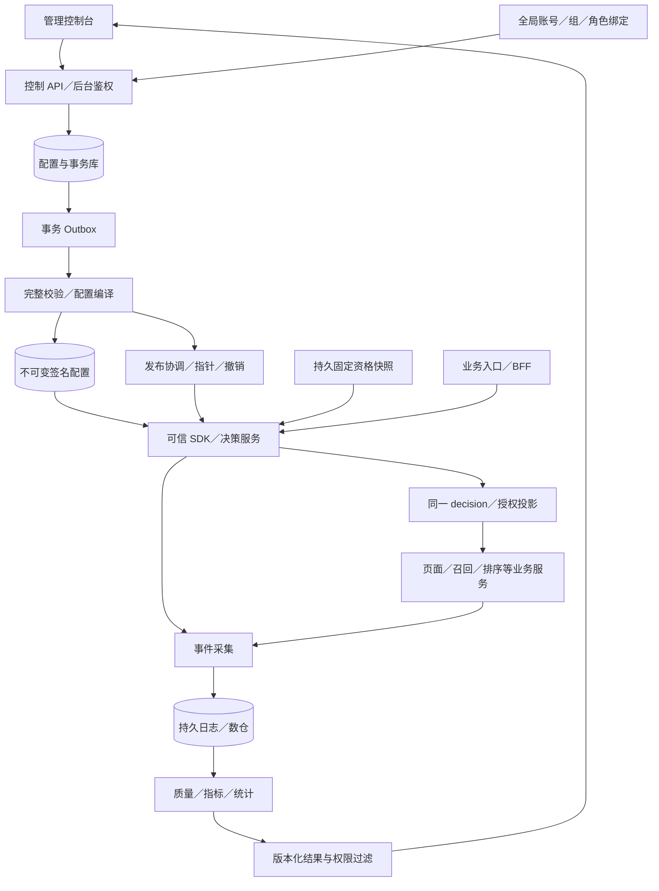

# 企业 AB 实验平台总体架构

设计 v1.2 · 2026-09-23｜实现基线：v23 前端原型

当前交付是 React／TypeScript／Vite 本地原型。以下生产架构尚未实现；具体数据库、API、SDK 与分析契约统一在[服务端技术方案](./服务端技术方案/README.md)维护。

## 1. 架构边界

| 部分 | 责任 |
| --- | --- |
| 控制管理 | Namespace、目录、拓扑、实验、权限、审批、预留及审计 |
| 编译与分发 | 校验、不可变签名快照、发布指针、租约与撤销 |
| 在线决策 | 固定资格、递归分流、参数投影、同请求决策上下文 |
| 业务执行 | 实际应用参数／模型、缓存、回退及执行记录 |
| 数据与分析 | 持久采集、去重归因、质量检查、指标及版本化结果 |

控制面先采用模块化单体；在线决策和数据链路独立部署。基础设施优先对接企业现有能力，供应商、容量与 SLO 待实测。



## 2. 资源与身份

```text
单企业平台：全局账号、用户组、角色模板
└ Namespace
  ├ 应用 → 参数、私有标签
  ├ 画像属性、受众、指标目录
  └ 环境 → 根域 → 唯一路由层 → 子域
                                  └ 参数层 → 实验／子域（递归）
```

Namespace 直接承接旧项目，不增加 project／space，不是团队同义词，也不是多租户设计。生产使用 `namespace_id` 和 `/namespaces/`；不把旧项目字段另保留为一层。

平台账号是操作者，业务 `user_id` 是随机化单元。账号可加入多个 Namespace，成员仅准入；角色按动作、资源范围和可选环境限制绑定。目录属于 Namespace，环境下拓扑、预留、发布、凭证与事件独立。

不同 Namespace 的资源、配置、权限和分桶空间隔离；用户仍可能同时参加，不能推断流量互斥或效果独立。跨 Namespace 不直接引用参数或层，同一运行参数必须有唯一控制归属。

## 3. 关键不变量

| 领域 | 规则 |
| --- | --- |
| 根结构 | 每环境一个根域、唯一根路由层，只承载子域 |
| 参数范围 | 同域完整且唯一归层；子域继承父层全部参数；实验不越层 |
| 归层事务 | 参数先 pending，在目标环境完整归层后原子 active |
| 子域初始化 | 仅一个完整初始参数层；空层不能运行实验或建子域 |
| 流量 | 每层 10,000 碎片桶，旧桶不搬；同层直接实验与子域共享预留 |
| 资格 | 不可变版本、固定快照、完整祖先条件；可证明互斥才复用桶 |
| 实验 | 2–20 组、唯一对照、稳定组 ID、各组相同顶层 Key 集合 |
| 运行 | 参数、权重、资格和分析计划冻结到 run；处理变化新建 run |
| 执行 | 同一 decision 跨服务传递；assignment 与 exposure 分开 |

参数组合约束维持下线；类型、Schema、范围及服务执行契约仍检查。不同参数层的分配独立，不代表效果独立；非重叠域仅隔离所在分支。

## 4. 权限与一致性

- **鉴权**：默认拒绝、allow 并集、无显式 deny。成员／owner／标签不是全资源授权；父级编辑无法被子级只读覆盖。
- **继承**：仅资源归属树继承，引用边不继承；环境授权不授目录全局编辑。多资源操作检查全部必要权利。
- **职责分离**：目录 manage/use、层 manage/use、实验 edit/approve/publish、结果 read/export 分开；审批不要求 edit。
- **发布**：审批绑定不可变内容；编译成功并上传验证后再激活指针，发布重新检查生产权限。
- **请求**：一次请求固定配置快照与资格，业务服务消费同一上下文，不各自重分流。
- **回收**：结束后等待旧租约／上下文耗尽及回收条件；断网实例不能承诺即时撤回。
- **数据**：持久事件去重，预定观察窗成熟后分析；重算生成新结果版本，保留异常历史。

Namespace 管理员只能委派平台允许的角色和范围；机器 SDK 按 ns/env/service/action 授权。完整判定和审计模型见[权限设计](./服务端技术方案/05-Namespace与权限设计.md)。

## 5. 详细设计索引

| 文档 | 权威内容 |
| --- | --- |
| [服务端总览](./服务端技术方案/README.md) | 架构、部署、运行边界与实施顺序 |
| [01 数据库设计](./服务端技术方案/01-数据库设计.md) | 实体、约束、版本、预留与事务 |
| [02 接口协议](./服务端技术方案/02-接口协议.md) | `/namespaces/` 管理 API、运行上下文、事件和查询 |
| [03 SDK 与分流协议](./服务端技术方案/03-SDK与分流协议.md) | 身份、资格、hash、递归求值、缓存与跨服务一致性 |
| [04 指标生产与分析](./服务端技术方案/04-指标生产与分析.md) | 埋点、归因、统计、质量门禁与重算 |
| [05 Namespace 与权限设计](./服务端技术方案/05-Namespace与权限设计.md) | 成员、角色、范围、委派、资源继承与后台授权 |
| [交付校验记录](./服务端技术方案/交付校验记录.md) | 文档及协议样例实际检查范围 |

## 6. 实施与验收

```text
明确试点链路与身份 → Namespace／权限／控制事务
→ 单链路 SDK 与发布 → 真实事件及 A/A
→ 低风险试点与故障演练 → 容量及多运行时扩展
```

验收必须覆盖：越权与委派边界、并发占桶、跨语言分桶、持久资格、配置过期、跨服务回退、缓存污染、事件迟到与去重、SRM、成熟分析和应急停止。关键指标包括决策延迟／可用率、回退率、配置陈旧率、执行一致率、事件丢失率及审计完整率；目标在容量和业务条件明确后设定。

原型实现映射见[平台技术方案](./平台文档/02-技术方案.md)，产品验收见[PRD](./PRD-企业AB实验平台.md)。历史结果见 [VERIFICATION](./VERIFICATION.md)，原始规格见 [superpowers](./superpowers/specs/2026-09-06-ab-platform-design.md)。本页不保留旧 SQL、旧协议或逐版验收流水账。
