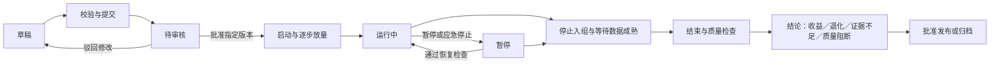

# 企业 AB 实验平台 · 产品方案

版本：方案 v23 · 2026-09-16。实验分组支持长 JSON 源码工作台、专注编辑、只读目录和结构差异比较，原文继续随草稿保存。层域负责人、长期／临时、预计结束日期和详情编辑沿用 v22，到期只做页面提醒。全页实验草稿工作区、递归层域、应用参数、固定受众版本、10,000 桶和多分组继续保留；组合约束维持下线。生产实施仍需独立立项，旧版本交付与验收记录保留。

导航：[摘要](#1-摘要) · [参与方](#2-参与方) · [背景](#3-背景与问题) · [目标](#4-目标与衡量) · [用户](#5-用户与使用场景) · [价值](#6-价值主张) · [方案](#7-产品方案) · [分期](#8-分期交付与风险)

## 1. 摘要

建立统一的实验工作台，让产品、研发、算法和数据团队使用相同的实验身份、流量规则、指标口径与审批流程，管理前端体验、后端服务和算法策略实验。一级“应用管理”以应用／服务为入口，参数只在所属应用的“参数”页签维护，不提供全局“全部参数”页面。参数指定唯一所属服务，注册后先待归层；完成独立归层配置才激活，域内层分配激活参数的作用范围，标签在所属应用内分类；实验选择固定参数集合，涉及服务自动推导，联动共享一个实验版本。

本次交付是可运行的中文交互原型，以及产品和生产架构建议。原型用于评审工作流与关键页面，不承担真实分流、统计分析、身份认证或生产发布。

产品原则：分配可解释、影响可追踪、结果可复现、操作可审计。业务团队在一个地方回答“谁受到什么变化影响、效果是否可信、现在能否扩大流量”。

## 2. 参与方

具体负责人待立项时确认，以下是建议职责，不代表现有组织安排。

| 角色 | 主要责任 | 需要确认的事项 |
| --- | --- | --- |
| 产品负责人 | 产品范围、流程与优先级 | 首批场景、试点团队、业务成功标准 |
| 实验平台负责人 | 控制台、分流协议与配置分发 | 现有基础设施、运行容量与故障边界 |
| 数据科学负责人 | 指标定义、统计方法与结论质量 | 分析单元、样本方案、数据质量门禁 |
| 前端／后端负责人 | 业务接入、实际执行与回退 | 身份来源、曝光点、默认行为 |
| 算法负责人 | 参数包、模型绑定与策略验证 | 模型依赖、影子运行、策略兼容性 |
| 安全与运维负责人 | 权限、审计、应急停止与恢复 | 环境隔离、审计留存、服务目标 |

## 3. 背景与问题

以下是立项假设，需要通过试点访谈和现有链路盘点验证；未提供企业现状数据。

- 不同团队各自分组和埋点，用户可能在前端命中 B、后端命中 A，难以确认实际处理。
- 实验配置、模型版本、指标 SQL 和结论分散，复盘时难以重建当时的完整条件。
- 同一批用户同时参加多个有相互影响的实验，缺少流量占用与冲突说明。
- “统计显著”可能被直接当作上线依据，数据缺失、样本比例异常和护栏退化未被充分检查。
- 修改生产参数、扩大流量与紧急回退缺少一致的审批记录，责任边界不清楚。

目前没有足够信息证明某一基础设施需要替换。建议优先建设统一控制面，对接既有代码发布、模型平台、身份系统与数据仓库，避免重复建设业务执行系统。

## 4. 目标与衡量

产品目标是提高可信实验的交付效率，并降低错组、污染和不可解释结果的比例。平台使用量只作为采用情况，不直接代表业务收益。

下表是建议验收目标；试点周期、基线和业务改善阈值由参与团队评审后登记，不作为当前已达成结果。

| 目标 | 衡量口径 | 建议评估点 |
| --- | --- | --- |
| 缩短准备时间 | 从需求确认到通过启动校验的中位时长，区分等待与实际操作 | 试点前记录基线，试点复盘比较并约定改善幅度 |
| 统一实验接入 | 使用统一实验 ID、配置版本和曝光契约的试点实验数／全部试点实验数 | 试点验收时，纳入范围的实验均通过契约验证 |
| 提高结果可信度 | 结论同时具备质量检查、指标版本、分析计划和数据快照的比例 | 所有提交正式结论的试点实验可复现 |
| 完整记录生产变更 | 有操作者、原因、前后配置、审批与下发结果的变更数／总变更数 | 生产试点所有变更均可关联审计记录 |
| 控制接入成本 | 按已有 SDK／新运行时统计首个实验接入工时与后续配置工时 | 首次试点建立基线，后续批次比较 |

业务指标改善由具体实验验证，不预先承诺平台能带来固定转化提升。延迟、可用性、数据新鲜度与回退收敛时间需要基于真实容量和故障测试设定目标。

## 5. 用户与使用场景

| 用户 | 需要完成的工作 | 最常用入口 | 主要约束 |
| --- | --- | --- | --- |
| 产品／增长负责人 | 设定假设、创建实验、理解结果、提出发布建议 | 实验管理、实验报告 | 需要业务语言和清晰决策条件 |
| 前端／客户端工程师 | 绑定界面版本、调试命中、确认真实展示 | 实验配置、SDK 集成 | 首屏一致性、匿名身份、离线缓存 |
| 后端工程师 | 绑定服务分支、透传决策、控制性能与错误 | 实验配置、SDK 集成 | 请求链路稳定、可信上下文、默认回退 |
| 算法／策略工程师 | 比较模型或参数包，确认实际执行版本 | 策略实验、指标分析 | 参数约束、依赖版本、效果与成本权衡 |
| 数据分析师 | 管理指标、诊断异常、冻结正式结论 | 指标中心、实验详情 | 口径稳定、样本成熟、可复现分析 |
| 审批者／管理员 | 检查风险、审批版本、处理冲突与审计 | 待审核、流量管理、团队权限 | 权责分离、项目隔离、应急响应 |

组织模型为单企业部署下的“平台 → 项目 → 环境”，不提供多租户能力。项目对应明确的业务和协作边界，环境至少区分测试与生产；测试数据、密钥和审批规则不与生产混用。

角色至少覆盖管理员、实验负责人、接入工程师、分析师、审批者与只读成员。生产高风险操作可要求审批人与提交人分离；应急停止采用单独权限并补充复盘记录。

工作区用于组织视角；域（Domain）切分父级流量，层（Layer）划分域内参数。结构递归交替为“域 → 层 → 子域 → 子层”；同一父层中的直接实验与子域互斥，同一域内的激活参数唯一归层，待归层参数不进入分流范围。子域只能重新划分父层继承的参数。层域不替代项目权限边界，前端／后端／策略类型也不决定层归属。

## 6. 价值主张

| 团队原本需要协调的事项 | 平台提供的共同约定 | 可验证的价值 |
| --- | --- | --- |
| 每端自行决定 A／B | 统一实验 ID、随机化单元与分配上下文 | 同一链路实际执行版本一致，可定位回退 |
| 各自维护指标表格 | 有负责人和版本的指标目录 | 结论能追溯分子、分母、窗口与数据来源 |
| 人工询问流量是否冲突 | 兄弟域互斥、参数层边界、固定实验桶与冲突检查 | 启动前可解释流量分母、剩余区间和共同命中风险 |
| 分散讨论上线或停止 | 预先登记决策条件、质量门禁和变更审批 | 提交结论时同时看到收益、不确定性与风险 |
| 结束后寻找当时配置 | 实验档案、版本化参数与结果快照 | 新成员可以重建实验条件和发布依据 |

本方案不主张所有实验使用同一种统计方法或执行引擎；统一的是管理对象、可信数据契约和决策流程。

## 7. 产品方案

### 7.1 信息架构与原型边界

全局导航保留项目／环境上下文，并持续显示“演示工作区”。搜索、筛选和详情应保留用户当前的浏览位置。

| 页面 | 核心内容与任务 | 本次原型范围 | 生产扩展 |
| --- | --- | --- | --- |
| 总览 | 实验规模、运行趋势、风险提醒、最近实验 | 演示概览与跳转 | 接入真实质量、流量和运营数据 |
| 实验管理 | 搜索、按固定受众版本／涉及服务／状态／负责人筛选、创建和查看详情 | 本地交互、分页、固定版本引用筛选及编辑草稿继续入口 | 资源权限、批量操作 |
| 实验草稿工作区 | 实验目标、范围与流量、分组与参数、检查与提交四区自由切换 | 全页编辑、本地自动保存、刷新恢复、逐项问题定位与待审核提交 | 服务端事务、跨设备协作、正式审批与发布 |
| 实验详情 | 指标、配置、活动；审核和状态变更 | 演示指标及本地流转 | 真实诊断、分析计划、版本差异与审批链 |
| 层域管理 | 层域配置／分流验证二级页签、递归树、父作用域、实验／子域共桶 | 子域／孙域下钻与保存、负责人及使用期限维护、到期页面提醒、完整默认域模拟与关注节点解释 | 生产审批、拓扑迁移、真实多运行时决策与交互诊断 |
| 应用管理 | 应用／服务目录及详情、应用内参数与接入配置 | 应用登记、可刷新五页签、三环境模式、固定当前服务的参数注册、应用内标签与关系维护、目录内历史待归属认领 | SDK／凭证与连接验证、定义版本、服务迁移、生产权限审批、范围／字段 schema、并发写入保护 |
| 指标中心 | 指标定义、分类、负责人、引用关系 | 可阅读、可筛选目录 | 指标建模、版本审批与数据源校验 |
| 受众管理 | 不可变规则版本、域／实验引用与人工场景估算 | 有限 AND／OR 规则创建、统一选择器、固定资格画像模拟、可证明互斥的桶复用 | 真实画像与曝光接入、资格快照服务、动态规则与生产权限 |
| 实验报告 | 结果摘要与导出 | 演示结果和 CSV 导出 | 成熟结果快照、签署结论、复现入口 |
| 团队权限 | 成员、角色及权限说明 | 演示组织信息 | SSO、服务身份、权限策略与审计查询 |

应用管理只有一个一级导航：应用目录 `#applications`；应用详情 `#applications/services/<id>/<tab?>`，包含概览、参数、接入配置、运行观测和关联实验，页签状态随路由保存并可刷新；参数目录及详情为 `#applications/services/<id>/parameters/<key?>`。不再提供全局参数维护页。

原型由 React、TypeScript 和 Vite 构建，浏览器 localStorage 保存演示操作。没有服务端登录校验、真实生产 SDK、真实样本采集或统计引擎。

原型中的人数、提升、趋势和显著性标签来自演示数据，不能用于业务结论。新建草稿没有参与人数和效果结果；改变状态不会自动产生真实样本。层域模拟器执行本地确定性规则，展示每个父层的分支选择、递归路径、最终实验／版本与参数合并，不代表已接入真实用户流量。

### 7.2 核心对象

| 对象 | 核心字段与规则 |
| --- | --- |
| 实验 Experiment | ID、唯一 key、假设、负责人、固定 parameterKeys、2–20 个具备稳定 ID、角色、名称及权重的分组值；涉及服务从参数归属推导；生产版本快照待实现 |
| 实验变体 Variant | 对照／处理标识、组内权重、同一参数集合的 JSON 值；新实验无需执行端实现矩阵 |
| 流量域 Domain | parentLayerId、相对父层的 start／traffic、随机化单元与模式；负责人、长期／临时及临时资源预计结束日期；同父层兄弟域互斥，全局比例沿祖先路径相乘 |
| 参数层 Layer | 所属域、激活参数子集与路由／普通层角色；独立的负责人、长期／临时及预计结束日期；空层待配置，非空层的直接实验和直属子域共桶，子域继承本层作用域 |
| 应用／服务 Service | ID、名称、负责人、类型、说明；开发／测试／生产各自配置 direct 或 delegated，全部待验证 |
| 参数 Parameter | 工作空间唯一 Key、显示名称、类型、默认值、负责人、说明与注册时间；一个所属服务；注册后待归层，激活后在所有受影响域唯一归层 |
| 参数业务标签 Tag | 通过 serviceId 唯一归属应用；应用内名称唯一，不同应用可同名但 ID 不同。参数可绑定本应用多个标签，不改变实验范围 |
| 参数服务绑定 ParameterBinding | key、serviceId、tagIds；新参数必须服务归属，旧自定义参数允许明确待归属 |
| 分配计划 Allocation | 域、层、bucketStart、域内 traffic、参数集合、分配 epoch；全局份额与组内权重分别说明 |
| 编辑草稿 ExperimentDraft | 独立于正式实验的本地表单、配置区、当前分组和 revision；允许不完整内容，不占用实验桶 |
| 历史组合规则 ParameterRule | v20 已下线；旧字段保留存储兼容，不参与配置、审核或分流校验 |
| 受众 Audience | 不可变规则版本与引用 ID；域及实验可复用，实际资格与所有祖先域条件取交集。缺属性为未知；人工规模假设不等于曝光结果 |
| 决策 Decision | 实验、变体、配置版本、分配 epoch、决策 ID、命中／回退原因；支持可信链路透传 |
| 分配／曝光记录 | 区分获分配、具备触发机会与实际展示／执行，保留去重键和真实执行版本 |
| 指标 Metric | 定义、负责人、方向、单位、分子／分母、聚合、归因窗口、数据源与版本 |
| 结论 Result | 分析计划、样本、区间、质量状态、成熟度、业务判断及可复现快照 |
| 审批／发布记录 | 被批准的配置版本、差异、提交／审批人、理由、下发覆盖和操作结果 |

“前端、后端、策略、网关”描述应用／服务的运行载体。创建实验不再选端类型，列表与详情按参数归属自动汇总涉及服务及负责人。旧 `type` 仅用于兼容历史数据结构，旧 `coordination` 的执行绑定保留历史校验；新旧组合规则均已下线。

### 7.3 不同运行载体的接入差异

| 维度 | 前端实验 | 后端实验 | 策略实验 |
| --- | --- | --- | --- |
| 变化内容 | 页面结构、交互、组件配置 | 服务分支、缓存、路由或计算方式 | 模型版本、召回／排序参数、业务规则 |
| 执行位置 | 浏览器、App、SSR／BFF | 可信服务进程 | 策略服务、模型服务或任务运行器 |
| 实际曝光 | 用户看见或触达指定功能 | 请求实际执行受影响分支 | 指定版本实际用于线上决策 |
| 额外校验 | 首屏闪烁、渲染失败、缓存隔离 | 超时、错误、幂等性、资源竞争 | 参数范围、依赖可用、模型兼容、影子运行 |
| 常见护栏 | 崩溃、页面耗时、关键转化 | 错误率、P95 延迟、资源成本 | 延迟、资源成本、覆盖／多样性等业务约束 |
| 回退动作 | 使用稳定组件／配置 | 使用明确默认分支 | 使用稳定模型及匹配的参数包 |

统一分配接口由各端适配器执行；敏感规则不直接下发浏览器。读取配置只是得到决策，不能自动当作真实曝光。

### 7.4 创建与审核

v21 使用全页草稿工作区，取代旧三步创建弹窗。以下四个配置区可随时切换，不以完成前一区作为编辑后一区的条件。

1. 实验目标：填写名称、唯一 Key、描述、假设、主指标与护栏；无需选择前端、后端或算法类型，涉及服务按选定参数归属汇总。
2. 范围与流量：通过完整域层路径选择目标层、固定受众版本与流量比例，查看所有祖先条件的交集及可用桶预览。草稿中的预览不预占流量。
3. 分组与参数：配置 2–20 个分组及一个对照组，通过源码工作台或专注模式切换单组编辑完整 JSON，用只读目录定位参数，用组间差异核对变化。按标签选参先选应用，仅显示其私有标签；切换应用保留跨应用累计的已选参数。待归层、越层或待归属服务的参数不可加入；批量加入保留已有值，为新增项填入默认值。所有组保存相同的固定 Key 集合，不订阅标签变化。组合约束已下线。
4. 检查与提交：集中列出缺失字段、名称／Key 冲突、域层或受众不可用、流量不足、分组身份／权重、参数完整性和类型问题。点击问题进入对应配置区，必要时选中具体分组并定位参数 Key。未通过检查仍可保存编辑草稿，但不能提交正式实验。

编辑内容自动保存到当前浏览器，错误 JSON 原文、未填写字段和暂时无效的分组权重可保留；刷新后按草稿地址恢复，也可从实验列表“编辑中的草稿”继续。每份草稿独立存储。检测到 revision 冲突后暂停自动保存并保留当前页内容，提供另存、导出和加载最新版本；坏数据、未知版本、读取失败或额度不足不会用空白新稿覆盖原记录。

入口包括空白创建、从层带入范围、复制已有实验。复制生成新分组 ID，保留源参数原文、顺序、角色和固定受众版本，不沿用源实验桶或运行状态。已知旧受众名称映射到原内置固定版本，未知旧条件保持未解析并阻止提交，须由用户显式重新选择，不能静默扩大受众。

提交前须先保存草稿，再按最新可读实验列表及当前有效拓扑重新检查并分配桶；检测到其他页面修改拓扑时要求刷新后复核。成功提交创建 `review` 待审核实验并预留流量，不启动执行；来源草稿 ID 用于重复提交识别，草稿保留对应实验标记并从编辑列表移除。实验持久化与草稿标记是本地顺序写入，不是服务端原子事务。

生产版本另需预注册分析计划、观察窗口与样本方案、应用接入兼容性、真实审批身份、差异审核和发布门禁；受控变更应使旧审批失效。当前仅演示审核和状态流转。

流量说明示例：常规重叠域占全局 80%，某实验占域内 20%，其全局名义份额为 80% × 20% = 16%；A／B 各 50% 时，各组名义份额为全局 8%。人工场景估算使用“基数 × 名义份额 × 桶内合格率”，合格率须针对全部祖先条件 AND 当前受众，不假设人群条件与桶独立。桶容量和人工估算不能当作实测覆盖，资格未匹配也不换桶补量。

原型校验唯一 Key、必要字段、版本权重、参数集合和层域桶分配；对新注册且具有定义的参数，草稿工作区与核心分配校验同时检查版本值的类型和 JSON 有效性。历史内置参数保留原有无类型定义的兼容行为。这些本地检查不构成生产安全边界。生产审批必须由真实身份和权限服务执行，原型中的审核者身份只是流程模拟。

#### 长 JSON 配置工作台（v23）

分组源码使用 CodeMirror 6，提供行号、语法高亮、括号匹配、折叠／展开、搜索／替换、格式化和撤销／重做。编辑区域独立滚动；“专注编辑”占用当前视口，可切换分组，退出后回到原工作区。分组名称、角色和流量设置收在独立配置区，参数编辑保留足够空间。编辑器首次进入“分组与参数”时按需加载。

左侧目录只读展示参数和嵌套字段，支持展开对象／数组、搜索字段／路径／值／登记名称、应用筛选及该应用的私有标签筛选。切换应用清除标签条件；筛选仅影响目录，不修改源码、参数 Key 集合或层范围。目录路径采用 JSON Pointer，点号参数 Key 保持完整，`/` 和 `~` 做转义；点击目录定位相应源码。目录最多展示 5,000 个节点，完整 JSON 仍参与校验和差异比较，源码搜索可访问全部内容。

每组在当前编辑器会话内独立保留光标、折叠、滚动位置和撤销历史；刷新、离开后重开不保证这些临时状态恢复。各组完整原文继续由现有草稿自动保存，未完成的 JSON 也可暂存，错误不会触发自动格式化。导出当前组时下载完整源码原文，包含尚未修复的内容；这与导出整个草稿的恢复文件不同。

问题列表给出行列和具体原因，点击可定位源码。严格检查顶层对象、JSON 语法、重复属性、数字有限性和最多 32 层嵌套；注释、尾随逗号和转义后同名属性均拒绝。格式化、草稿提交和向全部组批量加入参数复用这些约束，不能用解析后的最后一个同名字段静默覆盖前值；校验失败保留当前组原文，其他组也不被部分修改。参数归层、应用归属、固定 Key 集合和登记类型继续独立校验。

“分组差异”可选择另一个实际分组作为比较对象，只读展示新增、删除和修改的 JSON 路径及前后值。忽略对象字段顺序和空白；数组按整体比较，元素修改或重排均显示为数组修改，不假设元素有稳定身份。缺失与 `null` 分开显示，当前组仍存在的变化可定位源码。任一组 JSON 无效时不生成差异，也不会用上次有效内容冒充当前内容。比较不会复制、应用补丁、合并或修改分组。

本阶段仍是每组完整 JSON 的编辑方式。固定基线与继承覆盖、普通参数表格、可编辑 JSON 树、字段 schema、JSON／CSV 导入预检和完整发布快照仍为后续方案，不能把只读目录视为树编辑器。

### 7.5 生命周期与决策

生产设计分开记录“设计状态、运行状态、结论状态”。停止入组不代表数据已成熟，结束不代表胜出，胜出不自动等于发布。

- 运行：展示健康、真实执行率、数据新鲜度与样本进展；放量记录生效版本与阶段边界。
- 暂停：停止新的处理并按预设策略回到稳定行为，继续接收历史分配的迟到数据；实际撤回覆盖可见。
- 恢复：核验原配置、身份与分配是否仍一致。存在停顿、处理洗脱或变体变化时，分析须标记阶段或新建实验。
- 结束：冻结入组边界，等待归因与迟到窗口完成；保留分配后失败或回退的样本，禁止只保留成功处理样本。
- 结论：展示绝对变化、相对变化、区间、样本与质量状态，由负责人给出业务解释。
- 发布：批准具体获胜实现的推广方案，交由代码／配置／模型发布系统执行；跟踪上线健康，保留应急停止能力。

v21 编辑草稿独立于正式实验，提交后以“待审核 → 运行中 → 暂停／已结束”演示后续生命周期，审核、恢复、结束记录本地活动。历史 `Experiment.status=draft` 仍兼容既有状态流转，与新的未提交编辑草稿分别管理；数据成熟、正式签署结论和真实发布属于生产规划。

### 7.6 主指标、护栏与结论质量

主指标回答假设是否得到支持，护栏限制可接受的损失，诊断指标解释变化原因。指标分类不替代实验中的具体角色，同一个指标可在不同实验中担任不同角色。

- 启动前固定分析单元、主指标、对照比较、统计方法、最小可检测效果、预期样本与观察窗口；样本估计依赖真实基线与方差。
- 默认规划固定周期分析；过程看图可用于观察和安全停止，不能反复查看普通显著性并在首次显著时宣布胜出。
- 结果页同时展示置信区间和业务阈值；“不显著”不代表两组等效，“未显著变差”不能直接证明护栏安全。
- 护栏预先定义可接受退化幅度；紧急技术故障可以立即停止，业务指标自动停止须有已验证的判断规则。
- 样本比例异常（SRM）、埋点缺失、身份错配、分析单元错误或数据未成熟时，阻断正式胜出结论并给出诊断入口。
- 多处理组和多个共同主指标按预登记比较范围处理多重比较；事后切片标记为探索，避免当作确定性结论。
- 报告必须同时包含主指标、护栏、质量检查、异常解释、配置版本和数据截止时间；保留可复现快照。

统计细节、数据契约和参考依据见[架构方案](./ARCHITECTURE-企业AB实验平台.md)；原型显示的是样例结果，不执行上述推断。

### 7.7 层域模型与流量治理

采用 Google 论文 §4 的递归域层结构：域包含层，层同时容纳直接实验与子域，子域还能继续包含子层。默认域和默认层覆盖全流量及全参数；图 2b 的兄弟域只是这套递归模型的一种布局。以下比例与具体参数边界为本平台配置。[原论文 §4 与图 2](https://research.google.com/pubs/archive/36500.pdf#page=4)

| 域与全局比例 | 父层／占父层流量 | 域内参数层与继承范围 |
| --- | --- | --- |
| 默认域 root · 100% | 无父层／全量入口 | 默认路由层 root-layer，持有全局已激活参数，不包含待归层参数 |
| 常规重叠域 overlap · 80% | root-layer／80% | presentation 划分展示参数、ranking 划分排序参数、transaction 划分交易参数 |
| 全链路非重叠域 exclusive · 20% | root-layer／20% | full 继承默认层全部参数，同此分支其他实验隔离 |
| 界面探索子域 ui-mobile · 16% | presentation／20%，桶 [60%, 80%) | ui-navigation：ui.layout、ui.onboarding、ui.membership；ui-content：ui.cart、ui.content_card |
| 界面联动隔离子域 ui-isolation · 8% | presentation／10%，桶 [80%, 90%) | ui-full 的 * 仅代表父展示层的 5 个参数，不包括排序、交易参数 |
| 内容深度探索域 card-depth · 8% | ui-content／50%，桶 [50%, 100%) | card-layout 仅 ui.content_card；ui-cart 仅 ui.cart |

展示层的直接实验占桶 0%–60%，后接两个子域，90%–100% 保留为空闲；不能把子域当作另一组可以叠加的实验。内容深度探索域的全局比例为 100% × 80% × 20% × 50% = 8%。参数层彼此复用所属域流量，容量不能按层相加。

非重叠子域只隔离当前分支：进入 ui-isolation 的用户仍可命中祖先 overlap 域的 ranking 和 transaction 实验。域内最大并发实验数根据子树递归计算，不再固定写成“三层最多三个实验”。非重叠分支可继续嵌套非重叠子域，原型要求该分支最大并发仍不超过一项。

1. 层内固定桶空间由直接实验与直属子域共同占用；展示起点、父级分母与全局折算，保留空洞，禁止静默压紧已有区间。
2. 运行中、暂停和待审核实验占用或预留桶；子域也预留自身范围。草稿／已结束实验不占用，暂停／待审不实际执行，也不补桶。
3. 创建和恢复校验域层连接无环、父参数范围继承、域内激活参数分区完整且不相交、模式约束、版本参数名一致，以及子域／实验的所有相交桶是否具有可证明的固定资格互斥条件。
4. 域比例变化会改变下游全部实验可用人群；属于受控设计变更。扩大实验准入保持既有分组，受众／权重／身份／参数变化须评估新阶段或新实验。
5. 参数分区与独立随机化不能证明业务效果无交互；资源竞争、网络效应或跨参数组合应单独评估，必要时进入非重叠域。
6. 白名单、预览、应急停止、生产审批和导出按资源范围鉴权并审计；本地模拟器不能替代受信决策入口。

原型支持在树上选择有激活参数的父层，点击“新建子域”，填写名称（标识自动生成）、父层占比、模式和可选受众版本，并设置负责人和使用期限。保存时自动生成一个名为“初始参数层”的普通层，承接父层的全部继承参数，不再要求填写 A/B 两层名称或创建时划分参数。继承范围保留按应用、私有标签和搜索条件的只读查看；筛选不影响保存的完整范围。校验通过后，域与初始层一并写入 localStorage，展开定位到新域；刷新后可继续下钻。原型最多支持 16 级域嵌套，这是实现保护阈值，不是论文限制。

单参数父层也可创建重叠域，父层为空仍被阻止。重叠域可先只保留初始层，后续通过域内“新建层”按业务拆分；初始层和其他普通层一样受未结束实验、子域继承及来源层非空保护，不能把全部参数移走。非重叠域保持一个完整参数层，非重叠祖先分支继续禁止新增并行层。v16 的创建时 A/B 双层分区已被此 v18 流程取代，既有多层域及实验保持原样。

#### 层域配置与分流验证（v17）

“层域配置”负责树结构、流量范围、参数和创建操作；“分流验证”独立展示画像输入、完整递归路径和合并参数，不再放在任意节点详情底部。域或层的“验证分流”按钮只携带关注节点；执行始终从默认域开始，保留全部并行路径。到达域或层只表示访问了节点，不代表命中实验、分配变体或产生曝光。未到达时沿父路径找到首个阻断，分别解释根域准入记录、父层桶在域区间外、同桶候选判定或待配置空层跳过；记录不足时明确说明，不能把祖先排除说成当前层受众不匹配。

模拟器提供“孙域路径、分支隔离、全链路隔离”示例，优先尝试 user_219、user_98、user_5；若目标路径已改变，查找可用示例，目标分支不存在时禁用对应按钮。首次进入不自动生成本次结果，用户须提交输入或点击示例。两个二级页签切换，以及从结果返回层／域配置后再进入验证，保留当前输入和结果。输入、拓扑或实验配置变化后，结果标为上次验证，并按模拟时的配置解释；重新执行后才可用于判断当前路径。

保留范围仅限当前层域页面的常驻内存，不承诺刷新或离开一级导航后恢复输入、选中 user_id 或结果。已有固定资格画像继续保存在 localStorage；刷新后重新输入同一 user_id 可恢复只读画像，缺少的字段仍不能补填，新结果须手动运行。普通层域配置深链及旧受众上下文继续兼容，验证页用独立的 `#traffic/validation[/domain|layer/<id>]` 路径；未知关注节点或错误地址不自动改为其他节点。

#### 域下独立新建参数层

入口：层域管理 → 选择合法重叠域 → 新建层。先填写层名称与说明，参数可以暂不选择，保存空层并显示“待配置”；也可以选择待归层参数，一次完成建层和首次归层，或从已有层转移允许移动的激活参数。层标识自动生成，保存后定位新节点，刷新保留。

- 空层继承所属域的名义流量，但不承载实验、A/A 或子域，不计入可执行并发层；配置激活参数后才能使用。
- 选择待归层参数时，必须补齐其在所有受影响递归域的唯一归属。深层目标的新层和祖先路径固定，其他受影响分支继续配置；不能仅把 Key 填入目标层。
- 转移已激活参数仍在同域完成；草稿、待审、运行和暂停实验使用的参数不可转移。有子域的来源层保护全部继承范围，每个旧非空来源层至少保留一个参数。
- 新建、首次归层与转移均一次校验和保存，不改变已有实验桶、版本值或随机标识；不允许将激活参数退回待归层、清空或删除旧非空层来绕过保护。
- 默认域保留唯一默认路由层；非重叠域及非重叠祖先分支不能借新建空层增加并行层。

#### 层域管理信息（v22）

新建层和新建子域共用“管理信息”字段；已有域或层在详情内点击“编辑”维护，未设置的旧节点提供“补充信息”。保存立即更新当前节点，取消不写入；只补充管理信息也须经过现有拓扑保存校验。

| 字段 | 默认与校验 | 使用方式 |
| --- | --- | --- |
| 负责人 | 新建或补充信息时默认演示当前用户“陈思远”；必填，去除首尾空格后最多 40 个字符 | 可填写其他负责人；不是权限或服务归属 |
| 使用期限 | 默认长期，可选择临时 | 长期不保存日期；切回长期清除原预计结束日期 |
| 预计结束日期 | 仅临时资源必填，须为真实有效的 `YYYY-MM-DD` 日期，允许过去日期 | 按浏览器本地日期显示“今日到期”或“已超期”，可按实际进展修改 |

没有管理信息的历史节点保持“未设置”，不会被批量指定负责人或期限。创建子域时，初始参数层复制一次本次填写的管理信息；之后修改域或层均不联动另一节点。独立新建层采用自己的默认值和填写结果，不继承上级后续修改。

这些字段仅用于责任识别与页面提醒，不影响分桶、受众、参数归属或实验状态，到期后仍可创建和运行实验。v22 不增加退役、冻结、回收或审批操作。数据随拓扑保存在 `exp-lab-topology-v1`；保存前检测到其他页面已更新拓扑时拒绝覆盖，保留当前输入并提示刷新。该检查不是跨标签页原子事务，不提供跨设备同步。

#### 参数、层和实验关系的管理入口

“应用管理 → 具体应用 → 参数”在当前应用的参数范围内，从分流使用的同一份层域配置和实验声明派生关系，不维护另一套可独立修改的归属表。一个参数显示多处归属时，逐行标明域、层、完整继承路径和名义流量；唯一归层以同一域为边界。默认路由层的继承范围不计作直属实验引用。

选择参数可查哪些实验声明了它，以及每个版本实际配置的 JSON 值；新注册参数还展示名称、类型、负责人、说明、注册时间和默认值，关系检查会报告其版本值与注册类型不符的问题。按域筛选只缩小归属和实验列表，关系校验仍检查该参数的全部域；无匹配参数、无归属和无实验分别显示空状态。已结束实验保留历史声明和取值；参数转移后，历史记录不被改写，也不会被误报为当前实验越界。

“管理归属”定位到域，“所属层”定位到层；层域详情中的参数名可返回应用管理的参数详情。新建层可留空、选择待归层参数首次分配，或选择当前允许转移的已激活参数，均使用提交时的配置校验。页面展示未结束实验、子域继承、单参数来源层和域模式造成的具体限制。目录包含历史内置的 13 个演示参数，并支持注册新参数。内置参数没有类型或默认值定义，继续兼容已有演示实验；新注册定义当前不可直接编辑或删除。

#### 参数登记、首次归层与实验使用

从应用详情“参数”页签注册，所属服务固定当前应用。注册只填写参数定义与本应用标签，保存为“待归层”，不要求事先存在目标层。层也可先独立保存为空，解除“注册要先有层、建层又要先有参数”的依赖。

| 阶段 | 当前规则 |
| --- | --- |
| 登记定义 | Key 全工作空间唯一，3–80 位；名称与负责人必填、最多 60 字，说明最多 300 字；所属服务固定当前应用 |
| 类型与默认值 | string、number、boolean、object、array；默认值填写匹配类型的合法有限 JSON，仍只用于实验编写初值 |
| 私有标签 | 只可选择或创建本应用标签；新标签立即保存，取消参数表单不会撤销该标签 |
| 保存待归层 | 定义、服务绑定、标签与待归层状态共同保存；不修改任何层作用域，星号也不包含该参数 |
| 独立配置归层 | 从根域沿所选层的所有子域递归，单层域自动、多层域选一个层；必须补齐全部受影响域 |
| 首次激活 | 完整配置通过校验后一次保存并激活；可归入既有空层，也可在建层时完成。不能半激活或把旧激活参数退回待归层 |
| 创建实验 | 仅能选择已激活、服务已明确且在目标层内的参数；空层不能承载任何实验或子域 |

例如先在推荐排序应用登记 `ranking.result_limit`，类型 number、默认值 `20`，此时没有层归属，也不能加入实验。随后可在常规重叠域先建“推荐结果层”，再为参数配置归层；或在建层表单中选择该待归层参数，同时完成其他受影响域分配后激活。若归到展示层，则其子域继续继承并要求分配；归到更深层时必须保持完整祖先路径和其他受影响分支合法。

历史无待归层字段的参数保持已有激活归属。历史待归属服务仅表示尚未明确维护应用，两种状态独立；服务认领不隐式改变归层状态。新参数激活后可在实验选择器补入 各分组默认值，再按假设修改。number 参数填写 `"20"` 会被类型校验拦截。模拟器仍仅返回命中实验的显式覆盖，没有默认值版本锁定、完整运行快照、字段 schema、生产 SDK 下发或参数注册审批。

#### 按应用浏览层域参数（v18，延续 v16）

域的继承范围、层的关联参数、新建层与新建子域四个入口统一按参数的实际所属应用分组，可按 Key、登记名称或应用名称搜索。选定应用后仅显示该应用的私有标签，多标签采用任一匹配；切换应用清除标签条件，新建层保留跨应用已选 Key。筛选没有结果时展示空态，不扩张到该应用的全部参数；历史待归属参数继续明确展示，不根据 Key 前缀猜应用。

层不绑定单一应用。域／层详情只展示其实际继承范围；新建层仍从核心候选中选择待归层参数或受原保护约束的已激活参数；新建子域只读展示父层完整范围，自动生成的初始层包含全部继承参数，与当前筛选结果无关。编辑过程中的参数浏览不跳离表单；保存使用归层与拓扑校验，不更改应用目录结构、流量或实验规则。

### 7.8 应用、标签与联动组合

应用管理以应用／服务为入口，支持前端、后端、策略、网关 / BFF 四种类型。开发、测试、生产环境各自保存 `direct` 或 `delegated`。委托必须指向已登记的其他 gateway 服务，同环境解析且不能成环。所有状态为待验证；五个详情页签可查看参数与关联实验，运行观测没有真实数据，接入指引仅为伪代码。

新参数唯一归属一个服务，只能绑定该应用的私有标签。默认 13 个参数映射到明确示例服务；旧自定义参数保持 Key、取值与层归属，标记待归属，可通过应用目录内的认领区补齐；认领区仅在存在历史未归属参数时显示。已明确的服务归属不可直接迁移。标签的查询、创建和单项／批量维护均限定当前应用，名称在应用内唯一；不同应用可使用同名标签，但它们是不同 ID 的独立对象。创建实验仍可跨应用累计选参；按标签筛选前必须先选应用，切换应用清除标签筛选，不清除已选参数。标签不改变实验 Key 集合、桶分配或层域关系。

旧共享标签按实际使用参数的所属应用拆分为私有副本，保留名称、颜色与参数关联。未归属参数的历史标签和未引用旧标签隐藏归档，不出现在应用标签列表；参数认领后在目标应用复用同名标签或恢复私有副本。迁移不改实验 Key、版本值与分桶；无效目录或迁移保存失败时保留原数据并阻止保存，不能将现代跨应用绑定自动“修复”为合法。

例如在用户界面应用给 `ui.layout` 添加该应用的“首页推荐”标签，在推荐排序应用给 `ranking.model` 添加其同名私有标签。两个标签名称相同、ID 与归属不同。创建实验时先选择用户界面应用并按其标签加入参数，再切换推荐排序应用、重新选择其标签加入参数；在确实拥有二者的 `exclusive → full` 层组合它们，A 组设置旧布局与旧模型，B 组设置新布局与新模型。界面自动汇总两个服务及负责人；无需额外填写端类型与执行矩阵。此实验评估组合效果，不能分别给布局或模型归因。

v20 下线实验局部组合规则，历史字段保留存储兼容，不再执行或展示。各组完整参数 Key、类型与层范围继续自动校验；业务字段 schema 与固定基线编辑属于后续参数配置方案。

旧 `coordination` 的执行绑定与规则保留历史兼容；新建流程不再要求启用该契约。配置约束不参与 hash，也不生成部署或曝光。生产仍需不可变快照、真实 SDK、可信上下文透传、兼容性门禁与实际执行日志。失败用户保留原分配组并记录回退，不能因回退改记为 A。完整说明见[应用管理、参数与联动实验设计](./联动实验设计.md)。

### 7.9 画像属性、受众条件与覆盖估算

域回答“在哪个流量分支中组织实验”，受众回答“哪些用户具备资格”，两者不要求一一对应。受众目录允许人群重叠；一个受众版本可复用于多个域或实验。最终资格始终为所有祖先域条件 AND 当前域或实验的受众，当前受众内部使用 OR 也不能放宽祖先范围。

本轮入口由“受众管理”中的受众目录与画像属性目录组成。集中管理与域／实验旁的快捷新建复用同一受众编辑器；快捷创建保存后选中明确的版本，取消或关闭只返回原配置，不清空父页面草稿。编辑器以条件组表达“全部满足（AND）”或“任一满足（OR）”，属性选择约束可用操作符及输入类型；规则详情、搜索与继承摘要必须展示完整树，不能把 OR 扁平显示成 AND。

画像属性是用户的入组前特征，与实验参数分别登记。属性目录描述 Key、名称、类型、值域、口径及单位等定义信息，并支持查找受众引用；实验参数则控制下发行为、参与参数归层和各分组取值。登记属性无需绑定来源应用，仅建立本地定义，不表示已采集真实画像。属性类型等语义不能原地改写后影响旧受众，应登记新 Key 承接变化。属性 Key 在画像目录内唯一，支持标量字段，不把点号 Key 自动解释为嵌套对象；内置枚举保持开放值兼容，自定义枚举限于登记集合。

受众创建不可变版本；不同受众系列名称不能相同，同系列新版本可以沿用名称并以版本号区分。域与实验引用固定 ID，不随新版本自动切换。条件树最多 3 层分组（根组计一层）、30 条规则，采用有限 AND／OR 运算，不执行脚本；先校验属性、类型、操作符和值，再判断规则是否存在可满足的分支。空 IN、非法类型和不可满足分支是配置错误；即使其他 OR 分支可命中，也要求先修正不可达分支。全体受众需要明确选择，不能由删空普通条件组意外生成。无法识别的属性或规则不能静默删除；缺少必要属性时按三值逻辑判断，不能把未知当成空人群或全体。

创建表单在条件完整后自动检查受众关系，并在保存前用最新配置复验。规则自身矛盾和祖先交集为空时阻止保存；目录内普通受众重叠只作提示。域／实验快捷创建带入当前层和流量，自动组合当前受众下的可用桶；不能安排时阻止用于当前配置的受众保存。详情页不再要求用户另选受众发起检查。

受众详情提供“查看引用实验”入口，进入 `#experiments?audience=<id>`。实验列表按一个固定受众版本筛选，包含实验直接引用和任意祖先域继承，同一实验只计一次；已知旧受众名称仅兼容对应内置版本，不按同名或同系列自动合并新版本。画像属性详情按实际使用该属性的受众版本分组提供实验列表入口，实验数包含继承；同一实验可能属于多个版本的引用集合。筛选描述配置关系，不计算用户命中或曝光。

从外部受众入口进入列表时清除残留搜索、状态、服务及负责人筛选；在列表内主动切换受众时保留其他显式条件并取交集，重置页码。状态页签数量以当前受众引用集合为基数。未知或无效受众参数不能回退为全量结果，应显示明确空态并可清除；清除与列表刷新同步受众 URL，实验详情的返回按钮回到来源受众列表。其他临时筛选不承诺在刷新后恢复。

新的实验引用入口不再跳到聚焦详情；v14 带条件的实验详情链接仅作为旧链接兼容。域引用继续显示完整有效条件，并进入既有域条件页面，核对直接／继承关系；本轮不新增域列表，不修改实验或域配置。

同父层的直接实验与子域共同参与桶冲突检查。只有桶区间相交且完整有效资格无法证明互斥时，才形成分配冲突。对 OR 必须检查双方全部可满足分支的组合；只发现一对互斥、样本中没有交集或估计人数为零，都不能证明整体互斥。未知条件及展开超过 64 个组合时均保守处理，不允许据此复用相交桶；超限的合法树仍可按完整逻辑判断资格。全部相交区间逐对检查，占用按区间并集统计，不能把复用桶简单相加。

互斥证明以同一 user_id 的固定入组资格快照为前提。实时平台、会员或地区等属性会随设备或时间变化，不能单凭某次值不同证明用户互斥。运行时只判断既定桶中的候选；未匹配、资格未知、暂停或待审均不换桶补量。已有域不能更换受众或父层，已有层不能改挂域，防止祖先条件漂移。模拟器固定同用户首次成功保存的完整画像，自定义属性同样持久化；当时未提供或之后新登记的字段也不能给该用户补填。刷新恢复只读快照，坏数据或首次保存失败时停止模拟并保留原数据。编辑器内的临时画像预览只检查条件，不记录 user_id 或分流结果；它与层域模拟器的固定画像机制分开。真实身份、画像采集与资格快照服务仍未接入。

受众规模无真实查询服务时显示“未接入”，不使用演示人数充当圈选结果。人工场景估算由用户提供同口径基数、名义份额及桶内完整资格交集的合格率，计算“基数 × 名义份额 × 桶内合格率”，可再按变体比例拆分；例如 100 万 × 80% × 20% = 16 万。不能直接相乘 OR 分支或多个属性的边际比例，也不能把结果当作样本量承诺。真实分配、曝光、生效覆盖仍显示“未接入”。

### 7.10 可测试的验收标准

下表区分原型与生产验收标准。v17 独立自动化 193/193 通过，0 失败、0 跳过，新增 13 项验证路由与关注解释测试，构建通过；浏览器实际验收范围见[验证记录](./VERIFICATION.md)。旧版本结果保留为历史，生产目标不在本轮交付范围。

v16 的四个层域参数入口已实现；独立自动化 180/180 通过，沿用已有生命周期、范围、私有标签与原子保存测试，本轮没有新增核心逻辑。浏览器检查应用／标签筛选不越范围、切换应用保留选择、子层完整分区，以及新层首次归层与转移后的刷新恢复；最终证据见[验证记录](./VERIFICATION.md)。

| 层级 | 验收场景 | 可观察的通过条件 |
| --- | --- | --- |
| 原型 | 搜索与筛选 | 单一固定受众版本与名称／Key 搜索、状态、涉及服务及负责人筛选可组合；受众引用含任意祖先继承且去重，无结果时有明确空态 |
| 原型 | 受众实验列表入口 | 受众与属性引用进入带固定版本的实验列表；外部带入清除残留条件，列表内切换重置页码并保留显式组合筛选；清除、列表刷新及详情返回同步受众上下文；未知标识不回退全量 |
| 原型 | 编辑与提交分离 | 四区自由切换，未完成字段和错误 JSON 原文可保存；问题只阻止正式提交，并能定位具体分组及参数 Key |
| 原型 | 长 JSON 源码与会话状态 | 源码／专注模式可定位、折叠和搜索；切组保留各自光标、滚动与撤销，刷新只恢复草稿原文，不承诺编辑会话状态 |
| 原型 | 只读目录与严格诊断 | 应用私有标签与路径搜索仅筛选目录；语法、重复属性、非有限数和超深嵌套定位到源码，错误原文继续暂存 |
| 原型 | 组间结构差异 | 可选择比较分组；对象顺序和空白不算变化，数组整体比较；无效 JSON 阻止比较，不应用补丁或自动合并 |
| 原型 | 草稿恢复与冲突 | 自动保存后刷新及列表继续恢复原文、配置区和选中分组；过期 revision 暂停写入，支持另存／导出／加载最新，坏存储和额度失败保留原稿 |
| 原型 | 按层与复制入口 | 按层带入范围；复制生成新组 ID、保留源值及固定受众，未知旧条件不拓宽，源实验与原桶不改变 |
| 原型 | 创建和查看 | 最新校验成功后创建待审核实验并预留桶；来源草稿幂等关联，未自动启动，参与人数为 0，无虚构提升或显著性 |
| 原型 | 状态流转 | 提交、审核、暂停、恢复、结束仅出现合法操作，每次变更有本地活动记录 |
| 原型 | 递归层域与模拟 | 树可展开至孙域、节点与面包屑可下钻／返回；父层仅选直接实验或子域之一；递归路径、全局连乘和最终参数一致 |
| 原型 | 独立分流验证 | 层域配置／分流验证分为二级页签；关注域或层仍执行完整默认域路径，保留并行层，关注仅用于解释且到达不等于实验命中 |
| 原型 | 未到达与结果状态 | 解释首个祖先阻断、桶外、根域准入／同桶记录或空层跳过，错误优先于局部轨迹；两个页签与结果返回配置保留内存输入和结果，配置变化标旧结果，重新运行更新 |
| 原型 | 新建参数层 | 合法重叠域可先创建空层或选择待归层参数一次建层并激活；空层不得承载实验或子域；已激活参数转移保留使用保护与来源层非空约束 |
| 原型 | 新建子域 | 在父层空闲或已证明资格互斥的可用桶集合中创建子域，并自动生成一个承接全部继承参数的初始层；无 A/B 层名或参数分区必填项；只读筛选不改变继承范围，保存与刷新定位正确 |
| 原型 | 层域管理信息 | 创建及详情编辑可保存负责人、长期／临时、临时预计结束日期；无效负责人或日期拒绝保存，取消不写入；旧节点保持未设置，初始层复制一次后可独立修改；到期不改变分流，过期拓扑保存保留输入并拒绝覆盖 |
| 原型 | 子域模式与后续拆层 | 单参数父层可建重叠域，空父层仍阻止；合法重叠域之后可新建层拆分，初始层不能被清空，依赖保护保留；非重叠域与非重叠祖先约束不变 |
| 原型 | 参数与桶约束 | 子域扩大父参数范围、分区重叠／遗漏、域层成环、版本参数名不一致及无法证明资格互斥的实验／子域桶碰撞被阻断；暂停／待审不执行 |
| 原型 | 参数注册与归层 | 注册无需选层，保存待归层且任何层包括星号范围均不扩张；独立配置全部受影响域后才激活，缺失分配被阻断；刷新保留状态、定义与合法归属 |
| 原型 | 注册参数使用 | 按服务与标签批量选择，向所有分组补入默认值而不覆盖已有值；待归层、越层、待归属服务与类型错误被阻断；参数详情显示关系和真实配置值 |
| 原型 | 应用内参数入口 | 无全局全部参数页；应用详情五页签可刷新，参数深链带服务 ID，搜索、勾选和批量维护严格限定当前应用 |
| 原型 | 路由与认领 | 旧全局列表回应用目录，旧 Key 定位实际所属服务；未归属／未知 Key 在目录内反馈，不默认展示另一个参数；认领后进入正确应用参数 |
| 原型 | 应用登记与环境 | 应用 ID／名称不重复；三环境独立保存；委托非法目标／自身／环被拒绝，状态始终待验证 |
| 原型 | 参数服务归属 | 注册服务固定为当前应用且不可切换；旧 custom 从目录认领，认领后新实验可选；已有参数不能借注册或深链越应用维护 |
| 原型 | 私有标签与固定选参 | 当前应用只显示和维护本应用标签；应用内重名被拒绝，跨应用同名可区分；跨应用标签绑定被拒绝。先选应用再按标签筛选，切换清标签筛选、保留已选 Key；标签维护不改变已存实验值与分桶 |
| 原型 | 共享标签迁移 | 按实际参数所属应用拆分私有副本并保留名称、颜色和关联；未归属／未引用旧标签隐藏归档，未归属参数认领后恢复到其应用；现代越界数据不得自动修复 |
| 原型 | 画像属性目录 | 无需来源应用，登记类型与口径，完整追踪规则树及祖先继承引用；属性不进入参数集合；旧定义不能改写、删除或省略，内置开放枚举值兼容 |
| 原型 | AND／OR 编辑 | 最多 3 层、30 条，完整括号语义可读；错误定位到条件路径，无条件需明确选择；复杂度超限提示保守分桶，临时预览不冒充用户规模 |
| 原型 | 快捷创建 | 域／实验复用同一受众编辑器，保存后选中固定版本；关闭、Escape 和键盘切换不丢失父草稿；属性定义与值可核对 |
| 原型 | 受众版本与继承 | 域／实验引用固定版本，祖先条件 AND 当前条件；无效规则、失效引用及不可变版本改写被拒绝，旧未知受众不误执行 |
| 原型 | 条件桶复用 | 实验与子域的全部相交区间逐对判定；仅固定用户资格可证明互斥时允许复用，动态条件或未知不能放行；占用按并集不超过 100% |
| 原型 | 固定资格模拟 | 内置及自定义属性首次快照持久化；同一 user_id 不得补填新增字段，必要属性缺失按三值逻辑判断；资格未知不执行、不换桶补量；多个候选同满足应失败而非按顺序任选 |
| 原型 | 人工覆盖估算 | 基数、名义份额与完整交集的桶内合格率有明确口径；显示假设与估算，真实曝光／生效指标未接入时不显示虚构值 |
| 原型 | 多分组与历史兼容 | 新实验支持 2–20 组、唯一对照、稳定 ID；旧规则仅保留字段，旧分组哈希及顺序保持 |
| 原型 | 持久化与导出 | 刷新后保留已保存实验和状态；CSV 可读取，导出内容与所选范围一致 |
| 原型 | 导航与布局 | 所有导航有页面；窄屏能访问关键操作，宽表可滚动；状态同时有文字说明 |
| 生产试点 | 跨端一致性 | 同单元、同 epoch、同快照、同受信上下文的测试向量在目标 SDK 得到一致结果 |
| 生产试点 | 联动与回退 | 强制模拟下游故障，实际执行和回退可追溯，分配组不被改写 |
| 生产试点 | 权限与版本 | 无权限用户无法操作或导出；审批后改动受控字段使批准失效 |
| 生产试点 | 数据质量 | 注入重复、迟到、缺失与错组事件，去重及诊断生效，严重异常阻断正式结论 |
| 生产试点 | 结果复现 | 指定配置、指标定义和数据快照可重建同一报告；A/A 与历史回放满足预定检查 |
| 生产试点 | 容量与停止 | 在约定负载及故障场景测量延迟、可用性和回退覆盖，满足评审后的目标 |

## 8. 分期交付与风险

| 阶段 | 范围 | 进入下一阶段的依据 |
| --- | --- | --- |
| 当前：交互原型 | 工作台、全页实验草稿、长 JSON 源码与只读差异、应用管理、参数服务归属与私有标签、递归层域与分流轨迹、层域管理信息及导出 | 关键任务可走通，业务确认流程与递归模型 |
| 生产基础与试点 | 项目／环境隔离、真实身份权限、版本审批、统一决策接口、核心运行时 SDK、曝光与指标链路、互斥层、固定周期分析、SRM、应急停止 | 前后端联动试点及策略试点通过质量、故障与容量验收 |
| 规模化运营 | 更多运行时、指标版本治理、数据质量诊断、审计导出、发布联动、团队运营与成本观测 | 真实瓶颈明确，服务目标和维护责任稳定 |
| 进阶方法 | 经验证的序贯分析、方差降低、长期保留组、复杂身份桥接及集群／切换实验 | 对应业务需求、方法验证和数据条件均满足 |

阶段按依赖和验收推进，不在缺少技术栈、数据量、接入复杂度与人员配置时承诺精确工期。自动优化与 Bandit 应作为单独能力定义，不能直接替代因果 AB 结论。

| 风险／待验证问题 | 影响 | 应对与责任 |
| --- | --- | --- |
| 身份和埋点缺少统一规范 | 错组、重复样本、无法归因 | 接入前盘点身份与事件；平台和数据负责人共同签署契约 |
| 不同实验产生强交互 | 独立分桶仍无法解释效果 | 业务负责人维护冲突范围，必要时联合设计或互斥 |
| 指标变化快于数据成熟 | 过早停止或发布 | 显示数据截止时间，执行预登记窗口与质量门禁 |
| 配置撤回不能逆转业务副作用 | 停止后损失仍可能持续 | 业务实现提供兼容、幂等或补偿，审核时检查回退范围 |
| SDK 覆盖过广拖慢试点 | 首个闭环无法交付 | 先按现有技术栈选最小前后端链路，再扩展运行时 |
| 平台所有权不清楚 | 指标和接入规则长期失修 | 确定平台、数据、业务三方负责人及变更协作机制 |

立项前需补齐：首批业务链路、前后端语言与客户端、身份及埋点现状、日活与决策峰值、数据仓库、模型发布链路、项目与权限边界、行业数据要求、可接受实验窗口与可用维护人力。

### v15 的明确边界

应用目录及参数关系存于本地拓扑，实验另行保存。当前没有真实后端、RBAC、服务端审批、凭证、自动连接验证或多标签页并发版本控制。参数 Key 继续全局唯一，服务内同名 Key、参数改名和已归属服务迁移未实现。登记默认值仅供新实验编写时补入，没有锁定默认值版本或编译完整运行快照。项目级可复用规则与组合模板仍是后续能力。受众规则与资格画像仍是本地原型，真实快照服务、曝光和生效覆盖未接入。v15 实验筛选只读取既有固定受众引用，不改变条件、层域或分桶；独立自动化 180/180 通过，0 失败、0 跳过。浏览器已验证 CN v1 入口显示 2 个继承实验，搜索后剩 1 个，普通详情返回保留受众与搜索，刷新列表保留受众；切换无引用 v2 显示空态，清除恢复 31 个既有实验，外部入口清除残留搜索，未知版本不回退全量，country 属性的嵌套版本入口显示对应 1 个实验。验收全程只读。详见[验证记录](./VERIFICATION.md)，旧详情定位与更早版本结果保留为历史。

### v16 的增量边界

本轮只统一层域入口的应用参数浏览，应用归属不成为新的层或流量边界。浏览器在 `127.0.0.1` 测试来源保存“应用参数关联验收层”，包含两个应用的两个固定 Key，验证首次归层和允许的参数转移后刷新保留；未保存新实验或子域，也未写入用户 `localhost` 数据。v15 记录继续保留，构建与视觉证据见[验证记录](./VERIFICATION.md)。

### v17 的增量边界

布局与解释不修改分流引擎、参数范围或实验数据。独立自动化 193/193 通过，0 失败、0 跳过，构建通过。`127.0.0.1` 浏览器实测草稿 user_id 与 CN 画像换页保留；user_219 关注深域仍显示从默认域开始的 6 个实验、5 个域，结果返回 card-layout 配置再进入验证仍保留；user_5 关注 card-depth 时准确指出首个未到达祖先 overlap，其根层桶 97.7% 不在 [0%, 80%)，可返回该祖先配置。

仅在测试来源新增空层 `layer-6d40ca19` 检查配置变化提示：旧结果明确过期，重新运行后提示消失；关注空层时解释为待配置跳过。已有参数范围和实验保持，用户 `localhost` 未写配置或资格快照。本次结果只在层域内存中保留；固定画像持久化不代表模拟结果持久化。进一步验收证据见[验证记录](./VERIFICATION.md)。

### v18 的增量边界

创建子域先自动完整承接参数，再在合法重叠域内按业务拆层；取消创建时强制 A/B 两层名称及参数划分，保留只读应用／私有标签筛选。单参数可建重叠域、空父层不可创建，初始层仍服从原有分区与依赖保护；不迁移既有多层域或实验配置。v16 的子层划分验收保留为历史，当前验收按上文新子域与后续拆层标准执行；实际测试、构建与浏览器证据见[验证记录](./VERIFICATION.md)。

### v19 自动组合可用桶

用户只填写 0.01–100% 的流量比例，平台在当前层的 10,000 个固定桶中自动组合可用位置。可用总量足够时，分散桶段也可用于一个实验或子域；总量不足时明确显示申请桶数及可用桶数。输入精度超限直接报错，不静默四舍五入。分配预览显示桶数、比例、实际桶段；尚未成功的全局比例仅作为申请折算，不显示为已获配流量。

实验创建、审核预留、子域创建及内联受众预检使用同一分配规则。运行、暂停、待审和直属子域共享父层桶，仍要求同桶有效受众可证明互斥；旧分配与版本哈希保持，新配置只利用符合条件的可用桶。层详情给出分类占用与去重合计，不再要求用户通过“子域占30%”自行推算剩余。连续区间只是桶集合的压缩表示，不限制新申请。

验收包括：碎片总量够可创建；容量不足/非法精度阻断；0.01%与100%边界；段间空洞无命中与无冲突；后段冲突可定位；旧用户实验/版本稳定；保存刷新保持多段；受众可证明互斥复用；暂停待审保留全部段；视图及分流解释显示真实范围。实际结果见[验证记录](./VERIFICATION.md)。

### v20 多分组与参数配置简化

组合约束下线，包括新旧规则展示及运行校验；旧字段保留历史存储兼容。支持 2–20 个分组、一个对照，名称可编辑、ID 稳定；新增、复制、删除、指定对照和显式均分均在草稿操作。按单组切换编辑完整 JSON，参数批量加入同步到所有组并保留已填值。每组正权重、两位小数、合计 100%，相同 Key 集合、类型与层范围统一校验。第三组及以后使用真实身份，不复用 B 组统计。

大参数配置本轮交付[独立方案](./多分组与批量参数配置方案.md)：固定基线＋各组差异覆盖，普通值表格、对象／数组树与源码、路径差异、导入预检及完整快照。上述复杂编辑器属于后续建设，不将本轮分组切换和 JSON 格式化宣称为完整方案实现。

### v21 全页实验草稿工作区

本轮交付四区自由编辑、逐份本地草稿自动保存与恢复、按层和复制来源入口、问题定位，以及最新校验后提交待审核并预留流量。版本冲突与保存失败提供保留当前内容的恢复路径；已提交记录保留幂等来源标记。当前仍是浏览器原型，不提供服务端事务、跨设备协作或多人实时同步；本地 revision 检查不等同于跨标签页原子提交。

截至 v21，参数固定基线、普通值表格、JSON 树、路径差异和完整运行快照仍是 v20 独立方案中的后续能力。v23 已补充源码增强与只读组间路径差异，其余能力继续待建设。实际测试、构建与浏览器证据统一见[验证记录](./VERIFICATION.md)，此前版本记录保留。

### v22 层域负责人和使用期限

交付三个管理字段、创建表单与详情内编辑、今日到期／已超期页面提示，以及拓扑过期快照保存检查。字段不进入流量或实验生命周期规则，也不触发资源退役、冻结、回收或审批。旧节点不补造数据，子域初始层复制一次后独立维护。实际测试、构建与浏览器范围见[验证记录](./VERIFICATION.md)。

### v23 长 JSON 源码工作台

交付 CodeMirror 6 源码与专注模式、只读目录及应用私有标签筛选、严格诊断与源码定位、当前组原文导出和可选择比较组的只读结构差异。每组独立编辑会话状态保留在内存中，完整原文继续沿用草稿保存，不新增运行配置模型。v20／v21 后续方案中的源码增强和只读路径比较已在本版本实现；固定基线、表格、树编辑、字段 schema、导入和完整运行快照仍待建设。验证范围见[验证记录](./VERIFICATION.md)。
