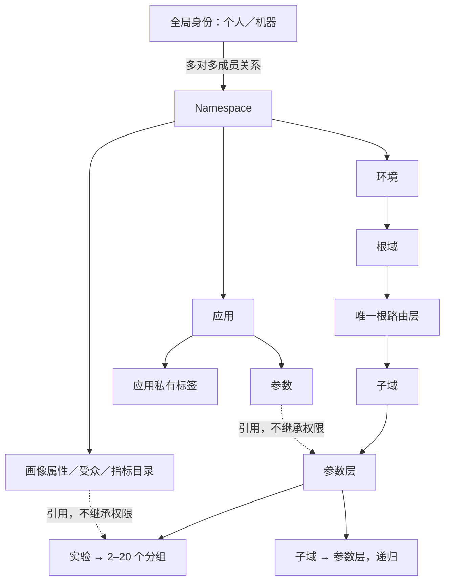

# EXP Lab 产品设计

设计 v1.3 · 2026-09-23｜实现基线：v23 前端原型

本文定义信息架构与规则。操作见[使用手册](./03-平台使用手册.md)，生产契约见[服务端技术方案](../服务端技术方案/README.md)，范围与验收见[PRD](../PRD-企业AB实验平台.md)。

## 1. 产品定位与能力边界

平台统一管理“哪些参数、在哪些用户中、按什么版本生效”，使跨应用实验可配置、可解释、可追踪。

| v23 已实现 | 尚未实现 |
| --- | --- |
| 应用参数目录、私有标签、递归层域、受众固定版本 | Namespace 管理、真实账号、RBAC 与资源授权 |
| 10,000 桶模拟、固定资格、可证明互斥时复用桶 | 生产 SDK、资格快照服务、真实流量接入 |
| 2–20 组、完整 JSON、源码工作台、只读目录、组间差异 | 固定基线覆盖、参数表格、可编辑树、字段 Schema、文件导入 |
| 本地草稿与状态流转、层域负责人和期限提醒 | 后端 API、事务、审批、配置发布、真实指标和分析 |

## 2. 资源与身份

生产采用单企业部署。Namespace 直接承接旧项目，是完整实验资源和授权作用域，不增加 project／space 层级，也不等同组织团队。



| 对象 | 规则 |
| --- | --- |
| 平台身份 | 个人操作控制台，机器使用受限凭证；不同于参与实验的业务 `user_id` |
| Namespace | 隔离目录、配置、权限与分桶空间；不能直接引用其他 Namespace 的参数或层 |
| 应用／服务 | 参数的维护与执行主体；应用类型不决定实验类型或层归属 |
| 参数 | Key 在 Namespace 内唯一，归属一个应用；顶层 Key 是归层和覆盖的原子单位 |
| 标签 | 应用私有；只分类，不授予权限、不动态修改实验参数集合 |
| 环境 | 拥有独立拓扑、预留、发布、凭证与事件空间；目录定义仍属于 Namespace |
| 域／层 | 域切流量、层分参数；服务划分不自动决定层数 |
| 受众版本 | 固定条件树，与全部祖先域条件取交集 |
| 实验／分组 | 实验固定参数集合，各组配置相同顶层 Key 集合的取值 |

同一业务用户可参加多个 Namespace；独立分桶不表示流量互斥或效果无交互。同一运行参数不能由多个 Namespace 竞争控制。需要共同控制首页参数的团队应在同一 Namespace 内授权协作；独立业务流程可分设 Namespace。

一期生产设计控制库为 30 张物理表，不含现有事件湖仓事实表。Namespace、多空间成员和资源授权完整保留，物理合并不改变层域与运行约束；表清单以[数据库设计](../服务端技术方案/01-数据库设计.md)为准。

## 3. 信息架构

| 当前入口 | 页面职责 |
| --- | --- |
| 应用管理 | 登记应用；详情含概览、参数、接入配置、运行观测、关联实验 |
| 应用 → 参数 | 注册参数、私有标签、首次归层、依赖与引用；没有独立“全部参数”维护页 |
| 层域管理 → 层域配置 | 递归树、范围、桶占用、新建层／子域、管理信息 |
| 层域管理 → 分流验证 | 从根域模拟完整路径，解释命中与阻断 |
| 受众管理 | 受众版本与画像属性两个目录，支持引用导航 |
| 实验管理 | 列表筛选、继续草稿、创建／复制、详情与演示状态操作 |
| 实验草稿工作区 | 实验目标、范围与流量、分组与参数、检查与提交四区 |
| 其他演示页 | 总览、指标、报告、团队信息；不代表真实分析或权限已接入 |

生产规划增加 Namespace 上下文、成员和资源授权；当前原型没有可据此使用的 Namespace 或真实授权入口。详细页面规划以[权限设计](../服务端技术方案/05-Namespace与权限设计.md)为准。

## 4. 应用、参数与归层

```text
应用内注册参数 → pending（待归层）
→ 在目标环境补齐全部受影响域的唯一归属
→ 整体校验并原子激活为 active → 用于合法层内的新实验
```

- 参数支持 string、number、boolean、object、array；默认值须符合类型。
- 原型默认值只初始化新增参数，不是冻结的线上基线；当前定义无原地编辑／删除或服务迁移入口。
- 待归层不扩大既有层范围；“待归属应用”是历史数据的另一状态，需先确定维护应用。
- 标签只在所属应用内维护。跨应用选择可累计参数，切换应用清除标签筛选；加入新参数保留已有组值。
- 生产参数定义属于 Namespace，激活状态按环境管理；原型尚无各环境独立的实验拓扑。

## 5. 层域不变量

| 规则 | 含义 |
| --- | --- |
| 根域只有一个路由层 | 路由层只承载子域，不直接建实验，不随意增加普通根层 |
| 完整且唯一归层 | 同域各层参数并集等于继承范围，任意两层无重复参数 |
| 子域完整继承 | 范围等于父层全部参数；创建时仅生成一个“初始参数层” |
| 实验不越层 | 所选参数必须在所属普通层内；跨应用合法，跨参数层不合法 |
| 同层互斥 | 同一个固定资格用户、同一桶，至多匹配一个直接实验或子域 |
| 跨层并行 | 同域不同层独立分配；不能据此推断业务效果独立 |
| 非重叠分支 | 保持完整参数层及单条实验路径，只隔离所在父层分支 |
| 空层待配置 | 可以保存，但不能承载实验或子域 |

结构无环，域深度上限 16。重叠域可后续拆层；原型转移参数须无未结束实验和子域继承依赖，原非空来源层至少保留一个参数。`*` 仅代表当前域继承范围，不包含待归层参数。

## 6. 固定桶与受众

每层有 `[0,10000)` 固定桶，最小粒度 0.01%。申请按可用总量组合碎片，不要求连续，也不移动旧桶。

```text
空闲：[1000,2000) + [7000,9000)
申请：25% = 2500 桶
分配：[1000,2000) + [7000,8500)
```

| 数值 | 解释 |
| --- | --- |
| 本层占用 | 直接实验与直属子域桶坐标的并集 |
| 当前受众可用 | 排除有效条件可能重叠的占用后可用桶 |
| 全局名义比例 | 当前环境根域起的路径比例乘积，不是实测人数或曝光 |
| 人数估算 | 手填基数与完整资格合格率的场景假设 |

并行层占用不能相加为全局占用；资格不满足时不换桶补量。

画像属性独立于应用参数，不要求来源应用。受众支持 AND／OR，原型上限为 3 层条件组、30 条规则；每次保存新版本，旧引用不自动更新。

只有相同固定资格语义下，完整条件可证明互斥时，候选才能复用相交桶。OR 必须检查全部分支；原型超过 64 个合取组合或语义未知时按可能冲突处理。条件执行可为 true／false／unknown，只有 true 满足资格。缺失字段不能自动补齐或视作满足。

## 7. 实验与编辑

1. 固定目标层、受众版本、实验流量和参数集合。
2. 配置 2–20 组，恰好一个对照组；稳定分组 ID、正数权重且合计 100%。
3. 各组编辑完整 JSON，顶层 Key 集合一致；参数组合约束保持下线。
4. 检查最新目录、拓扑、资格、桶和全部组值后提交。

源码工作台支持搜索／替换、折叠、格式化、专注模式和原文导出。只读目录可定位路径；组间差异忽略空白及对象顺序，数组整体比较。目录不是可编辑树，比较基准组不构成配置继承。

草稿可保存错误 JSON，不占桶；自动保存、刷新恢复及冲突另存均限当前浏览器来源。提交生成待审核实验并预留桶；运行、暂停和结束为本地演示。生产运行中的参数、权重、资格或分析计划变化须创建新 run，不能混算。

## 8. 权限与运行边界

成员资格不自动授予全部资源可见性。一期直接向个人／机器绑定“角色动作集 + 资源范围 + 可选环境限制”，默认拒绝，多个 allow 取并集；负责人、创建者和标签不自动赋权。全局用户组、组绑定、权限缓存及通用策略注册框架后续扩展。

权限只沿真实业务归属继承，不复制一棵授权资源树；引用参数、受众或指标不继承其管理权限。完整配置的编排、提交和发布须按阶段满足实验动作及目标层、所有参数／受众／指标的必要权限；未完成草稿可先保存。审批要求相关依赖 read + approve，不要求 edit/use。结果读取与导出分别授权；详见[权威设计](../服务端技术方案/05-Namespace与权限设计.md)。

跨服务使用同一 decision；分配、处理前资格、实际执行、曝光和业务结果分开记录。共享首页的实验布局见[联动实验设计](../联动实验设计.md)。

## 9. 历史与依据

本次仅更新设计说明，未重新执行浏览器验收。已执行验证见 [VERIFICATION](../VERIFICATION.md)；历史取舍见 [superpowers 规格](../superpowers/specs/2026-09-06-ab-platform-design.md)，层域来源见[研究记录](../research/architecture-notes.md)。
