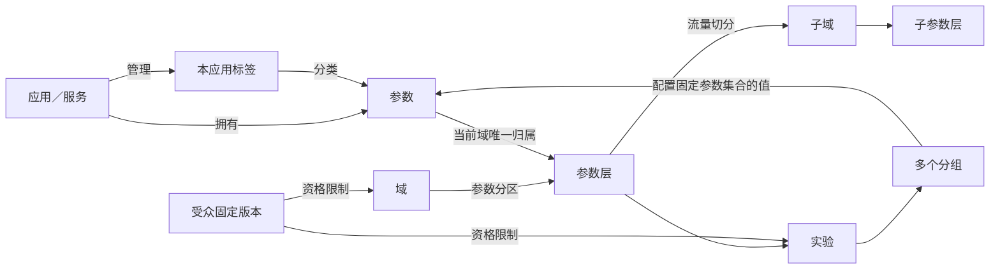

# EXP Lab 企业 AB 实验平台产品设计

文档基准：截至 2026-09-19 源码；仓库 README 当前说明版本为 v23。

适用对象：产品经理、业务实验负责人、研发、测试与平台评审人员。

本文将“原型已实现”和“生产规划”分别说明。原型已实现表示浏览器中的交互、校验与本地保存可以运行，不表示已经接入生产服务。

配套阅读：[技术方案](./02-技术方案.md)、[平台使用手册](./03-平台使用手册.md)、[平台管理与使用规范](./04-平台管理与使用规范.md)。

## 1. 产品目标与范围

平台以统一的应用参数目录和递归层域结构，承接前端、后端、算法及跨服务实验，让业务人员能够明确回答：实验修改哪些参数、由哪些应用执行、在哪些流量中生效、与哪些实验互斥，以及配置为何不能提交。

本次文档不设计指标体系、统计计算及实验效果分析模块；现有相关演示入口不在本次设计范围。

### 1.1 要解决的问题

| 问题 | 产品设计 |
| --- | --- |
| 各服务分别维护开关，跨服务实验分组难以对齐 | 应用拥有参数，一个实验通过同一分组配置多个应用参数 |
| 参数注册要求选层，建层又要求先有参数 | 登记与归层解耦，先保存待归层参数，再完成全部受影响域的归属并激活 |
| 为临时组合参数不断往根域增加层 | 根域固定路由结构，日常实验复用业务参数层，跨边界实验选择已有完整参数分支 |
| 创建子域时被迫规划两个子层 | 自动生成承接全部继承参数的“初始参数层”，之后按业务需要拆分 |
| 空闲流量碎片导致申请失败 | 每层固定 10,000 桶，按申请数量组合多个可用桶段 |
| 受众条件重复、冲突或与父域矛盾 | 画像属性目录、受众固定版本、创建时预检和提交前复检 |
| 多组实验存在大量普通参数与嵌套 JSON | 全页实验工作区、跨应用批量选参、长 JSON 源码工作台与组间结构差异 |
| 配置页复杂，编辑一半容易丢失 | 按实验独立保存草稿，保留未完成的 JSON 原文，冲突时提供恢复路径 |

### 1.2 使用角色

当前原型中的负责人用于展示、筛选与管理信息记录；以下角色分工也是后续权限设计的基础，目前没有真实鉴权。

| 角色 | 主要任务 |
| --- | --- |
| 平台管理员 | 维护根结构、应用接入规范、拓扑治理与生产发布规则 |
| 应用负责人 | 登记应用与参数，维护本应用标签、参数定义及接入配置 |
| 业务域负责人 | 规划参数分区、申请隔离流量、维护层域生命周期 |
| 实验负责人 | 创建实验、配置各组参数、核对受众与流量、提交和管理实验 |
| 研发与测试 | 校验参数值与调用链配置，使用模拟器解释分流结果 |

## 2. 核心概念和关系

模型基础采用 Tang 等人 2010 年论文 *Overlapping Experiment Infrastructure: More, Better, Faster Experimentation* 的递归域层思想；仓库已有[论文核验记录](../research/architecture-notes.md)。平台中的应用目录、私有标签、固定 10,000 桶、一个实验管理多个分组以及具体交互均属于本平台设计。

| 概念 | 业务含义 | 主要关系 |
| --- | --- | --- |
| 应用／服务 | 参数的业务归属与执行责任主体 | 一个应用登记多个参数；应用类型不会限制实验属于哪个端 |
| 参数 | 可以由实验改变的配置单元 | 当前 Key 在工作空间唯一，归属一个应用；值可为基础类型、对象或数组 |
| 应用标签 | 本应用参数的业务分类 | 每个标签归属一个应用；同名标签在不同应用拥有不同身份 |
| 域 | 在父层中取得一部分流量并继承父层参数范围 | 域下包含层；子域挂在层下，继承范围不能扩大 |
| 参数层 | 在当前域内管理一组可被实验覆盖的参数 | 域内各层完整划分激活参数；普通层可承载实验或子域 |
| 实验 | 一项可独立管理的实验配置 | 属于一个普通层，固定引用一组参数，配置 2–20 个分组 |
| 分组 | 一套参数取值和组内流量权重 | 每个实验恰好一个对照组，其余为实验组；各组顶层参数 Key 集合一致 |
| 画像属性 | 描述用户入组资格的属性 | 与实验参数目录独立，用于构建受众条件 |
| 受众版本 | 一组保存后保持不变的资格条件 | 被域和实验引用，与全部祖先域条件取交集 |



服务边界与层域边界各有职责。一个服务的不同参数可分别归入不同业务层；一个层也可包含多个服务的参数。服务拆分、部署迁移或新增端类型，不应自动触发层域重建。

### 2.1 必须维持的关系规则

1. 根域覆盖全量流量，只有一个全参数默认路由层；默认路由层不允许直接创建普通实验。
2. 域与层交替嵌套，不能成环，原型最多支持 16 级域深度。
3. 当前域继承的每个激活参数必须且只能属于本域一个层；不同域允许采用不同参数分区。
4. 星号表示继承当前域的全部有效参数范围，不表示取得全平台所有参数，也不包含待归层参数。
5. 一个实验只能修改所属层范围内的参数；已保存的参数集合不因标签维护而自动变化。
6. 同一层中，针对同一个固定资格用户，最多选择一个直接实验或一个子域。
7. 同域不同普通层分别分流，可同时命中；参数不重叠不代表业务影响之间不存在交互。
8. 非重叠域保留一个完整参数层，其所有后代路径也必须保持至多命中一个实验。

## 3. 信息架构

以下为本次范围内的产品入口。已有其他演示页不作为这些模块已经完成生产接入的依据。

| 一级入口 | 二级内容 | 核心动作 |
| --- | --- | --- |
| 应用管理 | 应用目录 | 登记应用，进入应用详情，处理历史待归属参数 |
| 应用管理 | 概览、参数、接入配置、运行观测、关联实验 | 维护应用参数和私有标签，登记各环境接入方式，查看引用 |
| 层域管理 | 层域配置 | 浏览递归结构，查看继承范围和流量，新增层／子域，编辑管理信息 |
| 层域管理 | 分流验证 | 输入固定用户资格，模拟完整路径，解释命中或阻断原因 |
| 受众管理 | 受众目录与详情 | 编辑条件、保存版本、查看关系与引用 |
| 受众管理 | 画像属性目录与详情 | 登记属性定义，查看按受众版本归集的实验引用 |
| 实验管理 | 实验列表与编辑中的草稿 | 搜索、状态／应用／受众筛选，继续草稿，复制实验 |
| 实验管理 | 全页实验工作区 | 实验目标、范围与流量、分组与参数、检查与提交 |
| 实验管理 | 实验详情 | 查看配置、参数分组取值与状态，执行演示状态操作 |

参数仅在应用的“参数”页签维护，不再提供独立的“全部参数”管理页面。创建实验、层域选参等跨应用场景使用嵌入式选择器，避免编辑中离开表单。

## 4. 应用与参数管理

### 4.1 应用登记与接入配置

应用记录标识、名称、负责人、类型及说明。类型包括前端、后端、策略、网关／BFF，用于应用描述。

接入配置按开发、测试、生产三个环境分别维护，每个环境选择直接决策或委托网关／BFF。委托目标必须已登记、属于网关类型、具备对应环境，并且委托关系不能形成环或跨环境引用。

原型保存的是接入意图，状态为待验证；运行观测没有真实服务数据。生产接入验证、凭证管理、SDK 分发和服务健康检查属于后续技术建设。

### 4.2 参数登记与激活

登记参数时，所属应用由当前页面确定。用户填写 Key、名称、类型、默认值、负责人、说明和本应用标签，不需要选择层。

支持 `string`、`number`、`boolean`、`object`、`array`。默认值须符合登记类型；对象和数组需要有效、有限的 JSON。

参数从“待归层”到可用于实验，采用独立流程：

```text
在应用内登记参数
    → 保存定义、应用归属与私有标签
    → 待归层：不改变任何现有层范围
    → 配置参数在全部受影响域的唯一归属
    → 整体校验通过，一次激活
    → 在合法参数层内参与新实验
```

首次归层从根域开始，只有一个层的域自动选定；多层域由用户选择。选中的层若包含子域，则这些子域也需要继续完成参数归属。只有全部受影响域都能保持完整分区，才激活参数。

“待归层”与历史参数“待归属应用”是两个独立问题。前者已有应用但尚无完整层归属；后者需要先明确服务责任主体，不能靠 Key 前缀自动猜测。

### 4.3 参数与标签的管理边界

- 标签的查看、创建、选择与维护均限定当前应用；不同应用允许使用同名标签。
- 一个参数可以绑定本应用的多个标签，不能绑定其他应用标签。
- 跨应用选参时先选择应用，再显示其标签；多标签按任一匹配筛选。
- 切换应用会清除当前标签筛选，但保留已经累计选择的跨应用参数。
- 批量加入参数保留各组已有值，仅为新增参数填入登记默认值。
- 标签只帮助查找和分类，保存实验时固化具体参数 Key，不将标签作为动态运行规则。

当前原型不提供已明确参数的服务迁移、参数定义编辑／删除、字段 Schema 或版本发布。参数默认值仅用于创建时补入初值，不等同于运行基线快照。

## 5. 层域与流量设计

### 5.1 重叠与非重叠

重叠域允许把继承参数拆为多个层，各层使用该域流量并独立分配。例如展示层与排序层分别管理不同参数，同一用户可以同时参加两层中的实验。

非重叠域使用单个完整参数层，承接当前域继承范围内的联合方案实验。其隔离边界限定在当前分支：展示层下的非重叠子域仍可与祖先域的排序层实验共同命中；需要全链路隔离时，应使用从全参数父层取得流量的非重叠分支。

页面必须同时解释参数继承范围、父层流量占比、全局名义流量和祖先路径，避免仅凭“非重叠”名称推断隔离范围。

### 5.2 新建子域与后续拆层

创建子域需要选择父层，配置名称、重叠模式、流量、可选受众及管理信息。父层必须有激活参数；单参数父层允许创建重叠子域，空层不允许创建子域。

保存时自动生成一个“初始参数层”，完整继承父层参数，并复制本次域管理信息。界面无需填写“子层 A／B 名称”或提前拆分参数。

后续在允许拆分的重叠域中新增层，可先保存空层，也可选入待归层参数或转移同域现有参数。转移必须满足：

- 参数未被未结束实验使用，也未被已有子域继承依赖。
- 原非空来源层至少保留一个参数。
- 转移后仍完整覆盖当前域范围，且参数不重复归属。
- 非重叠域及具有非重叠祖先的分支不能通过新增并行层扩大并发命中数量。

空层可以用于预先建立业务容器，但在获得参数前不能承载实验或子域。

### 5.3 10,000 桶与流量展示

每层使用 10,000 个固定桶，申请流量精度为 0.01%，一个桶对应本层名义流量的 0.01%。平台按低桶号组合当前可用桶，可形成多个不连续区间，不要求存在足够大的单个连续空闲段。

例如可用区间为 `[1000,2000)` 与 `[7000,9000)`，申请 25% 即 2,500 桶，可以分配 `[1000,2000)` 加 `[7000,8500)`，保留已有实验的分配。

| 页面数值 | 含义 |
| --- | --- |
| 层占用 | 直接实验的预留桶与直属子域桶的坐标并集 |
| 当前受众可用 | 排除与当前完整条件可能同时满足的占用后，可申请的桶总量 |
| 父层名义占比 | 此实验／子域获得的父层桶比例 |
| 全局名义占比 | 沿祖先路径相乘的流量比例，不包含真实资格匹配率 |
| 资格人数场景估算 | 用户手动给定基数与合格率产生的假设结果，不是实测 |

多个并行层的占用不能相加当作全局流量占用。受众不满足时不换桶、不自动补量，也不跨桶转投其他实验。同一桶中若存在按互斥资格合法复用的候选，则仅选择资格匹配的候选；没有匹配项时不进入实验。

### 5.4 层域管理信息

新建层与子域可填写负责人、长期／临时及预计结束日期，详情中可以继续编辑。负责人必填且最多 40 字；临时资源必须填写有效日期；长期资源不保存结束日期。

允许记录过去日期，界面按浏览器本地日期提示“今日到期”或“已超期”。到期仅提醒，不停止实验、不释放桶，也不删除层域。旧资源未填写管理信息时保持“未设置”。

初始参数层只在创建时复制一次域管理信息，后续域和层可以分别维护；编辑不是持续继承。

## 6. 画像属性与受众设计

### 6.1 同一一级入口下的两个目录

“受众管理”下分别提供画像属性目录和受众目录。属性目录定义可用条件字段，受众目录组合这些字段；两者共享入口但不把定义管理与圈选表单混在同一张列表。

画像属性包括 Key、名称、类型、取值范围及口径说明，不要求填写来源应用。类型支持枚举、数值、布尔和字符串。已登记属性不能静默改写语义或删除，需要变更时登记新属性。

受众条件支持 AND／OR 条件组，最多 3 层分组、30 条规则。每次保存形成固定版本，域和实验引用具体版本；新版本不会自动替换已有引用。

实际资格为“全部祖先域条件 AND 当前域／实验条件”。子域只能进一步收窄资格，不能通过自身条件恢复已经被祖先排除的人群。

### 6.2 创建时检查和桶复用

| 检查层次 | 页面处理 |
| --- | --- |
| 条件自身格式与类型 | 定位错误规则；不完整或非法条件阻止保存 |
| 与祖先条件的交集 | 可证明交集为空时阻止用于当前上下文 |
| 与已登记受众的关系 | 显示互斥、可能重叠或无法证明；普通人群重叠允许保存 |
| 当前层的分配容量 | 在域／实验内快捷创建受众时，联合父表单流量检查可用桶 |
| 最终保存／提交 | 重新读取当前配置并再次校验，预检结果不代替最终分配 |

只有完整条件能够证明互斥，才允许同父层的候选复用相交桶坐标。包含 OR 时须检查全部分支组合；展开超过 64 个组合仍可按完整树求值，但不能据此放行桶复用。未知结论按可能冲突处理。

原型模拟器为同一个 `user_id` 保存固定资格快照；首次保存后不能补填缺失字段或通过修改画像改换资格。缺少属性不视为满足条件。真实画像供应与生产快照服务尚未接入。

### 6.3 引用导航

受众的“查看引用实验”进入带受众版本条件的实验列表，包含直接引用以及经祖先域继承该版本的实验。画像属性详情按实际引用它的受众版本提供同类入口。

列表允许继续叠加名称、状态、涉及应用和本人负责筛选。未知版本显示可清除的空态。外部引用入口清除残留其他筛选，列表内主动切换受众保留其他筛选；返回列表保留来源条件。

该筛选表示配置依赖关系，不表示用户已经进入实验。域引用继续进入对应层域条件页面，当前不新增独立的域列表页。

## 7. 实验工作区与多组参数

### 7.1 全页工作区

创建入口支持空白新建、从参数层新建、复制已有实验。复制保留参数配置与可解析的固定受众资格，生成新的分组 ID，不复制原流量桶；未知旧条件阻止提交，要求显式重新选择。

工作区包含四个可自由切换的配置区，不要求完成上一步才能编辑下一步。

| 配置区 | 本文范围内的交互 |
| --- | --- |
| 实验目标 | 填写名称、唯一标识、说明与假设 |
| 范围与流量 | 选择域和普通层、受众固定版本、申请流量，查看资格和容量解释 |
| 分组与参数 | 管理分组、组内比例、跨应用选参及完整参数值 |
| 检查与提交 | 汇总当前错误与配置，点击问题回到配置区、具体分组或参数 |

实验无需选择前端、后端或算法类型。涉及应用及责任主体根据所选参数归属汇总。

### 7.2 多分组规则

原参数组合约束已下线，不再参与创建、审核或分流校验；仍保留参数类型、完整性、归层、受众与流量合法性检查。

新实验支持 2–20 个分组，每组拥有稳定标识、名称、角色、权重及参数原文。分组名称在实验内不重复，必须且只能有一个对照组，各组权重大于零且合计恰好 100%。

支持新增、复制、删除、设为对照与显式均分。均分由用户主动操作，不因普通编辑悄悄改变其他组比例。对照身份由角色确定，不由名称或首字母推断。

各组必须使用相同的顶层参数 Key 集合；有登记定义的参数值须通过类型校验。对象内部可以包含场景、召回路和策略配置，其内层路径不作为独立归层单元。

### 7.3 长 JSON 源码工作台

原型当前采用源码为主要编辑入口，覆盖普通参数与嵌套策略 JSON 共存的场景。

- 源码编辑器提供行号、折叠、搜索／替换、校验定位和格式化。
- 专注编辑扩大至当前视口，并支持切换实际实验分组。
- 每组在当前编辑器会话中分别保留光标、滚动、折叠和撤销历史；刷新后不恢复这些临时状态。
- 只读参数目录展示对象、数组及路径，可搜索字段、路径、值和登记名称，并按真实应用及私有标签过滤。
- 目录筛选只影响浏览，不裁剪源码、不改变实验参数集合；点击节点定位到对应源码。
- 严格校验顶层对象、重复属性、有限数字与最多 32 层嵌套；重复属性包含转义后同名字段。
- 目录最多显示 5,000 个节点，完整源码仍参与校验和差异比较。
- 分组差异对比两个实际分组，展示新增、删除与修改路径；忽略缩进和对象字段顺序，数组整体比较。
- 任一组 JSON 无效时停止比较；格式化只处理有效内容，源码导出保留当前完整原文。

只读目录与结构差异已经实现；固定基线加覆盖、字段 Schema、参数表格、可编辑 JSON 树、CSV 导入、补丁应用和自动合并属于后续规划，不作为当前配置机制。

### 7.4 草稿、提交与状态

草稿按实验独立保存，可以保存未完成或错误的 JSON 原文；保存表单、当前配置区与选中分组。草稿不预占流量，刷新或从“编辑中的草稿”可继续。

检测到版本冲突时暂停自动保存并保留当前输入，用户可另存、导出或加载最新版本。存储读取失败、坏版本、容量不足均显示错误，不用空白草稿覆盖旧内容。

提交前基于最新配置检查名称与标识、分组、参数、受众、归层及桶容量。成功后建立待审核实验并预留流量；演示启动是独立动作。待审核、运行中、已暂停实验预留桶，已结束实验释放其直接预留。

已提交草稿记录关联实验并从编辑列表移除，重复打开或提交通过来源草稿身份定位既有实验。浏览器保存仍不具备服务端事务、多人协作或跨设备同步保证。

## 8. 分流验证

分流验证位于层域管理的独立页签。域或层上的“验证分流”带入关注节点，模拟仍从默认域完整执行，并展示所有并行分支。

用户输入 `user_id` 和资格画像，查看经过的域、每层桶位、子域／实验选择、实验分组及显式参数覆盖。关注节点“已到达”只表示路径到达，不等于实验命中。

未到达时说明首个阻断原因，包括祖先桶外、受众不满足、准入限制或空层跳过，并提供返回对应配置的入口。输入与结果在层域两个页签间往返保留；输入或配置变化后提示重新模拟。

模拟结果不承诺离开一级导航或刷新后恢复。当前返回的是命中实验的显式覆盖，没有编译全目录默认值、发布层和运行基线的最终配置。

## 9. 推荐与微服务的建议组织方式

以下为规划示例，帮助讨论业务边界；不是当前页面内置的推荐系统模板。

```text
某重叠域
├─ 推荐业务参数层：可包含召回、过滤、排序等多个服务的参数
│  ├─ 常规迭代子域：示例 90%
│  │  ├─ 候选集层：召回与业务过滤配置
│  │  ├─ 评分层：粗排与精排配置
│  │  └─ 结果编排层：重排与展示编排配置
│  └─ 推荐联动非重叠子域：示例 10%
│     └─ 完整推荐参数层：验证跨阶段的成套方案
└─ 其他业务参数层：仍可与以上推荐分支并行
```

分层应依据可以独立演进的业务参数边界，避免为每条召回路、每个微服务或每个实验新建层。大量召回路可以组织在应用参数的对象值中，以场景和策略结构管理；一个对象参数的不同子路径不能分别分配给不同层。

需要跨已有层联合改动时，优先使用继承范围覆盖全部目标参数的已有隔离分支。没有合适分支时，由业务负责人评审拓扑调整；不能通过复制同一业务参数或临时扩大根结构绕过归属规则。

生产微服务方案应指定可信决策点，将同一请求链的实验分组与配置版本传给各执行服务。参数归属决定服务读取哪些配置；同一个 `user_id` 本身不足以保证各服务使用了相同配置。相关协议见[技术方案](./02-技术方案.md)。

## 10. 生产治理规划

以下能力未作为原型的真实权限或发布机制实现。

| 治理主题 | 规划要求 |
| --- | --- |
| 资源权限 | 按工作空间、应用、业务域授予查看／编辑／申请／审批权限；根结构由平台维护 |
| 跨应用实验 | 根据参数实际归属汇总责任应用，由相关负责人确认兼容性和执行准备 |
| 拓扑调整 | 明确业务目的、继承范围、影响实验与回收计划，控制新增层域数量及深度 |
| 配置发布 | 参数定义、实验配置、资格条件和桶分配以可追溯版本发布，保留变更与回滚记录 |
| 服务接入 | 接入验证通过后才允许进入生产发布流程，配置保存不能代替就绪验证 |
| 生命周期 | 对临时资源提醒、复核依赖并显式回收，避免到期自动打断仍在运行的实验 |
| 变更保护 | 运行中流量、参数迁移、域份额及分组比例变更需要独立影响评估 |

实施顺序建议为：服务端持久化与校验 → 权限和审批 → 配置发布与 SDK → 版本和运行追踪 → 更细粒度的参数编辑能力。详细操作约束见[平台管理与使用规范](./04-平台管理与使用规范.md)。

## 11. 核心验收场景

下表是本产品范围的验收要求；本文不把历史测试数量或构建记录作为本次重新执行的证据。

| 场景 | 预期行为 |
| --- | --- |
| 在应用中登记一个参数 | 保存为待归层；所属应用固定，不扩张现有层作用域 |
| 首次归层有一个受影响子域未配置 | 阻止激活并指出缺失域；补齐后整体生效 |
| 应用 A 选择应用 B 的标签 | 阻止保存；同名标签不改变该约束 |
| 同域两层试图拥有同一个参数 | 拒绝非法分区；不同域的不同分区可以保留 |
| 新建合法子域 | 自动创建完整继承参数的初始层，复制一次管理信息 |
| 非重叠分支新增并行参数层 | 阻止，保证该分支至多命中一个实验 |
| 空闲桶总数足够但不连续 | 自动组合桶段成功，不搬动已有预留 |
| 受众普通重叠但桶不相交 | 允许；人群重叠不等于分配冲突 |
| 申请复用相交桶但互斥无法证明 | 阻止复用，不按优先级挑选候选 |
| 实验与祖先受众交集为空 | 在创建上下文和提交前阻止 |
| 三个分组中一个缺失参数 | 阻止提交，定位具体分组与参数 Key |
| 只读目录筛选未展示部分参数 | 原文与提交参数集合保持完整 |
| JSON 出错后保存、刷新草稿 | 原始错误文本保留，修正后恢复校验与差异比较 |
| 同一草稿被另一页面改动 | 旧页暂停自动保存，保留输入并提供恢复操作 |
| 从受众详情查看引用实验 | 进入带固定版本条件的实验列表，支持继承引用 |
| 临时层域超过预计结束日期 | 显示超期提示，实验和桶分配继续保持 |
| 从节点进入分流验证 | 关注节点改变解释视角，完整模拟起点与并行路径不变 |

## 12. 实施边界与源码依据

当前是 React、TypeScript 与 Vite 构建的前端原型。目录、拓扑、实验和草稿主要保存于浏览器本地；没有真实后端、RBAC、服务端审批、生产 SDK、凭证、部署验证或跨设备协作。

普通保存的版本检查用于发现过期页面，不构成跨标签页原子事务。应用环境配置也不等于三个环境各自独立的一套生产拓扑。

当前不提供运行中节点迁移、域份额编辑、节点删除、共享对照、完整发布层执行、多种随机化单元和跨语言生产哈希契约。这些能力需要独立设计后再纳入产品承诺。

| 核验主题 | 主要源码 |
| --- | --- |
| 导航、实验提交与列表筛选 | [App.tsx](../../src/App.tsx) |
| 应用、私有标签与环境委托 | [service-catalog.ts](../../src/service-catalog.ts) |
| 参数登记与完整归层 | [parameter-registration.ts](../../src/parameter-registration.ts)、[parameter-assignment.ts](../../src/parameter-assignment.ts) |
| 递归拓扑、作用域与分配校验 | [traffic.ts](../../src/traffic.ts)、[child-domain-creation.ts](../../src/child-domain-creation.ts) |
| 画像与受众创建预检 | [profile-attributes.ts](../../src/profile-attributes.ts)、[audience-preflight.ts](../../src/audience-preflight.ts) |
| 多分组、草稿与提交校验 | [experiment-variants.ts](../../src/experiment-variants.ts)、[experiment-drafts.ts](../../src/experiment-drafts.ts)、[experiment-draft-validation.ts](../../src/experiment-draft-validation.ts) |
| 长 JSON 校验、目录及结构差异 | [json-parameter-analysis.ts](../../src/json-parameter-analysis.ts) |
| 负责人和使用期限 | [resource-management.ts](../../src/resource-management.ts) |
