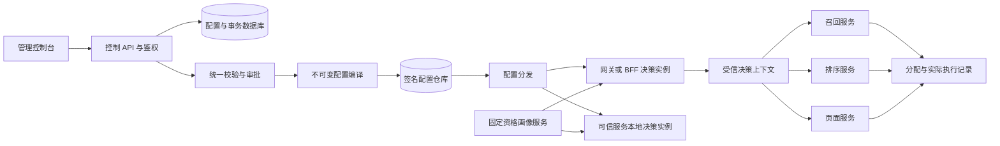

# EXP Lab 技术方案

版本：文档 v1.0｜编写日期：2026-09-19｜实现基线：仓库 v23 原型。

本文面向平台研发、架构评审和接入服务研发。标记为「已实现」的内容来自当前源码；标记为「生产建议」的内容尚未落地，不能视为平台现有能力。

本次范围包括应用与参数、递归层域、受众、实验配置、分流、跨服务执行、配置发布和管理治理。**不设计指标体系、统计引擎、效果分析及报告计算**；仅保留定位配置与执行问题必需的数据契约。

关联文档：[产品设计](./01-产品设计.md)｜[平台使用手册](./03-平台使用手册.md)｜[平台管理与使用规范](./04-平台管理与使用规范.md)。

## 1. 技术结论与设计边界

平台采用「域划分流量、层划分参数、实验配置分组取值」的递归模型。应用／服务负责参数定义与执行，服务边界和参数层边界分别维护；一个层可以包含多个应用参数，一个应用的不同参数也可以分布在不同层。

域与层交替嵌套；同一域的参数层完整且不重复地划分继承范围；同一层的直接实验和子域竞争该层的桶空间。命中子域后递归处理其参数层，不再同时执行父层的直接实验。这与 Google 的层域思想一致；本平台的具体约束以本文件第 4 节为准。[Google：Overlapping Experiment Infrastructure](https://research.google/pubs/overlapping-experiment-infrastructure-more-better-faster-experimentation/)

以下是本平台的产品与工程选择，不是论文规定：根域仅一个全参数路由层、固定 `user_id`、每层 10,000 桶、最多 16 级域、实验对象内包含 2–20 个分组、同用户固定画像下允许证明互斥的人群复用桶坐标。

当前交付是浏览器内可运行原型：没有后端数据库、生产 SDK、真实审批、机器凭证、跨设备同步或真实配置分发。界面的服务接入配置只记录期望接入方式，状态仍待验证。

## 2. 当前实现架构（已实现）

### 2.1 技术栈与模块

| 层次 | 当前实现 | 主要代码 |
| --- | --- | --- |
| 页面与路由 | React、TypeScript、Hash 路由 | `src/App.tsx`、各 `*-routes.ts` |
| 应用与参数 | 服务目录、私有标签、参数注册与首次归层 | `service-catalog.ts`、`parameter-registration.ts`、`parameter-assignment.ts` |
| 层域引擎 | 递归作用域、参数分区、拓扑校验、分流模拟 | `traffic.ts`、`child-domain-creation.ts` |
| 桶集合 | 整数区间验证、合并、求交和包含判断 | `bucket-ranges.ts` |
| 受众 | 属性目录、条件树、版本、求值与互斥证明 | `profile-attributes.ts`、`audiences.ts`、`audience-preflight.ts` |
| 实验草稿 | 每稿独立存储、revision、恢复、提交校验 | `experiment-drafts.ts`、`experiment-draft-validation.ts` |
| 分组 | 稳定 ID、唯一对照、权重、新增与复制 | `experiment-variants.ts`、`variant-draft-operations.ts` |
| JSON 工作台 | CodeMirror 6、严格 JSON、目录与结构差异 | `JsonParameterWorkbench.tsx`、`json-parameter-analysis.ts` |
| 管理信息 | 域／层负责人、期限、预计结束日期 | `resource-management.ts` |
| 工程 | Vite 构建、Node 内置测试运行器 | `package.json`、`tests/*.test.mjs` |

所有业务状态仍由前端内存与 `localStorage` 管理。模块中的 `plan*` 函数先基于快照生成候选结果，验证后由调用方保存；这里的“一次保存”不代表服务端数据库事务。

### 2.2 本地存储

| 存储键 | 数据范围 | 当前一致性能力 |
| --- | --- | --- |
| `exp-lab-topology-v1` | 域、层、参数、归层状态、服务、标签、画像属性、受众及管理信息 | 整体快照写入；保存前比较上次读取的原始内容 |
| `exp-lab-experiments-v3` | 正式实验及状态 | 列表整体写入；新草稿提交前重读和校验 |
| `exp-lab-experiment-draft-v1:<draftId>` | 表单、JSON 原文、配置区、选中分组、revision、提交标记 | 乐观版本检查；冲突时暂停自动保存 |
| `explab-simulation-profile-snapshots-v1` | 各 `user_id` 首次模拟画像及创建时间 | 同一 ID 复用固定快照，不允许补填旧快照 |

浏览器来源不同即存储隔离；`localhost` 和 `127.0.0.1` 不共享上述数据。清理浏览器数据会丢失本地配置，不提供服务端备份。

草稿允许保存无效或未完成的 JSON 原文。读取失败、坏版本、容量不足和版本冲突会保留可恢复内容并提示。已提交草稿通过 `sourceDraftId` 查找对应实验，避免常见的重复点击提交。

拓扑坏数据会阻止正常管理页面加载。正式实验的旧读取路径 `readSaved()` 在解析失败或结构不符时仍可能回退到演示种子；这一行为不适合生产数据恢复，迁移到后端时必须改为明确错误与人工恢复。

跨标签页同时“读—校验—写”仍可能竞争；草稿标记与正式实验写入也不是同一事务。本地 `revision` 和原始快照比较不能提供多用户原子提交保证。

## 3. 目标生产架构（生产建议，未实现）

### 3.1 控制、分发与决策职责



- **控制平面**：维护目录、拓扑、实验版本、审批、预留、权限与审计。可以先使用模块化单体，保持业务事务清晰，不必立即拆成大量微服务。
- **分发平面**：把已批准配置编译为不可变产物，签名、存储、按工作空间和环境分发，接收实例版本确认。发布指针和配置内容分开管理。
- **决策平面**：缓存已验证产物，在请求内使用确定的快照计算分组。不能在每个参数读取时访问控制台或数据库。
- **执行服务**：消费自己负责的参数，执行实际逻辑，报告生效版本和回退原因。实验平台不能替服务完成模型加载、代码部署或业务补偿。

控制服务不可用时，已部署的决策实例应在明确的有效期策略内继续使用本地有效快照。配置停更、网络隔离、旧版本过期必须具有不同的错误原因。

### 3.2 初始部署建议

建议先采用关系数据库承载配置事务、对象存储承载不可变产物、缓存或长连接承载分发通知。分配和执行记录采用异步采集，不能阻塞业务主请求。

数据库、队列和部署供应商根据现有基础设施选择；当前没有真实 QPS、快照规模、服务语言和延迟预算，本文不承诺容量、可用性或回滚时效。

开发、测试、生产需要独立的发布指针、预留与权限边界。当前原型的“三个环境”仅是服务接入配置，尚未做到每个环境独立的实验拓扑与运行状态。

## 4. 实体关系与不变量

### 4.1 当前实体与生产补充

| 实体 | 当前关键关系 | 生产建议增加 |
| --- | --- | --- |
| 应用／服务 | 类型、负责人、三个环境接入方式 | 工作空间、环境授权、机器身份、接入验证结果 |
| 参数定义 | Key、类型、默认值、负责人；绑定唯一服务 | 不可变定义版本、Schema 版本、业务安全默认值版本 |
| 应用标签 | `serviceId` 归属；本应用内名称唯一 | 操作审计；仍不承担权限或运行选择语义 |
| 参数归层 | 待归层状态；在各继承域唯一分区 | 归层变更版本、影响清单、原子生效 |
| 域 | 父层、模式、桶集合、受众版本、随机化单元 | 分配 epoch、冻结版本、归属业务与配额 |
| 层 | 所属域、参数集合、路由／普通角色 | 固定 hash salt、配置 revision、变更审计 |
| 受众版本 | 条件树与画像属性引用；不可原地改变条件 | 快照策略版本、证明算法版本、受信属性来源契约 |
| 实验版本 | 域、层、固定参数 Key、分组、流量与受众 | 不可变 revision、审批内容摘要、发布状态 |
| 分组 | 稳定 ID、角色、名称、权重、JSON 原文 | 编译后的参数值、冻结分桶映射 |
| 桶预留 | 当前由实验状态与子域配置推导 | 独立 Reservation 记录、生命周期及事务约束 |
| 决策快照 | 当前无独立实体 | 配置版本、画像快照、分配结果、有效期与签名 |

当前代码把参数定义和服务归属拆成 `parameters` 与 `catalog.bindings` 两部分。生产可使用关联表，但仍以参数的稳定身份关联，不能通过 Key 前缀猜测服务。

当前参数 Key 在整个工作空间唯一；不能在不同服务中注册同名 Key。服务内命名空间、重命名和已归属参数的服务迁移需要单独版本方案，不属于已实现能力。

### 4.2 层域结构

令 `P(d)` 为域继承的激活参数集合，`L(d)` 为域内参数层，必须满足：

```text
根域参数范围 = 全部已激活参数
子域参数范围 = 父层参数范围
对任意域 d：各层参数集合的并集 = P(d)
对同域任意不同层 l1、l2：P(l1) ∩ P(l2) = ∅
实验声明的参数集合 ⊆ 所属普通参数层的参数范围
```

`*` 只代表当前域完整继承范围，不代表平台全量参数，也不包含待归层参数。子域不能借助 `*` 获取父层之外的参数。

根域固定为 `root`，只有 `root-layer` 一个全参数路由层；路由层只创建子域，不能直接创建实验。该约束防止为临时组合不断在根部增加参数层，是本平台的治理选择。

重叠域可有多个参数层，各层分别计算桶位；非重叠域只有一个完整参数层，其后代也必须保持单条实验路径。位于某普通层内的非重叠子域，只隔离该分支，不隔离祖先域的其他并行层。

同域参数不重复能避免配置覆盖冲突；它不能证明不同业务改动不存在相互影响。微服务调用顺序也不等于层域树结构。

### 4.3 参数注册、激活与子域初始化

1. 在所属应用登记参数，检查 Key、类型、默认值和负责人，保存为待归层；此时不扩张任何层的参数范围。
2. 首次归层从根域出发，选择每个相关域的归属层；只有一个候选层时自动选择。
3. 沿选中层的所有子域继续补齐归属，必须一次完成全部受影响分区。
4. 校验新拓扑与所有预留实验后，移除待归层标记；已激活参数不能通过退回待归层绕开保护。
5. 新建子域时继承父层完整参数范围，自动创建一个「初始参数层」。随后在合法重叠域中按业务需要拆分。

空参数层可以先保存；它不参与模拟，也不能承载实验（含 A/A）或子域。新建子域要求父层已有参数。

当前同域拆层只转移没有未结束实验使用、没有子域继承的参数；原非空层必须保留至少一个参数。这里“未结束”包含历史正式 `draft`，比流量预留状态更严格。

生产建议将注册、首次归层与分区变更作为不同命令，在事务中重新校验全部依赖。参数可先注册为待归层，层也可先空建；两者存在后再完成归层，从而避免登记参数和创建层相互依赖。

## 5. 分流与容量算法

### 5.1 离散桶表示（已实现）

每个层使用整数桶 `[0, 10000)`；申请比例的最小粒度是 `0.01%`，桶数等于比例乘以 100。桶集合使用有序、不重复、左闭右开的多个区间表达。

```json
{
  "traffic": 20,
  "bucketStart": 10,
  "bucketRanges": [
    { "start": 1000, "end": 1800 },
    { "start": 4000, "end": 5200 }
  ]
}
```

上例共 2,000 桶，表示所在层的 20%。`bucketStart` 是兼容旧结构的百分比起点，必须等于第一段起点除以 100；不能再使用 `bucketStart + traffic` 推导终点。

申请时按低桶号依次组合可用桶，满足总数即成功，不要求连续；不会挪动或压缩其他分配。显式桶段无效时必须报错，不能回退到旧连续区间解释。

对于候选受众 `C`，冲突占用集合为：

```text
R = 同父层的子域 + 状态为 review / running / paused 的实验
占用(C) = 所有“无法证明与 C 互斥”的 R 的桶集合之并集
可用(C) = [0, 10000) - 占用(C)
申请桶数 <= 可用(C)桶数，才允许预留
```

不同层是不同桶空间，不能把各层使用比例相加得出域使用率。域份额沿路径相乘只能得到全局名义流量，经过受众筛选后的合格人数还取决于真实资格分布。

当前有实验尚未运行，也可能已占桶：审核中预留，暂停时保留；所有子域均占父层桶，即使其内部尚无运行实验。

### 5.2 当前模拟顺序（已实现）

1. 验证完整拓扑以及处于预留状态的实验；配置不合法则停止模拟。
2. 读取该 `user_id` 的首次固定画像，判断根域资格。
3. 从根域开始，对每个有激活参数的普通层以及路由层分别计算固定桶位。
4. 仅查看桶位所在的子域／实验候选，用完整有效受众条件求值。
5. 没有匹配候选则保持默认路径；未知资格不视为满足，不换桶补量。
6. 唯一匹配项为子域则递归；为运行实验则用实验自己的 hash 选择分组。
7. 审核中或暂停实验只保留占位，不返回实验覆盖；并行分支参数合并时发现重复 Key 则拒绝。

同桶出现两个匹配候选属于配置错误，模拟器拒绝分配，不按优先级随机选一个。模拟失败时清空合并参数，已有轨迹仅供定位问题。

### 5.3 稳定 hash 与版本（当前／生产建议）

当前 `traffic.ts` 使用基于 FNV 的 32 位混合 hash，输入是 JavaScript 字符串，经 `charCodeAt` 与整数混合后 `% 10000`。根层、普通层和实验分组使用不同前缀；前缀中的 epoch 目前固定为 `epoch-1`。

当前新分组根据**持久化数组顺序和累积权重**分配，稳定分组 ID 不是 hash 输入。改组顺序或权重会改变部分用户的组，不能把“有稳定 ID”解释成“任意调整都不换组”。

生产建议另定义独立的 `hashProtocolVersion`，固定 UTF-8 编码、字段长度编码、整数解释、bucket 映射、身份规范化及 salt 管理，并提供跨 Java／Go／JavaScript 的相同测试向量。可选 SHA-256 等标准算法；最终协议需验证后冻结，不直接把当前模拟 hash 当作生产规范。

```text
层桶输入 = workspace + environment + layerId + allocationEpoch + stableUnit
分组输入 = workspace + environment + experimentId + variantEpoch + stableUnit
```

字段应使用无歧义编码，不能简单连接可能包含分隔符的字符串。配置内容 revision 与分配 epoch 分开；不能因改名称、标签或说明就自动更换 hash 种子。

扩大准入范围时优先保留原桶并增加空闲桶；是否调整组比例、重排映射或更换随机化单元必须显式版本化。当前原型没有运行实验扩缩量、域份额编辑和生产用户迁移能力。

## 6. 受众求值与冲突证明

### 6.1 当前模型（已实现）

画像属性目录独立于应用参数，维护类型和语义，不要求填写来源应用。受众通过 AND／OR 条件树引用这些属性，版本固定保存；域和实验使用版本 ID，不随同名新版本自动更新。

```text
子域有效条件 = 所有祖先域条件 AND 子域自身条件
实验有效条件 = 所属域有效条件 AND 实验自身条件
```

条件编辑最多 3 层分组、30 条规则。数值、枚举、布尔等按登记类型验证；旧平铺条件仍按 AND 处理。

目录中的受众可以相互重叠；创建时先校验表达式、已知矛盾和受众关系。在域／实验创建上下文中，还计算祖先交集及当前桶容量；保存或提交前再次检查。

只有所有 OR 分支组合都可证明互斥，才能让两个候选占用相交桶坐标。展开超过 64 个组合、引用未知属性或存在未解析条件时，互斥证明返回未知，保守分配独立桶。

“未知”与“交集为空”不同。复杂但有效的条件仍可按完整树判断某个用户的资格；不能据此推导两个受众必然互斥。可证明为空的条件会阻止保存，无法证明的条件不伪造结论。

同桶复用依赖同一 `user_id` 的固定资格快照；不能用每个请求实时变化的地区、会员状态或设备信息替换旧快照后，仍声称用户跨时间互斥。当前模拟器首次保存后将画像锁定，包括缺失字段。

### 6.2 生产资格契约（生产建议，未实现）

画像服务为每次约定的入组周期返回 `profileSnapshotId`、快照策略版本、属性定义版本及值。客户端提供的任意字段不能直接充当权威资格。

参数默认值、受众条件版本和画像快照是三个不同概念：默认值不决定人群，条件版本不等于画像时点，身份相同也不保证画像相同。

若业务必须支持实时请求条件，需另建明确的请求过滤语义，并禁用依赖这些可变条件的用户级同桶复用。不能无声改变现有固定画像假设。

证明结果应记录条件版本、祖先路径版本、属性定义与证明器版本；任何依赖变化都使旧证明失效。提交事务中必须重新校验，前端提示不能成为唯一依据。

## 7. 多分组、参数 JSON 与编译

### 7.1 当前编辑和校验（已实现）

新实验支持 2–20 组，必须且只能有一个 `control`，其他为 `treatment`；各组 ID 稳定且唯一，名称忽略首尾空格和大小写后不得重复。权重为 0.01–100%，最多两位小数，合计恰好 100%。

所有分组使用同一顶层参数 Key 集合，并且全部属于选定层。每个参数有已明确的所属应用；待归层、未归属和越层参数不能进入新实验。

当前新草稿的 JSON 校验要求：顶层对象、严格 JSON、无重复属性、有限数字、最多 32 层。转义后相同的属性名也算重复；登记参数的顶层值必须符合 string／number／boolean／object／array 类型。

CodeMirror 提供行号、折叠、搜索替换和专注编辑。目录最多展示 5,000 个节点，该上限只影响导航，不裁剪完整 JSON 校验与差异；数组在分组差异中整体比较，调整顺序也记录为修改。

原始源码按分组保存在草稿中，错误文本也保留。编辑会话内的光标、撤销、滚动与折叠不保证刷新恢复；结构差异只读，不支持自动合并或补丁应用。

**校验实现边界**：当前严格解析集中在源码工作台与 `validateDraftForm`。底层 `validateAllocation` 仍使用 `JSON.parse`，类型检查依赖已登记的自定义参数定义；内置示例参数没有完全相同的定义校验。历史数据不能仅凭底层校验就认定满足新草稿全部约束。

组合约束已下线；历史 `parameterRules` 只保留兼容。不得重新把旧组合规则当成新实验发布门禁；历史 `coordination` 中显式保留的执行绑定仍有兼容校验。

### 7.2 编译产物（生产建议，未实现）

生产需要一个前后端共用语义的校验规范，所有入口均调用同一套验证器；API、导入、审批、编译和运行快照装载不能绕过重复字段、深度、类型及完整性检查。

建议为嵌套策略引入参数 Schema 版本，校验对象字段、枚举、范围及业务必填项。这是单个参数自身的数据合法性校验，不是恢复跨参数组合约束产品。

```text
可编辑原文 + 固定参数定义版本 + 固定环境默认值版本
→ 严格解析、范围与作用域校验
→ 生成不可变实验版本
→ 编译各组完整值与类型信息
→ 按服务生成授权可读视图
→ 校验产物摘要并签名
```

复杂策略可以引用不可变模型、索引或配置包版本，不使用含义会漂移的 `latest`。模型和代码资产保留在各自的发布系统，平台只保存可验证引用。

基线＋覆盖、可编辑参数表格、字段 Schema、CSV 导入和结构化补丁均为后续能力；当前每组保存完整的顶层参数对象，不存在自动组间继承。

## 8. 实验状态、预留与并发

### 8.1 当前状态语义（已实现）

| 状态／对象 | 预留桶 | 模拟返回实验覆盖 | 可转到 |
| --- | --- | --- | --- |
| 编辑工作区草稿 | 否 | 否 | 提交产生正式 `review` 实验 |
| 正式 `draft` | 否 | 否 | `review` |
| `review` | 是 | 否 | `draft`、`running` |
| `running` | 是 | 是 | `paused`、`completed` |
| `paused` | 是 | 否 | `running`、`completed` |
| `completed` | 否 | 否 | 无 |

草稿提交时按最新配置重新选桶，成功后进入待审核。审核退回释放预留；暂停保留原桶，恢复会再次校验。结束后不参与新分配，桶可由后续配置使用。

正式列表内的历史 `draft` 与全页工作区草稿是两类存储对象。不能假设每个历史草稿都具备工作区的 revision、原文恢复和提交标记。

状态变更仍是前端演示行为，当前没有真实审核身份、审批签名、配置分发完成确认或服务端事务。生命周期提示文字不能当作异步执行能力证明。

### 8.2 提交事务（生产建议，未实现）

```text
接收 Idempotency-Key、草稿 revision、拓扑 revision
→ 验证调用者和环境权限
→ 检查幂等记录及请求摘要
→ 锁定目标层的预留账本与相关拓扑版本
→ 重读受众、参数定义、祖先作用域及现有预留
→ 统一校验并分配桶集合
→ 写不可变实验 revision、review 状态和 Reservation
→ 写审批待办、草稿关联、审计及控制事件 outbox
→ 一次数据库事务提交
```

请求重复且内容相同返回同一实验；幂等键相同但内容不同应拒绝。`sourceDraftId` 建立唯一关系，不能只在应用层先查询再插入。提交审核产生控制事件，只有完成审批与启动流程后才生成可执行的配置发布事件。

同层可能有经证明互斥的受众共享桶，因此不能仅靠 `(layerId, bucketId)` 唯一约束实现全部规则。需要对层账本串行化修改，并校验相交桶对应的有效受众；普通无条件预留可以使用更简单的排他约束。

审核绑定 `experimentRevision + configDigest + dependencyRevisions`。提交后修改分组、受众、参数定义或依赖拓扑需要新版本与重新审批；审批不能只关联可变的实验 ID。

拓扑拆层、参数激活和子域创建也须锁定同一依赖范围，防止“审核时合法，发布时已越层”。返回结构化冲突及实际 revision，前端保留当前内容并提供重新校验。

生产停止实验时，应先发布停止分配版本，确认旧快照的使用窗口已结束或有隔离策略后再回收桶。不能把原型中的即时释放直接搬到异步分发系统，否则旧实例可能继续执行已被重新分配的桶。

## 9. 微服务决策与执行契约（生产建议，未实现）

### 9.1 权威决策点

推荐由业务入口 BFF／编排服务在一次请求内固定身份、资格画像和配置版本，完成所需实验的决策；下游消费同一上下文中的既定结果。

可信服务也可本地决策，但只有相同身份、hash 协议、分配 epoch、配置快照和资格快照才能复现同一结果。仅传播 `user_id`，下游各取最新配置，会造成同一调用链版本不一致。

应用“直接接入／委托网关”表示决策责任归属，不改变参数层与域的关系。当前目录已校验同环境委托、网关类型和无环，但没有执行上述委托链。

下游服务可以读取一个实验中的多个参数；若同一请求并行命中多个层，需要传播 `experimentId → variantId` 映射，不能只有一个全局 A/B 标记。

OpenFeature 可作为参数读取 API 与 provider 的适配层；其 transaction context 定义事务内上下文传播，不等于已经实现 HTTP、gRPC 或消息队列之间的传递。本平台需要自行实现网络载体与验证。[OpenFeature Evaluation Context](https://openfeature.dev/specification/sections/evaluation-context/)

### 9.2 决策对象示意

```json
{
  "schemaVersion": 1,
  "decisionId": "dec_7d4c",
  "workspaceId": "recommendation",
  "environment": "production",
  "configVersion": "cfg_1042",
  "hashProtocolVersion": "hash_v1",
  "subjectRef": "subject_token",
  "profileSnapshotId": "profile_817",
  "decisions": [
    {
      "domainId": "recommend_joint",
      "layerId": "recommend_full",
      "experimentId": "exp_201",
      "experimentRevision": 3,
      "allocationEpoch": "epoch_1",
      "variantId": "variant_b",
      "parameterBundleVersion": "bundle_28",
      "reason": "assigned"
    }
  ],
  "issuedAt": "2026-09-19T00:00:00Z",
  "expiresAt": "2026-09-19T00:05:00Z"
}
```

以上是建议契约，不是当前 API。有效期只是示意，需根据业务时延、重试和离线调用约束确定。参数值可按服务投影返回，或通过受控缓存解析不可变包版本；不建议把上百行配置塞进请求头。

HTTP／gRPC／MQ 分别实现上下文注入和提取；入口移除外部伪造头，检查签名、工作空间、环境、有效期和服务可见范围。重试和扇出沿用原决策；跨新的业务决策边界才显式重新评估。

W3C Baggage 可传播精简关联信息，但本身不认证信息来源。不在其内放完整画像、密钥或敏感身份；穿越信任边界时进行过滤并控制大小。[W3C Baggage 安全与隐私说明](https://www.w3.org/TR/baggage/)

### 9.3 默认值、失败与实际执行

当前登记默认值仅用于新分组初填，已有手写值不会自动被覆盖；模拟器只返回命中实验的显式覆盖。页面显示“默认参数”不代表已经生成完整默认配置快照。

生产建议明确以下取值顺序，并写入 SDK 契约：正常情况下先使用当前有效快照的实验覆盖；未命中或实验暂停则使用该快照固定的环境基线；快照不可用时，按允许的陈旧窗口使用最后良好快照；超过窗口后使用业务确认的安全默认值或显式拒绝执行。

紧急停用需单独定义优先级与作用域，防止“最后良好快照”重新启用已禁止的配置。高风险业务可以要求 fail-closed，不能统一套用默认继续执行。

跨服务统一决策不保证所有服务原子生效。召回加载失败、排序模型缺失或前端版本不兼容，都可能形成部分执行；需要在发布前校验就绪性，并为联动实验定义一致的整体回退策略。

发生局部失败时，记录原始分配、失败服务、实际采用配置版本和回退原因，不把失败用户悄悄改记为对照组。安全要求必须整体一致的链路，应由编排层协调回退或拒绝，不让下游各自再随机分组。

缓存键需要区分会改变响应的参数包／版本，SSR 与客户端初始化复用同一决策，防止用户收到其他分组的缓存结果。

### 9.4 最小记录契约

仅用于执行追踪，不在本次设计中延伸为指标或统计系统：

| 记录 | 必要字段 | 语义 |
| --- | --- | --- |
| 分配记录 | `eventId`、`decisionId`、时间、环境、匿名主体引用、配置／画像版本、域层路径、实验 revision、分组 | 平台作出何种分配 |
| 执行记录 | `eventId`、`decisionId`、服务、参数包版本、代码／模型实际版本、结果、回退原因 | 服务实际执行何种配置 |
| 发布确认 | 实例／区域、产物版本与摘要、接收／装载时间、成功或失败原因 | 配置是否被具体实例装载 |

记录按事件 ID 幂等接收，分配成功不自动等同于业务执行成功；保留关联和错误事实即可。本文件不定义曝光归因、指标聚合或效果推断。

## 10. API、鉴权与审计（生产建议，未实现）

### 10.1 控制 API 建议

| 方法与路径示意 | 用途 | 必要约束 |
| --- | --- | --- |
| `POST /applications` | 登记应用／服务 | 工作空间权限、唯一标识 |
| `POST /applications/{id}/parameters` | 注册待归层参数 | 应用维护权限、类型与 Key 验证 |
| `POST /parameters/{id}/activation-plans` | 生成首次归层计划 | 返回所有受影响域与阻断项 |
| `POST /parameters/{id}/activate` | 提交完整归层 | 版本条件、事务和审计 |
| `POST /layers/{id}/child-domains` | 创建子域及初始层 | 原子预留、继承范围与受众检查 |
| `POST /domains/{id}/layers` | 新增层并拆分参数 | 依赖保护、同域唯一及完整分区 |
| `POST /audiences/{id}/versions` | 创建固定受众版本 | 属性契约、条件预检 |
| `POST /experiment-drafts`、`PATCH /experiment-drafts/{id}` | 草稿创建与保存 | revision 条件；原文可以未完成 |
| `POST /experiment-drafts/{id}/submit` | 提交审核并预留 | 幂等键、完整校验、单事务 |
| `POST /experiments/{id}/revisions/{revision}/approve` | 审核确定版本 | 审批权限、摘要匹配、依赖未变化 |
| `POST /experiments/{id}/actions` | 启动、暂停、恢复、结束 | 状态机、发布流程与审计 |
| `POST /allocation/preflight` | 返回冲突与容量解释 | 预检不占桶；提交必须重检 |
| `POST /decisions/evaluate` | 可信入口批量决策 | 机器身份、环境、固定上下文 |

路径中的参数 ID 建议使用不可变内部 ID；若兼容点号 Key 路由，必须统一编码规则。示意 API 不是当前可调用接口。

更新携带 `If-Match`／revision；过期写入返回 409 或 412，附当前版本和冲突范围。校验错误返回配置区、分组 ID、参数 Key、JSON Pointer 等位置，前端可直接定位修复。

### 10.2 权限边界

人类账号通过统一登录获得工作空间／环境角色；机器凭证独立管理，限制其决策、读配置和记录上报权限。服务端校验对象归属，不相信客户端传入的 `workspaceId`。

建议区分平台管理员、应用维护者、域层维护者、实验负责人、审核人和只读用户。跨应用实验可引用已授权参数，其发布需要覆盖相关应用负责人的授权规则；不能因为能看到参数目录就获得修改任意服务配置的权限。

应用标签只用于分类；域层只用于实验分配。两者均不能替代工作空间、环境和资源权限。

审计保留操作者、机器身份、时间、原因、前后版本、审批记录、幂等键、发布结果与关联请求。域层到期策略需明确；当前预计结束日期只展示提醒，不停实验、不删除节点、不回收桶。

## 11. 发布、回滚与迁移（生产建议，未实现）

### 11.1 发布过程

1. 冻结获批实验与依赖版本，编译拓扑、有效受众、桶集合、组映射及服务参数视图。
2. 执行统一校验、跨语言分流测试和服务兼容性检查；失败产物不能成为发布候选。
3. 写入不可变仓库并签名，再更新目标环境发布指针；通过事务 outbox 保证配置提交与发布事件可恢复。
4. 决策实例下载并验证完整产物后原子替换，不能逐字段覆盖正在使用的对象。
5. 记录各区域及实例装载确认；只完成控制台提交不能宣称全网已生效。

请求开始时固定配置引用，请求内不切换到新版本。缓存至少保留仍在有效请求使用窗口内的不可变产物，避免下游只拿到版本号却无法解析。

### 11.2 回滚与紧急停用

正常回滚切换到明确的历史产物，并保留发布批次和原因；若历史产物与当前桶回收、参数归属或服务兼容条件冲突，必须重新编译校验，不能直接恢复任意旧指针。

紧急停用可以独立的高优先级通道阻断指定实验，但须保留授权与审计。断网实例不能保证瞬时收到命令，需明确最大陈旧时间和过期行为。

业务代码、模型、索引和实验配置是不同部署对象。配置回滚不撤销已产生的业务副作用；需要补偿的业务由接入服务另行实现。

### 11.3 原型数据迁移

迁移前导出各本地键原始内容并计算摘要，记录来源浏览器与工作空间；原数据只读保留。旧版键继续作为输入证据，不能迁移失败后写入空对象覆盖。

将共享历史标签按真实服务归属拆为应用私有标签；未知自定义参数保留待归属，不按名称推断。已归属参数的服务关系不在迁移中偷偷改变。

区分未显式声明待归层的旧激活参数与新待归层参数；保留现有参数范围、实验值及固定受众语义。旧连续桶按兼容边界转换为离散桶，不重新分桶。

为旧分组补充稳定身份时保留顺序和分配边界；历史未解析受众不能转换为全部用户。旧组合约束可归档保存，但不得重新生效。

只读试迁移需输出差异和阻断项；在旧／新引擎对同一批身份回放一致后，才批准切换。正式数据加载失败必须停止写入并反馈恢复路径，禁止回退演示种子。

## 12. 验证与落地顺序

### 12.1 已有验证基础

仓库测试覆盖层域递归、桶集合、受众条件、参数生命周期、服务与标签、草稿恢复、多分组、严格 JSON 及历史兼容。可运行 `npm test`；`npm run build` 进行 TypeScript 检查和构建。

本文是源码核对后的方案说明，不将历史测试通过数当作本次重新执行结果。已有本地用例不证明生产并发、跨语言、跨机房或真实接入已通过验证。

### 12.2 生产验收重点

| 验证类别 | 必测场景 |
| --- | --- |
| 分配正确性 | 固定身份的跨语言同桶、10000 桶边界、多段集合、层间 salt 分离 |
| 拓扑 | 根路由约束、16 级边界、环、完整分区、空层、非重叠后代 |
| 受众 | 祖先交集、缺失字段、OR 全组合、证明超限、版本更换、固定快照 |
| 参数 | 应用私有标签、待归层激活、跨应用同层、越层、嵌套 JSON 错误和重复字段 |
| 状态 | 审核预留、退回释放、暂停保留且默认、恢复校验、结束与旧快照隔离 |
| 并发 | 两人抢同层容量、拆层与提交竞争、重复幂等键、审批期间版本变更 |
| 发布 | 部分实例失败、过期快照、签名损坏、断网、回滚与桶再分配冲突 |
| 微服务 | 请求重试与扇出、上下文伪造、跨环境调用、模型缺失、部分执行与整体回退 |
| 迁移 | 原文保留、旧连续桶边界、旧分组顺序、未解析受众与未知服务归属 |

建议按以下顺序建设：先完成后端持久化、工作空间与环境鉴权、统一校验和事务预留；再完成不可变发布与单语言可信决策；然后接入网关和首条真实服务链路，验证权威上下文与失败策略；最后扩展更多语言、服务规模和治理自动化。

上线门槛以配置正确性、可恢复性及接入链路实际执行验证为准。指标与效果分析部分留待独立需求评审，不在本轮技术方案中展开。
