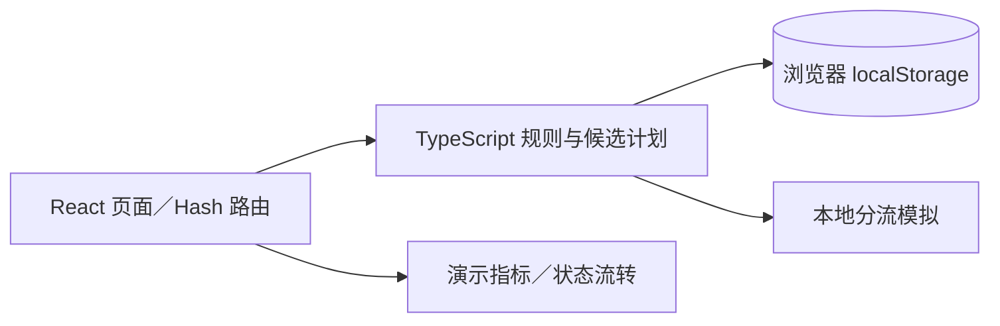
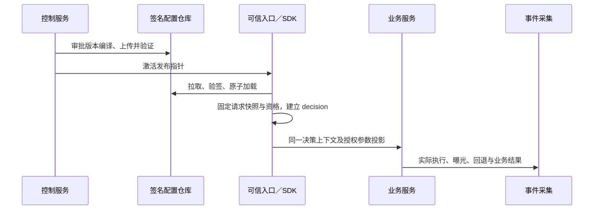

# EXP Lab 技术方案：原型与生产映射

设计 v1.2 · 2026-09-23｜实现基线：v23 前端原型

本文说明当前源码如何映射到生产系统，不重复 SQL 或运行协议。生产设计入口见[总体架构](../ARCHITECTURE-企业AB实验平台.md)与[服务端技术方案](../服务端技术方案/README.md)。

## 1. 当前实现



| 模块 | 主要源码 | 已实现范围 |
| --- | --- | --- |
| 页面与路由 | `App.tsx`、`*-routes.ts` | 中文页面、定位、筛选和返回上下文 |
| 应用参数 | `service-catalog.ts`、`parameter-registration.ts`、`parameter-assignment.ts` | 应用私有标签、注册、完整首次归层 |
| 层域 | `traffic.ts`、`child-domain-creation.ts`、`bucket-ranges.ts` | 递归范围、唯一分区、碎片桶、模拟 |
| 受众 | `profile-attributes.ts`、`audiences.ts`、`audience-preflight.ts` | 固定版本、AND／OR、有限互斥证明 |
| 草稿与分组 | `experiment-drafts.ts`、`experiment-variants.ts`、`experiment-draft-validation.ts` | 本地恢复、2–20 组、提交校验 |
| JSON | `JsonParameterWorkbench.tsx`、`json-parameter-analysis.ts` | CodeMirror 6、严格诊断、只读目录、结构差异 |
| 管理信息 | `resource-management.ts` | 负责人、长期／临时、日期提醒 |

技术栈为 React、TypeScript、Vite；校验先生成候选结果，再由页面保存。无真实后台、Namespace 管理、RBAC、生产 SDK 或统计引擎。

## 2. 本地数据与限制

| 存储键 | 范围 |
| --- | --- |
| `exp-lab-topology-v1` | 目录、层域、归层、受众、画像及管理信息 |
| `exp-lab-experiments-v3` | 正式实验与演示状态 |
| `exp-lab-experiment-draft-v1:<draftId>` | 原文、当前区／组、revision、提交标记 |
| `explab-simulation-profile-snapshots-v1` | 模拟 user_id 的首次固定画像 |

- 浏览器来源隔离：localhost 与 127.0.0.1 不共享数据；无跨设备同步和服务端备份。
- 草稿允许无效原文；冲突或写入失败保留当前输入，暂停自动保存。
- 原始快照比较和 revision 不能保证跨标签页事务；实验保存与草稿提交标记也非原子操作。
- 正式实验旧读取路径在坏数据时可能回退演示种子，生产必须改为明确错误和恢复流程。
- 模拟画像固定不等于生产身份认证或持久资格服务；演示统计不等于真实分析。

## 3. 原型到生产的映射

| 当前实现 | 生产设计，尚未实现 |
| --- | --- |
| 单份本地目录与拓扑 | Namespace 目录 + 各环境独立拓扑、预留和发布 |
| 演示团队、负责人字段 | 全局账号、多对多成员、角色绑定与后台鉴权 |
| 本地 plan／validate | 数据库事务、并发锁、版本检查、审计和 Outbox |
| 演示审核与状态按钮 | 不可变 revision/run、精确审批、发布协调与撤销栅栏 |
| 前端演示 hash | 独立生产协议与跨语言一致性向量；不热换原型算法 |
| 模拟首次画像 | 持久 `put-if-absent` 资格快照与固定 epoch |
| 每组完整 JSON | 编译后完整参数 bundle、定义版本、运行基线 |
| 服务接入意图 | ns/env/service/action 机器授权、握手与执行观测 |
| 本地 CSV／源码导出 | 受 `result.export` 等权限控制的审计导出 |
| 演示结果 | 持久事件、去重归因、成熟观察窗与版本化统计结果 |

原型的开发／测试／生产只用于应用接入配置，不表示三个环境已有独立实验树。

## 4. Namespace 与授权接入

```text
全局账号 → 验证 namespace_member 有效（仅准入）
→ 合并本人绑定与所属用户组绑定；组绑定不绕过个人成员资格
→ 按角色动作、资源范围、可选环境与到期限制判定
→ 服务端判定并过滤列表 → 执行操作 → 审计
```

Namespace 直接替代旧项目，不增加 project／space。生产统一使用 `namespace_id` 与 `/namespaces/` 路径；平台账号与业务 `user_id` 分离。目录属于 Namespace，运行资源属于环境；环境授权不隐含目录全局编辑权。

资源归属树可以继承权限：应用→参数、环境→域→层→实验。引用边不能继承：能用层不意味着能修改其参数。默认拒绝、allow 并集、无显式 deny；子级只读不能覆盖父级已授编辑。平台管理全局角色模板，Namespace 管理员仅可委派获准角色和范围。

多资源操作按阶段检查全部必要权利，未完成草稿不套用提交级检查。审批要求所需 read + approve，不要求 edit/use；发布重新验证生产授权和审批。接口查询、详情、导出和机器凭证均由后端控制，隐藏按钮不构成安全边界。具体动作和判定见[05 Namespace 与权限设计](../服务端技术方案/05-Namespace与权限设计.md)。

## 5. 保持不变的业务规则

| 范围 | 不变量 |
| --- | --- |
| 拓扑 | 每环境根域仅一路由层，只承载子域；域→层→实验／子域递归，无环、深度最多 16 |
| 参数 | 同域激活参数完整且唯一归层；实验不越层；子域等于父层完整参数范围 |
| 注册 | pending 参数在目标环境完成全部受影响分区后原子 active；原型为本地整体保存 |
| 子域 | 创建时只建一个完整初始层，后续合法拆分；空层不能开实验或子域 |
| 桶 | 每层 10,000 桶，可组合不连续段；不搬动已有桶，区间左闭右开 |
| 受众 | 不可变 AND／OR 版本、全部祖先条件交集；只有固定资格可证明互斥才复用桶 |
| 分组 | 2–20 组、唯一对照、稳定 ID、正整数分配权重；同一顶层 Key 集合 |
| 编辑 | 错误原文可保存，不能提交；任意参数组合约束下线，类型／范围／可执行性检查保留 |

跨 Namespace 不能直接引用参数或层；同一运行参数不得由多个 Namespace 竞争控制。不同 Namespace 的分桶隔离不提供用户互斥或业务效果独立性。

## 6. 生产请求与发布



- 决策不访问管理数据库；配置版本不进入分桶 hash。
- 下游复用 decision，不能只凭同 user_id 重新分组；共享缓存须区分影响结果的处理版本。
- assignment、处理前 qualification、execution、exposure 与 business 分开记录；读取参数不自动曝光。
- 暂停／结束不等于所有断网实例已停止；生产桶须经过 draining 和租约／上下文有效期检查才能回收。
- 改变参数值、组权重、资格或分析计划创建新 run；旧审批不覆盖新内容。

## 7. 详细设计与验证

| 事项 | 权威文档 |
| --- | --- |
| 总体职责与部署 | [服务端总览](../服务端技术方案/README.md) |
| 数据模型与事务 | [01 数据库设计](../服务端技术方案/01-数据库设计.md) |
| 管理与运行 API | [02 接口协议](../服务端技术方案/02-接口协议.md) |
| 身份、hash、资格、上下文 | [03 SDK 与分流协议](../服务端技术方案/03-SDK与分流协议.md) |
| 指标、归因与统计 | [04 指标生产与分析](../服务端技术方案/04-指标生产与分析.md) |
| Namespace 与权限 | [05 Namespace 与权限设计](../服务端技术方案/05-Namespace与权限设计.md) |

上线需验证越权、事务冲突、跨语言 hash、固定资格并发、配置过期、联合回退、事件质量及 A/A；不能以原型可点击代替。当前历史验收见 [VERIFICATION](../VERIFICATION.md)，旧规格见 [superpowers](../superpowers/specs/2026-09-06-ab-platform-design.md)。本次未修改运行代码或重跑产品验收。
