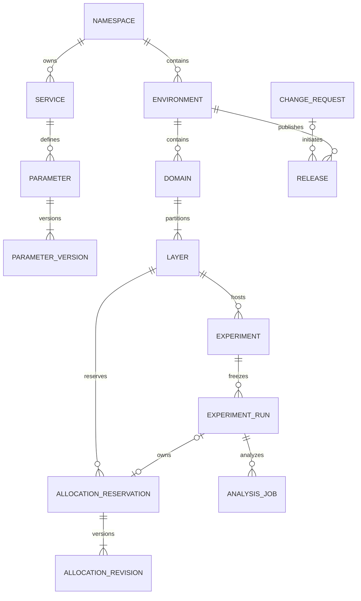

# 数据库设计：一期 30 表

版本：设计 v1.3 · 2026-09-23 · 原型基线 v23。**仅为设计，尚未建库、迁移或实现后端。** PostgreSQL 控制库固定为下列 30 张表；本文 SQL 是约束示例，不是完整迁移脚本。

关联：[总方案](./README.md)｜[接口](./02-接口协议.md)｜[SDK 与分流](./03-SDK与分流协议.md)｜[指标分析](./04-指标生产与分析.md)｜[Namespace 与权限](./05-Namespace与权限设计.md)。

## 1. 范围与总表清单

```text
单企业 / 单部署，无 tenant
└─ Namespace（承接原 project，保留原 ID）
   ├─ 应用 → 参数版本 / 私有标签
   ├─ 画像属性 / 受众版本 / 指标定义
   └─ environment
      ├─ 域 → 层 → 子域 / 实验
      ├─ 草稿 → run（冻结配置、分组、分析计划）
      ├─ 预留 → 分配版本
      └─ 变更审批 → 发布 → 分析任务与结果索引
```

| # | 表 | 一期职责 |
| --- | --- | --- |
| 1 | `principal` | 全局人类/机器身份 |
| 2 | `namespace` | 资源边界与授权版本 |
| 3 | `namespace_member` | 显式成员准入 |
| 4 | `environment` | 工作区、资格契约、活动发布指针 |
| 5 | `role` | 动作集合与委派限制 |
| 6 | `role_binding` | 直接主体的资源范围授权 |
| 7 | `service` | 应用目录 |
| 8 | `service_environment` | 应用环境接入与最近观测 |
| 9 | `machine_credential` | 受限运行凭证 |
| 10 | `parameter` | 参数身份、应用归属、标签 |
| 11 | `parameter_version` | 不可变参数定义版本 |
| 12 | `service_tag` | 应用私有标签 |
| 13 | `profile_attribute` | 当前画像语义定义 |
| 14 | `audience` | 受众身份 |
| 15 | `audience_version` | 不可变条件与画像定义快照 |
| 16 | `domain` | 当前域及固定资格契约 |
| 17 | `layer` | 当前层及分桶盐 |
| 18 | `layer_parameter` | 同域唯一的参数归层 |
| 19 | `experiment_draft` | 不完整表单及分组原文 |
| 20 | `experiment` | 固定归层的实验身份 |
| 21 | `experiment_run` | 冻结实验配置及运行状态 |
| 22 | `allocation_reservation` | run/子域的预留与回收证据 |
| 23 | `allocation_revision` | 不可变桶集合与证明 |
| 24 | `change_request` | 统一审批、拓扑/基线历史快照 |
| 25 | `release` | 发布状态、配置产物、租约水位 |
| 26 | `metric` | 当前指标定义 |
| 27 | `analysis_job` | 分析任务、冻结输入、结果索引 |
| 28 | `audit_event` | 各作用域统一审计 |
| 29 | `outbox_event` | 各作用域可靠副作用 |
| 30 | `idempotency_record` | 各作用域命令幂等 |



预留的 run/子域主体二选一；根域无父层预留。审批可以针对 run，也可以独立审批拓扑/基线；完整约束以下文为准。

控制库之外沿用三类存储，不把删去的关系表搬到新服务：

| 位置 | 数据 | 必须保留的边界 |
| --- | --- | --- |
| 持久资格 KV | 首次固定的业务用户画像/资格 | CAS / put-if-absent；键包含 Namespace、环境、epoch、unit、subject |
| 对象存储 | 不可变配置、独立应用投影/参数包、分析输入与结果文件 | 内容摘要、版本保留、下载授权；写库前确认对象可读 |
| 既有事件/遥测/分析链路 | 分配、曝光、业务事实、SDK ACK、接入观测 | 事件去重/归因按指标方案；遥测 ACK 不证明桶可回收 |

## 2. 公共约定与 JSON 边界

除 `?` 外均为 NOT NULL。下表列组是实际字段；各表使用时完整展开。

| 列组 | 字段 / 约束 |
| --- | --- |
| `N` | `namespace_id uuid`，FK → namespace |
| `E` | `N, environment_id uuid`，复合 FK → environment(N,environment_id) |
| `C` | `created_at timestamptz, created_by uuid`，操作者 FK → principal |
| `M` | `C, updated_at timestamptz, updated_by uuid, row_version bigint > 0`；更新者 FK；管理修改递增版本 |
| `A` | `archived_at timestamptz?, archived_by uuid?`；同时有值/为空，操作者 FK |
| `G` | `owner_id uuid, lifetime text, expected_end_date date?`；owner FK；long_term 无日期，temporary 必填 |

- UUID 由服务端生成；Namespace 更名沿用原 project UUID、盐和历史，不重新分桶。
- `PK(E,id)`、FK、UQ 中的 E 均展开为 namespace_id、environment_id。环境关系携带 E，目录关系携带 N；禁止跨 Namespace 引用。
- 时间使用 timestamptz；日期提醒使用 Namespace timezone。摘要为 32 字节 bytea；序列为正 bigint，明确声明初始 0 的 head/撤销序列除外。
- 外键默认 RESTRICT；引用端建完整 FK 前缀索引，已有 PK/UQ/查询索引覆盖则不重复。循环头指针可用延迟 FK 同事务创建。
- 目录及历史引用对象只归档，不硬删除。带 A 的列表索引为 `(scope,archived_at,created_at DESC,id)`；带 owner 的对象按需加 `(scope,owner_id,archived_at)`。

| 可合入 JSON / 数组 | 不能因此取消的检查 |
| --- | --- |
| role.actions、credential.allowed_actions | 代码动作目录版本、去重、scope 类型、委派上限；未知动作拒绝 |
| parameter.tag_ids | 小型 UUID 数组；同 N、同 service、存在、去重；标签不赋权、不参与分桶 |
| 草稿 variants、表单 | 结构大小/类型限制；raw_parameters 保留错误原文，不要求业务完整 |
| run 契约、审批目标、受众/指标定义快照 | 服务端从真实资源重读；完整同作用域依赖校验；版本/摘要冻结；客户端不能声明“已校验” |
| 审批 decisions | 锁行追加；身份存在、当前审批资格、去重、前缀不可改；同事务审计 |
| 对象索引/输入 manifest | 校验 schema、URI、摘要、签名及所属应用；不能凭 ID 下载越权文件 |

核心归属、绑定目标、run 来源、预留主体、发布指针与任务归属仍使用真实 FK。JSON 中的冻结引用由受控事务验证，不宣称数据库对 JSON 自动提供外键。普通业务账号不能绕过受控写入口。

## 3. 身份、Namespace、环境与授权（1–6）

| 表 | 核心字段 | 键、约束与索引 |
| --- | --- | --- |
| `principal` | `principal_id, identity_issuer, identity_subject, kind, display_name, status, created_at` | PK(id)；UQ(issuer,subject)；kind=human/machine，status=active/disabled |
| `namespace` | `namespace_id, namespace_key, name, timezone, policy_revision, M, A` | PK(id)；UQ(key)，归档不释放；policy_revision > 0，只增 |
| `namespace_member` | `N, principal_id, status, expires_at?, M` | PK(N,principal_id)；principal FK；active/disabled；成员不自动授予 read |
| `environment` | `N, environment_id, environment_key, name, status, topology_revision, workspace_topology_change_id, baseline_revision, workspace_baseline_change_id, eligibility_epoch_id, eligibility_contract jsonb, active_release_id?, head_version, revocation_revision, M, A` | PK(N,id)；UQ(N,key)；status=active/frozen；工作区指针 FK → 同 E 的 change_request，活动指针 FK → 同 E 的 release；版本与指针内容同事务一致；head/revocation 初始 0、只增 |
| `role` | `role_id, role_code, name, scope_class, actions text[], action_catalog_version, delegable, status, M` | PK(id)；UQ(code)；scope_class=deployment/namespace；仅平台管理员维护；动作按代码目录校验；active/disabled |
| `role_binding` | `binding_id, namespace_id?, principal_id, role_id, scope_kind, typed_targets, binding_scope_key, environment_filter_id?, status, expires_at?, M` | PK(id)；principal、role FK；Namespace 绑定 FK(N,principal_id) → member；各目标 FK 见下表；active/revoked；索引(principal_id,status)、(N,scope_kind,status) |

`typed_targets` 是下列真实 UUID 列的合称，不是 JSON：`target_namespace_id?、target_environment_id?、service_id?、parameter_id?、domain_id?、layer_id?、experiment_id?、draft_id?、audience_id?、attribute_id?、metric_id?`。

| scope_kind | 必须有值的目标/归属 | 必须为空 / 外键 |
| --- | --- | --- |
| deployment | 无业务目标 | N、全部目标、environment_filter_id 均空；部署单例由该固定类型表示 |
| namespace | N、target_namespace_id，二者相等 | 其余目标空；target_namespace_id FK namespace |
| environment | N、target_environment_id | 其余目标空；FK(N,target_environment_id) → environment |
| service / parameter / audience / profile_attribute / metric | N、对应唯一 ID | target_environment_id 及其他目标空；对应表的 N 复合 FK |
| domain / layer / experiment / experiment_draft | N、target_environment_id、对应唯一 ID | 其他目标空；对应表的 E 复合 FK，E 使用 target_environment_id |

`scope_kind` 使用封闭 CHECK，逐类检查以上形状；不能仅检查“有任意一个 ID”。`environment_filter_id` 另以(N,id) FK → environment；资源自带环境时只能等于该环境。环境限定不授予 Namespace 级目录编辑，详细动作见 [权限规范](./05-Namespace与权限设计.md)。

写入绑定时必须验证 role.scope_class：deployment 角色只绑定 deployment，namespace 角色只绑定 Namespace 内真实资源；不能靠范围缩小把部署动作委派出去。

绑定去重使用服务端/数据库按上述列规范生成的非空 `binding_scope_key`，不可由客户端提供；UQ(principal_id,role_id,binding_scope_key,environment_filter_id) NULLS NOT DISTINCT WHERE status='active'。键包含 N、scope_kind、真实目标 ID，不能跨 Namespace 碰撞。

一期不建授权资源镜像树、不实现组绑定、不实现权限缓存。继承沿 service→parameter、environment→domain→layer→experiment 等真实归属查找；草稿固定归 environment。每次管理授权读取当前角色动作和成员状态。

## 4. 应用与参数（7–12）

| 表 | 核心字段 | 键、约束与索引 |
| --- | --- | --- |
| `service` | `N, service_id, service_key, name, kind, owner_id, description, M, A` | PK(N,id)；UQ(N,key)；kind=frontend/backend/strategy/gateway；owner FK |
| `service_environment` | `E, service_id, access_mode, delegate_service_id?, expected_protocol, readiness_status, observed_at?, readiness_summary jsonb?, M` | PK(E,service_id)；service 按 N FK；delegate FK → 同 E 的 service_environment；直接模式无 delegate；委托不得指自己 |
| `machine_credential` | `E, credential_id, principal_id, service_id, public_key_id, secret_ref?, allowed_actions text[], action_catalog_version, expires_at?, revoked_at?, M` | PK(E,id)；UQ(public_key_id)；FK member(N,principal_id)、service_environment(E,service_id)；主体须 machine；动作仅受支持 runtime/event 动作，且与当前角色取交集 |
| `parameter` | `N, parameter_id, service_id, parameter_key, name, owner_id, current_version, tag_ids jsonb, M, A` | PK(N,id)；UQ(N,key)；service/owner FK；当前版本复合 FK → parameter_version；标签受控事务校验 |
| `parameter_version` | `N, parameter_id, parameter_version, parameter_version_id, value_type, default_value jsonb, safe_default_value jsonb?, schema_contract jsonb?, schema_version?, execution_contract jsonb, content_digest, C` | PK(N,parameter_id,parameter_version)；UQ(N,parameter_version_id)；parameter FK；只增不改；类型 string/number/boolean/object/array；schema 两字段同时有值/为空 |
| `service_tag` | `N, service_id, tag_id, name, normalized_name, color, M, A` | PK(N,service_id,tag_id)；UQ(N,service_id,normalized_name)；service FK；同名不同应用合法；归档不硬删 |

- 参数 Key 在 Namespace 内唯一；普通更新不改 service/Key。归档仍占 Key，防止旧配置认错身份。
- 默认值、可选安全值和执行契约均随版本冻结；已有 run/基线不追随 current_version。本地安全值由接入服务确认，目录更新不强改旧代码的应急值。
- 委托链在环境锁内验证无环、目标为可用网关。readiness 仅由验证观测更新；填配置不代表接入成功。原始 ACK/观测走遥测，当前表只留摘要。
- 凭证只存校验材料或 KMS 引用；secret 不进入审计、快照或普通页面。每次使用还要检查 Namespace 成员、应用/环境及动作。

## 5. 画像、受众与当前拓扑（13–18）

| 表 | 核心字段 | 键、约束与索引 |
| --- | --- | --- |
| `profile_attribute` | `N, attribute_id, attribute_key, name, attribute_version_id, semantic_revision, definition jsonb, content_digest, M, A` | PK(N,id)；UQ(N,key)；UQ(N,attribute_version_id)；定义含类型、枚举、语义和 missing_policy；更新生成新版本 ID/递增 revision |
| `audience` | `N, audience_id, name, owner_id, description, current_version?, M, A` | PK(N,id)；owner FK；当前版本 FK → audience_version；名字可重复 |
| `audience_version` | `N, audience_version_id, audience_id, version, rule_ast jsonb, attribute_snapshot jsonb, schema_version, condition_digest, C` | PK(N,id)；UQ(N,audience_id,version)；audience FK；只增不改；同属性在一版中不得混用语义版本 |
| `domain` | `E, domain_id, parent_layer_id?, kind, name, audience_version_id?, eligibility_epoch_id, eligibility_contract jsonb, G, M, A` | PK(E,id)；UQ(E,domain_id,parent_layer_id)；父层 FK 同 E；受众 FK 按 N；kind=root/overlap/non_overlap；仅 root 的父层为空 |
| `layer` | `E, layer_id, domain_id, role, name, allocation_epoch, hash_salt, hash_protocol, G, M, A` | PK(E,id)；UQ(E,domain_id,layer_id)；domain FK；role=routing/parameter；salt 为32位小写十六进制 |
| `layer_parameter` | `E, domain_id, parameter_id, layer_id` | PK(E,domain_id,parameter_id)，同域唯一；FK domain、parameter(N,id)、layer(E,domain_id,layer_id)；索引(E,layer_id,parameter_id) |

### 5.1 资格契约

`environment.eligibility_contract` 完整固定 epoch→随机化单元、身份契约、画像 schema、缺失策略、快照策略及 snapshot_namespace。存在相关 reserved/draining 预留时不得原地更换；旧 epoch ID 不重用不同语义。domain、run、reservation、change_request 和 release 均保存使用时的完整契约。

固定画像实体在持久 KV，以 `(E,epoch,unit,subject_ref)` 首次 CAS 固定；缺失字段也固定为缺失，不后补。画像属性不绑定来源应用。受众新版本冻结所用属性定义和版本；旧版本不读当前属性。首期新建受众版本使用当前受支持定义，过期输入拒绝而非静默升级。

AST 最多 3 层条件组、30 条规则。互斥证明超过 64 个展开组合返回 unknown；完整树仍可求值。普通受众重叠可登记，自相矛盾不能提交。

### 5.2 归层与拓扑不变量

```text
某环境参数 active ⇔ 它存在于根 routing 层的 layer_parameter
根域参数范围       = 根 routing 层的完整参数集合
子域参数范围       = 父层的完整参数集合
每域全部层的参数并集 = 该域范围；同域任一参数恰好归一层
```

1. 每环境一个有效根域；根域仅有一个 routing 层。其余域只有普通 parameter 层，routing 层不挂实验。
2. 全部有效节点从根可达、同 E、无环；根计第 1 级，域深度≤16。环境创建同事务写根域、routing 层及首个完整拓扑快照。
3. 非重叠域只有一个完整普通层，其后代也必须非重叠。重叠域可有空层，空层不承载实验/子域。
4. 注册参数仅新增目录，所有环境自然为 pending；新环境根映射为空。激活时沿完整拓扑原子补齐映射，不建额外状态行。
5. active 不得通过删根映射退回 pending。转移参数须同域、原非空层仍非空，且无未结束 run、子域继承或仍可能执行的 draining 引用。
6. 活跃域的父层、资格、有效受众和范围不得原地移动；运行中的实验不换层。合法离线迁移仍检查移动两端/后代授权与完整拓扑。
7. 子域继承父层全部参数，不能按当前操作者可见项裁剪；初始层复制一次 G，之后独立维护。日期仅提醒，不触发停止/回收。

拓扑检查在一个受控环境写事务集中执行；不为每个业务表再维护一棵带双向触发器的授权树。每次合法拓扑修改，包括无需上线的治理修改，都写完整不可变 change_request 快照并递增 topology_revision。名称/owner 修改不重建分桶盐。

## 6. 草稿、实验与 run（19–21）

| 表 | 核心字段 | 键、约束与索引 |
| --- | --- | --- |
| `experiment_draft` | `E, draft_id, experiment_id?, source_run_id?, supersedes_draft_id?, target_layer_id?, owner_id, form jsonb, editor_state jsonb, variants jsonb, submitted_run_id?, M, A` | PK(E,id)；实验/run/旧稿/目标层均同 E FK；owner FK；submitted_run FK；索引(E,owner_id,updated_at DESC) WHERE submitted_run_id IS NULL AND archived_at IS NULL |
| `experiment` | `E, experiment_id, layer_id, name, description, owner_id, latest_run_id?, next_revision, M, A` | PK(E,id)；UQ(E,experiment_id,layer_id)；layer/owner FK；latest_run FK 含同 experiment；next_revision 在锁内递增 |
| `experiment_run` | `E, run_id, experiment_id, experiment_revision, source_draft_id, layer_id, analysis_plan_version_id, variant_epoch, variant_salt, contract_snapshot jsonb, contract_digest, validator_version, state, state_version, desired_state?, started_at?, completed_at?, completion_reason?, C` | PK(E,id)；UQ(E,source_draft_id)、UQ(E,experiment_id,experiment_revision)、UQ(E,analysis_plan_version_id)；UQ(E,run_id,experiment_id)、UQ(E,run_id,layer_id)；FK experiment 含 layer、source_draft；部分 UQ(E,experiment_id) WHERE state IN(review,running,paused) |

`experiment_revision`、`analysis_plan_version_id`、`variant_id` 是协议逻辑标识，不表示另有物理表。run 固定字段一经提交不能修改；状态、待发布意图和实际开始/结束时间可按状态机更新。冻结保护只需覆盖这类明确不可变字段，不扩成通用资源框架。

| run.contract_snapshot 冻结内容 | 关键校验 |
| --- | --- |
| 参数身份/定义版本、执行契约、完整分组值 | 服务端解析真实 parameter_version；所有组 Key 集合相等；对象/数组为原子值，禁止运行时补当前默认值 |
| 分组 ID、role、weight、固定区间 | 2–20 组、恰一 control；每组 weight>0，总和10000；区间完整无重叠覆盖[0,10000)，长度等于权重 |
| 目标层/祖先路径/有效受众/资格契约/拓扑与基线快照引用 | 同 N/E、参数 active、层包含全部参数；祖先受众按 AND 冻结 |
| 分析计划与完整指标定义 | 身份/unit/纳入与结局窗/迟到与更正策略/对比家族/alpha/power/MDE/样本计划/停止与护栏/扩量约定/受支持方法与实现版本均冻结 |
| 版本与摘要 | 包含参数、受众、画像、基线、拓扑、指标、策略实现、validator 版本与 digest；未知或跨 scope 引用拒绝 |

- 草稿允许无名称/目标层、权重未完成、坏 JSON。variants 数组保存每组稳定 ID 和 raw_parameters 字符串，不能先转 jsonb 丢失重复 Key/格式。
- 正式解析须在转 jsonb 前验证顶层对象、转义后重复 Key、有限且跨语言可表示数字、≤32 层及体积限制；未知 Key 和缺值均拒绝。
- 保存草稿只验结构/作用域；提交另开事务，检查锁后的目标层、草稿版本和全部依赖。新实验重验目标层 create+submit，已有实验检查自身 submit；均需草稿 read。
- 实验固定归层；换层新建实验。复制/新 run 生成新的分组身份；展示排序和名称变化不得重排已冻结区间。
- 层 salt 与 run.variant_salt 各为128位随机值，以32位小写十六进制固定。发布/重启/扩量不重建；Hash v2、9字段及全部测试向量不变。
- 参数值/集合、分组/权重、受众、epoch/unit、分析计划变化须新 run。同 run 仅允许外层桶集合超集扩量，variant_epoch/salt/映射不变。
- state=review/running/paused/completed；desired_state 是待发布意图。退回旧 run 为 completed/review_rejected，再建关联草稿；不把旧正式配置改回草稿。

## 7. 预留账本与回收（22–23）

| 表 | 核心字段 | 键、约束与索引 |
| --- | --- | --- |
| `allocation_reservation` | `E, reservation_id, layer_id, run_id?, child_domain_id?, status, current_allocation_revision, eligibility_epoch_id, eligibility_contract jsonb, effective_condition jsonb, condition_digest, dependency_digest, retirement jsonb?, retire_release_id?, reclaim_after?, released_at?, M` | PK(E,id)；run/child 恰一非空；FK layer、run(E,run_id,layer_id)、domain(E,child_domain_id,parent_layer_id=layer_id)、release；当前版本 FK；UQ(E,run_id)、UQ(E,child_domain_id)、UQ(E,reservation_id,run_id)；reserved/draining/released；索引(E,layer_id,status)、(status,reclaim_after) WHERE draining |
| `allocation_revision` | `E, reservation_id, allocation_revision, parent_revision?, bucket_ranges int4multirange, bucket_count, allocation_digest, topology_change_id, proofs jsonb, reason, C` | PK(E,reservation_id,allocation_revision)；FK reservation、同 reservation 父版本、同 E 的 change_request；不可变；0<bucket_count≤10000，区间非空且包含于[0,10000) |

- 直接实验与子域使用同一层账本。相交预筛后，固定 unit/epoch/有效祖先条件相容且证明 disjoint 才可复用；unknown 按冲突。
- proofs 冻结双方 reservation/revision、输入摘要、算法版本、结论及证据；提交时仍重读当前依赖。没有独立证明表，也不把缓存当权威。
- 不建全层桶唯一或全层 range 排斥约束：它会错误拒绝合法互斥受众复用。bucket_count 等于各规范区间长度之和，在写事务校验。
- review/running/paused 预留均为 reserved；已可能激活的停止进入 draining。只有能证明从未发布/签发上下文的审核拒绝可直接 released。

回收证据并入 reservation.retirement，冻结停止 release、撤销序列、全部相关旧 release 的水位、TTL/在途/skew 上界和验证时间：

```text
先停止所有相关旧 release 的 authority 租约续发
reclaim_after >= max(这些 release 已持久化的 max_lease_expires_at)
               + max_context_ttl + max_inflight_duration + clock_skew_allowance
```

业务请求不逐次写 SQL。SDK 只能在有效 authority 租约内签发 context；TTL 有冻结上限、透传不续期、过期拒绝。上界未知则保持 draining 并告警；多数 ACK 不足以释放。回收持环境锁重验；旧配置回滚不得复活已回收/被新 run 使用的桶。

## 8. 统一审批与发布（24–25）

| 表 | 核心字段 | 键、约束与索引 |
| --- | --- | --- |
| `change_request` | `E, change_id, kind, run_id?, reservation_id?, allocation_revision?, topology_revision?, baseline_revision?, baseline_version_id?, target_snapshot jsonb, target_digest, dependency_digest, policy_version, metadata_only, decisions jsonb, status, expires_at?, activated_release_id?, M` | PK(E,id)；kind=experiment/expansion/topology/baseline；run、release 同 E FK；复合FK(E,reservation_id,run_id) → allocation_reservation；FK(E,reservation_id,allocation_revision) → allocation_revision；UQ(E,topology_revision)、UQ(E,baseline_revision)、UQ(E,baseline_version_id)；snapshot/摘要/类型目标只增不改；索引(E,status,created_at) |
| `release` | `E, release_id, release_sequence, previous_release_id?, change_request_id?, config_revision?, expected_head_version, state, trigger_kind, input_manifest jsonb?, input_digest?, object_uri?, content_digest?, signature?, signing_key_id?, compiler_version?, schema_version?, hash_protocol?, lease_contract jsonb, lease_issuance_enabled, max_lease_expires_at?, activated_at?, failure jsonb?, reason, C` | PK(E,id)；UQ(E,release_sequence)、UQ(E,config_revision)；前 release/触发 change 同 E FK；state=building/distributing/active/failed；distributing/active 必须具备完整产物字段；索引(E,state,created_at) |

### 8.1 变更目标与决定

| kind | 冻结目标 | 空值/状态规则 |
| --- | --- | --- |
| experiment / expansion | run、reservation、allocation_revision 及完整配置/依赖/计划摘要 | 三个实体引用必填，必须属于同 run；拓扑/基线版本列空 |
| topology | 完整节点/父关系/参数分区/受众/epoch/G 快照，topology_revision | run/reservation/allocation 与基线列空；治理修改可 metadata_only=true |
| baseline | baseline_revision、baseline_version_id、完整参数定义版本及值 | run/reservation/allocation 与拓扑列空；API 版本 ID 指向此快照 |

各类以 CHECK 校验字段形状，以受控事务校验 JSON schema 和引用。environment 的 topology/baseline 工作区指针必须分别指向匹配 kind 且序号一致的快照；allocation_revision.topology_change_id 必须指向该次校验使用的 topology 快照及序号，不能引用其他 kind 的 change。status=pending/approved/rejected/invalidated/publishing/published/failed/recorded；recorded 只用于无需上线的 metadata_only 拓扑记录。初始空基线、根拓扑也写快照，环境指针延迟 FK 在同事务闭合。

decisions 只按 `(reviewer_id,decision,comment,decided_at,signed_digest)` 追加；同 reviewer 不重复，旧决定不可改。锁 change 行后检查 principal、当前审批范围、职责分离、精确摘要及有效期，审计同事务。编辑目标必须新建 change，不能在获批对象上覆盖 JSON。审批不等于发布者当前有权限。

### 8.2 配置文件、发布与租约

```text
读取已冻结目标与当前依赖 → 事务外编译/上传/验签/确认可读
→ 产物字段一次写入 release 并冻结
→ 激活事务重检权限/审批/依赖/回收安全
→ environment.head_version CAS + active_release_id + 状态/审计/outbox
```

- input_manifest 冻结完整拓扑、基线、run 契约、精确 allocation、当前运行控制及资格契约；依赖来自服务端一致读取，不信任客户端清单。
- config_revision 仍为稳定协议 ID；projection_id、parameter_bundle_id 是对象索引内的逻辑 ID。投影/参数包必须有独立的 service+capability URI、摘要和授权，不能把全环境大包直接交给任一应用。
- 大型完整产物保存在受保护对象存储；release 只存索引/摘要/签名/编译信息。签名私钥在 KMS，不入库。HTTP 304 不续租。
- 发布状态和租约水位可变，已生成产物字段不可覆盖；重编译产生新 release/config_revision。失败孤立对象可清理，活动指针不指向未可读对象。
- 回滚创建新 release 和新 config_revision，复制历史冻结输入后重新编译/包装，重验当下权限、桶账本和撤销序列；仅 scope/capability/digest 一致的投影或 bundle 内容文件可复用，不复用旧 config_revision。
- 接受停止先写 desired_state 和 outbox；停止 release 激活后才更新 run.state、记录状态审计，并把预留置 draining。未激活失败保持原实际状态。
- 撤销序列在 environment 单调递增；明细写审计，当前控制冻结到新 release。恢复/回滚不能降低序列，不能以 ACK 代替租约证据。

每次 authority 租约签发须先短事务取得 IAM/环境/目标 release 栅栏，检查当前权限、应用、capability、活动/许可状态和撤销序列，再单调更新 `release.max_lease_expires_at`；提交成功后才签名返回。到期值在事务中固定，失败重试不能延长未记录的有效期。停止续发与签发用同一栅栏，旧 release 一并处理；不能只看当前 head 的水位。

`lease_contract` 冻结 max_context_ttl、max_inflight、skew 及签发规则。manifest 是短期签名协议，不另建表；local SDK 仍可本地分流，不要求每次 decision/token 写控制库。

## 9. 指标与分析（26–27）

| 表 | 核心字段 | 键、约束与索引 |
| --- | --- | --- |
| `metric` | `N, metric_id, metric_key, name, owner_id, description, metric_version_id, semantic_revision, definition jsonb, content_digest, M, A` | PK(N,id)；UQ(N,key)、UQ(N,metric_version_id)；owner FK；更新生成新版本 ID/递增 revision；query 为受控 DSL/模板，不执行任意用户 SQL |
| `analysis_job` | `E, analysis_job_id, run_id, analysis_plan_version_id, request_digest, reason, status, attempt_count, analysis_run_id, data_snapshot_id?, input_snapshot jsonb?, input_digest?, code_version?, random_seed?, result_metadata jsonb?, result_uri?, result_digest?, supersedes_analysis_run_id?, failure jsonb?, started_at?, finished_at?, C` | PK(E,id)；FK run 含 analysis_plan_version_id；UQ(E,analysis_run_id)、UQ(E,run_id,analysis_run_id)；supersedes FK 同 run；queued/running/succeeded/failed；索引(status,created_at)、(E,run_id,created_at DESC) |

为 run 建立 UQ(E,run_id,analysis_plan_version_id)，保证任务只能用该 run 的固定计划。创建请求用 idempotency_record 去重，request_digest 只作追溯，不单独唯一；相同查询在迟到回填后可显式创建新任务。supersedes 仅可引用同 run 已有成功结果，禁止自指，并在新任务创建事务检查。分析执行使用 run 中冻结的完整 metric 定义及策略/方法实现版本，不读取 metric 当前定义；旧稿引用过期当前版本时要求重验，不静默替换。

| 时点 | 必须冻结 / 行为 |
| --- | --- |
| 提交 run | 首期 fixed_horizon；恰一主指标；完整护栏/校正家族；0<alpha,power<1，MDE>0；估计器、身份、触发/排除、质量、止损与扩量规则、实际受支持实现版本及摘要 |
| 首次执行前 | data_snapshot_id、全部来源 manifest/offset、水位、received_at cutoff、归因 cutoff、更正窗口、dataset_version、code_version、random_seed；对象与摘要先确认可读 |
| 重试 | 沿用冻结输入/代码/种子；不能重抓“最新数据”冒充同一任务 |
| 成功 | 冻结 result_metadata、result_uri/digest；包含 result_status、decision、质量摘要、分析时间；不得覆盖 |
| 更正或换输入/代码 | 新 job/analysis_run_id，引用同 run 旧结果的 supersedes；失败重试不改原冻结契约 |

analysis_run_id/data_snapshot_id 为协议逻辑标识，无独立结果/输入关系表。result_status=insufficient/invalid/provisional/final；final 表示数据成熟且过质量门禁，不等于获胜；decision 独立。数据事实模型仍见指标方案。

一期不建通用策略产物注册框架；受支持策略随服务代码/发布配置提供，提交时冻结实际契约和实现版本。未知算法、任意模型字符串或缺少部署证据的版本不能被选用。

## 10. 审计、可靠副作用与幂等（28–30）

三表共用作用域列 S：`scope_kind, namespace_id?, environment_id?`。CHECK 限定 deployment 两 ID 空；namespace 仅 N 有值；environment 两者都有值。N FK namespace，E 复合 FK environment；不填虚构 Namespace。

| 表 | 核心字段 | 键、约束与索引 |
| --- | --- | --- |
| `audit_event` | `audit_id, S, actor_id, action, event_kind, run_id?, release_id?, run_state_sequence?, from_state?, to_state?, object_reference jsonb, request_id, before_digest?, after_digest?, reason, occurred_at, metadata jsonb` | PK(id)；actor、同 E 的 run/release FK；event_kind=management/run_state；状态事件部分UQ(E,run_id,run_state_sequence)；只追加；索引(N,environment_id,occurred_at DESC)、(actor_id,occurred_at DESC)；不含 secret/原始画像 |
| `outbox_event` | `event_id, S, event_type, aggregate_key, aggregate_version, payload jsonb, created_at, available_at, attempt_count, delivered_at?, last_error?` | PK(id)；UQ(scope_key,event_type,aggregate_key,aggregate_version)；索引(available_at,created_at) WHERE delivered_at IS NULL |
| `idempotency_record` | `S, scope_key, principal_id, operation, idempotency_key, request_digest, status, response_status?, response_body jsonb?, expires_at, C` | PK(scope_key,principal_id,operation,idempotency_key)；principal FK；status=in_progress/succeeded；同键异摘要409；索引(expires_at) |

任意审计行只要 run_id/release_id 非空，就必须为 environment 作用域以完整 E 执行 FK。run_state 事件还必须含 run、单调序号、from/to 和 occurred_at；由发布激活引起时还必须含 release，事件与 run.state_version/状态及 release 激活同事务写入。审核拒绝等未发布状态也记结构化事件，不伪造 release。指标观察窗据此回溯，不能依赖自然语言审计备注。

scope_key 是按 S 规范生成且 NOT NULL 的列：固定 `deployment`，或 `namespace:<UUID>`、`environment:<namespace UUID>:<environment UUID>`。outbox 同样有该生成列；形状 CHECK 和真实 FK 必须先成立，不接收客户端 scope_key，也不让 NULL 参与唯一性绕过。

- operation=`HTTP method + canonical_path`；请求摘要含规范化 body 和所有语义条件头。部署创建、Namespace 目录命令、环境命令用同一机制，作用域键不同。
- 幂等记录与业务写入同事务；失败整体回滚，成功重放先重新鉴权。source_draft 永久唯一关系不依赖短期幂等记录存活。
- 审计、状态变更、outbox 原子提交。消费小批量领取可用 `FOR UPDATE SKIP LOCKED`；外部调用不在业务行锁内等待。
- 一期无消费 inbox 表。消费者用 event_id、目标业务唯一 ID 和状态 CAS 实现幂等；delivered 标记不代替副作用幂等，不承诺端到端 exactly-once。

## 11. 必要事务与数据库约束

### 11.1 一期锁模型

```text
IAM 栅栏：普通授权相关写取共享锁，任何成员/角色/绑定/凭证撤回取排他锁
→ Namespace（普通环境写 FOR SHARE；目录/授权变更 FOR UPDATE；多空间按 ID 排序）
→ environment FOR UPDATE（同环境管理写串行；多环境按 ID 排序）
→ 草稿 / 实验 / run / 变更 / 发布等目标行（固定顺序）
→ 幂等记录
```

IAM 栅栏可使用部署固定键的事务 advisory lock，不增加表。管理授权以及控制面凭证签发/续租直查当前身份、成员、role.actions 和绑定；撤权与业务提交不能交错穿透。运行时 evaluate/context 使用可信服务凭据和受控运行授权/撤销状态，不把每次业务请求变成控制库 SQL；离线失效边界由租约、TTL 与栅栏保障。IAM 变化、policy_revision、审计同事务；全局角色/身份变更可保守更新全部相关 Namespace 版本，首期不做影响集合缓存优化。

READ COMMITTED + 显式锁 + 锁后重读即可。一期不为不同层并发建立额外锁优化；所有占桶、激活、停止、回收、租约续发入口遵守同一环境栅栏。编译、网络、SDK ACK 均在事务外。死锁/序列化失败只允许有限次整笔重试并沿用幂等键。

### 11.2 关键写入

| 事务 | 短步骤 |
| --- | --- |
| 创建 Namespace/环境 | 检查部署/Namespace 动作 → 写身份/显式成员 → 初始化环境根域/routing/空基线与拓扑 change 快照 → 闭合延迟 FK → 审计；初始管理员绑定只能由固定创建流程建立 |
| 保存草稿 | 当前 read/edit 鉴权 → If-Match → 一次更新 form/variants/editor_state → 审计；不要求坏 JSON 或缺项已修好 |
| 提交草稿 | IAM+N+E 栅栏 → 锁稿，读取真实目标 → create/submit/draft read 与完整依赖 AND 检查 → 幂等/已提交映射 → 严格解析 → 冻结 run → 读层全部 reserved/draining → 证明/分配 → 写 reservation/revision/change → 标稿提交 → 审计/outbox；任一步失败全回滚 |
| 激活参数 | E 排他 → 参数 pending 与 assign/use 检查 → 服务端重算从根到所有子域的完整映射 → 比较提交映射，无缺漏 → 写 layer_parameter → 完整分区验证 → topology change 快照/环境指针/审计 |
| 创建子域 | E 排他 → 父层非空、深度/模式、完整继承/受众/容量与授权 → 写域/初始层/完整映射/父层预留 → 完整拓扑快照 → 审计 |
| 扩量 | E 排他 → 冻结契约未变 → new_ranges 包含 old_ranges → 新段完整冲突校验 → 新 allocation_revision 与精确审批；不先回收重排旧桶 |
| 审核 | IAM+E+change 锁 → 重验当前 reviewer 与全依赖 read、职责分离/摘要/状态 → 追加决定 → 状态及审计 |
| 激活发布 | IAM+E+release 锁 → 重验发布者/全部依赖/精确审批/回收安全 → CAS head → release/run/预留状态与审计/outbox；不等 ACK |
| 回收 | E 排他 → 确认旧租约续发已封闭、所有相关水位与运行窗口完整 → 当前时间达到上界 → released+审计；未知则保留 draining |
| 分析 | 首次执行前冻结输入 → 异步计算 → 结果文件校验 → 一次写成功终态；重试沿用输入、更正新建 job |

### 11.3 约束示例

```sql
-- 真实 N/E 关系与唯一归层不能因合并表而取消。
ALTER TABLE layer_parameter ADD CONSTRAINT layer_parameter_pk
  PRIMARY KEY (namespace_id, environment_id, domain_id, parameter_id);
ALTER TABLE layer_parameter ADD CONSTRAINT layer_same_domain_fk
  FOREIGN KEY (namespace_id, environment_id, domain_id, layer_id)
  REFERENCES layer (namespace_id, environment_id, domain_id, layer_id);

CREATE UNIQUE INDEX one_root_per_environment ON domain
  (namespace_id, environment_id)
  WHERE kind = 'root' AND archived_at IS NULL;
CREATE UNIQUE INDEX one_open_run_per_experiment ON experiment_run
  (namespace_id, environment_id, experiment_id)
  WHERE state IN ('review', 'running', 'paused');

ALTER TABLE allocation_reservation ADD CONSTRAINT reservation_target_xor
  CHECK (num_nonnulls(run_id, child_domain_id) = 1);
ALTER TABLE allocation_revision ADD CONSTRAINT valid_bucket_extent
  CHECK (NOT isempty(bucket_ranges)
    AND bucket_ranges <@ int4multirange(int4range(0, 10000, '[)'))
    AND bucket_count BETWEEN 1 AND 10000);
-- 区间长度和、完整分组覆盖、拓扑无环/完整分区在受控事务校验。

UPDATE environment
   SET active_release_id = :release_id,
       head_version = head_version + 1,
       updated_at = now()
 WHERE namespace_id = :namespace AND environment_id = :environment
   AND head_version = :expected;
-- affected_rows = 1 才可提交；否则整笔激活回滚。
```

数据库角色分离迁移账号与业务账号；业务账号不能直接绕过冻结保护/授权写入口。RLS 是后续纵深防御，不是一期前提；统一鉴权入口、强 N/E FK、所有查询显式 scope 过滤及隔离验收首期必须具备。

## 12. 77→30 的明确去向

本节左列仅为 v1.2 旧逻辑表名，**不属于一期新建表**。保留/改名 29 张，42 张合并、推导或转为既有文件/遥测，6 张延期或取消；再新增统一 change_request，合计 77→30。

| 旧逻辑表 | v1.3 去向 |
| --- | --- |
| principal、namespace、namespace_member、environment、role、role_binding、service、service_environment、machine_credential、parameter、parameter_version、service_tag、profile_attribute、audience、audience_version、domain、layer、layer_parameter、experiment_draft、experiment、experiment_run、allocation_reservation、allocation_revision、release、analysis_job、audit_event、outbox_event、idempotency_record | 保留身份；按本文调整字段，共28张 |
| metric_definition | 改名 metric；当前定义含版本标识 |
| permission、role_permission | role.actions + 代码维护动作目录 |
| machine_credential_action | machine_credential.allowed_actions |
| user_group、group_member | 组能力延期，首期拒绝 group 主体 |
| auth_resource | 取消；typed role_binding FK + 真实业务归属继承 |
| parameter_tag | parameter.tag_ids；低风险目录关联受控校验 |
| parameter_environment_state、domain_parameter | 根/父层映射推导状态与范围 |
| profile_attribute_version、audience_attribute_ref | audience_version.attribute_snapshot 冻结所用完整定义 |
| eligibility_epoch | environment 当前契约 + domain/run/reservation/审批/发布历史快照 |
| topology_revision、baseline_revision、baseline_item | change_request 不可变完整快照 + environment 工作区指针；发布对象包含执行时快照 |
| draft_variant | draft.variants，保留 raw_parameters |
| experiment_revision、experiment_parameter、experiment_variant、variant_parameter_value | experiment_run.contract_snapshot；原 revision 与 run 为一对一 |
| run_state_event | audit_event 状态变更历史；run 留当前状态 |
| allocation_overlap_proof | allocation_revision.proofs |
| reservation_retirement | allocation_reservation.retirement 与回收列 |
| approval_request、approval_decision、configuration_change_request、configuration_change_decision | 统一 change_request，目标与决定分区冻结 |
| config_snapshot | release 产物字段 + 不可变对象文件 |
| snapshot_projection、parameter_bundle | 对象索引/独立受限文件；逻辑 ID 保留，无关系表 |
| release_manifest | 短期签名协议 + release 持久最大租约到期水位 |
| revocation_event、environment_release_head | environment 单调撤销/head + audit 历史 + release 当前控制快照 |
| release_ack | 遥测原始观测，service_environment 最近摘要 |
| metric_version、analysis_plan_version、analysis_plan_metric | metric 当前版本 + run 中完整冻结计划/指标定义 |
| policy_artifact_version、analysis_plan_policy_ref | 通用注册框架延期；首期按受支持代码/配置版本固定 |
| analysis_input_snapshot、result_analysis_run | analysis_job 冻结输入和不可变成功结果索引 |
| consumer_inbox | 取消；消费者使用业务唯一键/CAS 幂等 |
| namespace_audit_event、deployment_audit_event | audit_event 统一 S |
| namespace_outbox_event、deployment_outbox_event | outbox_event 统一 S |
| namespace_idempotency_record、deployment_idempotency_record | idempotency_record 统一非空 scope_key |

原型导入仍走“原文+摘要→隔离校验→差异报告→解决未知归属→相同身份回放→切换”；不自动上线演示实验/收益。旧 project_id/key 保留值更名；旧组合约束只作为历史原文，不恢复执行。

## 13. 验收与恢复边界

| 分组 | 一期必验 |
| --- | --- |
| IAM | 成员不等于 read；跨 N/E FK拒绝；typed scope 假形状拒绝；默认拒绝/allow并集；父授权不能子只读撤回；直接机器范围；撤权与提交并发；group明确unsupported |
| 草稿/配置 | 缺层/名称/坏JSON可保存；绕过validate直接submit仍重验create；source_draft只提交一次；原文保真；分组2–20/唯一control/全Key/覆盖；冻结契约不可改 |
| 拓扑/账本 | 激活/子域初始化原子回滚；完整继承；active不能删根映射退pending；环/16级/非重叠；并发抢桶；disjoint合法复用、unknown拒绝；扩量不换组 |
| 审批/发布 | 决定追加/不重复/不自改；依赖变化审批失效；旧head CAS失败；对象不可读不激活；按service+capability隔离下载 |
| 租约/回收 | 签发水位先提交；停止续发无穿透；全部相关旧release参与上界；不依赖ACK；draining未到界不能复用；离线旧token过期；回滚不得复用已回收桶 |
| 分析/副作用 | 首跑前固定输入/代码/seed；重试不变输入；更正新任务；三层scope幂等不串；同键异摘要拒绝；重复投递不重复业务副作用 |

配置库与对象做备份/恢复演练；恢复后先冻结发布，校验文件摘要/签名、活动 head、授权/撤销序列和租约/桶水位，序列与安全上界不得回退。不能只恢复数据库就自动重新上线旧实验。

本轮只完成设计取舍与文档一致性检查，未执行真实数据库、SDK、统计链路或恢复验收。
