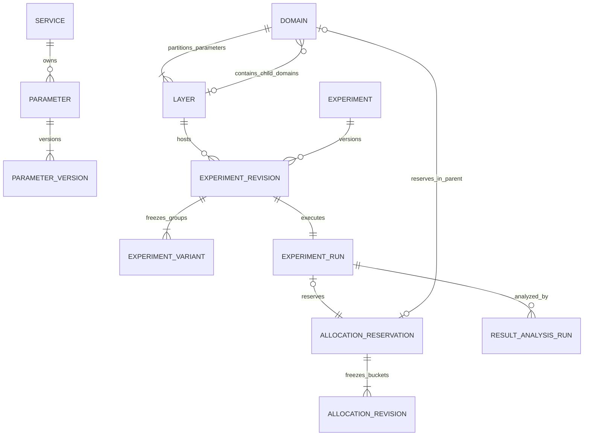

# 数据库设计

版本：设计 v1.2 · 2026-09-23 · 原型基线 v23。本文是 PostgreSQL 16+ 的逻辑模型和事务设计，**尚未建库、执行迁移或实现后端**。SQL 仅说明核心约束，不能作为全量迁移执行。

本方案面向单企业、单部署，不设租户；同一部署保留多个 Namespace、环境和应用及其权限边界，不设置租户表、租户字段或默认租户占位。

关联：[总方案](./README.md)｜[接口协议](./02-接口协议.md)｜[SDK 与分流](./03-SDK与分流协议.md)｜[指标生产与分析](./04-指标生产与分析.md)｜[Namespace 与权限规范](./05-Namespace与权限设计.md)。本库承担配置、审批、发布和分析元数据；高频分配、曝光、业务事件及聚合事实进入数据链路。



图中 reservation 的 run／子域归属二选一；根域无父层预留。完整 scope、跨行约束及草稿存储规则以下表为准。

```text
部署 → Namespace → environment → 拓扑 / 实验 / run / 发布 / 结果
                └→ service → parameter / 私有标签
                └→ 画像属性 / 受众 / 指标定义
```

Namespace 承接旧 project，不再叠加项目或空间对象。迁移保留原 ID；改名或改术语不重建盐、不重新分桶。跨 Namespace 引用一律拒绝。

## 1. 建模约定

### 1.1 作用域、类型与公共字段

下面各表字段表使用公共列组减少重复；列组是实际字段，不是省略实现要求。除 `?` 标记外均为 `NOT NULL`。

| 记号 | 展开的字段／约束 |
| --- | --- |
| `N` | `namespace_id uuid`；FK → `namespace(namespace_id)` |
| `E` | `namespace_id uuid, environment_id uuid`；复合 FK → `environment(N,environment_id)` |
| `C` | `created_at timestamptz, created_by uuid`；操作者 FK → `principal(principal_id)` |
| `M` | `C, updated_at timestamptz, updated_by uuid, row_version bigint CHECK > 0`；每次管理修改递增，`updated_by` 同样 FK |
| `A` | `archived_at timestamptz?, archived_by uuid?`；两列同时为空或非空，操作者 FK |
| `G` | `owner_id uuid, lifetime text CHECK IN ('long_term','temporary'), expected_end_date date?`；owner FK → `principal(principal_id)`；长期日期为空、临时日期必填 |

| 数据 | 约束 |
| --- | --- |
| ID / 归属 | 服务端生成 UUID，外部不得指定归属 |
| 版本 / 序列 | 正 bigint |
| 摘要 | bytea，octet_length = 32 |
| 权重 / 桶坐标 | 整数 |
| 时间 / 提醒 | timestamptz；日期提醒按 Namespace timezone |
| jsonb | 通过明确版本的结构校验器；限条件 AST、配置解析结果、不可变编译清单，不代替主外键 |

表中 `PK(E,id)` 表示实际复合主键含 `namespace_id、environment_id、id` 三列；索引、唯一约束和 FK 同理。即使 UUID 全局唯一，业务资源引用也不只依赖单列 ID：环境内 FK 必须携带 E，Namespace目录引用携带 N；账号、操作者及负责人引用统一 FK → `principal(principal_id)`。禁止用无约束的 `resource_type + resource_id` 保存核心业务关系。除专门说明，外键使用 `ON DELETE RESTRICT`，不级联删除历史。

所有 FK 的引用端建立以完整 FK 字段为前缀的 B-tree 索引；若已有 PK／UQ／查询索引覆盖前缀则不重复建。PostgreSQL 不自动为引用端创建索引；复合 FK 用来防止跨Namespace、跨环境错误引用。[PostgreSQL：约束与外键](https://www.postgresql.org/docs/16/ddl-constraints.html)

公共索引约定：Namespace内／环境内带 `A` 的目录对象建立 `(scope, archived_at, created_at DESC, id)` 列表索引，scope 分别展开为 N／E；带 `owner_id` 的对象另建 `(scope, owner_id, archived_at)`。部署级Namespace目录 `namespace` 的列表索引为 `(archived_at, created_at DESC, namespace_id)`。JSON 不默认全表 GIN，只有实际检索需求和执行计划证明必要时才增加。

公共列组 R 在 §2.3 展开，仅加到标注 R 的资源身份表；版本、账本、关联表不重复登记授权资源。

### 1.2 当前状态与历史分开

- **目录身份**保留名称、负责人及当前版本指针；定义、受众和正式实验配置使用只增不改的版本表。
- **拓扑当前表**用于事务校验和管理查询；每次合法修改同时生成不可变 `topology_revision`，SDK 只读取编译产物。
- **实验身份、实验配置、运行、发布**分别存储。一个 `experiment_id` 最多一个 `review/running/paused` run；`completed` 的历史可以保留多个。
- **草稿独立存储原文**，正式版本仅接收严格解析后的合法配置。配置发布 ID 不进入分桶 hash。
- **逻辑停止与释放桶分开**。`completed` 不再产生新的运行处理，但预留可能仍为 `draining`，直到旧配置和执行上下文全部被有效期或撤销机制隔离。

## 2. 身份、Namespace 与授权目录

### 2.1 身份及业务目录

`principal` 是部署级身份，`identity_issuer + identity_subject` 唯一。同一身份可加入多个 Namespace；成员资格只允许进入授权判定，不自动授予资源读取。`owner_id`、创建者和参数标签不赋权。

| 表 | 完整业务字段（加公共列组） | 主键、唯一与检查 |
| --- | --- | --- |
| `principal` | `principal_id uuid, identity_issuer text, identity_subject text, kind text, display_name text, status text, created_at timestamptz` | PK(principal_id)；UQ(identity_issuer,identity_subject)；kind=`human/machine`；status=`active/disabled` |
| `namespace` | `namespace_id uuid, namespace_key text, name text, timezone text, policy_revision bigint, M, A, R` | PK(namespace_id)；UQ(namespace_key)，归档不释放 Key；policy_revision > 0，只增 |
| `namespace_member` | `N, principal_id uuid, status text, expires_at timestamptz?, M` | PK(N,principal_id)；principal FK；status=`active/disabled`；human 和 machine 均须显式加入 |
| `environment` | `N, environment_id uuid, environment_key text, name text, topology_revision bigint, status text, M, A, R` | PK(N,environment_id)；UQ(N,environment_key)；status=`active/frozen`；topology_revision → 本环境版本，可延迟检查 |
| `service` | `N, service_id uuid, service_key text, name text, kind text, owner_id uuid, description text, M, A, R` | PK(N,service_id)；UQ(N,service_key)；kind=`frontend/backend/strategy/gateway`；owner FK |
| `service_environment` | `E, service_id uuid, access_mode text, delegate_service_id uuid?, expected_protocol text, readiness_status text, observed_at timestamptz?, readiness_evidence jsonb?, M` | PK(E,service_id)；service／delegate 以 N 引用；delegate 另 FK → 同 E 的 service_environment；直接接入无 delegate，委托必填且不等于自身 |
| `machine_credential` | `E, credential_id uuid, principal_id uuid, service_id uuid, public_key_id text, secret_ref text?, expires_at timestamptz?, revoked_at timestamptz?, M` | PK(E,credential_id)；UQ(public_key_id)；FK namespace_member(N,principal_id)、service_environment(E,service_id)；受控入口及约束触发器校验 principal.kind=machine |
| `machine_credential_action` | `E, credential_id uuid, action_code text` | PK(E,credential_id,action_code)；FK credential、permission；只允许 §05 动作表中的 runtime.evaluate、runtime.context.resolve、runtime.config.read、runtime.debug、event.ingest；凭证动作是上限，仍与当前 role_binding 取交集 |

- 环境委托链：环境锁内检查无环、目标为网关类型、同环境可用。
- 接入状态：`readiness_status=unknown/ready/failed` 仅由验证报告更新；填写配置不代表接入成功。
- 凭证：只存不可反推的校验材料或 KMS 引用；审计与页面不得包含 bearer secret。

### 2.2 统一 RBAC 存储

旧 `project_grant / environment_grant / service_grant` 不再使用。动作、继承、组合检查与管理流程以 [权限规范](./05-Namespace与权限设计.md) 为准。

| 表 | 完整业务字段（加公共列组） | 主键、唯一与检查 |
| --- | --- | --- |
| `permission` | `action_code text, description text, scope_class text` | PK(action_code)；scope_class=`deployment/namespace/both`；audit.read 可用于两类范围；由代码维护稳定动作目录 |
| `role` | `role_id uuid, role_code text, name text, scope_class text, delegable boolean, status text, M` | PK(role_id)；UQ(role_code)；scope_class=`deployment/namespace`；status=`active/disabled`；部署级目录，仅平台管理员维护 |
| `role_permission` | `role_id uuid, action_code text` | PK(role_id,action_code)；FK role、permission；提交触发器检查 permission.scope_class 为 both 或与 role 一致 |
| `user_group` | `group_id uuid, group_key text, name text, status text, M` | PK(group_id)；UQ(group_key)；status=`active/disabled`；全局人类用户组，无嵌套；SQL 避免使用保留字 group |
| `group_member` | `group_id uuid, principal_id uuid, C` | PK(group_id,principal_id)；FK group、principal；触发器只允许 human |
| `auth_resource` | `resource_id uuid, namespace_id uuid?, environment_id uuid?, resource_kind text, parent_resource_id uuid?, parent_namespace_id uuid?` | PK(resource_id)；UQ(N,resource_id)、UQ(resource_id,resource_kind)、UQ(N,resource_id,resource_kind)；N FK namespace，E FK environment；parent FK 本表；父作用域约束见下表 |
| `role_binding` | `binding_id uuid, namespace_id uuid?, principal_id uuid?, group_id uuid?, role_id uuid, scope_resource_id uuid, scope_kind text, environment_id uuid?, status text, expires_at timestamptz?, M` | PK(binding_id)；主体恰一非空；FK principal／group／role；直接主体以(N,principal_id) FK member；FK(scope_resource_id,scope_kind)及(N,scope_resource_id) → auth_resource；E FK environment；status=`active/revoked` |

`role_binding.environment_id` 是可选环境限定。NULL 表示不附加环境过滤；非空只适用于匹配环境的操作，不授予 Namespace 目录编辑。对 Namespace 目录的 read/use 请求可带环境上下文，以服务该环境内的组合操作；不能用此上下文执行目录 manage。

绑定唯一性用两条部分唯一索引：直接主体 `(namespace_id,principal_id,role_id,scope_resource_id,environment_id)`，组主体将 principal 换为 group；`NULLS NOT DISTINCT`，且 `status='active'`。另建 `(N,scope_resource_id,status)`、`(principal_id,status)`、`(group_id,status)` 查询索引。

### 2.3 auth_resource 的可验证关系

业务表不存任意 `type + id`。以下目录实体均附加实际公共列组 **R**：

| 列组 / 对象 | 数据库约束 |
| --- | --- |
| `R` | `auth_resource_id uuid NOT NULL, auth_resource_kind text GENERATED ALWAYS AS ('固定类型') STORED`；UQ(N,auth_resource_id)；FK(N,auth_resource_id,auth_resource_kind) → auth_resource(N,resource_id,resource_kind)，DEFERRABLE INITIALLY DEFERRED |
| 附加 R 的实体 | namespace、environment、service、parameter、domain、layer、experiment、experiment_draft、audience、profile_attribute、metric_definition；metric_definition 的固定类型为 metric |
| deployment 根 | auth_resource 自身表示部署单例；kind=deployment 时 N、E、parent 均空；部分唯一索引保证至多一个，初始化及提交校验保证恰一个 |
| namespace 根 | N 必填、E 空；parent 指向 deployment；必须对应 namespace 自身的 R |
| 其他资源 | N 必填；目录对象 E 空；environment／domain／layer／experiment／experiment_draft 的 E 非空且匹配实体；不得漂移到别的环境 |
| 父作用域 FK | parent_resource_id 单列 FK；parent_namespace_id 为生成列：deployment/namespace 时 NULL，其余等于 N；FK(parent_namespace_id,parent_resource_id) → auth_resource(N,resource_id) |
| 反向约束 | 在 auth_resource 和每种实体上安装延迟约束触发器；提交时每个非 deployment 资源恰有一个对应类型实体引用，禁止空壳、错误类型、多个实体共用目录项 |
| 真实父子 | 同一触发器验证 parent 等于业务归属：parameter→service；experiment→layer；layer→domain；子 domain→父 layer；根 domain／experiment_draft→environment；environment／service／audience／profile_attribute／metric→namespace |
| 绑定作用域 | scope_kind=deployment 当且仅当 N 为空，此时环境限定也为空；其他绑定 N 非空。触发器检查角色 scope_class；资源自身带环境且绑定也有限定时必须一致，N 级资源可附同 N 的环境限定；不能伪造 scope_kind 绕过复合 FK |

resource_kind 使用封闭 CHECK：deployment、namespace、environment、service、parameter、domain、layer、experiment、experiment_draft、audience、profile_attribute、metric；不接受任意字符串。

父链提交检查无环、可达部署根、单一父节点；类型实体、目录项、parent、审计必须同事务创建或修改。资源树仅表达归属，不收录“实验引用参数／受众／指标”等引用边。

版本/run/结果回到实验身份；experiment_draft 独立登记且固定归 environment，target_layer_id 是可空引用，不改变权限 parent。草稿创建时以环境或已选层的 experiment.create 授权，并事务内写固定的草稿 read/edit 显式绑定；该例外不能用于其他资源或动作。绑定/提交再按目标层或既有实验检查动作及依赖。业务实体归档保留目录项，历史引用不悬空。

授权变更锁 Namespace 行、递增 `policy_revision`，并写 Namespace 审计/outbox，同事务提交。全局角色、组成员或 principal 状态变化，按 ID 顺序锁定全部受影响 Namespace、逐一递增版本；同事务写部署审计。详见第 10、12 节。

## 3. 参数、标签与环境基线

| 表 | 完整业务字段（加公共列组） | 主键、唯一、FK 与索引 |
| --- | --- | --- |
| `parameter` | `N, parameter_id uuid, service_id uuid, parameter_key text, name text, owner_id uuid, current_version bigint, M, A, R` | PK(N,parameter_id)；UQ(N,parameter_key)；UQ(N,service_id,parameter_id)供标签FK；service、owner FK；当前版本复合FK → parameter_version |
| `parameter_version` | `N, parameter_id uuid, parameter_version bigint, parameter_version_id uuid, value_type text, default_value jsonb, safe_default_value jsonb?, schema_contract jsonb?, schema_version text?, execution_contract jsonb, content_digest bytea, C` | PK(N,parameter_id,parameter_version)；UQ(N,parameter_version_id)；FK parameter；value_type=`string/number/boolean/object/array`；schema两列同时有值或同时为空；只增不改 |
| `service_tag` | `N, service_id uuid, tag_id uuid, name text, normalized_name text, color text, M, A` | PK(N,service_id,tag_id)；UQ(N,service_id,normalized_name)；FK service；同名不同服务合法 |
| `parameter_tag` | `N, service_id uuid, parameter_id uuid, tag_id uuid, C` | PK(N,parameter_id,tag_id)；复合 FK → parameter(N,service_id,parameter_id)、service_tag(N,service_id,tag_id) |
| `parameter_environment_state` | `E, parameter_id uuid, state text, activated_at timestamptz?, activation_topology_revision bigint?, M` | PK(E,parameter_id)；FK parameter(N,id)；state=`pending/active`；active须有激活时间与拓扑版本，pending两者为空；索引(E,state,parameter_id) |
| `baseline_revision` | `E, baseline_revision bigint, baseline_version_id uuid, content_digest bytea, reason text, C` | PK(E,baseline_revision)；UQ(E,baseline_version_id)；不可变环境默认值集合头 |
| `baseline_item` | `E, baseline_revision bigint, parameter_id uuid, parameter_version bigint, value jsonb` | PK(E,baseline_revision,parameter_id)；FK baseline_revision、parameter_version；类型与schema由统一校验器检查 |

参数 Key 的大小写和允许字符由接口契约固定，数据库采用对应确定性比较规则，不以显示名称或 Key 前缀推断归属。已归属参数不允许普通更新改服务或 Key；归档仍占用原 Key，防止旧快照把新参数当旧参数。默认值只是定义版本的属性，修改会产生新版本；已有 run 和环境基线不追随 `current_version`。

`parameter_version_id` 与 `baseline_version_id` 是API使用的稳定UUID；表内递增版本号用于排序和复合FK。二者在同一不可变记录中一一对应，API先按scope和UUID解析该行，不接受客户端把UUID与另一版本号拼接成新含义。

环境状态是独立边界：同一Namespace参数可以测试环境 active、生产 pending。注册参数不插入任何归层关系。注册与创建新环境统一持有Namespace排他锁：注册补齐当前环境 pending 行，新环境初始化为所有现存未归档参数创建 pending 行，避免并发遗漏；后续激活只锁目标环境。

标签只影响管理检索，不进入实验 Key 集合或分流输入。无效／未归属的原型历史参数进入导入隔离区，完成认领后再写带强外键的正式参数表。不新建 `parameter_rules`：旧组合约束仅保留在迁移原文归档中。

可选safe_default_value是版本化执行契约的一部分，与default_value分别校验。调用方在部署时确认自己的本地安全值，故障时不依赖在线目录；参数新版本不能强制改写旧服务代码携带的应急值。控制API首版的owner_id为单个账号，协作者通过 role_binding 管理。

## 4. 固定受众与资格快照

| 表 | 完整业务字段（加公共列组） | 主键、唯一与 FK |
| --- | --- | --- |
| `profile_attribute` | `N, attribute_id uuid, attribute_key text, name text, current_version bigint, M, A, R` | PK(N,attribute_id)；UQ(N,attribute_key)；当前版本复合 FK |
| `profile_attribute_version` | `N, attribute_id uuid, attribute_version bigint, value_type text, enum_values jsonb?, semantic_contract jsonb, missing_policy text, content_digest bytea, C` | PK(N,attribute_id,attribute_version)；FK属性；missing_policy首期固定=`not_matched`；不可变 |
| `audience` | `N, audience_id uuid, name text, owner_id uuid, description text, M, A, R` | PK(N,audience_id)；owner FK；名称可同名，以ID引用 |
| `audience_version` | `N, audience_version_id uuid, audience_id uuid, version bigint, rule_ast jsonb, schema_version text, condition_digest bytea, C` | PK(N,audience_version_id)；UQ(N,audience_id,version)；FK audience；不可变 |
| `audience_attribute_ref` | `N, audience_version_id uuid, attribute_id uuid, attribute_version bigint` | PK(N,audience_version_id,attribute_id)；FK audience_version、profile_attribute_version；一版内同属性不得混用语义版本 |
| `eligibility_epoch` | `E, eligibility_epoch_id uuid, randomization_unit text, profile_contract_digest bytea, snapshot_policy_version text, snapshot_namespace text, opened_at timestamptz, closed_at timestamptz?, C` | PK(E,eligibility_epoch_id)；UQ(E,snapshot_namespace)；不可改已有epoch的unit／契约 |

画像属性不绑定来源应用。固定画像实体存于持久资格服务，键至少为 `(E, eligibility_epoch_id, randomization_unit, subject_ref)`；首次写入必须具备 CAS／put-if-absent。未填字段以缺失状态固定，不能后补后继续声称同一资格版本。关系库只保存 epoch 策略及审计，不在管理表为每次请求插画像。

受众 AST 固定全部属性定义版本，最多 3 层条件组、30 条规则。互斥证明展开超出 64 个分支组合即 `unknown`，不能以“未发现相交”当作已证明互斥；完整树求值仍可继续。普通受众重叠不禁止登记，配置自相矛盾则阻止提交。

## 5. 递归层域、参数范围与拓扑历史

| 表 | 完整业务字段（加公共列组） | 主键、唯一与 FK |
| --- | --- | --- |
| `domain` | `E, domain_id uuid, parent_layer_id uuid?, kind text, name text, audience_version_id uuid?, eligibility_epoch_id uuid, G, M, A, R` | PK(E,domain_id)；UQ(E,domain_id,parent_layer_id)；kind=`root/overlap/non_overlap`；父层 FK → layer(E,layer_id)；受众 FK 按N；epoch FK按E；root且仅root父层为空 |
| `layer` | `E, layer_id uuid, domain_id uuid, role text, name text, allocation_epoch uuid, hash_salt text, hash_protocol text, G, M, A, R` | PK(E,layer_id)；UQ(E,domain_id,layer_id)；FK domain；role=`routing/parameter`；hash_salt满足`^[0-9a-f]{32}$`；salt、allocation_epoch、协议在有存活分配时冻结 |
| `domain_parameter` | `E, domain_id uuid, parameter_id uuid` | PK(E,domain_id,parameter_id)；FK domain、parameter_environment_state；只允许active或同事务正被激活的参数 |
| `layer_parameter` | `E, domain_id uuid, parameter_id uuid, layer_id uuid` | PK(E,domain_id,parameter_id)确保同域唯一；复合FK → domain_parameter、layer(E,domain_id,layer_id)；索引(E,layer_id,parameter_id) |
| `topology_revision` | `E, topology_revision bigint, parent_revision bigint?, graph jsonb, content_digest bytea, validator_version text, reason text, C` | PK(E,topology_revision)；parent_revision FK同E；graph冻结节点、管理信息、参数分区、受众和epoch引用；不可变 |

建环境时同事务生成根域、唯一 routing 层和首个 topology_revision。`domain` 与 `layer` 的循环 FK 使用 `DEFERRABLE INITIALLY DEFERRED`，允许一次事务创建互相引用的合法结构。提交时仍检查树结构，不把延迟 FK 当成无环证明。

相同原则用于identity→current_version、environment→topology_revision、reservation→current_allocation_revision等“头指针和首个版本同事务建立”的FK；预先分配ID，一次插入完整不可变版本，不以提交后补字段破坏只追加约定。

以下是提交前的跨行不变量，不能只靠字段 CHECK：

1. 每环境恰好一个有效根域；根域恰好一个 routing 层，不能有普通层；其他域只能普通层，路由层不能直接挂实验。
2. 从根开始所有未归档节点可达，父层与子域同 E，无环，根计为第 1 级、域深度不超过 16。通过递归 CTE 携带已访问路径检测循环；迁移校验同时检查孤岛。PostgreSQL 提供递归查询与 `CYCLE` 支持，但业务最大深度仍需显式限制。[PostgreSQL：递归查询](https://www.postgresql.org/docs/16/queries-with.html)
3. 根域 `domain_parameter` 等于当前环境全部 active 参数；子域 `domain_parameter` 等于父层参数，不允许只复制筛选后可见项。每个域的层参数必须完整覆盖其域参数；同域唯一由 PK 防重，完整覆盖由差集检查防漏。
4. 非重叠域只有一个完整普通层，其后代也必须非重叠，不能再分出并行参数层。普通重叠域可保存空层，空层不能承载实验或子域。
5. 分层转移参数时，来源原非空层必须仍非空；目标同域，参数没有未结束 run 的引用，没有子域继承依赖，没有 draining 历史仍可能执行的引用。激活后不允许改回 pending 绕过限制。
6. 活跃子域的父层、有效受众、unit／epoch 及范围不可原地移动。治理元数据更新可以新拓扑revision且不改变hash；涉及运行语义的迁移须新建资源、结束依赖并完成回收流程。

`owner_id` 是账号身份，不把原型中的姓名字符串当权限依据。`expected_end_date` 只驱动提醒，允许过去日期；不得由定时任务因此归档域、终止 run 或回收桶。创建子域时初始层复制一次 G，后续独立修改。

## 6. 草稿、正式版本与固定 run

| 表 | 完整业务字段（加公共列组） | 主键、唯一与 FK |
| --- | --- | --- |
| `experiment_draft` | `E, draft_id uuid, experiment_id uuid?, source_experiment_revision bigint?, supersedes_draft_id uuid?, owner_id uuid, target_layer_id uuid?, form jsonb, editor_state jsonb, submitted_run_id uuid?, M, A, R` | PK(E,draft_id)；target_layer及可选旧实验／旧revision、supersedes、submitted_run同E FK；owner FK；索引(E,owner_id,updated_at DESC) WHERE submitted_run_id IS NULL AND archived_at IS NULL |
| `draft_variant` | `E, draft_id uuid, variant_id uuid, position integer, name text, role text, weight_bps integer?, raw_parameters text` | PK(E,draft_id,variant_id)；FK draft；UQ(E,draft_id,position)；原文允许语法错误，role/权重可不满足正式提交规则 |
| `experiment` | `E, experiment_id uuid, name text, description text, owner_id uuid, layer_id uuid, latest_revision bigint?, M, A, R` | PK(E,experiment_id)；UQ(E,experiment_id,layer_id)；layer FK；latest_revision FK同实验；owner FK |
| `experiment_revision` | `E, experiment_id uuid, experiment_revision bigint, source_draft_id uuid, layer_id uuid, audience_version_id uuid?, eligibility_epoch_id uuid, randomization_unit text, topology_revision bigint, baseline_revision bigint, analysis_plan_version_id uuid, plan_digest bytea, dependency_digest bytea, validator_version text, C` | PK(E,experiment_id,experiment_revision)；UQ(E,source_draft_id)；UQ(E,experiment_id,experiment_revision,layer_id,analysis_plan_version_id)；FK草稿、层、受众(N)、epoch、拓扑、基线；FK experiment(E,experiment_id,layer_id)；分析计划FK带experiment_id；不可变 |
| `experiment_parameter` | `E, experiment_id uuid, experiment_revision bigint, parameter_id uuid, parameter_version bigint` | PK(E,experiment_id,experiment_revision,parameter_id)；FK正式版本与参数定义(N) |
| `experiment_variant` | `E, experiment_id uuid, experiment_revision bigint, variant_id uuid, name text, role text, position integer, weight_bps integer, variant_bucket_start integer, variant_bucket_end integer` | PK(E,experiment_id,experiment_revision,variant_id)；FK正式版本；UQ(E,experiment_id,experiment_revision,position)；部分UQ同revision WHERE role='control'；role=`control/treatment` |
| `variant_parameter_value` | `E, experiment_id uuid, experiment_revision bigint, variant_id uuid, parameter_id uuid, value jsonb` | PK(E,experiment_id,experiment_revision,variant_id,parameter_id)；复合FK → experiment_variant、experiment_parameter |
| `experiment_run` | `E, run_id uuid, experiment_id uuid, experiment_revision bigint, layer_id uuid, analysis_plan_version_id uuid, variant_epoch uuid, variant_salt text, state text, state_version bigint, desired_state text?, started_at timestamptz?, completed_at timestamptz?, completion_reason text?, C` | PK(E,run_id)；UQ(E,run_id,layer_id)；UQ(E,run_id,analysis_plan_version_id)；UQ(E,run_id,experiment_id,experiment_revision)；UQ(E,experiment_id,experiment_revision)；FK → experiment_revision含layer及plan；部分UQ(E,experiment_id) WHERE state IN ('review','running','paused') |
| `run_state_event` | `E, run_id uuid, sequence bigint, from_state text?, to_state text, reason text, release_id uuid?, occurred_at timestamptz, actor_id uuid` | PK(E,run_id,sequence)；FK run、release、actor；状态历史只追加 |

实验身份的 layer_id 是授权归属，正式版本必须与其一致；首版禁止原地换层，换层新建实验。草稿 target_layer_id 可空（API 字段为 layer_id），允许缺名称、坏 JSON 和未完成内容；选择层只是引用，不改变草稿的 environment 父节点。正式提交必须有合法目标层与完整配置。

层hash_salt与run的variant_salt分别生成128位随机值，持久化为32位小写十六进制文本，快照输出为SDK hash输入的salt。盐不是凭证，不能因发布、重启或扩量重建。run的variant_salt同样以CHECK限制`^[0-9a-f]{32}$`。

正式版本提交时一次验证：2–20 组，恰好一个 control，所有 `weight_bps > 0` 且总和 10000，组边界完整不重叠覆盖 `[0,10000)`，分组ID唯一。组顺序只决定首次编译映射；映射存入正式版本，之后展示排序或改名称不得重新累计权重。复制实验生成新 experiment／variant ID；原 run 的 variant ID 不重用为另一处理。

### 6.1 提交完整性

每个正式分组另有行CHECK：`0 <= variant_bucket_start < variant_bucket_end <= 10000`，且`variant_bucket_end - variant_bucket_start = weight_bps`；跨组总和与完整覆盖在提交末尾统一检查，部分control唯一索引只保证“至多一个”。

`variant_parameter_value` 两个 FK 保证只能填入该正式版本声明的参数；再用 `variants × experiment_parameter EXCEPT values` 检查完整性，防止某组少一个 Key。严禁用“当前目录默认值”在运行时补缺。每个选中参数固定定义版本和完整组值，参数内部对象／数组也是一个原子值。

严格 JSON 校验在转为 `jsonb` **之前**进行：顶层对象、转义后无重复属性、有限数字、数值可跨语言精确表示、最多 32 层及体积限额。`jsonb` 会丢掉重复属性、空白和字段顺序，因此不能承担源码保真或发现原文重复 Key 的职责。[PostgreSQL：JSON 类型](https://www.postgresql.org/docs/16/datatype-json.html)

`raw_parameters` 与 `form/editor_state` 在一次带 `row_version` 的草稿保存事务更新。草稿结构字段可以校验长度、类型和作用域，但允许业务未完成；正式提交用最新资源再校验。草稿保留原始源码，光标／撤销栈等临时编辑器状态无需承诺持久化。

### 6.2 状态与版本变化

| 状态项 | 规则 |
| --- | --- |
| run.state | 仅 review/running/paused/completed |
| desired_state | 待发布意图；实际执行还受快照、租约和撤销栅栏约束 |
| 发布失败 | 不得声明已全网生效 |
| 审核退回 | 旧 run → completed，reason=review_rejected；创建关联旧稿的新草稿 |
| 历史映射 | 保留旧 source_draft_id；正式版本不能退回可变 draft |

参数值、固定参数集合、权重、分组、有效受众、资格epoch、随机化单元或分析计划改变须创建新run。治理名称可以修改身份元数据。仅增加外层流量桶允许同run新allocation_revision，必须为旧桶集合的超集，不能改分组映射、variant_epoch或分析计划约定的扩量策略。

## 7. 预留账本、受众证明与回收

| 表 | 完整业务字段（加公共列组） | 主键、唯一与 FK |
| --- | --- | --- |
| `allocation_reservation` | `E, reservation_id uuid, layer_id uuid, run_id uuid?, child_domain_id uuid?, status text, current_allocation_revision bigint, eligibility_epoch_id uuid, randomization_unit text, effective_condition jsonb, condition_digest bytea, dependency_digest bytea, retire_release_id uuid?, reclaim_after timestamptz?, released_at timestamptz?, M` | PK(E,reservation_id)；run与child_domain恰好一个非空；FK layer、run(E,run_id,layer_id)、domain(E,child_domain_id,layer_id→parent_layer_id)、epoch、release、当前allocation_revision；UQ(E,run_id)、UQ(E,child_domain_id)、UQ(E,reservation_id,run_id)；status=`reserved/draining/released` |
| `allocation_revision` | `E, reservation_id uuid, allocation_revision bigint, parent_revision bigint?, bucket_ranges int4multirange, bucket_count integer, allocation_digest bytea, topology_revision bigint, reason text, C` | PK(E,reservation_id,allocation_revision)；FK reservation、父版本、topology；审批表单向引用此版本；`0 < bucket_count <= 10000`，规范区间非空且包含于`[0,10000)`；不可变 |
| `allocation_overlap_proof` | `E, proof_id uuid, left_reservation_id uuid, left_revision bigint, right_reservation_id uuid, right_revision bigint, input_digest bytea, proof_algorithm_version text, verdict text, certificate jsonb, C` | PK(E,proof_id)；FK左右allocation_revision；UQ(E,left_reservation_id,left_revision,right_reservation_id,right_revision,input_digest,proof_algorithm_version)；左右ID规范排序；verdict=`disjoint/overlap/unknown` |
| `reservation_retirement` | `E, reservation_id uuid, stop_release_id uuid, revocation_revision bigint, last_possible_issue_at timestamptz?, max_token_ttl_ms bigint, max_inflight_ms bigint, clock_skew_ms bigint, evidence jsonb, verified_at timestamptz?, C` | PK(E,reservation_id)；FK reservation、release；时长非负；缺少有效签发上界时不得释放 |

账本索引：`allocation_reservation(E,layer_id,status)`；回收扫描 `(status,reclaim_after)` WHERE status='draining'；allocation_revision 主键读取当前段，必要时 `GiST(bucket_ranges)` 加速相交预筛，但必须同时限定 E／层。PostgreSQL 整数 range 使用离散边界，multirange 适合表达多段集合。[PostgreSQL：Range 类型](https://www.postgresql.org/docs/16/rangetypes.html)

`effective_condition` 是固定全部祖先域条件 AND 本候选条件的完整冻结树；输入摘要包含祖先拓扑版本、属性版本、unit、epoch 和证明算法。只有这些上下文一致且 verdict=`disjoint` 才允许相交桶。直接子域和直接实验使用同一账本，不分开各自算“空闲”。

**不对全层建立 `EXCLUDE(bucket_ranges WITH &&)` 或 `(layer_id,bucket_id)` 全局唯一约束。** 它们会拒绝固定且互斥的受众合法复用。事务先锁层，再读取该层所有 reserved／draining 预留；相交即检查有效条件，unknown按冲突处理。证明表是可追溯证据和缓存，不能替代提交时重读当前依赖。

review／running／paused 均 reserved。结束已可能激活的run、撤销活跃子域均进入draining，逻辑上停用但容量仍按冲突占用；旧版本仍能命中的参数范围也继续受保护。确认从未发布或签发任何执行上下文的审核拒绝可直接released。其余必须满足：

```text
reclaim_after >= last_possible_issue_at
               + max_token_ttl + max_inflight_duration + clock_skew_allowance
```

`last_possible_issue_at` 来自旧快照最晚失效／租约撤销证据，而非点击结束时间。回收时重检撤销序列和当前时间，在同层锁内置released。超时未知就保留draining并告警；不凭“多数实例已确认”释放。旧快照回滚也必须检查已回收桶，不允许恢复已被新run占用的旧分配。

## 8. 审批、快照、发布与可靠副作用

| 表 | 完整业务字段（加公共列组） | 主键、唯一与 FK |
| --- | --- | --- |
| `approval_request` | `E, approval_request_id uuid, run_id uuid, experiment_id uuid, experiment_revision bigint, reservation_id uuid, allocation_revision bigint, allocation_digest bytea, topology_revision bigint, plan_digest bytea, dependency_digest bytea, request_kind text, policy_version text, status text, expires_at timestamptz?, C` | PK(E,approval_request_id)；复合FK → run(E,run_id,experiment_id,experiment_revision)、reservation(E,reservation_id,run_id)、allocation_revision(E,reservation_id,allocation_revision)、topology；request_kind=`experiment/expansion`；status=`pending/approved/rejected/invalidated`；索引(E,status,created_at) |
| `approval_decision` | `E, approval_request_id uuid, reviewer_id uuid, decision text, comment text, decided_at timestamptz, signed_digest bytea` | PK(E,approval_request_id,reviewer_id)；FK request／principal；decision=`approve/reject`；只追加 |
| `configuration_change_request` | `E, change_id uuid, kind text, target_topology_revision bigint?, target_baseline_revision bigint?, content_digest bytea, dependency_digest bytea, reason text, status text, release_id uuid?, M` | PK(E,change_id)；kind=`topology/baseline`，恰一对应目标版本非空并FK同E版本；release FK；status=`pending/approved/rejected/publishing/published/failed`；索引(E,status,created_at) |
| `configuration_change_decision` | `E, change_id uuid, reviewer_id uuid, decision text, signed_digest bytea, comment text, decided_at timestamptz` | PK(E,change_id,reviewer_id)；FK change／principal；decision=`approve/reject`；只追加；审批绑定目标及依赖摘要 |
| `config_snapshot` | `E, config_revision text, input_digest bytea, topology_revision bigint, baseline_revision bigint, dependency_manifest jsonb, object_uri text, content_digest bytea, signature bytea, signing_key_id text, compiler_version text, schema_version text, hash_protocol text, C` | PK(E,config_revision)；FK topology、baseline；不可变，不含运行租约到期时间；索引(E,input_digest,created_at) |
| `release` | `E, release_id uuid, release_sequence bigint, previous_config_revision text?, target_config_revision text?, expected_head_version bigint, state text, reason text, activated_at timestamptz?, failure jsonb?, C` | PK(E,release_id)；UQ(E,release_sequence)；前后config复合FK；state=`building/distributing/active/failed`；distributing/active必须有target；索引(E,state,created_at) |
| `snapshot_projection` | `E, config_revision text, projection_id uuid, service_id uuid, capability text, object_uri text, size_bytes bigint, content_digest bytea, signature bytea, signing_key_id text, C` | PK(E,projection_id)；UQ(E,config_revision,service_id,capability)；UQ(E,config_revision,projection_id,service_id)；FK snapshot、service；capability=`decide/execute`；不可变 |
| `parameter_bundle` | `E, parameter_bundle_id uuid, run_id uuid, experiment_id uuid, experiment_revision bigint, variant_id uuid, service_id uuid, object_uri text, content_digest bytea, C` | PK(E,parameter_bundle_id)；UQ(E,run_id,variant_id,service_id)；复合FK → run含experiment/revision、experiment_variant、service；固定本组本服务完整参数值 |
| `release_manifest` | `E, manifest_id uuid, release_id uuid, config_revision text, projection_id uuid, service_id uuid, revocation_revision bigint, issued_at timestamptz, not_before timestamptz, expires_at timestamptz, content_digest bytea, signature bytea, signing_key_id text` | PK(E,manifest_id)；FK release；复合FK → snapshot_projection含config/service；expires>not_before；不可变短期执行租约；索引(E,config_revision,expires_at) |
| `revocation_event` | `E, revocation_revision bigint, scope_kind text, run_id uuid?, service_id uuid?, effective_at timestamptz, reason text, C` | PK(E,revocation_revision)；FK run／service；scope_kind=`environment/run/service`，对应零个／run一个／service一个非空；只追加；由environment_release_head行锁生成单调revision |
| `environment_release_head` | `E, config_revision text?, release_id uuid?, head_version bigint, revocation_revision bigint, updated_at timestamptz` | PK(E)；FK snapshot／release；CAS更新head_version；无活动版本时两ID均空 |
| `release_ack` | `E, release_id uuid, service_id uuid, instance_id text, observed_config_revision text, outcome text, loaded_at timestamptz?, error_code text?, reported_at timestamptz` | PK(E,release_id,service_id,instance_id)；FK release／service／snapshot；索引(E,release_id,outcome)；重复上报幂等更新观测时间 |
| `idempotency_record` | `E, principal_id uuid, operation text, idempotency_key text, request_digest bytea, status text, response_status integer?, response_body jsonb?, expires_at timestamptz, C` | PK(E,principal_id,operation,idempotency_key)；principal FK；status=`in_progress/succeeded`；同键异摘要拒绝；索引(expires_at) |
| `outbox_event` | `E, event_id uuid, event_type text, aggregate_key text, aggregate_version bigint, payload jsonb, created_at timestamptz, available_at timestamptz, attempt_count integer, delivered_at timestamptz?, last_error text?` | PK(E,event_id)；UQ(E,event_type,aggregate_key,aggregate_version)；索引(available_at,created_at) WHERE delivered_at IS NULL |
| `consumer_inbox` | `E, consumer_name text, event_id uuid, processed_at timestamptz` | PK(E,consumer_name,event_id)；外部事件不要求FK本库outbox；与消费副作用同事务写入 |
| `audit_event` | `E, audit_id uuid, actor_id uuid, action text, object_reference jsonb, request_id text, before_digest bytea?, after_digest bytea?, reason text, occurred_at timestamptz, metadata jsonb` | PK(E,audit_id)；actor FK；索引(E,occurred_at DESC)、(E,actor_id,occurred_at DESC)；只追加，不含secret和原始用户画像 |

### 8.1 审批与编译

- 审批绑定精确版本及摘要，不能只批准 experiment_id。
- 跨应用责任人按冻结参数集合推导；获批内容变化使旧批准失效。
- 审批到激活期间依赖变化须重新校验。管理信息变化也产生新拓扑 revision；首期仍重新编译/核验，不放宽摘要。

无实验run的基线／拓扑发布使用configuration_change_request与其decision，不伪造run满足外键。管理工作区中的拓扑版本与在线活动快照分开；变更获批后仍经统一编译、活动指针CAS和运行依赖检查。已发布目标不可修改，修改目标创建新change；只改备注或负责人而无需上线的变化可以不发运行快照。

`dependency_manifest` 明确列出每个run／experiment_revision、allocation_revision、参数定义、受众与执行契约；这些JSON引用在编译一致性快照内校验scope与存在性，冻结后按摘要保护，不依靠JSON伪装FK。`release_manifest` 单独承载可续发的短租约：续期新增manifest，不修改config_snapshot内容或config_revision；回收必须考虑已签发租约的最晚签发上界，停止续发也需纳入发布状态机。签名私钥只在KMS／签名服务；表内只存签名及key id。

### 8.2 租约签发

1. 读取当前授权 scope、活动 head、最新 revocation_revision；拒绝已撤销 run/服务。
2. 核对 release_manifest.config_revision 与 release 目标一致；撤销 revision 初始 0，之后只增。
3. 下载同时检查 service_id、capability；已知 projection_id 不能取得其他应用配置。
4. 签名覆盖 scope、projection/artifact 摘要、有效期和撤销 revision；HTTP 304 不续租。

### 8.3 发布副作用

```text
事务外上传 → 验签 + 确认可读 → 写 config_snapshot
→ 激活事务 CAS 切换 environment_release_head + release + 审计 + outbox
```

失败孤立对象按保留策略清理；对象未可读时不得推进活动指针。

审批与发布可各自重试。outbox消费者使用小批量 `FOR UPDATE SKIP LOCKED` 领取待处理项，并以event_id做幂等；不得把长时间编译、网络下载或等待实例ACK放进层预留锁事务。队列投递至少一次，不能据此宣称所有外部副作用严格exactly-once。

## 9. 指标和分析控制元数据

此处只存定义、任务与可追溯结果索引；事实模型、归因和统计方法见[指标生产与分析](./04-指标生产与分析.md)。表名为 `result_analysis_run`，其数据库主键与JSON字段均叫 `analysis_run_id`，它与实验 `run_id` 是两种身份。

| 表 | 完整业务字段（加公共列组） | 主键、唯一与 FK |
| --- | --- | --- |
| `metric_definition` | `N, metric_id uuid, metric_key text, name text, owner_id uuid, description text, current_version bigint, M, A, R` | PK(N,metric_id)；UQ(N,metric_key)；owner／当前版本FK |
| `metric_version` | `N, metric_version_id uuid, metric_id uuid, metric_version bigint, value_type text, direction text, aggregation_spec jsonb, unit_contract jsonb, event_contract_version text, query_definition jsonb, content_digest bytea, C` | PK(N,metric_version_id)；UQ(N,metric_id,metric_version)；FK definition；不可变；query为受控DSL／模板引用，不执行任意用户SQL |
| `policy_artifact_version` | `E, artifact_version_id uuid, policy_key text, kind text, version bigint, manifest jsonb, content_digest bytea, object_uri text?, signature bytea?, signing_key_id text?, C` | PK(E,artifact_version_id)；UQ(E,policy_key,version)；UQ(E,kind,artifact_version_id)；kind=`identity/trigger/exclusion/quality/safety/planning_input/statistical_method`；不可变受管策略产物 |
| `analysis_plan_version` | `E, analysis_plan_version_id uuid, experiment_id uuid, plan_version bigint, design text, identity_namespace_id uuid, population_spec jsonb, randomization_unit text, enrollment_window jsonb, outcome_window jsonb, lateness_policy jsonb, comparison_family jsonb, alpha numeric, power numeric, mde numeric, mde_scale text, sample_plan jsonb, stopping_rule jsonb, guardrail_policy jsonb, allocation_schedule jsonb, content_digest bytea, C` | PK(E,analysis_plan_version_id)；UQ(E,experiment_id,plan_version)、UQ(E,experiment_id,analysis_plan_version_id)；FK experiment；identity_namespace_id FK → policy_artifact_version且kind为identity；design首期=`fixed_horizon`；0<alpha<1、0<power<1、mde>0；mde_scale=`absolute/relative`；不可变 |
| `analysis_plan_policy_ref` | `E, analysis_plan_version_id uuid, field_path text, policy_kind text, artifact_version_id uuid` | PK(E,analysis_plan_version_id,field_path)；FK plan；复合FK → policy_artifact_version(E,kind,artifact_version_id)；field_path为对应计划JSON Pointer，提交时与计划正文逐项一致 |
| `analysis_plan_metric` | `E, analysis_plan_version_id uuid, metric_version_id uuid, role text, direction text, estimator text, test_method text, required_for_release boolean, hypothesis_spec jsonb` | PK(E,analysis_plan_version_id,metric_version_id)；FK plan、metric_version(N)；role=`primary/secondary/guardrail/diagnostic`；首期恰好一个primary、必需护栏和校正家族在提交时验证 |
| `analysis_job` | `E, analysis_job_id uuid, run_id uuid, analysis_plan_version_id uuid, request_digest bytea, reason text, status text, attempt_count integer, requested_cut jsonb, analysis_run_id uuid?, failure jsonb?, started_at timestamptz?, finished_at timestamptz?, C` | PK(E,analysis_job_id)；复合FK → run(E,run_id,analysis_plan_version_id)；结果FK含同run；status=`queued/running/succeeded/failed`；UQ(E,run_id,request_digest)；索引(status,created_at) |
| `analysis_input_snapshot` | `E, data_snapshot_id uuid, source_snapshot_ids jsonb, source_offsets jsonb, event_time_watermark timestamptz, received_at_cutoff timestamptz, dataset_version text, manifest_uri text, content_digest bytea, C` | PK(E,data_snapshot_id)；不可变数据输入清单，不保存事实明细；同一ID可引用多张表／分区的冻结快照 |
| `result_analysis_run` | `E, analysis_run_id uuid, run_id uuid, analysis_plan_version_id uuid, data_snapshot_id uuid, source_snapshot_ids jsonb, source_offsets jsonb, event_time_watermark timestamptz, received_at_cutoff timestamptz, attribution_cutoff timestamptz, correction_horizon jsonb, dataset_version text, code_version text, random_seed bigint, result_status text, decision text, quality_summary jsonb, result_uri text, content_digest bytea, supersedes_analysis_run_id uuid?, reason text, C` | PK(E,analysis_run_id)；UQ(E,run_id,analysis_run_id)；data_snapshot_id引用同E的冻结analysis_input_snapshot；复合FK → run(E,run_id,analysis_plan_version_id)；supersedes FK含同run；result_status=`insufficient/invalid/provisional/final`；索引(E,run_id,created_at DESC)；不可变 |

指标定义版本由plan关联冻结，不随目录current_version变化。结果记录通过plan追溯完整metric_version集合；输入数据切片、水位、代码、随机种子必须明确，重复分析不能只记录“最新数据”。`final` 是数据成熟且通过质量门禁，不等于实验获胜；`decision` 独立记录 `winner/inconclusive/harm/not_evaluated` 等结论。更正生成新结果并引用supersedes，不原地覆盖历史。

接口中的identity_namespace_id、trigger_version_id、exclusion_policy_version_id、quality_policy_version_id及safety策略均由policy_artifact_version提供权威版本。identity_namespace_id指向固定身份策略版本，非客户端可自行填写的新命名空间；unit与eligibility_epoch必须使用同一受信身份契约。首期由平台运营／发布流程维护注册表，管理UI只选择受支持版本，无需为每种策略新建CRUD。编译时验证scope、kind、正文与引用一致、内容digest及签名／可读性；模型或触发器实现仍在接入服务，登记不代表已部署。统计方法字符串必须映射到受管实现版本，不能仅换名称启用新算法。

提交顺序（一个事务，任一步失败全部回滚）：

```text
草稿 form.analysis_plan_draft
→ experiment 身份（latest_revision 暂空）
→ 不可变 analysis_plan_version + 指标关联
→ 正式 experiment_revision + run
→ 推进 latest_revision
```

| 一致性 | 规则 |
| --- | --- |
| 计划与 run | plan 与正式 revision 同事务校验；run 只绑定该 revision 指定的计划 |
| 水位/来源 | 结果字段与 analysis_input_snapshot 严格一致；写入服务验证摘要，不分别编辑 |
| 计划变更 | 影响处理或推断契约时创建新 run |
| 分析实现修复 | 同 run 可生成新 result_analysis_run；必须有新 code_version 和更正原因 |

## 10. 事务边界和并发控制

### 10.1 全部写入口遵循一个取锁顺序

```text
部署授权目录互斥锁（仅全局策略修改／创建与绑定角色组等可能改变影响集合的写入）
→ Namespace行（普通管理FOR SHARE；注册参数／创建环境／授权变更FOR UPDATE；多Namespace按ID排序）
→ 环境行（普通实验提交FOR SHARE；拓扑变更FOR UPDATE；多环境按ID排序）
→ 层行（FOR UPDATE，跨层按layer_id排序）
→ 实验／run／草稿行（固定表序，再按ID排序）
→ 预留与幂等记录
```

环境共享锁允许不同层同时提交，环境排他锁阻止拓扑变化与提交交叉。首次归层、拆层、创建／归档子域、改变资格依赖及环境基线生效都属于拓扑相关写；审批／启动／扩量／恢复／结束／释放容量也必须加入相同锁协议。仅持有草稿行锁的自动保存不得随后升级为拓扑写；提交另开事务并检查草稿version。

基线实施使用 `READ COMMITTED + 显式行锁 + 锁后重读`，不锁最初的浏览器预检结果；没有预留行时也锁永久存在的layer行，因此两人抢空层不会穿透。行锁持续至事务结束，统一顺序降低死锁风险。[PostgreSQL：显式锁](https://www.postgresql.org/docs/16/explicit-locking.html)

跨行完整性由受控写事务保证，必要的提交末尾约束用 deferred constraint trigger再次检查；普通业务账号不能直接改表。不能把读其他行的函数塞入CHECK冒充跨行约束。若采用SERIALIZABLE提高防御，必须对`40001`及死锁`40P01`做有限次数、带抖动的**整个事务**重试，沿用相同幂等键；不能只重试最后一条INSERT。[PostgreSQL：事务隔离](https://www.postgresql.org/docs/16/transaction-iso.html)

### 10.2 草稿提交

```text
BEGIN
  锁Namespace、环境、预读目标layer，再锁draft；读取锁后的 target_layer_id 与完整草稿
  若目标不同于已锁layer：整笔回滚，按统一锁序重试；不在持草稿锁时补锁新层
  新实验：重验目标层 experiment.create + experiment.submit，以及草稿 experiment.read
  既有实验：重验实验 experiment.submit 与草稿 experiment.read；目标层必须与实验身份一致
  按权限规范检查 layer.use 和全部依赖；不接受先前 validate 作为授权凭据
  若draft.submitted_run_id已有值：内容同原提交时返回原映射，否则409
  创建/读取幂等记录；同键不同request_digest → 409；已成功 → 原响应
  检查draft row_version、topology_revision和传入的资源条件；不符 → 412
  重读并严格解析draft_variant原文；固定参数/受众/分析计划/基线版本
  校验参数active、完整作用域、2–20组、唯一control、权重和Key集合
  合并全部祖先有效条件；读取当前层reserved和draining账本
  对相交桶验证同unit/epoch和互斥证明；unknown计为冲突；组合空闲桶
  写experiment身份（若新建）、immutable analysis_plan_version及metric引用
  写不可变experiment_revision、parameter/variant/value、review run
  写reservation和allocation_revision、证明、approval_request
  标记draft.submitted_run_id；递增draft row_version
  写audit、outbox、幂等成功响应
COMMIT
```

即使幂等缓存到期，`UQ(E,source_draft_id)` 与草稿映射仍阻止重复创建。请求断开但事务已提交时重试返回原run。不可变版本号在experiment行锁下取下一号，不采用无锁 `MAX(revision)+1`。

### 10.3 参数激活与创建子域

```text
参数激活：锁目标环境FOR UPDATE → 锁相关层（排序）
→ 校验 parameter.assign、目标层 layer.manage、全部参数 read/use；检查 pending 与计划拓扑版本
→ 从根域开始：每域恰选一层，沿所选层的全部子域递归展开
→ 比较提交映射与服务端重算的完整受影响域集合，差一项即拒绝
→ 同事务写domain_parameter、layer_parameter、pending→active
→ 检查所有分区与依赖，新增topology_revision，更新环境head，审计/outbox

创建子域：锁环境FOR UPDATE → 锁父层
→ 校验 domain.manage、父层 layer.use 和全部继承参数 read/use、受众 read/use
→ 父层非空、深度/祖先模式允许、参数范围完整、受众可行、容量足够；不按调用者可见项裁剪
→ 写子域、一个初始普通层、全部继承domain_parameter/layer_parameter
→ 写子域父层reservation/allocation_revision及证明
→ 生成topology_revision，审计/outbox，一次提交
```

激活事务中临时出现pending参数的范围行是允许的，提交末尾必须同时active且完整；任一域分配失败整笔回滚。注册本身不插归层、不扩张`*`范围。子域初始化失败不留下空壳域或泄漏预留。

### 10.4 扩量、停止和发布

扩量锁环境、layer、run，验证run契约未变，`new_ranges @> old_ranges`且新增段在当前有效受众下无冲突；写新allocation_revision及精确审批，审批后新快照才可生效。`current_allocation_revision`可指向已预留的候选，新旧快照分别记录自身精确revision；统计记录实际allocation_revision。不能先回收旧桶再重排一份同大小的集合。

停止受理事务只写desired_state和停止发布outbox；state仍表示最近已激活控制配置的状态。停止配置激活事务才变更state、追加run_state_event，并将可能已激活的reservation置draining；未激活前失败保持原状态。回收工作器取同层锁，验证stop release、撤销／租约上界和执行窗口，满足后才released。结束和回收分别审计。启动/暂停/恢复/结束都保留状态事件，指标系统按预注册规则处理有效运行区间。

激活事务按统一顺序锁环境及相关层，再锁release head；重新检查发布者当前 experiment.publish、layer.use、全部参数/受众/指标 read/use，确认审批精确摘要、依赖版本和回收安全未变，以expected_head_version做CAS；写活动指针、release状态、run状态事件、audit/outbox后提交。发布过程不能长持该锁等待SDK确认。

### 10.5 关键竞态的期望结果

| 并发场景 | 防线与结果 |
| --- | --- |
| 两稿抢同层最后10%流量 | 同层行锁；后获得者重读账本，容量不足返回409 |
| 固定iOS／Android受众申请相同桶 | 同层串行校验后，完整有效条件可证互斥则都成功 |
| 预检时互斥，提交前祖先受众变化 | 环境锁和dependency_digest拒绝过期计划；不得沿用旧证明 |
| 拆层／激活与实验提交同时发生 | 环境排他锁与共享锁相斥；提交重新验证实际归属 |
| 两次提交同draft但使用不同幂等键 | draft行锁和source_draft唯一约束仍只产生一个run |
| 两管理员交叉移动域造成环 | 首期禁止活跃父关系移动；合法离线迁移持环境排他锁并重做可达/环检查 |
| 同时注册参数与创建环境 | Namespace排他锁串行化，不出现缺少环境状态的参数 |
| 结束旧实验后立即申请同桶 | draining仍占用，回收证据通过后才可分配 |
| 编译完成后环境已有新发布 | CAS失败，旧产物保留但不激活；重新编译／确认 |
| 同名不同服务标签误绑定 | parameter_tag的两个含service_id复合FK拒绝跨服务绑定 |

## 11. 核心 SQL 约束示例

以下假定字段和作用域表已经按上文建好，展示可验证的设计意图；未覆盖建表、全部FK、触发器、RLS及迁移顺序，**不是可直接执行的迁移脚本**。

```sql
-- scope 必须是真实资源；NULL namespace 仅用于部署根。
ALTER TABLE role_binding ADD CONSTRAINT binding_subject_xor
  CHECK (num_nonnulls(principal_id, group_id) = 1);
ALTER TABLE role_binding ADD CONSTRAINT binding_scope_shape
  CHECK ((scope_kind = 'deployment' AND namespace_id IS NULL
                                      AND environment_id IS NULL)
      OR (scope_kind <> 'deployment' AND namespace_id IS NOT NULL));
ALTER TABLE role_binding ADD CONSTRAINT binding_resource_fk
  FOREIGN KEY (namespace_id, scope_resource_id)
  REFERENCES auth_resource (namespace_id, resource_id);
ALTER TABLE role_binding ADD CONSTRAINT binding_kind_fk
  FOREIGN KEY (scope_resource_id, scope_kind)
  REFERENCES auth_resource (resource_id, resource_kind);

-- R 的参数实例：类型由数据库生成，客户端不能自报另一类型。
ALTER TABLE parameter ADD COLUMN auth_resource_kind text
  GENERATED ALWAYS AS ('parameter'::text) STORED;
ALTER TABLE parameter ADD CONSTRAINT parameter_auth_resource_uq
  UNIQUE (namespace_id, auth_resource_id);
ALTER TABLE parameter ADD CONSTRAINT parameter_auth_resource_fk
  FOREIGN KEY (namespace_id, auth_resource_id, auth_resource_kind)
  REFERENCES auth_resource (namespace_id, resource_id, resource_kind)
  DEFERRABLE INITIALLY DEFERRED;
-- 其余 R 实体同构；还必须按 §2.3 安装双向延迟约束触发器，
-- 检查目录项确有实体、真实 parent、环境、可达性和无环。
CREATE UNIQUE INDEX one_deployment_auth_root ON auth_resource (resource_kind)
  WHERE resource_kind = 'deployment';
CREATE UNIQUE INDEX one_namespace_auth_root ON auth_resource (namespace_id)
  WHERE resource_kind = 'namespace';

-- Namespace 内参数 Key 唯一，不因service不同而允许重名。
ALTER TABLE parameter ADD CONSTRAINT parameter_namespace_key_uq
  UNIQUE (namespace_id, parameter_key);

-- 同域同参数恰一层：PK防重复；“没有漏项”仍由提交末尾差集校验。
ALTER TABLE layer_parameter ADD CONSTRAINT layer_parameter_pk
  PRIMARY KEY (namespace_id, environment_id, domain_id, parameter_id);
ALTER TABLE layer_parameter ADD CONSTRAINT layer_same_domain_fk
  FOREIGN KEY (namespace_id, environment_id, domain_id, layer_id)
  REFERENCES layer (namespace_id, environment_id, domain_id, layer_id);

-- 至多一个root、control、未结束run；“至少一个”是事务整体约束。
CREATE UNIQUE INDEX one_root_per_environment ON domain
  (namespace_id, environment_id)
  WHERE kind = 'root' AND archived_at IS NULL;
CREATE UNIQUE INDEX one_control_per_revision ON experiment_variant
  (namespace_id, environment_id, experiment_id, experiment_revision)
  WHERE role = 'control';
CREATE UNIQUE INDEX one_open_run_per_experiment ON experiment_run
  (namespace_id, environment_id, experiment_id)
  WHERE state IN ('review', 'running', 'paused');

ALTER TABLE allocation_revision ADD CONSTRAINT valid_bucket_extent
  CHECK (NOT isempty(bucket_ranges)
    AND bucket_ranges <@ int4multirange(int4range(0, 10000, '[)'))
    AND bucket_count BETWEEN 1 AND 10000);
-- bucket_count还须在写入/提交校验器中与unnest(bucket_ranges)各段长度之和比较。
-- 有意不建全层的range排斥约束；固定资格互斥时允许同桶号复用。

UPDATE environment_release_head
   SET config_revision = :new_config, release_id = :release_id,
       head_version = head_version + 1, updated_at = now()
 WHERE namespace_id = :namespace
   AND environment_id = :environment AND head_version = :expected;
-- affected_rows必须为1，否则整笔激活事务回滚。
```

## 12. 权限、归档、恢复与实施检查

数据库运行账号不拥有表、无超级用户或BYPASSRLS。Namespace／环境作用域业务表启用并强制RLS，策略按认证中间件验证后的事务本地Namespace／环境及主体上下文 `SET LOCAL` 读取；连接池事务结束即清理上下文。RLS用于Namespace／环境权限的纵深防御，应用仍需校验人类与机器主体的资源动作权限。表owner和具有BYPASSRLS的角色可能绕过策略，不能把默认RLS当管理员隔离保证。[PostgreSQL：行级安全](https://www.postgresql.org/docs/16/ddl-rowsecurity.html)

### 12.1 作用域、事件与幂等

Namespace 级事件使用独立的 `namespace_audit_event(N, audit_id, actor_id, action, object_reference, request_id, before_digest?, after_digest?, reason, occurred_at, metadata)`，字段类型与audit_event相同、PK(N,audit_id)、actor FK → `principal(principal_id)`、时间/操作者索引同构；不能为无环境的注册操作随便填一个生产environment_id。Namespace级outbox也使用独立 `namespace_outbox_event`（将outbox_event的E替换为N，其余字段与索引不变）。

Namespace级幂等表为 `namespace_idempotency_record`，将idempotency_record的E替换为N，其余字段、PK和索引同构；适用于注册服务、参数和受众等POST。三类幂等表的 operation 均是规范化`HTTP method + canonical_path`，路径含稳定资源ID、去除无关查询排序差异，不能只写`create`导致跨资源重放；摘要覆盖规范化body及所有影响语义的条件头。

| 部署级幂等表 | 完整字段 | 主键、外键与检查 |
| --- | --- | --- |
| `deployment_idempotency_record` | `deployment_resource_id uuid, deployment_kind text GENERATED ALWAYS AS ('deployment') STORED, principal_id uuid, operation text, idempotency_key text, request_digest bytea, status text, response_status integer?, response_body jsonb?, expires_at timestamptz, C` | PK(deployment_resource_id,principal_id,operation,idempotency_key)；FK(deployment_resource_id,deployment_kind) → auth_resource(resource_id,resource_kind)；principal FK；status=`in_progress/succeeded`；摘要32字节；索引(expires_at) |

部署幂等用于创建 Namespace、全局 group/role 等命令 POST。`operation` 是该请求的规范动作（HTTP method + canonical_path），键绑定部署根、操作者、动作和 idempotency_key；同键异 request_digest 返回 409。插入/并发取锁、成功响应、到期与重放规则和 N/E 表相同；重放前重新鉴权。它是独立表，不用可空 N/E 合并三类作用域，部署根复合 FK 防止引用 Namespace 资源冒充部署。

部署级事件使用 `deployment_audit_event` / `deployment_outbox_event`，分别移除环境表的 E，其余字段、主键（只保留 audit_id/event_id）和索引同构；不填虚构 Namespace。全局变更仍为涉及的每个 Namespace 写失效事件。`object_reference` 只记录审计快照，不是权限判定依据。

| 变更 | 必须原子完成 |
| --- | --- |
| 成员、绑定、资源 parent、凭证撤销 | 变更 + Namespace policy_revision 递增 + 审计 + outbox |
| 组增删成员、组禁用、账号禁用、角色动作修改 | 先锁部署授权目录，再锁受影响 Namespace（排序）；变更 + 各 policy_revision 递增 + 部署/Namespace 审计与失效事件 |
| 授权判定与写入 | 锁后重读 principal/member/绑定/角色和 policy_revision；提交前不允许使用旧版本缓存决定权限 |

全局锁也覆盖成员与绑定写入等会改变影响集合的操作，防止全局撤权漏掉同时新增的 Namespace。撤权阻止新管理请求和凭证/manifest 签发；运行中的实验由显式停止流程处理，不因人员离职暗中终止。

### 12.2 归档与恢复

不可变表撤销普通UPDATE/DELETE权限，由插入API和防修改触发器兜底；当前指针表与任务状态表才允许CAS更新。审计另行输出到受限追加存储。归档只隐藏入口，不删参数定义、受众版本、正式revision、run、approval、allocation历史及被引用产物。归档前验证无未结束依赖和draining引用，层域归档产生新拓扑版本。

配置库做备份与时间点恢复演练；对象仓库启用版本保留，数据库和对象恢复需对齐摘要及发布head。恢复后先冻结发布，校验活动快照可读性、签名、租约／撤销序列及已回收桶；撤销序列不得回退。不能只恢复数据库就自动把旧实验重新上线。

### 12.3 迁移与实施检查

旧 project_id / project_key 更名为 namespace_id / namespace_key，保留原 UUID、分桶盐与历史记录；删除旧三类 grant 前先转成成员和 role_binding，并比较逐资源有效动作。迁移不得把仅有成员身份扩成读取权限。

从原型迁移采用“原文导出＋摘要 → 隔离导入 → 差异报告 → 人工解决未知归属／受众 → 相同身份回放 → 切换”。导入批次单独记录源localStorage键、原型版本、原文URI、摘要和操作者；首次生产上线不自动导入演示实验或收益。旧组合约束作为历史原文保留，不恢复执行。

| 实施验收分组 | 必测行为 |
| --- | --- |
| Namespace/IAM | 跨 Namespace 引用/授权拒绝；目录反向约束；跨环境绑定拒绝；组成员失效；默认拒绝；父级 allow 并集；引用不传播权限；组合检查不可漏项；撤权与提交并发 |
| 数据隔离 | 跨 scope FK 拒绝；缺失 RLS 上下文拒绝 |
| 流量账本 | 两稿抢桶；合法互斥复用；unknown 拒绝；扩量旧用户不换组；draining 前不复用 |
| 拓扑 | 完整归层/子域初始化原子回滚；图环与 16 级边界；非重叠后代约束 |
| 实验配置 | 草稿缺层/名称和坏 JSON 仍可保存；source_draft 重复提交；2–20 组、唯一对照、Key 补全；raw JSON 保真 |
| 审批/发布 | 审批摘要变化；旧发布 CAS 失败；outbox 重复消费；恢复后撤销序列不倒退 |

当前未执行上述数据库集成测试；建库实现时按这些事务行为验收。
