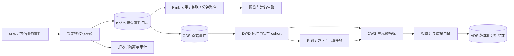

# 指标生产与分析

版本：设计 v1.3 · 2026-09-23。本文是服务端待实施方案；当前前端原型的已有图表是演示数据，没有真实采集、仓库或统计引擎。统一对象见[方案总览](./README.md)，采集接口见[接口协议](./02-接口协议.md)，决策与曝光时机见[SDK 与分流协议](./03-SDK与分流协议.md)。

## 1. 分析对象与不可变口径

`scope = (namespace_id, environment_id)`。原项目改称 Namespace，既有 ID 不换值；身份／权限见 [Namespace 与权限设计](./05-Namespace与权限设计.md)。

| 对象 | 不变量 |
| --- | --- |
| 目录 | 定义属于 Namespace；参数／受众保留版本表，metric／profile_attribute 只保当前定义及语义版本；使用时冻结完整内容，引用不得跨 Namespace |
| 运行／数据 | 实验、事件、任务、缓存、路径与结果按 scope 隔离；可信凭证限定服务和 producer，客户端不能自报权限 |
| experiment／run | experiment 是业务身份；run 冻结受众、单位、分组、参数和计划。2–20 组、一个 control，整数权重总和 10000；更改这些契约须新 run |
| config_revision | 配置版本不拆分／合并 cohort；事实按 run_id 关联，实验／分配版本和资格快照保留 lineage |
| 并行实验 | 一个 decision 可有多个 assignments；逐 run 分析，同一订单跨 run 的归因数不能加成全站订单数 |
| Namespace 隔离 | 隔离资源、配置和授权；同一用户可进入多个 Namespace，不保证流量互斥或消除业务交互。干扰须预注册因子／集群设计 |
| V1 主分析 | ITT：预定义 population 中已分配单位始终保留，包含失败、未曝光、回退、未购买；成功执行者分析仅作诊断 |

| 数据操作 | 所需动作与范围 |
| --- | --- |
| 事件接收 | 有效机器 namespace_member + event.ingest；逐项验证 Namespace／环境／服务／producer，客户端 scope 不能覆盖凭据 |
| 指标目录／定义 | metric.read／metric.manage；环境限定角色不能修改 Namespace 定义 |
| 实验选择指标 | 每个版本的 metric.read + metric.use；引用不传播授权，标签／owner 不授权 |
| 结果／质量／历史查询 | result.read + 返回指标的 metric.read；按实验／结果对象过滤，Namespace 可见不等于全部结果可见 |
| 分析／重算 | analysis.execute + result.read + metric.read；提交和后台执行时检查当前授权，固定任务 scope |
| 聚合导出 | result.export + result.read + metric.read；生成、领取和下载均鉴权；不开放任意用户明细 |
| 审计／调试 | audit.read／runtime.debug；按资源过滤并脱敏，调试数据不进入生产分析 |

服务端注入 scope，校验真实资源归属；查询、游标、缓存和导出绑定 principal／授权范围及 policy_revision。首期管理鉴权直查当前状态，不建设 allow 缓存及跨 Namespace 失效服务；配置／数据结果缓存继续按 scope 与授权投影隔离，命中不绕过当前访问检查。撤权阻止新请求；不自动停止实验或删除历史事实。UI 隐藏不可读对象，后台仍按完整冻结计划计算，不因读者权限裁剪 cohort 或更改统计分母。

analysis_plan 在提交 run 时写入 experiment_run.contract_snapshot，包含完整指标定义、metric_version_id、方法、受支持策略实际契约与实现版本摘要。新提交只选目录当前受支持版本，旧稿过期需重校验，不能静默换版。metric 的 POST versions 更新当前定义、生成新语义版本并审计；旧运行／结果始终读取冻结计划，历史口径从获授权 run 查询。展示名称／备注可改；正式口径修复须审计并产生新契约／结果，不得改旧快照或事后择优。

| 类别 | 必填内容 |
| --- | --- |
| 研究设计 | 随机化单元、身份命名空间、祖先资格与受众版本、分组与权重、唯一对照组 |
| population | 全量合格且分配群体，或启动前定义并验证的处理前触发群体；机器人、测试流量等排除条件 |
| 时间 | 入组开始／截止、每个 unit 的观察窗 `W`、迟到容忍 `L`、业务更正期限 `H`、时区、暂停／提前止损后的分析规则 |
| 指标 | 主指标、护栏、方向、分子分母、单位、来源与 SQL／DSL 版本、去重／缺失／异常值政策、归因键 |
| 推断 | 固定周期、目标样本、MDE、power、alpha、比较族、检验与区间方法、样本不足处理 |
| 质量与发布 | SRM 和缺数门禁、执行污染阈值、护栏退化幅度、谁审批发布与谁能执行预授权止损 |

### 1.1 控制库与数据链路的存储边界

v1.3 PostgreSQL 控制库固定 30 张表，完整清单见 [数据库设计](./01-数据库设计.md)。本篇 ODS／DWD／DWS／ADS 是既有事件与湖仓链路中的事实模型，不属于这 30 张控制表，也不作为另建一套关系库的替代说法。

| 内容 | 落点 |
| --- | --- |
| 指标当前定义 | `metric` 一行当前版本；旧口径由引用快照保留，不另建 metric_version |
| 分组、祖先资格、完整指标与分析计划 | `experiment_run.contract_snapshot`；analysis_plan_version_id、variant_id 是固定逻辑 ID |
| 调度、冻结输入及结果元信息 | `analysis_job`；analysis_run_id、data_snapshot_id 为逻辑 ID，输入清单和结果正文在对象存储 |
| 审批、实际生效状态及追踪 | `change_request`、`release`、统一 `audit_event/outbox_event/idempotency_record`；运行状态变化与发布激活同事务审计 |
| 资格快照、原始事件、计算事实 | 既有资格 KV、持久事件日志、对象存储和湖仓；控制库不逐 decision/token/event 写入 |

策略支持清单随服务代码／发布配置提供；提交冻结实际内容、实现版本和摘要，首期不引入通用策略注册框架。控制面 outbox 按 event_id、业务唯一 ID/CAS 防重，无独立 consumer_inbox；业务采集去重仍按下文的数据事实键执行。

## 2. 事件语义与可信边界

### 2.1 四个不能混用的阶段

| `event_type` | 何时产生 | 必要信息与用途 |
| --- | --- | --- |
| `qualification` | 在应用处理之前，在各组相同的位置判定资格／触发条件 | `qualification_id` 为本次判定身份，`trigger_id` 为冻结机会定义；另有条件版本、合格与否、原因、固定资格快照；可以没有 `variant_id` |
| `assignment` | 可信决策内核确定某个 run 的组 | 决策、run、variant、随机化单元、资格引用、配置和分配版本；是 cohort 权威依据 |
| `exposure` | 业务确认实际展示或使用了指定处理 | 决策 token、run、执行点、实际使用版本、事件 ID；配置查询／下载／预取不生成曝光 |
| `business` | 独立业务事实发生，如支付、退款、请求结束 | 业务唯一键、业务发生时间、单位、金额／时延等；通常无需实验或组字段 |

execution 另记成功／超时／回退、实际参数摘要和服务版本；回退保留 assignment。多服务联合处理须预定义生效条件、逐服务记录，不把执行失败记为处理曝光。

qualification 是处理前机会，如具备冻结资格的结算请求；不能用点击新按钮、支付成功或算法非空结果定义。triggered population 在各组相同代码位置使用处理前信号；另查未触发及全量群体。曝光后筛选不能改善正式结论，触发人群效果不能冒充全站效果。[Microsoft 触发分析实践](https://www.microsoft.com/en-us/research/articles/patterns-of-trustworthy-experimentation-post-experiment-stage/)

### 2.2 公共事件 envelope

采集字段 snake_case，时间 RFC 3339，仓库 UTC。服务端填写 received_at、trust_level、摄取坐标，并按凭据验证 producer_id。unit.id_hash 是 Namespace 内稳定伪名，记录身份命名空间和密钥版本；不传原始身份，不接受客户端自行改变归因身份。

| 字段 | 必需性 |
| --- | --- |
| `schema_version,event_id,event_type,event_time,producer_id,namespace_id,environment_id` | 所有事件必需；重试保留原 `event_id` 和正文 |
| `unit:{type,id_hash}` | 参与实验归因的事实必需；缺失进入不可归因队列，不能随意补成当前登录用户 |
| `request_id`，以及 payload 中的 `service_id,sdk_version` | 有业务请求、执行服务或 SDK 时提供；不把 `request_id` 当业务去重键 |
| `decision_id,run_id,variant_id,config_revision` | assignment 必需；qualification 按语义允许无组；exposure 由可信 token／决策日志解析并校验；business 通常可省略 |
| `decision_token` | 公共端曝光／执行确认必需；内部服务按协议校验后可透传。清洗后存 token 摘要及验证结果，不向分析人员暴露可复用 token |
| `payload` | 通过事件注册表的类型和字段白名单校验；禁止任意高基数属性自动变成维度 |

公共端曝光示例：run_id 只是声明，采集端按 token 校验 scope、unit、decision、run，再补可信组。浏览器曝光须标来源可信度；交易优先采用后端账本。

```json
{
  "schema_version": 1,
  "event_id": "evt_exposure_01",
  "event_type": "exposure",
  "event_time": "2026-09-19T02:01:05.123Z",
  "producer_id": "web_checkout",
  "namespace_id": "prj_shop",
  "environment_id": "env_prod",
  "unit": {"type": "user_id", "id_hash": "uh_4cf1"},
  "request_id": "req_checkout_72",
  "decision_id": "dec_72",
  "run_id": "run_checkout_03",
  "decision_token": "<signed_decision_token>",
  "payload": {
    "service_id": "web_checkout",
    "exposure_point": "checkout_panel_visible"
  }
}
```

支付事实无需组字段；凭据标识支付服务，归因端用稳定伪名和时间 join assignment，不要求订单系统知道所有并行实验。

```json
{
  "schema_version": 1,
  "event_id": "evt_pay_9001_v1",
  "event_type": "business",
  "event_time": "2026-09-19T02:04:09.000Z",
  "producer_id": "svc_payment",
  "namespace_id": "prj_shop",
  "environment_id": "env_prod",
  "unit": {"type": "user_id", "id_hash": "uh_4cf1"},
  "request_id": "req_pay_94",
  "payload": {
    "event_name": "order_paid",
    "source_system": "payment_ledger",
    "source_event_id": "payment_9001",
    "source_version": 1,
    "business_id": "order_9001",
    "amount_minor": 12900,
    "currency": "CNY"
  }
}
```

assignment/exposure 均“一事件一 run”；多 assignments 由可信 producer 独立发出，或内部 adapter 以 event_id+run_id 展开。外部 events:batch 不接收自由声明的 event.assignments[]；同 run 不得两组，不只取首项、不合并不同 run 样本。支付 payload.business_id 清洗后映射为 DWD order_id。

### 2.3 接收、重复与异常

1. 校验凭证、scope、schema、大小、枚举、时间偏差和 token。新 schema 通过兼容检查后登记；未知主版本、错环境、伪造组或同 run 冲突进入隔离队列并返回逐条结果。测试、预览、强制分组单独标记，不进入生产主分析。
2. 持久日志确认写入后才返回 `accepted`；它表示已可靠接收，不表示已经归因、聚合或通过质量校验。超时的客户端按原 ID 重试。业务支付事件建议由事务 outbox／可靠 CDC 生产，避免业务成功但事件未发送。
3. 传输去重键为 `(scope,producer_id,event_id)`，批量子记录再加 `run_id`。相同键、相同 payload digest 幂等忽略；相同键、不同正文作为冲突报警，不能用后到覆盖先到。
4. 业务去重另用 `(scope,source_system,source_event_id,source_version)`，解决同一订单被不同 event_id 重发。订单与退款还有领域唯一键；传输幂等不能代替业务幂等。更正必须增加版本或新的 adjustment ID，引用原事实。
5. 超晚、身份缺失、找不到 assignment 的事件保留原始记录及原因，后续重关联；不要默默当零，也不要把客户端发送的 variant 当作补救依据。缺失 assignment 的规模必须进入质量门禁。

## 3. 从事件到结果的数据链路

图中组件对应既有日志、流处理和湖仓能力，沿用组织已有部署；不是一期必须新建多个分布式服务的清单。首条链路可按已有设施先实现持久接收与批处理，实时预览独立推进，统计口径和可靠接收边界不变。



Kafka topic 按环境／可信事件类别拆分，分区键 hash(scope,unit_type,unit_hash)，不按 run 建 topic、不依赖跨 topic 顺序。join 允许业务先到；湖与实时使用独立 consumer group。按部署／Namespace／环境／producer 设置配额、lag 和积压预算。

全链路为 **at-least-once + 业务幂等 + 可重算**。Kafka producer／Flink checkpoint／事务 sink 不消除客户端、跨存储或超长重放重复；外部 sink 须协调 checkpoint 或按业务键幂等，结果版本提交。外部 exactly-once 仍需目标系统配合。[Kafka 交付语义](https://kafka.apache.org/41/design/design/#message-delivery-semantics)

实时按 event time 计算；watermark 由分区进度与乱序量推进，idle partition 单独告警。watermark 不证明全部到齐；迟到进 late side output／ODS，由批任务修复。[Flink 事件时间与迟到](https://nightlies.apache.org/flink/flink-docs-stable/docs/concepts/time/)

| 状态 | 保留规则 |
| --- | --- |
| 事件去重 D、待关联 J | 根据离线／生产重试／恢复时长分别配置，不能统一一天 |
| 单元观察 | W + L + 恢复余量 |
| 清理 | State TTL 按处理时间，不等于 watermark；窗口用事件时间 timer，TTL 兜底 |
| 超 TTL 重放 | 可能重新进入实时预览；正式批任务依持久事实键重建 |

状态 TTL、版本、checkpoint 和恢复演练纳入运行配置。[Flink 状态 TTL](https://nightlies.apache.org/flink/flink-docs-stable/docs/dev/datastream/fault-tolerance/state/#state-time-to-live-ttl)

## 4. 湖仓模型与物理设计

以下均为数据链路模型，不增加 PostgreSQL 控制表数量。

`scope`、`dataset_version` 和 UTC 时间字段为下面各表的公共列。ID 用字符串或一致的 UUID 表示；金额用 `BIGINT` 最小货币单位，跨币种须锁定汇率来源／日期／版本后另产换算指标。方差累加使用足够精度的数值类型及稳定算法，避免平方和溢出与大数相减精度损失。

| 层／表 | 粒度与逻辑键（均含 scope） | 核心列 | 分区／组织 |
| --- | --- | --- | --- |
| ODS `ods_event_raw` | 每次实际摄取；物理键 topic/partition/offset，保留重复 | 原文、digest、producer、event/received time、schema、校验状态、摄取坐标 | `received_date`、环境；按 Namespace 聚簇，原始事实追加 |
| ODS `ods_event_quarantine` | 拒收或清洗异常记录 | 错误码、原文引用、重放关联、处理状态 | received_date；限制访问权限 |
| DWD `dwd_event_canonical` | producer/event_id；展开记录再加 run_id | 标准 envelope、可信度、token 校验、数据来源与清洗版本 | event_date、环境；以持久键做去重，避免只在日分区内去重 |
| DWD `dwd_qualification` | qualification_id（可信 authority 生成，scope 内唯一） | run、unit、判断时间、资格规则／快照、eligible、reason、来源 producer | event_date；按 run/unit 聚簇 |
| DWD `dwd_assignment` | run/unit_type/unit_hash，一次首次有效分配 | variant、first_assignment_at、qualification_id、decision_id、配置及分配版本、is_test | 首次入组日；按 run/unit 聚簇；重复决策另存明细 |
| DWD `dwd_exposure_execution` | producer_id/event_id/run/执行点 | 实际执行或曝光、actual_payload_digest、fallback、服务版本、关联状态 | event_date；run/unit 聚簇 |
| DWD `dwd_business_change` | source_system/source_event_id/source_version | order/adjustment ID、unit、业务时间、数量、金额、状态、supersedes | received_date；按业务键聚簇，追加全部更正 |
| DWD `dwd_order_asof` | 每数据快照一行 source_system/order_id | 原支付时间、原购买unit、净额、退款状态、保留正负调整 lineage | paid_date；由更正账本生成版本快照 |
| DWD `dwd_run_cohort` | run/unit_type/unit_hash | 唯一原始组、入组时刻、population证据、observation_start/end | cohort_date；一个 run 的单位跨日只能一行 |
| DWS `dws_unit_metric` | run/metric_version/unit/观察窗/dataset_version | `x,y,converted`、观察长度、质量标记、业务去重计数 | run/metric 按规模选 bucket；禁止每日行直接当独立样本 |
| DWS `dws_variant_sufficient_stats` | run/metric/variant/window/dataset_version | `n,sum_x,sum_y,sum_x2,sum_y2,sum_xy`、分母零数、原始事实数 | run 或汇总日期；体量小可不细分区 |
| ADS `ads_metric_preview` | run/metric/variant/window/preview_version | 分钟聚合值、近似UV、水位、lag、preview标记 | 分钟／日；可更新，不是正式结论 |
| ADS `ads_analysis_result` | analysis_run_id/metric/comparison/population | 估计、差值、CI、原始／调整p、n、SRM、成熟度、质量、结论 | analysis日期；按 scope/run 查询 |

逻辑键均含 scope：event_id 在 producer 内唯一；qualification_id 由可信 authority 分配、scope 内唯一；order_id 在 scope+source_system 内唯一。冲突隔离；镜像订单先映射权威来源及标准业务键，不能重复计收入。

大 Namespace 用 days(time)+bucket(namespace_id 或 unit_hash)，避免逐 Namespace/run/unit 小分区。湖格式未必强制逻辑唯一，ETL 提交前验证。服务端注入 scope；明细按回溯／删除政策保留，结果快照不得提前过期。

批任务固定 source_snapshot_ids；跨表清单记录全部 snapshot、源 offsets、完整性。临时写入 → 校验逻辑键／总数 → 原子发布 dataset manifest 与结果指针。Iceberg 提供单表快照，跨表原子清单和任务幂等仍由平台负责。[Iceberg 可靠性](https://iceberg.apache.org/docs/latest/reliability/)

## 5. Cohort、归因与单元聚合

### 5.1 固定分母

默认 population 是“在预定入组期内满足冻结资格、被可信内核分配的所有随机化单位”。首次合格分配建立 cohort；之后重复访问不新增样本。流量增加只增加尚未入组的单位，已有单位的组和起始时间不改变。因身份冲突出现同 run 多组时阻断该 run 的正式结论，不能临时挑一个组或删除问题用户后继续宣称无偏。

qualification 必须有处理前 lineage，且规则对各组相同；未能关联资格日志时是数据缺失，不等于“不合格”。全量 ITT population 可包含预定义未触发单位；若计划选择预处理 triggered population，必须先按其定义建 cohort，再聚合所有入组单位的结果。无曝光、失败、无订单单位都进入分母并获得零业务计数；遥测缺失、服务断流则触发质量阻断，不能把缺数当无行为补零。

V1 采用单位级观察窗 `[first_assignment_at, first_assignment_at + W)`。归因要求 scope、unit 类型／身份一致，业务事实的有效时间落在观察窗；同一事实在一个 run 内最多关联一次。暂停期是否允许新入组由冻结计划及控制状态确定；已入组单位的固定观察窗继续接收结果，即使随后暂停、停止处理或回退，也不能事后删除单位或裁掉不利时段。“有效运行区间”用于描述准入与执行状态，不替代该固定观察窗。跨日累计用户数从 cohort 去重，不能把每日 UV 相加。设备实验登录后仍用原设备身份，用户实验不能事后追溯合并登录前的设备，身份桥接另设版本化政策。

### 5.2 一段可实现的批 SQL

以下为 PostgreSQL 风格的仓库 SQL 示例：固定 7 天观察窗，可信订单快照已经按业务版本去重、合并退款、更正归属；`source_snapshot_ids` 由执行器绑定，不能读取不断变化的 latest 表。示例以用户随机化，输出购买转化、每用户订单数与客单价所需充分统计量。

```sql
-- 所有 : 参数由服务端计划绑定，非前端自由拼接。
-- dwd_assignment 已校验唯一组和资格证据；is_test 等排除规则在启动前固定。
WITH cohort AS (
  SELECT namespace_id, environment_id, run_id,
         unit_type, unit_hash, variant_id, first_assignment_at,
         first_assignment_at + INTERVAL '7 days' AS observation_end
  FROM dwd_assignment
  WHERE namespace_id = :namespace_id
    AND environment_id = :environment_id AND run_id = :run_id
    AND dataset_version = :assignment_dataset_version
    AND first_assignment_at >= :enrollment_start
    AND first_assignment_at < :enrollment_end
    AND population_qualified = TRUE AND is_test = FALSE
), unit_values AS (
  SELECT c.run_id, c.variant_id, c.unit_type, c.unit_hash,
         COUNT(o.order_id) AS order_count,
         CASE WHEN COUNT(o.order_id) > 0 THEN 1 ELSE 0 END AS converted,
         COALESCE(SUM(o.net_amount_minor), 0) AS revenue_minor
  FROM cohort c
  LEFT JOIN dwd_order_asof o
    ON o.namespace_id = c.namespace_id
   AND o.environment_id = c.environment_id
   AND o.unit_type = c.unit_type AND o.unit_hash = c.unit_hash
   AND o.dataset_version = :order_dataset_version
   AND o.source_system = :order_source_system
   AND o.currency = 'CNY'
   AND o.paid_at >= c.first_assignment_at
   AND o.paid_at < c.observation_end
   AND o.received_at <= :received_at_cutoff
  -- final 前执行器断言：所有 observation_end 已成熟且源数据完整。
  -- provisional 若只展示已成熟 cohort，另命名 population，报未成熟人数。
  GROUP BY c.run_id, c.variant_id, c.unit_type, c.unit_hash
)
SELECT run_id, variant_id,
       COUNT(*) AS n_units,
       SUM(converted) AS n_converted,
       SUM(order_count) AS n_orders,
       SUM(revenue_minor) AS revenue_minor,
       AVG(converted::NUMERIC) AS purchase_rate,
       AVG(order_count::NUMERIC) AS orders_per_unit,
       SUM(revenue_minor)::NUMERIC / NULLIF(SUM(order_count), 0) AS aov_minor,
       SUM(revenue_minor::NUMERIC * revenue_minor) AS sum_x2,
       SUM(order_count::NUMERIC * order_count) AS sum_y2,
       SUM(revenue_minor::NUMERIC * order_count) AS sum_xy
FROM unit_values
GROUP BY run_id, variant_id;
```

这里 `LEFT JOIN` 保留零订单用户，`COUNT(*)` 是 cohort 单位数；订单条件不能挪到 join 后的 `WHERE` 将其变成事实内连接。`dwd_order_asof` 必须保证 scope/source_system/order 唯一，本例绑定一个权威 `order_source_system`，否则先聚合或判错，不能依赖 `COUNT(DISTINCT)` 掩盖金额重复。支付转化是否在全额退款后撤销由指标版本定义；本例转化记录“曾支付”，净收入扣减退款，订单数不因退款自动减少。

日增量可保存 unit-day 的计数、金额和业务键状态，但正式运行窗口必须再按 unit 汇总得到 `X_i = Σday x_i` 后计算 `ΣX_i²`；不能相加每日平方和代替累计平方和，因为会漏掉跨日协方差。累计转化取 `MAX(converted_day)`；累计去重订单基于持久订单键，不相加重复的日快照计数。精确推断不用 HLL 近似 UV 作样本量；近似去重仅用于明确标记的预览。

## 6. 指标定义和统计方法

| 类型 | 单位级记录与组估计量 | 推断与约束 |
| --- | --- | --- |
| count / mean | `X_i` 为单位窗口内次数／金额／时长；组估计为 `ΣX_i/n` | 按随机化单位估计方差；可用 Welch／大样本均值差。事件不能当独立用户 |
| rate | `X_i∈{0,1}`；转化率为转化单位数／全部 cohort 单位数 | 预注册二项或均值差方法；稀疏数据改用经验证的方法或 insufficient，不能硬套正态近似 |
| ratio | `X_i` 分子、`Y_i` 分母；组估计 `R=ΣX_i/ΣY_i` | 保留协方差，使用 delta method 或按随机化单位 cluster bootstrap |
| latency | 成功／失败请求口径、超时截断、单位明确；可为总时延／请求数或单位平均时延 | 两者目标不同，必须命名区分；请求级 P95/P99 用分位数方法与单位重采样，不能套均值SE |

金额始终明确 `amount_minor + currency`，显示层再换算“元”。客单价为 `Σ收入/Σ订单`，不是 `AVG(每用户收入/每用户订单)`；零订单用户可有 `X_i=Y_i=0`，不得为方便计算从 cohort 消失。整个组分母为零时指标不可估计，不输出 0% lift 或无穷显著性。

对一个组，令 `n` 为随机化单位数，`s_x²,s_y²,s_xy` 为单位级无偏样本方差／协方差：

```text
R = mean(X) / mean(Y)
Var(R) ≈ [s_x² + R² s_y² - 2 R s_xy] / [n × mean(Y)²]
Δ = R_treatment - R_control
SE(Δ) = sqrt(Var(R_treatment) + Var(R_control))
```

该式要求分母稳定且满足大样本近似；重尾、极稀疏、极少随机化单位时必须做模拟覆盖率验证或改用预注册 cluster bootstrap。bootstrap 在每组按 unit 整簇重抽，保留该 unit 所有天和请求；组织随机化就按组织重抽。保存 seed、次数和算法版本；不能把订单单独重抽当成用户随机化实验的置信区间。相对 lift 的区间也须对比值重新推导／重采样，不能把绝对差区间机械除以观测对照值并忽略其不确定性。[Deng 等，Delta method 原始论文](https://arxiv.org/abs/1803.06336)

主结果至少给出各组 `n`、分子分母、估计值、绝对差、相对差、CI、原始／校正 p 值、业务阈值和数据状态。对照值为零时只报有定义的绝对差，相对 lift 为空。裁剪、winsorization、机器人过滤、缺失插补在指标版本中预定；不得看到异常值后按组选择过滤。P99 与收入等重尾指标发布前要用历史回放确认灵敏度与计算成本。

### 6.1 固定周期、多组与样本规划

V1 只支持预注册固定入组周期和观察窗。实时展示样本、趋势和健康；普通固定周期 p 值不能用于“每天看，显著就停”或“暂不显著就延长”。严重事故允许安全停止，但提前停止的固定周期实验不自动输出正常最终胜出；结果注明停止原因并按预注册规则处理。需要随时决策时，二期单独实现并验证序贯有效推断。[Johari 等，Always Valid Inference](https://arxiv.org/abs/1512.04922)

默认比较是每个处理组对同一个 control，不自动遍历全部两两比较。计划冻结 `comparison_family`：V1 推荐把 `(K−1) ×（主指标数 + 发布必需护栏数）` 个正式假设组成一个族，用 Holm 控制族错误率。主指标默认双侧检验且正向估计，护栏使用预定义退化界限的单侧非劣检验；每个 p 值必须来自对应的零假设。排序后依次以 `alpha/(m−j+1)` 比较，在首次不拒绝处停止；校正 p 用前缀最大值保证单调。共享对照产生的相关性不妨碍 Holm 的一般错误率控制。[Holm 1979 原文](https://www.ime.usp.br/~abe/lista/pdf4R8xPVzCnX.pdf)

UI 同时显示带标签的边际 95% CI 和保守的族范围 Bonferroni 同时区间／单侧界限（按 m 调整），不要把边际区间冒充 Holm 同时区间。胜出要求正式主比较通过校正、效果达到预定义业务标准、所有必需护栏通过；数据质量和成熟度同时有效。多个处理均胜过 control 时不能据此认定它们彼此有显著差异。事后切片、追加指标、组间比较标“探索性”，不进入自动胜出。

样本规划使用历史相同单位和相同窗口的方差、实际 `weight_bps`、目标 MDE 与至少 80% 等由团队确认的 power 目标。连续均值的近似总量可从下式起算，再用真实零膨胀／重尾数据模拟验证；多组规划保守使用 `alpha/m`，以最难比较所需 N 为准：

```text
N ≈ (z(1−alpha_pair/2) + z(power))²
     × [variance_t / weight_t + variance_c / weight_c] / MDE_absolute²
weight_v = weight_bps_v / 10000
```

比率指标使用线性化后的方差，rate 使用对应基线率；集群设计按真实随机化单位和相关性估计，不能套用户数量。还须覆盖业务周周期、观察窗和样本流入速度。达到日期但样本不足输出 insufficient；新一轮可重新规划，不能为了显著性追延旧计划。不要用事后观测效果计算“已实现 power”来证明结果可信。

### 6.2 A/A、SRM 与方差缩减

上线前使用“相同处理、不同随机标签”的 A/A 验证跨 SDK 分配、首入组去重、曝光差异、流水与业务账本核对，并做多次模拟／历史回放检验 CI 覆盖率和比较族假阳性率。一次 A/A 的 p>0.05 不是系统正确的充分证据；应有覆盖不同权重、20组、迟到、回退和重尾的固定测试集。

SRM 在**与随机分配权重对应的合格且 assigned cohort**上检查，`E_v=N×weight_bps_v/10000`，多组统计量 `Σ(O_v−E_v)²/E_v`，自由度 K−1；预期计数太小时采用经验证的精确／模拟法，或标记尚无足够诊断样本。受众不合格、祖先桶外、未准入、测试强制分组不能混入分母；父域比例／实验准入流量比例不能冒充分组权重。按冻结 run 权重检验，分配 revision／时间段分别诊断新增流量结构。[Microsoft SRM 诊断](https://www.microsoft.com/en-us/research/articles/diagnosing-sample-ratio-mismatch-in-a-b-testing/)

预处理触发 cohort 可额外做 SRM，以验证触发日志一致；exposed-only 或付费用户的组比例可因处理真实改变，不得机械套随机权重后称为随机化错误。分别报告 assignment → exposure → execution → outcome 的覆盖和缺失差异，定位机制。SRM 连续监测预设告警时点、阈值、持有时间及重复告警预算；不把偶然一次越线自动解释为业务损害。重大未解释 SRM 阻断胜出，排查 hash、身份漂移、选择性漏报、错环境、错误过滤。

CUPED 列为二期：仅使用处理前协变量，冻结协变量窗口、缺失政策与系数估计方法，检查各组覆盖和离群点。它可以减少方差，不能修复 SRM、后处理筛选或错误埋点。[Deng 等，CUPED 原始论文](https://ai.stanford.edu/~ronnyk/2013-02CUPEDImprovingSensitivityOfControlledExperiments.pdf)

## 7. 迟到、更正、成熟与可重跑

| 情况 | 处理规则 |
| --- | --- |
| 网络离线／乱序 | 保留原 `event_time` 和服务器 `received_at`；不按到达日重新归因。客户端时间异常隔离或按预注册可验证政策处理 |
| assignment 后到 | 在待关联状态重试；状态过期仍保留事实，批任务在完整 scope/unit/time 上补 join，并报告原未关联量 |
| 支付退款 | 退款使用独立 `adjustment_id`，关联原订单和原购买 unit；按冻结净收入定义回写原支付观察窗，不能按退款当天重新选实验组 |
| 事实更正 | 追加更高 source_version，存旧值和 supersedes；有效版本由可信 source_version 决定，不用最后到达时间覆盖 |
| 历史回填 | 独立 backfill_id、范围、原因和源快照；覆盖受影响 unit/run/window 分区重算，不直接对旧汇总盲加增量 |
| 终止／暂停 | 停止入组不停止已入组单位观察；保留失败／回退记录。旧离线决策按有效期／撤销规则识别，不能挪到新 run |

| 时间／版本 | 规则 |
| --- | --- |
| W | 自首次分配起的行为观察窗 |
| L | 事件传输／流水到达容忍 |
| H | 自原业务事实起的业务更正期限；无业务更正取 0 |
| 最晚成熟 | enrollment_end + W + H + L；例 7 天／48 小时／30 天只是待确认示例 |
| final 条件 | 所有观察／更正期结束、源完整性覆盖、摄取覆盖 L、质量通过；watermark 前进不能掩盖源断流 |
| 未成熟预览 | 展示累计值或另名的成熟 cohort；附成熟比例／分母，不能静默删除未成熟单位形成主结论 |
| 长更正期 | 可预注册“7日毛收入”与“30日净收入”等独立指标，分别成熟 |
| 任务幂等 | analysis_job 首次执行前冻结计划、input manifest、源快照／offset、水位、cutoff、代码和 seed；执行重试复用固定输入；创建按 Idempotency-Key 去重，新 key 可新建 job；摘要仅校验和追溯，每 job 唯一发布 |
| 修复／重算 | 新 analysis_job_id 和 analysis_run_id + supersedes_analysis_run_id、差异和原因；旧成功结果只读，错误 final 追加失效／替代记录 |

analysis_job 合并调度、输入快照和结果元信息，不另建 result_analysis_run 或 analysis_input_snapshot。创建任务时固定 analysis_job_id、analysis_run_id 和发起者，预分配分析 ID 不表示结果已完成。首次执行前固定 scope、run、analysis_plan_version_id、metric_version_ids、code_version、source_snapshot_ids、源 offsets、event_time_watermark、received_at_cutoff、attribution_cutoff、correction_horizon、dataset_version、seed 和 input manifest 的 URI／摘要；执行中及重试不得换输入。成功时冻结质量报告、结果 URI／摘要及完成时间，成功记录不可覆盖或重开；更正、换数据或换代码新建 job，并以 supersedes_analysis_run_id 关联同 run 的成功旧结果，禁止自指。相同请求正文不永久合并：幂等有效期内同 key 返回原 job，新 key 可创建独立 job 并固定其首次执行输入。重算覆盖真实迟到／更正范围，不固定“只算昨天”。复现期内保持快照可读；过期／依法删除后标明无法完整复现。

| `result_status` | 返回含义 | 可否形成正式胜出 |
| --- | --- | --- |
| `insufficient` | 样本／有效分母不足、估计不可计算；报告具体不足 | 否 |
| `invalid` | SRM、身份错组、来源不完整等重要质量问题未解释 | 否；允许事故止损 |
| `provisional` | 仍在预览／未到计划分析时点／窗口未成熟 | 否 |
| `final` | 输入成熟、质量有效、按冻结计划完成分析 | 可进入决策流程，但不表示已胜出或已批准上线 |

quality_findings[] 保留全部阻断，状态优先级 invalid > insufficient > provisional > final。调度状态 queued/running/succeeded/failed 与业务 decision=positive/inconclusive/negative 分开；不显著既不代表数据无效，也不证明等效或护栏安全。

## 8. 质量门禁、告警与运营

| 门禁 | 检查与动作 | 主要负责人 |
| --- | --- | --- |
| 接收完整性 | SDK/业务 outbox 发送数、持久ACK数、Kafka lag、ODS数对账；按来源和组诊断差异 | 采集平台／接入应用 |
| 身份与分配 | 同 run 多组、单位类型漂移、错scope、token验证失败、资格缺失、强制流量串入 | 决策平台 |
| 业务事实 | 订单账本金额／数量核对、版本冲突、退款重复、币种缺失、事件时间异常 | 数据／业务 owner |
| 统计结构 | 正确population SRM、各组成熟率、零分母、分析单元数量、流批差异 | 统计／数据 owner |
| 执行健康 | 默认回退、实际参数不一致、组间执行失败／漏曝光、SDK配置陈旧 | 业务 SRE |
| 护栏 | 错误率、崩溃率、时延及业务退化限度；单位、最小量与窗口预先固定 | 业务 owner／SRE |

阈值由 A/A、历史分布、风险及可检测程度标定，随规则版本保存。缺来源／清单／关键数据时标缺数，不显示零转化。

质量异常告警并阻断胜出；护栏超限提出暂停／回退。自动止损须预审批并冻结 run、回退动作、阈值、最小量、窗口、冷却、通知与审计，由具备 experiment.stop 的受限机器身份幂等调用控制面。紧急 kill switch 同样可追溯；分析服务不能直接写配置指针，显著胜出不跳过审批。

| 首轮容量验证候选（非已有 SLA） | 测量 |
| --- | --- |
| 在线持久接收 P99 ≤2秒 | 客户端发送 → ACK |
| 分钟预览 P95 ≤5分钟 | event_time → 预览可见 |
| 源完整后日批 ≤2小时 | 源完整清单 → 结果发布 |

离线延迟单列，不能剔除后宣称全端达标。演练采集超时、Kafka／checkpoint 恢复、跨 TTL 重放、源断流、晚退款及重复任务。

## 9. 成本估算和交付验收

在确认业务基线前只给公式。设每日事件量 `E`、压缩后每条平均字节 `B`、峰值系数 `P`、Kafka保留天数 `Dk`／副本 `R`、湖保留天数 `Dl`、压缩及版本放大 `A`，则：

```text
平均摄取字节/秒 = E × B / 86400
峰值带宽预算 = E × B / 86400 × P × 协议与重试余量
Kafka磁盘预算 ≈ E × B × Dk × R × 运维余量
湖存储预算 ≈ E × B × Dl × A
去重状态预算 ≈ 去重TTL内唯一事件数 × 每key状态字节 × 状态后端放大
观察状态预算 ≈ 活跃run-unit-metric组合数 × 单元状态字节 × 保留窗口系数
每次批扫描量 ≈ 相关时间分区字节 × 选择率 × 读取列比例
月成本 ≈ 存储GB月单价 × GB + 流计算资源时单价 × 资源时
         + 批计算/扫描单价 × 实际用量 + 网络 + 备份 + 运维
```

归因量按每单位平均并行 run 数放大；JSON 原文大小与列式压缩大小分别采样。20 组增加比较数量和所需样本，不代表事件量必然乘20。限制自由维度、合并小文件、按需物化常用指标、隔离大回填任务，比先承诺固定节点数更可靠。

首期按以下验收集交付，使用固定输入和可审阅的预期结果：

1. 同一 event 重试100次、换event_id重发同业务事实、跨日／跨TTL重放，正式支付数量与金额均不变；相同ID不同内容被隔离。
2. 业务先于assignment到达、离线晚到、时区边界、7天窗口边界、重复访问，最终join和cohort一致；零事件用户保留，累计UV不等于日UV求和。
3. 一个decision命中多个run，各自正确归因；同run多组、错环境、伪造variant、缺资格日志阻断正式结果。
4. 服务回退与执行失败仍保留ITT；只筛选成功曝光可改变估计的测试样本被识别，不能成为默认主报表。
5. 部分退款、全额退款、重复退款、更高版本金额修正、停止入组后的迟到更正，都生成可解释的新结果版本。
6. 2组／20组、非等比分配、低计数、零分母、重尾金额、跨日相关、共享对照、多重比较，用模拟真值校验覆盖率和族假阳性；SQL充分统计量与单机基准一致。
7. checkpoint恢复、分区重放、并行任务重试、发布结果中途失败，同一 job 不产生两份可见结果；首次执行前固定输入，重试不换快照，成功结果不可覆盖，更正生成新job；相同输入、代码和seed可复现。
8. Namespace／环境同ID事件不串数；伪造 scope、越权producer、结果查询／游标／缓存／下载被拒；撤权后不再创建／执行未授权任务。
9. A/A与业务账本对账通过后，先开放预览，再开放正式结论，最后单独审批启用自动止损策略。

统计方法、参考组件语义以上述官方文档与原始论文为依据；topic划分、数据表、成熟政策、比较族和SLO为本平台设计选择，需经首条真实业务链路验证后定版。
