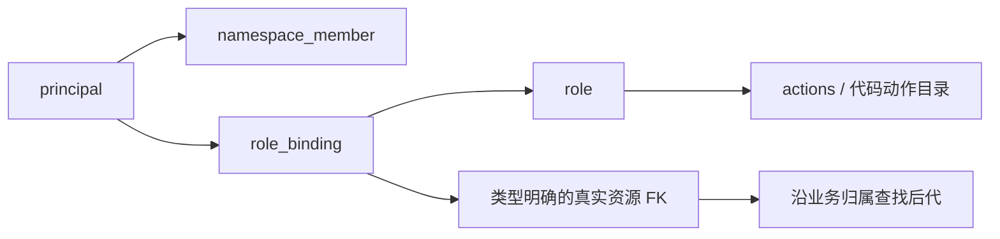

# Namespace 与权限设计

版本：设计 v1.3 · 2026-09-23 · 原型基线 v23。**设计规范，尚未实现鉴权、数据库、管理界面或 SDK 服务身份。** 本文是权限规则的唯一详述；表结构见 [数据库](./01-数据库设计.md)，请求协议见 [接口](./02-接口协议.md)，运行凭证见 [SDK](./03-SDK与分流协议.md)。

## 1. 边界与概念

```text
单企业 / 单部署                         无 tenant
├─ 全局 principal（人 / 机器）、角色目录
├─ Namespace A                          承接旧 project
│  ├─ 应用 → 参数、应用私有标签          定义目录，不属于某个环境
│  ├─ 画像属性、受众、指标定义            定义目录
│  ├─ 测试环境 → 拓扑、归层、实验、运行、发布、结果
│  └─ 生产环境 → 拓扑、归层、实验、运行、发布、结果
└─ Namespace B
```

| 概念 | 规则 |
| --- | --- |
| Namespace | 独立资源、配置、凭证和分桶作用域；不再叠加项目/空间 |
| 成员 | principal 与 Namespace 多对多；显式有效成员才进入权限判定，成员身份不自动授予 read |
| 角色 | 部署级动作集合，由平台管理员维护首版模板 |
| 绑定 | 直接给一个 human/machine principal，在某个资源及其后代授予角色；可附加环境与到期限制 |
| 用户组 | 后续能力；一期不建组/组成员表，也不接受 group 绑定 |
| 负责人/标签 | 管理元数据，不赋权；标签不形成权限范围 |
| 业务用户 | 实验分桶使用的业务身份，与控制台 principal 不同；可参与多个 Namespace |

Namespace 不保证业务因果无干扰。同一业务用户在多个 Namespace 接受的处理仍可能互相影响。需要联动的参数应放同一 Namespace；不得复制相同运行参数到多个 Namespace 竞争写入。

迁移将 `project_id/key` 更名为 `namespace_id/key`，保留原 ID、盐和历史。改名不重新分桶；资源、受众、参数、凭证和结果引用不得跨 Namespace。

## 2. 授权关系与判断顺序



一次检查输入：`principal + namespace + action + resource + 操作环境（可空）`。

1. 验证身份有效；Namespace 操作再验证个人成员有效。机器身份相同。
2. 找该 principal 的直接绑定；排除禁用、撤销和到期项。
3. 检查角色包含 action、scope 是目标或其归属祖先。
4. 检查绑定的环境限定与操作环境匹配。
5. 组合操作的每一项检查全部通过，才继续业务状态校验。

默认拒绝；有效 allow 取并集。没有显式 deny，也没有“较小范围覆盖较大范围”。角色不隐含其他动作，例如 `parameter.manage` 不隐含 `parameter.use`，`experiment.publish` 不隐含 `experiment.read`。

部署动作在 deployment 根授权，不要求 Namespace 成员。平台角色不自动获得 Namespace 业务资源访问权；进入某 Namespace 仍须个人成员和资源授权。创建 Namespace 的事务可原子建立首个成员及管理员绑定，除此之外没有隐式准入。

### 2.1 归属树不是引用树

```text
部署
└─ Namespace
   ├─ service
   │  └─ parameter
   ├─ audience / profile_attribute / metric
   └─ environment
      ├─ experiment_draft（目标层可空，只作引用）
      └─ 根 domain
         └─ routing layer
            └─ domain
               └─ parameter layer
                  ├─ 子 domain → layer → …
                  └─ experiment → 版本 / run / 结果（沿身份判定）

实验引用参数、受众、指标：另查各自权限，不产生授权继承边。
```

一期不复制授权资源树。role_binding 按封闭 scope_kind 选择一个真实实体 FK；environment 资源使用 target_environment_id，授权环境限定另用 environment_filter_id，不能混用。N/E 复合 FK 和逐类形状 CHECK 拒绝伪造目标；继承直接读取上述业务归属。数据库字段见 [数据库 §3](./01-数据库设计.md)。

API 仍可传 resource_type/resource_id，由服务端解析到对应强类型列；不能直接存成无约束的 type+id。subject 仅接受 `{type:"principal",id:"…"}`，传 group 明确返回不支持。

| 绑定 | 有效范围 | 不会获得 |
| --- | --- | --- |
| 应用 A 上的参数维护角色 | 应用 A 下的参数定义；取决于角色包含哪些 action | 这些参数被引用的层、实验或生产发布 |
| 域 D 上的实验只读角色 | D 的后代层与实验 | 实验引用的应用/参数/受众/指标详情 |
| 单个实验上的审批角色 | 该实验的 approve 动作 | 依赖读取、编辑和发布 |
| Namespace 上的只读角色 | 其后代中与 read 动作匹配的资源 | 创建、使用参数、发布、导出等未列入动作 |

父级已经授予编辑时，在子级增加只读绑定不能收回编辑。需移除/缩小原父级绑定，再在需要的位置重新授予。

### 2.2 环境限定

| binding.environment_filter_id | 判定 |
| --- | --- |
| NULL | 不附加环境过滤；仍只覆盖 scope 后代和角色动作 |
| 测试环境 ID | 仅覆盖测试环境操作；不能编辑 Namespace 级定义目录 |
| 与资源自身环境不符 | 创建绑定时拒绝 |

应用、参数、受众和指标的定义都属于 Namespace。它们在某环境被使用时，read/use 检查携带该环境上下文；环境限定绑定可以满足该检查，但不能借该上下文执行目录 manage。Namespace 目录列表也只能显示当前上下文有 read 的条目。

### 2.3 拓扑变化

- 实验身份固定归属一个 layer；换层新建实验。层/domain 的运行中拓扑不得原地移动。
- 合法离线迁移同时检查来源、目标及全部后代的管理权限；重算移动后的有效授权并记录变化。
- 实体归属、完整拓扑 change_request 快照、环境版本、policy_revision 与审计同事务更新；后续检查读取当前归属。
- 禁止先改 parent 再利用新继承权限，或以改 owner/标签代替授权。

## 3. 稳定动作目录

动作由代码维护；角色只组合下表动作。UI 使用中文名称，协议与审计使用完整 action_code。新增动作须版本化评审，不能用临时同义码替代。

| 类别 | action_code | 目标 / 含义 |
| --- | --- | --- |
| 部署 | `namespace.create` | deployment：创建 Namespace |
| 部署 IAM | `iam.roles.manage` | deployment：维护角色模板/动作集合；会扩大现有绑定权限，必须审计 |
| 后续保留动作 | `iam.groups.manage` | 组能力延期；一期 API 明确不支持，不允许用此动作模拟组授权 |
| Namespace | `namespace.read`、`namespace.manage`、`namespace.members.manage` | Namespace：读元数据、维护目录、增删/禁用成员 |
| 绑定/凭证 | `iam.bindings.manage`、`iam.credentials.manage` | 授权范围内管理绑定、机器凭证；另受可委派与权限上限检查 |
| 环境 | `environment.read`、`environment.manage` | environment：读取、管理环境；创建时在 Namespace 检查 manage |
| 应用 | `service.read`、`service.manage` | service：读取、维护应用定义及接入配置；创建时在 Namespace 检查 manage |
| 参数 | `parameter.read`、`parameter.manage`、`parameter.use`、`parameter.assign` | parameter：读取、维护定义、在指定环境使用、激活/归层；创建时在 service 检查 manage |
| 域 | `domain.read`、`domain.manage` | domain：读取、创建/维护拓扑；创建子域在父 layer 检查 manage |
| 层 | `layer.read`、`layer.manage`、`layer.use` | layer：读取、维护、承载实验/子域；创建层在 domain 检查 manage |
| 实验 | `experiment.read`、`experiment.create`、`experiment.edit` | experiment / experiment_draft：读与编辑；草稿 create 在 environment 或已选 layer 检查 |
| 实验工作流 | `experiment.submit`、`experiment.approve`、`experiment.publish`、`experiment.stop` | experiment：提交、审核、发布、停止；业务状态和审批策略另验 |
| 结果 | `result.read`、`result.export`、`analysis.execute` | experiment：读取/导出结果、发起分析任务 |
| 受众 | `audience.read`、`audience.manage`、`audience.use` | audience：读取、维护、在指定环境使用 |
| 画像属性 | `profile_attribute.read`、`profile_attribute.manage` | profile_attribute：读取/维护定义；没有隐含的数据明细访问权 |
| 指标 | `metric.read`、`metric.manage`、`metric.use` | metric：读取、维护定义、在指定环境的分析计划中使用 |
| 非实验发布 | `configuration.approve`、`topology.publish`、`baseline.publish` | environment：审核拓扑/基线变更、发布拓扑、发布基线 |
| 发布记录 | `release.read`、`release.rollback` | environment：读发布、请求回滚；回滚还须各受影响对象的发布及依赖授权 |
| 审计 | `audit.read` | scope 内审计；读取部署审计须在 deployment 绑定该动作 |
| 运行时 | `runtime.evaluate`、`runtime.context.resolve`、`runtime.config.read`、`runtime.debug`、`event.ingest` | service + 指定环境：分流、解析上下文、下载配置、调试、事件上报；与控制台动作分开 |

受众、画像属性和指标创建时，在 Namespace 上检查对应 manage。删除/归档使用对应 manage 并校验依赖；读写版本沿身份判定。没有独立的“所有资源通配字符串”或标签权限。

首版角色模板按职责组合，例如 Namespace 管理、目录维护、实验编排、审批、发布、结果只读、SDK 运行。模板名不是权限判断依据；接口返回角色包含的动作，避免把“管理员”误解为所有动作。

## 4. 多资源检查矩阵

**每一列都是 AND。** 继承或多个直接绑定可以合并满足同一动作，但不能用某一个资源的授权代替整行检查。依赖集合由服务端按完整当前配置计算，包含所有祖先受众，不采信客户端声明的子集。

| 操作 | 主动作及 scope | 层/拓扑 | 全部参数 | 受众/画像/指标 |
| --- | --- | --- | --- | --- |
| 创建未完成草稿 | 未选层：environment 上 `experiment.create`；已选层：可在目标 layer 检查 create | 草稿固定归 environment；此时不要求 layer.use | 可缺参数、名称，可存坏 JSON | 不要求未完成依赖已合法；读取候选目录仍需 read |
| 保存草稿原文 | 草稿 `experiment.edit` | 不因选层移动授权 parent | 保留未完成原文，不做提交级完整性校验 | 不因缺项拒绝自动保存；不返回无权读取的依赖内容 |
| 绑定/校验完整配置 | 草稿或实验 `experiment.edit`；新稿改目标层还须目标层 create | `layer.use` | 最终完整参数集合 read/use | 最终完整引用集合 read/use |
| 提交/扩量提交 | 新实验在目标层 `experiment.create` + `experiment.submit`；既有实验在 experiment 上 submit；草稿提交另需草稿 read | `layer.use`；重新验证当前拓扑 | 全部 read/use | 全部受众 read/use、指标 read/use；可见配置的属性 read |
| 审核实验 | 实验 `experiment.read` + `experiment.approve` | `layer.read`、涉及 domain.read | 全部 read | 全部受众/指标/画像依赖 read；无需 edit/use |
| 发布/启动/恢复 | 实验 `experiment.publish` | `layer.use` | 全部 read/use | 全部受众 read/use、指标 read/use；重检当前授权与审批摘要 |
| 停止实验 | 实验 `experiment.stop` | 可定位所属层 | 无需新增参数使用权 | 停止走发布/撤销状态机；另记审计 |
| 创建子域 | 父层 `domain.manage` | 父层 `layer.use` | 完整继承参数 read/use | 完整祖先及新增受众 read/use |
| 激活/归层/转移参数 | 参数 `parameter.assign`（环境上下文） | 所有来源/目标层 `layer.manage` | 全部涉及参数 read/use | 若改变资格依赖，检查完整受众 read/use |
| 发布基线 | 环境 `baseline.publish` | 环境 read，拓扑一致 | 全部改变参数 read/use | 审批状态通过 |
| 发布拓扑 | 环境 `topology.publish` | 全部改变域/层 manage；涉及承载层 use | 全部受影响参数 read/use | 全部受影响受众 read/use；审批状态通过 |
| 审核拓扑/基线 | 环境 `configuration.approve` | 涉及域/层 read | 全部涉及参数 read | 完整配置依赖 read；无需编辑 |
| 回滚发布 | 环境 `release.rollback` | 目标快照涉及的对应 topology.publish 等 | 当前全部依赖 read/use | 每个实验/基线对应 publish 与依赖使用权；审批与回收安全重验 |
| 发起分析/重算 | 实验 `analysis.execute` + `result.read` | 沿实验身份；提交与执行均复验 | 展示的参数详情另需 read | 冻结计划中的全部指标 `metric.read`；按已冻结计划执行，不修改计划 |
| 查看/导出结果 | 分别 `result.read` / `result.read`+`result.export` | 沿实验身份；导出生成、领取和下载均鉴权 | 展示的参数详情另需 read | 返回的全部指标均需 `metric.read` |

草稿创建事务可写入预定义的、仅该草稿的 experiment.read/edit 绑定，并审计；这项固定创建行为不要求用户通用 iam.bindings.manage，也不允许扩成提交/审批/发布。owner 字段不动态授予权限。API 的 layer_id 对应数据库 nullable target_layer_id；未选层不妨碍保存草稿。

提交事务读取锁后的目标层与草稿，重新检查整行权限；保存原文后改 target_layer_id 再直接 submit，也不能绕过目标层 create/submit 检查。之前的 validate 成功不构成授权凭据。既有实验目标层必须仍与实验身份一致。

审批资格与审批业务状态分开：具备 approve 不代表当前待审批；已有 approved 也不代表发布者现在有权限。职责分离、内容摘要、审批有效期仍由原有审批规则校验。

新建子域必须继承父层完整参数，不得把不可见参数裁掉后保存。服务端完整验证；权限不足时拒绝整次操作。UI 用不含名称/数量细节的提示解释“依赖权限不足”，不暴露隐藏资源。

## 5. 授予、撤回与管理交互

### 5.1 授权流程

```text
选择 Namespace → 选择成员 → 选择可委派角色
→ 选择可管理资源 scope → 可选环境 / 到期时间
→ 预览新增动作及覆盖范围 → 事务内复验并保存 → 审计 + policy_revision
```

保存时全部满足：

1. 操作者有目标 scope 的 `iam.bindings.manage`。
2. 角色可委派，scope 和环境不超出操作者可委派范围；不得利用角色组合自授平台权限。
3. 主体是有效 Namespace 成员，human/machine 均显式加入；部署绑定检查有效全局身份。group 请求直接拒绝。
4. 被授动作不超过操作者在该范围可委派的动作。不能只凭 bindings.manage 发出任意角色。
5. 在事务锁内重检以上条件；变更、版本、审计和必要 outbox 事件同事务提交。

Namespace 管理员可以绑定平台允许委派的角色，不能修改全局角色目录。role.actions 与凭证 allowed_actions 使用版本明确的代码动作目录校验；未知动作、部署动作混入 Namespace 角色或超出委派范围一律拒绝。

### 5.2 撤回流程

```text
定位有效权限来源 → 撤销绑定 / 禁用成员 / 禁用身份
→ 重算其他直接/继承 allow 来源 → 同事务写审计和 policy_revision
→ 阻止新的管理请求与凭证请求
```

- 若父级或其他直接绑定仍授予相同动作，移除一条绑定后权限仍存在；界面明确显示剩余来源。
- 撤权不暗中停止正在运行的实验。业务需停止时，具备权限者另执行 `experiment.stop`。
- 成员、绑定、凭证到期即不生效；每次管理鉴权直查当前状态与时间。

### 5.3 首版界面

| 入口 | 必备信息 / 操作 |
| --- | --- |
| Namespace 切换 | 仅显示有 namespace.read 的有效成员空间；当前环境明显展示 |
| 成员页 | 全局身份、当前成员状态/到期时间、直接角色与继承来源 |
| 资源权限页 | 直接与继承绑定、作用域、环境、到期时间；明确“继承权限需在来源撤回” |
| 授权弹窗 | 可委派角色、真实资源树、环境限定及权限预览；不提供自由填写资源 ID |
| 发布/审批页 | 服务端预检结果；提交再次检查；不给无权者显示隐藏依赖名称 |
| 服务凭证页 | Namespace、环境、应用、动作、到期、撤销状态；secret 只按签发协议展示一次 |
| 审计页 | 操作者、主体、角色、scope、环境、变更前后、原因和请求 ID；可追溯角色动作与授权变更 |

按钮可见性只辅助操作；后端每次检查。列表按资源权限过滤，不能先全量返回再由浏览器隐藏。

## 6. SDK 与服务身份

机器凭证绑定唯一 `Namespace + environment + service + principal`，签发/续租时按凭证动作上限与当前角色绑定取交集；machine 也要有效成员资格。控制台角色不能自动转换成 SDK 凭证。

管理鉴权、凭证签发和控制面 authority 租约续发直查当前权限。evaluate/context 使用可信服务凭据及受控运行授权/撤销状态；local SDK 保留，不要求每次业务请求查询控制库。

| 请求 | 必须核对 |
| --- | --- |
| evaluate | runtime.evaluate；主体/Namespace/环境/应用一致；允许的决策能力与当前配置 |
| context.resolve | runtime.context.resolve；context 签名、受众、运行状态和参数归属 |
| 配置下载/manifest 续发 | runtime.config.read；projection/capability/service 匹配，当前权限及撤销状态 |
| 调试 | runtime.debug；服务范围；不得把完整其他应用参数或原始画像返回调用者 |
| event ingest | event.ingest；可信分配/曝光证据及对应 Namespace、环境、服务；不能用客户端传入 ID 扩权 |

参数无论来自实验、域、基线、默认值、参数包或网关委托，都必须经过同一服务范围检查。持有 experiment/run/bundle/projection ID 不代表有权读取。

撤销凭证立即阻止新鉴权请求；已发短租约与上下文按既有 TTL/撤销栅栏处理，不能声称瞬间让所有离线执行消失。一期不实现管理权限缓存；运行配置/租约仍按运行协议校验。停止运行及桶回收遵循 [SDK 协议](./03-SDK与分流协议.md) 和数据库的 draining 规则。

## 7. 默认禁止、错误与一致性

| 场景 | 对外行为 |
| --- | --- |
| 未认证或凭证失效 | 401 |
| 跨 Namespace、资源不存在、没有基本可见性 | 相同形态 404；不确认隐藏资源是否存在 |
| 能看到资源，但缺少请求动作 | 403；只说明已可见范围内的缺失权限 |
| 多依赖检查含隐藏资源 | 泛化 403/404，遵循资源可见性；不返回隐藏名称、ID、计数或差集 |
| 有权限但版本/状态冲突 | 按接口使用 409/412；不得先做详细业务校验泄漏隐藏依赖 |
| 权限查询 | 仅查询自身已可定位的资源，或管理者可管理范围；避免资源枚举 |

一期管理鉴权直查 principal、成员、role.actions、直接绑定和真实父链，不建设跨 Namespace 权限缓存与失效通知系统。

```text
授权相关管理写 / 签发事务：共享 IAM 栅栏 → Namespace → 环境 → 目标行
成员/角色/绑定/凭证撤回：排他 IAM 栅栏 → 涉及 Namespace → 变更 + policy_revision + 审计
```

policy_revision 单调递增，供管理响应/预检识别变化；不能把旧预检结果当授权。全局身份/角色修改按正确性要求同步涉及 Namespace 的版本，一期可保守处理，不维护复杂影响集合缓存。低频环境管理写先按环境串行；事务内不编译、不发网络请求、不等 SDK ACK。

发布激活重检发布者和全部依赖；长时间审批/编译不冻结人员权限。运行租约签发须先持久更新对应 release 的最大到期水位，再返回签名；停止续发与签发共用栅栏。人员撤权阻止新管理/签发请求，已有离线租约和 context 的失效边界仍是 TTL/撤销规则，不宣称瞬间停止全部执行。

## 8. 一期边界与实施顺序

| 阶段 | 一期交付 | 验收重点 |
| --- | --- | --- |
| 1. 作用域 | Namespace 更名、显式成员、真实 N/E FK、固定代码动作目录与角色表 | ID/盐保留；跨 Namespace 引用拒绝；成员不自动获得 read |
| 2. 管理授权 | 直接 human/machine 绑定、typed scope、环境限定/到期、继承、AND 检查、统一审计 | 默认拒绝；父级 allow 无法被子只读撤回；未知 scope/越权委派拒绝；草稿不完整仍可保存 |
| 3. 服务身份 | 受限凭证、服务/能力投影、local SDK 授权租约与撤销 | 任意参数来源不越应用；签发水位先持久化；TTL/回收边界明确 |
| 4. 并发回放 | IAM/环境栅栏、发布复验、恢复演练 | 撤权与发布不穿透；state 审计结构化；序列与回收上界不回退 |

组授权、动态权限缓存/影响集合优化不在一期；不预建相关关系表，也不把它们作为上线前置条件。是否加入后续范围按真实需求决定。

当前仅更新设计文档；前端原型的按钮显隐/mock 数据不构成后端权限实现。未建表、未迁移授权、未签发生产凭证，也未执行上述服务端验收。
