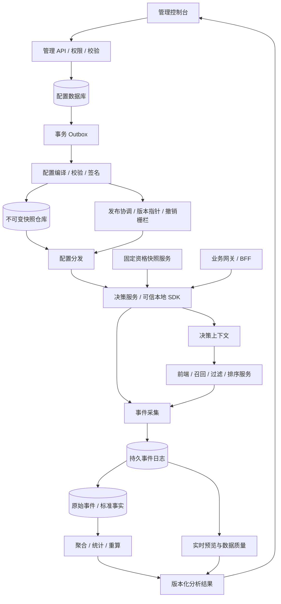

# EXP Lab 服务端技术方案

版本：设计 v1.1 · 2026-09-22

依据：当前 v23 交互原型、已确认的产品规则、Google 递归层域模型  
交付性质：面向研发评审和实施的设计基线；本文不代表后台、SDK、数据库或指标链路已经上线。

本平台面向单一企业部署，资源结构为“平台 → 项目 → 环境”，不设计租户实体或租户维度。用户身份在部署内统一管理，通过项目、环境及应用授权控制访问。

本方案将平台分成控制管理、配置编译与分发、在线决策、事件采集、指标分析五个部分。控制管理先采用模块化单体，在线决策与数据链路独立部署；实验查询不访问管理数据库，服务间沿用同一次决策上下文。

## 阅读入口

| 文档 | 覆盖范围 |
| --- | --- |
| 本文 | 架构、统一术语、层域治理、发布一致性、权限、容量与实施顺序 |
| [01 数据库设计](./01-数据库设计.md) | 表结构、主外键、索引、不可变版本、预留事务和并发约束 |
| [02 接口协议](./02-接口协议.md) | 管理后台、客户端决策、跨服务上下文、配置下载、事件上报及结果查询 |
| [03 SDK 与分流协议](./03-SDK与分流协议.md) | SDK 接入、固定资格、递归决策、哈希协议、微服务联动与降级 |
| [04 指标生产与分析](./04-指标生产与分析.md) | 埋点、数据分层、归因、指标聚合、统计检验、数据质量和重算 |
| [交付校验记录](./交付校验记录.md) | 文档、JSON 示例及分桶向量的实际验证范围 |

旧版[平台技术方案](../平台文档/02-技术方案.md)说明原型实现与生产方向。本套补充可实施的服务端契约与指标设计；服务端设计与历史概要不一致时以本套为准。原型的实际使用方法仍以[使用手册](../平台文档/03-平台使用手册.md)为准。核心 SQL 为设计片段，接口为待实现协议，不是现成迁移或已运行服务。

## 1. 已确定的设计边界

1. **应用管理是参数入口。** 参数属于一个应用／服务，Key 在项目内唯一；标签只属于当前应用。实验不再选择前端、后端或策略类型，涉及服务从参数归属推导。
2. **域切流量、层分参数。** 域 → 层 → 实验或子域递归，同域一个参数只归属一个层，子域不能超出父层参数范围。一个层可以承载多个应用的参数。
3. **一个层有 10,000 个固定桶。** 平台按申请比例组合多个空闲桶段，不要求连续，不搬动已有桶。受众条件只筛选资格，不替未命中的用户换桶补量。
4. **创建子域只生成一个初始参数层。** 该层承接全部继承参数，之后在域内按业务需要拆分。非重叠域保持完整参数层和单条实验路径。
5. **注册与归层分离。** 注册参数不要求先选层；在目标环境一次完成全部受影响域的归层后激活，消除循环依赖。
6. **实验支持 2–20 个组。** 唯一对照组、稳定分组 ID、整数分配权重，同一实验各组的顶层参数 Key 集合一致。参数组合约束保持下线；类型、JSON Schema、作用域和服务可执行性校验保留。
7. **画像目录独立。** 不要求画像属性填写来源应用。受众使用不可变条件版本，创建时检查自相矛盾和交集关系，提交占桶时必须再次检查。
8. **运行契约冻结。** 参数值、分组权重、资格规则和分析计划改变时创建新 run；不在正在统计的 run 内悄悄替换含义。
9. **配置查询不等于曝光。** 分配、处理前资格触发、实际执行和业务结果分别记录；指标口径在运行前冻结。

递归层域来自 [Tang 等，Overlapping Experiment Infrastructure（KDD 2010）](https://research.google/pubs/overlapping-experiment-infrastructure-more-better-faster-experimentation/)。10,000 桶、根域治理、固定资格复用桶、2–20 分组和本文 API 是本平台的工程选择，并非论文规定。

## 2. 参考技术栈与部署

当前没有真实业务 QPS、数据量、已有云设施及团队语言偏好。以下用于说明实施路径，技术栈可以替换，但事务与运行协议不能因语言变化而改变。

| 模块 | 参考实现 | 选择理由与边界 |
| --- | --- | --- |
| 控制后台／编译器 | Java 21，组织标准 Web 框架 | 统一校验、审批、关系事务；先单体按模块分包 |
| 配置事务库 | PostgreSQL 16+ | 外键、唯一约束、JSONB、行锁；高频曝光不写入该库 |
| 配置仓库 | 对象存储 + 私网分发缓存 | 保存不可变签名产物；下载与发布指针分离 |
| 决策服务 | 与首个服务端 SDK 共用决策内核 | 横向扩容；本地内存快照，避免维护两套分桶逻辑 |
| 资格快照／决策上下文 | 持久 KV／现有画像基础设施 | 强一致首次写入；Redis 可缓存，不能只靠会淘汰的缓存保证资格固定 |
| 事件缓冲 | Kafka 或既有持久日志平台 | 可重放、削峰；采集 ACK 以写入持久日志为准 |
| 实时预览 | Flink 或已有流处理引擎 | 事件时间聚合、质量监测；与离线正式结果区分 |
| 事实与重算 | 对象存储 + Iceberg／现有湖仓 + SQL 引擎 | 保留原始事件及可重复分析输入 |
| 结果服务 | OLAP 仓库 + 可选缓存 | 按分析批次查询，不对控制数据库扫曝光明细 |

这里不要求同时新建整套大数据设施。若已有数仓，第一期可采用持久事件采集 + 小时／日批分析；分钟级流处理作为后续扩展。发布前确定依赖的具体版本与支持周期，文中的产品名称不代表选择了其最新版本。



控制、决策、事件采集分别有资源池与扩缩容策略。管理发布拥塞不能拖慢用户请求；分析重算不能抢占在线决策资源。每个环境有独立拓扑、预留账本、发布指针、凭证及事件空间。

## 3. 统一对象、身份与版本

| 概念 | 语义 | 可否在运行中原地改变 |
| --- | --- | --- |
| `project_id / environment_id` | 业务实验空间、开发／测试／生产环境 | 不可由请求正文切换授权范围 |
| `service_id / parameter_id` | 应用与参数稳定身份；目录为项目级 | 参数所属服务变更需专门迁移，不提供普通 PATCH |
| `parameter_version` | 类型、Schema、默认值、执行契约不可变版本 | 新版本；旧 run 保留旧值和版本 |
| `topology_revision` | 某环境已校验的完整层域结构版本 | 新版本；激活及拆层事务校验全部引用 |
| `audience_version_id` | 固定条件树及属性定义版本 | 不可；同名新版本不会自动替换引用 |
| `eligibility_epoch` | 一批并行分配共同使用的固定资格快照命名空间 | 不可切换后继续声称与旧资格互斥 |
| `experiment_id` | 用户可识别的实验业务身份 | 名称、描述、负责人可独立维护 |
| `experiment_revision` | 经过校验、可提交审核的不可变实验配置，单调整数 | 只能新增 |
| `run_id` | 一次冻结受众、分组、参数、指标与分析计划的运行 | 改处理含义即新 run，不混算 |
| `variant_id` | run 内分组身份，唯一一个 `control` | 名称不是身份；排序不能改变桶映射 |
| `allocation_revision / allocation_epoch` | 桶集合变更版本／随机化种子世代 | 增桶可新 revision，epoch 不随发布变化 |
| `config_revision` | 已编译配置包的不可变 ID，字符串 | 不进入 hash；与审批资源 revision 区分 |
| `decision_id` | 一次请求决策的可追踪身份，含多个 assignment | 同次请求重试沿用原决策 |
| `analysis_run_id` | 一次特定输入、水位、代码版本的分析任务 | 重算产生新 ID，旧结论不覆盖 |

“应用参数项目级”和“层域实验环境级”是生产新增的明确边界。参数可在生产待激活、在测试已激活；不能用一个全局 pending 字段代替环境状态。项目级标签变更只影响管理检索，不自动改变已保存实验的参数集合。

一个 `experiment_id` 同时最多一个未结束 run。复制实验生成新的实验及分组 ID；继续原业务问题可以结束旧 run 后创建新 run，但报表分别分析。切换前的残留影响、用户学习和推荐模型训练效应不因换 ID 消失，需要预设洗脱期或独立 cohort。

## 4. 层域、参数与资源治理

### 4.1 可实现的约束

```text
根域参数范围 = 当前环境全部激活参数
子域参数范围 = 所属父层的完整参数范围
同域所有层参数集合的并集 = 域继承范围
同域任意两个普通层的参数集合交集 = 空
实验参数集合 ⊆ 所属普通参数层参数集合
同一层、同一固定资格用户、同一个桶，只能匹配一个直接实验或子域
```

根域只允许一个路由层，路由层只承载子域。普通层内直接实验与子域共享同一预留账本。不同层独立分桶，不能把各层使用率相加后称为域流量占用。域路径比例乘积只表示名义份额；真实受众规模、流量频次与样本量须用观测数据估计。

空层可以保存，但不能开实验或建子域。新参数完成受影响分区的归属后才激活。拆分参数层要求参数未被未结束实验使用，且没有子域继承依赖；不允许把运行中的参数直接“挪过去”。拓扑图必须无环，域深度上限 16，资源修改须重检所有后代继承关系。

### 4.2 受众条件与冲突

平台维护两个不同结论：条件是否可能重叠，以及该候选在当前层是否有足够桶。普通受众重叠是合法现象，不在受众目录中一概禁止。

桶复用必须同时满足：相同分流单元、相同固定资格 epoch、属性类型与语义版本相同、包含全部祖先域条件、能够证明两份有效条件互斥。缺失字段、非法值均不视为满足。OR 需检查全部分支组合；超出证明复杂度预算或依赖动态上下文时结果为 `unknown`，占桶按可能冲突处理。证明结果记录输入摘要与算法版本，提交时不能使用过期的“绿色检查”。

例如 iOS 与 Android 固定资格可以共享桶号；若客户端每次传入当前 OS，用户跨设备时可能先后进入两个本应隔离的实验，所以不能拿这类动态属性为桶复用提供证明。资格快照固定的是平台定义的业务含义，不是把随时变化的请求参数换个名字。

### 4.3 避免“所有组合都新建根层”

| 场景 | 处理方式 |
| --- | --- |
| 某稳定业务能力频繁独立迭代 | 建长期参数层，可跨应用，指定业务 owner |
| 相同参数范围内的新实验 | 复用现有层，分配可用桶 |
| 偶发需要多个兄弟层参数联合实验 | 使用涵盖这些参数的共同祖先下的隔离域／联合实验池 |
| 联合实验池超出参数范围 | 返回缺失参数与合法祖先，不能自动把其他层参数拉入 |
| 反复出现同类跨层组合 | 评审稳定参数边界；待相关实验结束后版本化重划 |
| 临时域到期 | 提醒 owner 和管理员；到期不自动停实验、删层或收桶 |

治理策略包括业务空间负责人、创建层／域权限、层数和嵌套深度预算、长期未使用资源提醒。它们是新服务端能力，不能宣称原型 v22 的负责人和日期字段已实现上述权限控制。

### 4.4 推荐系统示例

```text
根域 → 路由层 → 业务重叠域
  ├ 推荐参数父层
  │   ├ 常规优化子域（示例 90%）
  │   │   ├ 候选层：召回 + 业务过滤参数
  │   │   ├ 评分层：粗排 + 精排参数
  │   │   └ 编排层：重排、多样性参数
  │   └ 联合隔离子域（示例 10%）
  │       └ 初始完整参数层：召回 + 过滤 + 粗排 + 精排 + 重排
  └ 页面表现参数层
```

比例仅为说明。召回层参数可包括召回服务的 `home.recall.plan` 和过滤服务的 `home.filter.policy`；顶层 JSON Key 是归层和覆盖的原子单位，内部路径不能分给不同层。一个模型／索引版本必须与特征 Schema 和调用服务兼容。涉及共享缓存、全局限额、训练数据反馈时需另评估干扰，参数不重叠不代表业务效果独立。

## 5. 控制后台的事务与状态

### 5.1 主要模块边界

| 模块 | 写入责任 | 不承担的责任 |
| --- | --- | --- |
| Application Catalog | 服务、标签、参数定义版本、接入配置 | 不按服务边界自动建层 |
| Topology | 域、层、继承范围、归属、管理信息 | 不覆盖旧运行参数值 |
| Audience | 属性语义、受众版本、证明服务 | 不把画像目录当真实画像仓库 |
| Experiment | 草稿、正式版本、run、分组与固定配置 | 不将原始草稿编译为可运行配置 |
| Allocation | 桶预留、扩量、冲突账本、回收栅栏 | 不让前端预览决定最终可用性 |
| Review & Release | 内容审批、编译、激活、撤销、实例确认 | 不替业务服务部署模型或补偿交易 |
| Metric Catalog & Analysis | 指标版本、计划、分析任务、质量状态 | 不在管理请求中同步扫事实明细 |

### 5.2 生命周期

草稿是可变编辑对象，不占桶，可保存错误 JSON 原文。提交事务完成严格解析、参数检查、资格证明、桶预留和正式版本写入后进入 `review`。退回审核将该 run 记为 `completed`、原因为 `review_rejected`，基于原内容生成新的可编辑草稿；旧草稿提交映射保持不变。确认从未激活、没有运行 token 的审核预留可以直接释放，否则仍需 draining。启动必须绑定有效审批与精确配置摘要。

`review → running → paused → running → completed` 是业务状态主线。`desired_state` 表示已受理的目标，`state` 表示最近已激活发布对应的状态；启动、暂停、结束另通过 release 状态表达 `building / distributing / active / failed`。指针已激活不代表全部 SDK 已收敛，仍需观测版本及租约栅栏。审核拒绝、撤销及启动失败的具体响应见接口文档。

| 状态 | 新请求是否返回处理参数 | 桶预留 |
| --- | --- | --- |
| 草稿 | 否 | 无 |
| review | 否 | 有 |
| running 且发布有效 | 是 | 有 |
| paused | 否，使用安全默认值 | 保留原桶与分组契约 |
| completed | 否 | 进入 draining，达到回收条件后才可复用 |

暂停后的样本有暂停期影响，准入及执行使用预先指定的有效运行区间，并报告暂停历史；已经入组的单位按冻结观察窗继续收集结果，不能按结果好坏选择删去用户或某段数据。暂停不意味着可以换参数值后继续算作同一处理。

### 5.3 提交的原子边界

同一个数据库事务中校验资源版本、锁定环境拓扑及目标层账本、确认受众证明仍有效、重新分配桶、写正式 revision/run/分组快照/预留、标记来源草稿已提交、记录审计和 Outbox。任何一步失败整体回滚。同一草稿重复提交返回已有结果，不能创建两个实验。

预览 token 只绑定候选内容与检查时刻，不是锁桶凭证。跨层拓扑变更按统一顺序取锁；第一期优先使用环境级拓扑写锁，宁可降低低频管理写并发，也不使用复杂的无锁更新冒险。具体主键、事务顺序和索引见数据库文档。

## 6. 编译、发布和在线一致性

### 6.1 产物内容

编译器以数据库一致快照为输入，输出环境配置包：拓扑、各层 seed/epoch、桶预留映射、固定受众条件、参数定义和默认值版本、运行实验的组映射与完整参数快照、服务授权投影、分析与埋点契约引用。待审核或暂停占位保留在分配结构中，但不输出处理覆盖。

编辑端将来可以采用“基线 + 覆盖”减少重复输入，运行端仍只接收编译后的完整分组配置。对照组也冻结完整选定参数值，不能执行时去读当前最新默认值。未被任何实验覆盖的参数使用配置包中的基线默认值；涉及活动层的基线变更须做影响检查，改变研究条件时应暂停、结束或开启新 run。

编译检查含 JSON 重复 Key、类型／Schema、同组 Key 集一致、参数归属、层域闭环、受众引用、共享桶证明、组权重总和、服务执行契约、资源配额。执行契约检查如“模型文件可用”“服务支持该 Schema”是技术兼容性，不恢复已下线的产品参数组合约束。

不可变产物记录 `config_revision / input_digest / compiler_version / schema_version / hash_protocol / digest / created_at`；签名 manifest 将产物摘要、授权 scope 与本次 `not_before / expires_at` 绑定，运行租约独立于内容身份。内容未变时可以签发新 manifest 延长期限，但不能改变旧 manifest，也不能绕过撤销栅栏。配置摘要使用规范化 JSON；跨语言数值、重复 Key 和 Unicode 处理须一致。规范化依据 [RFC 8785 JCS](https://www.rfc-editor.org/rfc/rfc8785)，具体限制见 SDK 文档。

### 6.2 发布步骤

1. 审批绑定不可变实验 revision、影响拓扑 revision、完整差异摘要及申请人；内容变化使审批失效。
2. 编译器通过 Outbox 幂等领取任务，产物写入对象存储并验证可读；不能先切指针后上传。
3. 服务接入验证检查 SDK 协议版本、Schema／模型支持与实例 readiness。未就绪时阻止发布；运行态未知不能自动标记为已连接。
4. 向指定环境的发布协调器申请激活，CAS 更新活动指针并写发布审计。依赖拓扑已变化则拒绝旧产物。
5. SDK 收到通知后按 ETag 拉取、验签、校验完整包，在内存一次切换；请求开始时固定快照引用，请求内不混用新旧版本。
6. 跟踪实例确认率、旧版本请求占比与错误。管理页面同时展示“期望发布状态”和“观测到的运行版本”。

数据库提交、对象存储写入和 SDK 加载不是一个分布式事务；采用不可变产物 + Outbox + 可重试步骤 + CAS 指针恢复。消息重复可安全重放，编译失败不会污染当前活动版本。

### 6.3 结束与桶回收

`desired_state=completed` 表示停止意图，`state=completed` 表示停止发布已激活；二者都不能单独证明断网实例已停止签发旧决策。生产预留增加 `draining`，进入回收前要满足：停止签发旧 run、旧配置租约／有效期全部耗尽或受控实例已确认、旧决策上下文执行有效期耗尽、最长在途执行窗口与时钟容差结束。

```text
reclaim_after >= last_possible_old_decision_issue_at
                 + max_execution_token_ttl
                 + max_inflight_duration
                 + clock_skew_allowance
```

`last_possible_old_decision_issue_at` 取可验证的旧配置最晚失效时间或租约撤销界限，不能只取控制台点结束的时间。未知、不受控客户端若能无限离线执行，就无法保证及时回收；因此公开客户端不持有完整离线分桶规则，核心实验由受控网关决策。

紧急停止使用单独、单调递增的撤销版本和短期执行租约。SDK 每次执行检查本地缓存的撤销栅栏；失去更新且租约过期时停止实验处理。配置可以较长时间缓存，危险处理的执行权限不能无限续命。具体最大停用时延由租约上限、网络及请求执行窗口共同决定，不承诺“点击即全端瞬时停止”。

### 6.4 回滚和扩量

回滚创建新的发布记录，可复用旧配置内容，但必须用当前撤销集与桶账本重新校验；禁止将已经回收的旧桶重新激活。回滚不回滚业务事件，也不删除已经受到处理的样本。

仅增加同一 run 的准入流量时，保留旧桶并附加合法空闲桶，分组 hash 和权重映射不变。记录扩量时间、桶集合版本和预设扩量阶段，分析保留阶段维度。缩量与反复进出会影响暴露历史，第一期不开放任意运行中缩量；紧急止损走暂停或结束。任何权重调整、参数处理变化和随机化单元变化创建新 run。

## 7. 权限、安全与数据责任

| 身份 | 典型权限 |
| --- | --- |
| 项目管理员 | 应用接入授权、环境权限、根路由及业务域治理 |
| 应用 owner | 本应用参数、标签和服务执行契约；不能随意移动其他应用参数 |
| 域／层 owner | 资源范围、拆层、流量预算与联合实验池管理 |
| 实验编辑者 | 编辑授权层内的草稿、提交审核 |
| 审核／发布者 | 审阅精确配置差异并在授权环境发布 |
| 结果读取者 | 读取授权实验的聚合结果；画像明细需单独授权 |
| 机器身份 | 仅指定 project/env/service 的配置、决策或事件权限 |

生产环境可配置创建者与审批者分离。跨应用选参由服务授权策略决定，服务负责人可以预授某个业务域的参数使用权；不必每次实验逐人手工审批，但所有授权可审计。

所有查询、缓存 Key、对象路径、事件路由、异步任务携带并核验项目／环境。鉴权由可信会话或凭据确定操作者及授权范围，正文中的 ID 只是待验证引用。数据库使用项目／环境复合外键与应用层权限检查；日志和错误不暴露未获授权的项目资源是否存在。

配置下载、令牌和管理操作使用 TLS；生产机器身份采用短期凭据与必要的 mTLS。签名保证完整性、不保证保密性。秘密凭证不作为实验参数值下发；配置中使用服务可解析的秘密引用，公开客户端只能拿允许公开的最终值。

随机化 ID 经项目级身份服务转为稳定假名 `unit_key`；事件使用同一假名，不上传无关完整画像。假名化不等于匿名化。密钥轮换、用户删除与数据保留策略需保持可审计关系，不能在 run 中更换假名规则导致用户重新分组。审计记录操作人、作用域、前后摘要、审批／发布／请求 ID，敏感 payload 不直接写应用日志。

## 8. 故障、容量与可观测性

### 8.1 降级原则

| 故障 | 在线行为 | 恢复与观测 |
| --- | --- | --- |
| 控制 API／数据库不可用 | 已有效的 SDK 配置继续服务，禁止新变更 | 修复后重放 Outbox |
| 新产物损坏／验签失败 | 保留未过期的旧配置 | 告警 revision、digest、失败原因 |
| 无可信资格快照 | 不进入依赖该资格的分支，不换桶 | 返回明确原因；测量缺失率 |
| 快照或执行租约过期 | 使用约定安全默认，不执行实验处理 | 记录 fallback，不伪称对照组曝光 |
| 跨服务上下文缺失／失效 | 按契约回退或拒绝该业务功能，不私自重新分组 | 记录分配与实际执行差异 |
| 采集暂时不可用 | SDK 有界缓冲和异步重试，业务请求不无限等待 | 队列溢出计数、丢失率、补发 |
| 分析数据异常／迟到 | 结果标为暂定或无效，不发布确定收益 | 回填后产生新 analysis_run |

控制库主从切换、对象存储跨区复制、事件日志重放、数仓恢复分别演练。RPO/RTO 在业务定级后确定；未验证备份恢复前不宣称具有灾备能力。多地域首期由单写控制面发布，决策副本本地读取，避免两个控制主节点同时分配同一环境桶。

### 8.2 压测维度与候选目标

候选目标用于验收预算讨论：热缓存本地纯决策 P99 ≤ 1 ms，同地域远程决策服务端 P99 ≤ 20 ms，正常发布 60 秒内覆盖受控健康实例，分钟预览延迟 ≤ 5 分钟。以上不包含远端取画像、模型加载、客户端公网网络及大 JSON 复制成本，也不是当前测量结果。快照大小、深度、并行层数和组内 payload 大小时必须分别压测。

容量按实际公式估算：

```text
决策计算负载 = 请求 QPS × 平均访问层数 × 每层条件计算成本
原始事件字节/日 = 请求 QPS × 每请求事件数 × 平均事件字节 × 86400
资格存储量 = 活跃 unit 数 × 并行资格 epoch 数 × 快照字节
快照内存 = 活跃快照展开大小 × 同时保留版本数 + 索引 + 请求引用
事件物理存储 = 原始事件量 × 保留期 × 压缩系数 × 副本数 + 重算中间结果
```

例如 10,000 请求/秒、平均每请求 2 个事件、每事件 600 字节，原始事件约 **1.04 TB/日**；这是容量算例，不是当前平台业务规模。对每次参数读取都上报曝光会显著放大数据量，SDK 应按业务触发去重。没有采用概率抽样的统计设计前，不得为节省带宽任意抽样分配或主指标事件。

### 8.3 监控与告警

- 控制：版本冲突、事务锁等待、分配冲突、越权、审核积压、Outbox 积压。
- 发布：编译失败、版本滞后、验签失败、租约过期、目标与观测运行状态差异。
- 决策：延迟、默认值返回率、资格缺失率、上下文失效、参数类型不符、同层多重命中。
- 执行：期望模型与实际模型不一致、各组 fallback 比例、关键服务未执行比例。
- 数据：事件接收／落仓延迟、重复率、迟到率、归因缺失、样本比例失衡（SRM）、分组事件丢失差异。
- 分析：输入水位、成熟样本数、无效结论比例、重算状态；质量告警与业务护栏告警分开。

## 9. 实施阶段和验收门槛

| 阶段 | 可交付能力 | 进入下一阶段的门槛 |
| --- | --- | --- |
| P0 契约冻结 | 数据模型、权限矩阵、hash 向量、事件 Schema、分析口径 | 核心边界无歧义，跨语言样例一致 |
| P1 管理闭环 | 应用参数、拓扑、受众、服务端草稿、多分组、预留、审核 | 并发提交不双占，版本冲突不丢稿，跨环境不能串数据 |
| P2 单服务决策 | 编译发布、Java SDK／远程查询、固定资格、配置回滚 | A/A 分桶与数据链路通过，暂停／结束／回收演练通过 |
| P3 指标闭环 | 可信采集、事实表、冻结指标与计划、批分析、结果 API | 零事件分母、重复、迟到、SRM、多组校正和重算正确 |
| P4 多服务联动 | BFF authority、上下文传递、服务投影、实际执行上报 | 多服务同组、缓存隔离、降级与模型版本不一致可追踪 |
| P5 规模化 | 实时预览、更多语言 SDK、资源配额、自动诊断 | 真实规模压测、故障演练、成本和数据质量达标 |

必须覆盖的验收样例：100 个并发请求争抢最后 10% 流量；相同幂等键重复提交与不同正文复用；互斥人群共享桶后固定资格不可变；参数激活同时发生拆层；暂停重启不换组；发布中途失败不产生半包；已获知撤销或执行授权到期后拒绝旧 token，并实测最长停止时限；小数权重整数化；中文与带分隔符 ID 的跨语言 hash；多服务部分回退仍进入分配口径；无业务事件用户保留分母；迟到重算不覆盖旧报告。

## 10. 开工前需由团队定值的项目

本设计不以这些未定项阻塞协议讨论，但生产实现前必须填写：身份来源与 user/device 单元策略、资格 epoch 的业务期限、首次画像的持久化系统、SDK 首发语言、服务 readiness 检查方法、最大快照和参数大小、配置／执行 token 有效期、紧急停止时限、事件保留期和隐私要求、指标归因窗口、基础设施与成本预算、生产 RBAC 审核职责。

第一期默认以 `user_id` 为随机化单位、单项目内实验、Java 服务端 SDK、公开客户端走 BFF、固定周期分析为基线；跨设备未登录身份、跨项目联合随机化、序贯检验及推荐模型训练干扰治理作为独立扩展评审。
