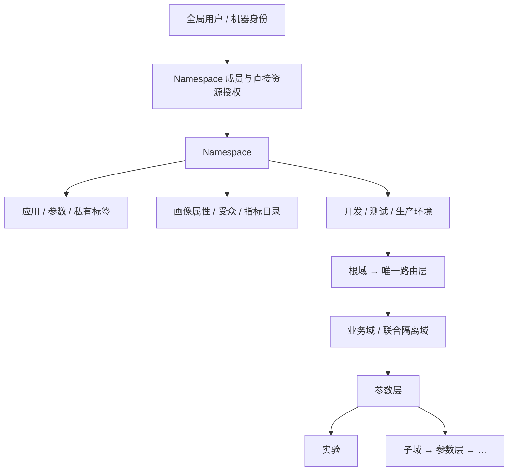
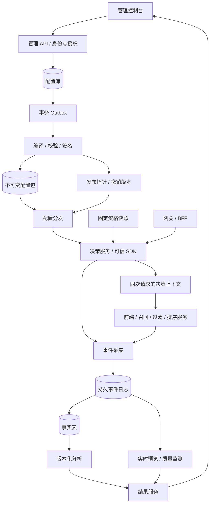

# 服务端技术方案

设计 v1.3 · 2026-09-23 · 对应原型 v23

本文是生产实施方案。当前可运行的是浏览器原型；后台、Namespace、权限、生产 SDK 和指标链路尚未实现。

一期 PostgreSQL 控制库限定为 **30 张表**。保留业务身份、核心关系和流量账本；将一起冻结的配置合并为快照，将审计、Outbox、幂等统一存储。详细清单与旧模型映射见[数据库设计](./01-数据库设计.md)。

## 1. 阅读顺序

| 要解决的问题 | 文档 |
| --- | --- |
| 看清整体结构、发布和故障处理 | 本文 |
| 理解 Namespace、成员和细粒度授权 | [05 Namespace 与权限](./05-Namespace与权限设计.md) |
| 建表、外键、索引和事务 | [01 数据库设计](./01-数据库设计.md) |
| 对接管理后台、决策、配置和事件 API | [02 接口协议](./02-接口协议.md) |
| 实现 SDK、分桶和跨服务上下文 | [03 SDK 与分流](./03-SDK与分流协议.md) |
| 生产指标、判断实验效果 | [04 指标生产与分析](./04-指标生产与分析.md) |
| 查看本次实际校验范围 | [交付校验记录](./交付校验记录.md) |

产品范围见[产品设计](../平台文档/01-产品设计.md)，原型操作见[使用手册](../平台文档/03-平台使用手册.md)。服务端契约以本目录为准；历史记录不覆盖现行规则。SQL 是设计片段，不是可直接执行的完整迁移。

## 2. 资源边界



| 边界 | 含义 |
| --- | --- |
| 企业 | 单企业部署，不设租户表或租户字段 |
| Namespace | 完整实验作用域；承接旧文档中的“项目”，不再叠加第二个空间实体 |
| 目录 | 应用、参数、标签、画像属性、受众和指标定义属于 Namespace |
| 环境 | 参数激活、层域、实验、桶账本、基线、发布、凭证及结果分别管理 |
| 成员 | 同一账号可加入多个 Namespace；成员资格不自动授予所有资源权限 |
| 资源权限 | 角色动作集 + 资源范围 + 可选环境限制；详见权限规范 |
| 业务用户 | 同一用户可参加多个 Namespace 的实验；资源隔离不等于流量互斥或效果独立 |

资源引用不得跨 Namespace。需要联合控参和统一冲突检查的实验放在同一 Namespace，通过团队授权协作。独立业务流程可分别建立 Namespace；不能让多个 Namespace 竞争控制同一个运行参数。

一期直接给用户或机器身份授权；全局用户组与组绑定作为后续扩展。角色、成员和资源权限仍完整校验，先直接读取当前授权，不建设权限缓存。

示例：招聘、房产、本地生活的独立频道可各有 Namespace；首页召回、跨业务混排及联合实验放在“公共首页推荐”。Namespace 不必与部门一一对应。

协议字段统一为 `namespace_id`，管理路由为 `/api/admin/v1/namespaces/{namespace_id}`。旧 `project_id` 只改名称、保留 ID 值；hash v2 的字段顺序和编码不变，不因改名重新分组。`eligibility_epoch` 的画像快照存储名不是另一个业务 Namespace。

## 3. 必须保持的产品规则

| 对象 | 规则 |
| --- | --- |
| 应用参数 | 参数属于一个应用；Key 在 Namespace 内唯一；标签只属于当前应用 |
| 注册与归层 | 注册后在各环境为 pending；原子完成该环境全部受影响域的归层后 active |
| 域与层 | 域切流量，层分参数；域 → 层 → 实验或子域递归 |
| 初始子域 | 自动创建一个初始参数层，完整承接父层参数；之后再拆层 |
| 参数分区 | 同域各层不重复且完整覆盖域参数；实验只能使用所属层参数 |
| 流量 | 每层 10,000 个桶；组合空闲桶段，不要求连续，不搬动已有桶 |
| 受众 | 固定版本与祖先条件相交；普通重叠合法；未命中不换桶补量 |
| 分组 | 2–20 组、唯一对照组、稳定分组 ID；各组顶层参数 Key 集合相同 |
| 参数校验 | 保留类型、Schema、范围和执行兼容性；参数组合约束已下线 |
| 运行 | 参数值、分组权重、资格和分析计划冻结；改变处理含义须新 run |
| 事件 | 查询配置、分配、资格触发、执行、曝光和业务结果分别记录 |

递归层域依据 [Google：Overlapping Experiment Infrastructure](https://research.google.com/pubs/archive/36500.pdf)。10,000 桶、根域治理、固定资格桶复用、2–20 分组及本文 API 是本平台的工程选择。

### 层域不变量

```text
根域参数 = 当前环境全部 active 参数
子域参数 = 父层完整参数集合
同域所有层参数的并集 = 域参数
同域任意两层的参数交集 = 空
实验参数 ⊆ 所属参数层
同层、同一固定资格用户、同一个桶 → 至多一个直接实验或子域
```

- 每环境一个根域；根域只有一个路由层，路由层只承载子域。
- 普通层内，直接实验和子域共用预留账本；不同层独立分桶。
- 非重叠域保持一个完整参数层及单条实验路径，不排除祖先域的其他并行层。
- 空层可保存，不能开实验或建子域。拆层不能移动未结束实验、子域继承或未排空历史依赖中的参数。
- 拓扑无环，域深度最多 16；变更重检全部后代。权限过滤只影响展示，不能裁剪真实继承范围。
- 各层流量比例不能相加为域占用；路径比例乘积仅是名义份额，真实样本量另行估算。

### 受众与桶复用

平台分别回答“条件是否相交”和“可用桶是否足够”。同桶复用必须同时满足：

1. 分流单元和固定资格 epoch 相同。
2. 属性类型、语义版本和全部祖先条件已纳入判断。
3. 完整条件可证明互斥；OR 的所有分支组合均通过。
4. 证明摘要、算法版本和拓扑依赖仍有效。

缺失或非法属性不算满足。超过证明预算或使用动态上下文时返回 `unknown`，按可能冲突处理。固定 iOS/Android 资格可用于证明；每请求变化的 OS 不可用于证明。创建时预检，提交占桶时重检。

### 参数层治理

| 需求 | 做法 |
| --- | --- |
| 稳定能力独立迭代 | 建长期参数层，可包含多个应用参数 |
| 相同参数范围的新实验 | 复用已有层 |
| 偶发跨层联合实验 | 在能继承全部所需参数的共同祖先下使用隔离域 |
| 找不到覆盖所需参数的范围 | 返回缺失参数和合法位置，不自动挪参数 |
| 同类联合实验反复出现 | 依赖结束后，评审并版本化调整参数分区 |
| 临时域到期 | 提醒负责人，不自动停实验或回收流量 |

例如推荐参数父层下可设“常规域”和“联合域”：前者拆召回、评分、重排层，后者保留完整参数层。页面表现层若位于其外，仍可并行。顶层 JSON Key 是归层原子单位，内部路径不能分给不同层。

## 4. 系统架构



控制后台先采用模块化单体；决策、采集、分析独立扩容。在线查询不访问管理数据库；下游服务沿用同一次决策。管理拥塞、分析重算不能占用在线决策资源。

| 模块 | 责任 | 参考实现 |
| --- | --- | --- |
| 控制后台 | 目录、授权、拓扑、草稿、审批和预留事务 | Java 21 + PostgreSQL 16+ |
| 编译与分发 | 不可变包、验签、版本指针、撤销 | 对象存储 + 私网分发 |
| 在线决策 | 共用分流内核、内存快照、服务参数投影 | Java SDK / 远程决策服务 |
| 资格与上下文 | 首次快照 CAS、持久保存、请求链一致 | 持久 KV；缓存不能作为唯一存储 |
| 事件采集 | 持久写入后 ACK、幂等重试和重放 | Kafka 或既有日志平台 |
| 指标生产 | 事实表、冻结口径、可重复分析 | 现有湖仓 / SQL 引擎 |
| 实时预览 | 延迟较低的质量与运行观测 | Flink 或既有流处理 |

技术栈是参考，不代表最新版本或已完成选型。第一期可复用既有数仓做小时／日批分析，再增加分钟级预览。

### 30 表与存储边界

| 控制库模块 | 表数 | 主要内容 |
| --- | ---: | --- |
| 身份与作用域 | 6 | 身份、Namespace、成员、环境、角色、绑定 |
| 应用参数 | 6 | 应用、环境接入、凭证、参数、参数版本、私有标签 |
| 画像与受众 | 3 | 属性当前定义、受众、冻结受众版本 |
| 层域 | 3 | 域、层、参数归层 |
| 实验 | 3 | 草稿、实验身份、冻结运行配置与生命周期 |
| 流量账本 | 2 | 预留、桶集合版本 |
| 审批发布 | 2 | 统一变更申请、发布与快照索引 |
| 指标分析 | 2 | 指标当前定义、分析任务及冻结结果 |
| 基础设施 | 3 | 审计、Outbox、幂等 |
| **合计** | **30** | 物理表；不包含视图和索引 |

分组、分析计划和审批决定是所属对象中的受约束结构。它们有稳定 ID 和版本，但不单独建表。运行快照冻结所用指标、属性和参数定义，历史执行不追随目录当前值。

配置包及按应用授权的投影文件存对象仓库；固定资格存持久 KV；高频事件、事实和聚合沿用数据链路。控制库保留业务配置及其冻结快照，对这些外部产物另存索引、摘要和水位，不接收每次分流或曝光写入。30 表上限不代表全链路只有 30 种数据集，也不要求为被合并的表另建服务。

## 5. 身份、版本与运行状态

| 标识 | 用途 | 变更规则 |
| --- | --- | --- |
| `namespace_id / environment_id` | 资源和执行范围 | 由可信授权校验，不能仅信任正文 |
| `service_id / parameter_id` | 应用和参数身份 | 不通过普通更新换归属 |
| `parameter_version / baseline_revision` | 参数契约 / 环境默认值 | 不可变版本，运行不追随最新目录值 |
| `topology_revision` | 层域完整图 | 每次合法变更生成新版本 |
| `audience_version_id / eligibility_epoch` | 条件 / 固定资格快照范围 | 旧引用不自动换版 |
| `experiment_id / experiment_revision` | 实验身份 / 配置版本 | 身份稳定，配置只增不改 |
| `run_id / variant_id` | 一次冻结运行 / 分组 | 同一实验最多一个未结束 run |
| `allocation_revision / allocation_epoch` | 桶集合版本 / 随机化世代 | 扩桶可改 revision，普通发布不改 epoch |
| `config_revision` | 编译产物 | 不进入 hash |
| `decision_id` | 一次业务请求的全部分配 | 重试沿用，跨服务传播 |
| `analysis_run_id` | 特定输入和代码的一次分析 | 重算新增记录，不覆盖旧报告 |
| `policy_revision` | Namespace 授权版本 | 授权变更递增；写事务重查当前权限，首期无权限缓存 |

复制实验生成新的实验和分组 ID，不复用旧桶。新 run 不会消除用户学习或训练反馈，必要时需洗脱期或独立 cohort。

| 状态 | 是否返回实验覆盖 | 桶占用 |
| --- | --- | --- |
| 草稿 | 否；可保存错误 JSON 原文 | 不占 |
| review | 否；等待审批和启动 | 预留 |
| running，发布有效 | 是 | 占用 |
| paused | 否；按默认值契约处理 | 保留 |
| completed | 否 | 排空后释放 |

业务主线为 `review → running → paused → running → completed`。`desired_state` 是目标，`state` 是最近已激活配置对应状态；发布任务另有 `building/distributing/active/failed`。指针激活不等于所有 SDK 已更新。

拒绝审核将 run 标为 `state=completed`、`completion_reason=review_rejected`，另建可编辑草稿；旧提交映射保留。只有确认从未激活、未签发运行 token 的预留可直接释放，其余进入 draining。

### 提交事务

1. 校验当前成员、资源权限、版本及依赖。
2. 按统一锁序检查当前授权，锁目标环境；一期环境内业务变更串行。
3. 严格解析配置，重检受众证明与可用桶。
4. 写含不可变 revision、分组和分析计划的 run，写预留与变更申请，标记草稿已提交。
5. 写审计与 Outbox，整体提交或回滚。

预览不锁桶。重复提交同一草稿返回已有结果。低频管理写优先采用环境级拓扑锁；详细锁序和幂等规则以数据库／接口文档为准。

## 6. 编译、发布、停止与回收

### 配置包

配置包包含完整拓扑、seed/epoch、桶映射、固定受众、版本化参数与基线、分组完整值、服务授权投影及事件／分析契约。待审核、暂停的预留保留占位，但不输出处理覆盖。

编辑器将来可用“基线 + 覆盖”；SDK 只接收编译后的完整分组值。对照组同样冻结值。未覆盖参数使用包内基线；基线变更若改变研究条件，应暂停、结束或新建 run。

编译校验严格 JSON、类型／Schema、分组 Key、归层、条件证明、权重、配额及服务兼容性。“模型可用、Schema 支持”等执行检查不恢复已下线的组合约束。

产物携带 revision、输入摘要、编译器／Schema／hash 版本、摘要与时间。签名 manifest 绑定内容、授权范围和有效期。签发前持久更新对应 release 的租约到期上界；停止续发与签发使用同一锁栅栏。manifest 不逐份建表，续签不能绕过撤销。摘要规范采用 [RFC 8785 JCS](https://www.rfc-editor.org/rfc/rfc8785)。

### 发布流程


- 内容或关键依赖变化，原审批失效。服务 readiness 未知不能当作已就绪。
- SDK 在请求开始固定快照，请求内不混用版本。
- DB、对象存储和 SDK 不是同一事务；用 Outbox、不可变产物、幂等步骤和 CAS 恢复。
- 监控同时展示期望状态和观测状态，编译失败不污染活动版本。

### 停止与桶回收

停止发布激活后，旧 SDK 和请求仍可能执行。回收前必须证明旧配置不能再签发决策，旧上下文有效期、在途执行窗口和时钟容差都已结束。

```text
reclaim_after >= last_possible_old_decision_issue_at
                 + max_execution_token_ttl
                 + max_inflight_duration
                 + clock_skew_allowance
```

最晚签发时间取旧配置可验证的失效／撤销界限，不取控制台点击时间。公开客户端不持有完整离线分流规则；核心决策由受控网关执行。

实现上取所有仍可能包含该运行的旧 release 的最大租约到期水位，再加固定的上下文 TTL、在途窗口和时钟容差。authority 只能在有效租约内签发上下文，透传不能续期；业务请求无需逐次写控制库。快照、基线与完整拓扑保存在不可变变更／发布产物中，回滚不能读取目录当前默认值来重建历史。

紧急停止使用单调撤销版本和短执行租约。失联且租约过期时停止实验处理，不承诺瞬时全网撤回。停用时限由租约、网络和执行窗口共同决定。

| 操作 | 约束 |
| --- | --- |
| 回滚 | 新建 release 和 config_revision，按当前撤销集和桶账本校验；可复用同授权范围的内容文件，不能复活已回收桶 |
| 扩量 | 附加空闲桶，保留旧桶、分组 hash 和权重；记录阶段与 allocation_revision |
| 缩量 | 首期不支持运行中任意缩量；紧急处理用暂停或结束 |
| 改参数／权重／随机化单元 | 创建新 run |
| 暂停后分析 | 已入组用户继续按冻结观察窗收集结果；不能删掉失败用户或不利时段 |

## 7. 权限与数据责任

详细授权模型见[05 Namespace 与权限](./05-Namespace与权限设计.md)。核心要求：

- 全局账号与业务分流 `user_id` 分开；成员资格、资源角色、环境限制分别校验。
- 参数管理不等于使用权，层管理不等于发布权；实验引用不传播权限。
- 复合操作须满足所有必要权限；后端完整检查依赖，列表按可见范围投影。
- 新建或撤销授权同步审计，写事务重查当前权限；撤销人的权限不自动停止已运行实验。
- SDK 凭证只授指定 Namespace、环境、服务及运行动作，不沿用控制台角色。

所有 API、缓存、对象路径、事件路由和异步任务携带并核验 Namespace／环境。数据库复合外键防止串用资源；错误不泄露无权对象。TLS、必要的 mTLS、短期机器凭据和签名用于通信与配置保护。签名不提供保密性；秘密值不作为实验参数下发。

业务 ID 经 Namespace 级身份服务转为稳定 `unit_key`，事件沿用同一假名。不能在 run 内换假名规则导致重新分组。假名化不等于匿名化，保留期、删除、密钥轮换和审计需单独落实；日志不写完整画像、密钥或敏感 payload。

## 8. 故障与容量

| 故障 | 行为 | 观测 |
| --- | --- | --- |
| 控制后台不可用 | 有效配置继续服务，停止新变更 | 修复后重放 Outbox |
| 新包损坏／验签失败 | 保留仍有效的旧包 | revision、digest、错误原因 |
| 资格快照缺失 | 不进入依赖该资格的分支，不补量 | 缺失率与 reason |
| 配置／执行租约过期 | 返回约定安全默认，不冒充对照组 | fallback 与实际执行 |
| 上下文缺失／失效 | 按契约回退或拒绝功能，不重新分组 | 分配与执行差异 |
| 采集不可用 | 有界缓冲、异步重试，不无限阻塞业务 | 丢失、重试、溢出 |
| 分析异常／迟到 | 结果标暂定或无效，回填后新建分析 | 数据水位、质量与重算 |

首期单写控制面、多地决策副本。分别演练控制库、对象存储、日志和数仓恢复；RPO/RTO 由业务定级，不以备份存在代替恢复验证。

候选验收预算：本地热缓存纯决策 P99 ≤ 1 ms；同地域远程决策服务端 P99 ≤ 20 ms；正常发布 60 秒内覆盖健康受控实例；分钟预览延迟 ≤ 5 分钟。均为待压测目标，不含远程画像、模型加载、公网及大 JSON 复制。

```text
决策负载 = 请求 QPS × 平均访问层数 × 单层计算成本
事件字节/日 = QPS × 每请求事件数 × 平均事件字节 × 86400
资格存储 = 活跃 unit 数 × 并行 epoch 数 × 快照字节
快照内存 = 展开大小 × 保留版本数 + 索引 + 请求引用
事件存储 = 原始事件量 × 保留期 × 压缩系数 × 副本数 + 重算中间结果
```

算例：10,000 QPS、2 事件/请求、600 字节/事件，原始事件约 1.04 TB/日。SDK 按业务触发去重；未设计统计抽样前，不任意丢弃分配或主指标事件。

监控分六类：管理事务与越权、发布版本与租约、决策延迟与缺失、实际执行与回退、事件质量与 SRM、分析水位与成熟度。质量告警和业务护栏分开。

## 9. 实施顺序与验收

| 阶段 | 交付 | 验收重点 |
| --- | --- | --- |
| P0 契约 | Namespace、权限、hash、事件和统计口径 | 跨文档一致，跨语言向量一致 |
| P1 管理 | 30 表内的直接成员授权、目录、拓扑、草稿、预留、统一审批 | 无越权、无双占、无丢稿；跨空间／环境不串数据 |
| P2 决策 | 编译、发布、SDK、固定资格、回滚 | A/A；暂停、结束与回收演练 |
| P3 指标 | 采集、事实表、批分析、结果 API | 零事件分母、重复、迟到、SRM、多组校正、重算 |
| P4 联动 | 权威决策、透传、服务投影、执行上报 | 同组、缓存隔离、降级和版本可追踪 |
| P5 规模化 | 实时预览、多语言 SDK、配额和诊断 | 压测、故障演练、成本与数据质量 |

必须覆盖：并发争抢最后流量、幂等键正文冲突、授权撤回与提交竞态、跨 Namespace／环境引用、直接绑定越权、参数激活并发拆层、固定资格桶复用、暂停恢复不换组、半包失败、撤销与最长停用时限、Unicode hash、多服务回退保留分配、无事件用户分母、迟到重算。

开工前确定：身份来源、资格 epoch 期限、持久画像设施、readiness 检查、快照大小、配置／执行有效期、事件保留期、归因窗口、基础设施预算和生产审批职责。

首期以稳定 `user_id`、单 Namespace 内实验、Java SDK、公开端走 BFF、固定周期分析为基线。跨 Namespace 联合随机化、匿名身份桥接、序贯检验和推荐训练干扰治理另行设计。

全局用户组、权限缓存、通用策略注册框架和逐实例配置 ACK 存储属于后续扩展；不能为这些能力预先突破一期 30 表清单。增加新表需说明独立查询或生命周期需求，并重新评审容量与复杂度。
