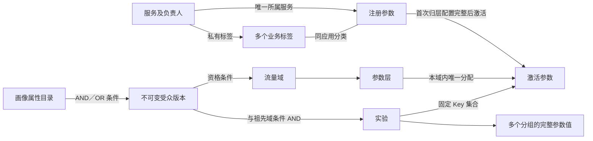

# 应用管理、参数与联动实验设计

版本 v20 · 2026-09-12。子域创建时自动生成一个承接全部继承参数的“初始参数层”，重叠域后续按业务拆层。层域配置与分流验证二级页签、完整默认域解释继续保留。层域参数按实际所属应用浏览；受众固定版本与祖先条件相交，仅可证明互斥时复用桶。参数在所属应用／服务内维护，标签保持应用私有，不提供全局参数页面。旧版本功能与验收记录保留，旧 A/B 双层创建流程已被取代。本文记录已授权设计与原型边界，不构成新的审批请求。 本轮统一每层 10,000 个固定桶，按比例自动组合空闲桶，支持 0.01% 粒度并兼容旧桶位。 本轮移除组合约束功能，新增 2–20 个分组（一个对照组）；大量参数编辑另附方案。

## 1. 用明确关系表达业务

**服务负责参数，层域负责作用范围，受众负责入组资格，标签负责分类，实验负责取值组合。** 创建实验时选择参数即可推导涉及服务，不再要求先判断是前端、后端还是算法实验。

| 关系 | 当前规则 | 不承担的作用 |
| --- | --- | --- |
| 服务 → 参数 | 每个新参数必须指定一个已登记服务；旧自定义参数可暂时待归属 | 不决定实验桶或域内层位置 |
| 域 → 层 → 激活参数 | 同一域内普通层唯一分配激活参数，子域继承父层范围；待归层参数不进入任何层，空层待配置 | 不替代参数登记和业务维护责任 |
| 应用 → 标签 ↔ 参数 | 标签由 serviceId 唯一归属应用；参数只能绑定本应用多个标签 | 不授予生产权限、不创建隔离域、不自动加入实验 |
| 实验 → 参数 → 版本值 | 保存明确的 `parameterKeys`，各分组对相同 Key 集合分别赋值 | 不动态订阅某标签未来增加的参数 |
| 画像属性 → 受众条件 | 属性 Key 固定类型与口径，受众按 AND／OR 组合这些属性 | 不作为实验参数下发、不代表已接入真实画像 |
| 受众版本 → 域／实验 | 共享不可变条件，最终资格与全部祖先域条件相交 | 不替代层参数边界、不移动 hash 桶、不等同实际曝光 |

“唯一所属服务”和“同一域内唯一归层”是两种约束。同一个 `ui.layout` 由用户界面服务维护，可以在互斥域或继承它的子域中有不同层归属。网关读取或传递此值也不获得该参数所有权。

Google 原模型依据仍是域切分流量、层划分参数、层可包含直接实验与子域。服务目录、标签、配置规则和接入协议是本平台的产品与工程设计。[Google 原论文 §4](https://research.google.com/pubs/archive/36500.pdf#page=4)

## 2. 应用管理与接入配置

一级“应用管理”以应用／服务为入口，不再提供“全部参数”页面。`#applications` 为应用目录；`#applications/services/<id>/<tab?>` 为应用详情及可刷新的五个页签；`#applications/services/<id>/parameters/<key?>` 为当前应用的参数目录或详情。

目录支持前端应用、后端服务、策略服务、网关 / BFF 四种类型。应用详情有概览、参数、接入配置、运行观测、关联实验五个页签。服务类型用于描述运行载体；实验不再选择端类型。

每个服务分别保存开发、测试、生产环境。`direct` 表示设计为本服务直接决策；`delegated` 表示设计为网关 / BFF 决策后传递上下文。委托只能指向已登记的其他 gateway 服务，并沿同环境解析，拒绝自委托、缺失目标和循环。保存一个环境不会改写其他环境。

应用目录中的示例服务为 `ui-web`、`ranking-service`、`checkout-service`、`pricing-service`。需要集中决策时，可另登记 gateway 类型服务。当前没有 SDK、真实 API、密钥签发或连接探测；三个环境全部显示待验证，运行观测无真实数据，接入代码只作伪代码示意。登记服务与保存接入方式均不构成上线证明。

## 3. 参数登记、归层与标签管理

参数从当前应用“参数”页签登记，服务固定该应用，只填写全局唯一 Key、名称、类型、默认值、负责人和本应用私有标签。保存后处于“待归层”，没有任何当前层归属，不能加入实验；包括星号层在内的分流范围保持原样。新标签立即保存，取消参数登记不撤销标签目录项。

归层是登记之后的独立动作：沿默认域的所有受影响分支递归分配，单层域自动、多层域选择一层，再为所选层的每个子域分配；全部完成后一次激活。参数可以进入既有空层，也可在建层时选中待归层参数，一次完成新层创建和首次激活。若目标在深层，必须同时满足祖先路径及其他受影响兄弟分支，不能局部加 Key 后放任星号动态继承。

合法重叠域可先创建空层，显示待配置。空层不承载任何实验（包括 A/A）或子域，不计入可执行并发；原有根域、非重叠域和非重叠祖先分支限制仍生效。移动激活参数继续受未结束实验、子域继承和来源层至少保留一个参数的保护；不允许 active 退回 pending 或清空、删除旧非空层绕过校验。

旧无待归层字段的数据保持已有激活状态；“待归层”与历史“待归属服务”是不同关系的状态。登记、首次归层、建层和认领均不改已有实验的参数值、Key 与桶位。

内置 13 个历史 Key 使用明确的示例服务映射。旧自定义 Key 不按前缀猜测，显示“待归属”，由用户在应用目录内的认领区补齐所属服务；认领不改已有实验值或层域关系。已指定服务的参数暂不支持直接迁移服务。Key 仍在工作空间全局唯一，未启用服务内同名参数或自动重命名。

标签必须有 serviceId，名称在应用内按去除首尾空格并转小写后唯一；不同应用可同名，但 ID 不同，不能将同名视作共享关系。查看、筛选、创建与单项／批量绑定均限定当前应用，参数不能绑定其他应用标签。应用参数页中的搜索、筛选、选择和批量标签操作必须限定当前服务，不能通过遗留勾选修改另一个服务的参数。标签变化只影响分类与搜索，不改变服务归属、层归属、随机 hash、实验 Key 集合。

旧共享标签按实际使用参数的所属应用拆分私有副本，保留名称、颜色和参数关联。未归属参数的旧标签引用及未引用标签保留隐藏归档，不能出现在应用的普通标签列表；认领后在目标应用复用同名标签或恢复私有副本。此迁移只处理精确旧目录格式，不自动修复现代跨应用引用。迁移失败保留原数据并阻止继续保存；实验参数与分桶保持不变。

旧全局参数列表路由兼容到应用目录。旧参数 Key 深链按服务绑定定位到规范参数详情；未归属或未知 Key 导向 `#applications/unassigned/<key>`，在目录内说明原因。认领区仅在存在历史未归属参数时出现，不能扩展为新全局参数维护页；无效 Key 不允许退回编辑另一个真实参数。

## 4. 从标签选参到固定实验配置

创建实验的流程为：基础信息 → 域层与流量 → 按服务／标签选择参数 → 多个分组的取值与权重 → 指标与草稿确认。现有界面仍为三步向导，上述配置集中在“流量与版本”步骤。

创建实验的 ParameterPicker 保留跨服务选参：标签筛选须先选择应用，候选标签只来自该应用，多标签之间采用任一匹配。切换应用会清除标签筛选，已勾选参数可以跨应用累计；再次按标签查找时须选择新应用的私有标签。此处只选择实验参数，不提供跨服务参数定义或标签维护。选择器显示所有匹配参数及不可加入原因；只有已激活、当前层范围内、已明确所属服务、尚未加入的参数可批量加入。越层参数不能因属于同一个标签而越过边界。

加入参数会将其登记默认值补入所有分组，保留已填写的值。保存时记录具体 Key 集合；后续标签增删不会改变已保存实验。涉及服务与负责人按当前参数服务绑定推导，实验不另外保存一份可独立编辑的服务列表。参数 Key、版本键集合、类型、桶段和分组元数据由核心分配校验复验。

若需要跨当前层组合参数，应先选择确实拥有全部参数的普通层，或使用合法重分区／隔离分支。例如 `exclusive → full` 可容纳 `ui.layout` 和 `ranking.model`；`ui-isolation → ui-full` 仅继承展示层范围，不能容纳排序参数。已有活跃实验与子域使用保护不会因标签或服务关系而绕过。

### 层域入口的应用参数浏览（v18，延续 v16）

域继承范围、层关联参数、新建层和新建子域按参数实际服务归属分组，支持搜索 Key、登记名称和应用名称。选定应用后只显示其私有标签，多标签任一匹配；切换应用清除标签条件，新建层保留跨应用已选 Key。历史待归属参数不能根据命名前缀推断服务，筛选无结果不扩大到应用全部参数。

应用是浏览与维护入口，不是层的独占绑定。新建层候选仍来自 `layerParameterOptions`，包含待归层参数及受未结束实验、子域继承和来源层非空保护的激活参数。新建子域只读展示父层 scope，按应用／标签筛选不改变完整继承范围；无需选择参数或填写 A/B 层名，保存时自动生成唯一普通“初始参数层”。编辑中不跳离表单；详情参数链接继续定位实际所属应用，已有参数的应用归属和实验固定 Key 保持。

单参数父层可建重叠域，空父层仍被阻止；非重叠祖先限制保留。创建后，合法重叠域可通过“新建层”按业务拆分初始层，初始层须保留参数且服从既有依赖保护。非重叠域仍为一个完整参数层。此前创建时强制 A/B 双层分区的流程已被 v18 取代，不改已有多层域。

## 5. 多分组与组合约束下线（v20）

新实验支持 2–20 个分组，恰有一个对照组；各组有稳定 ID、名称、角色、权重及完整参数 JSON。新增／复制不会改动其他组流量；显式均分将总权重精确分配为 10,000 个权重单位。声明 Key 集合、类型、应用归属和层范围仍统一校验。各分组流量以本实验流量为分母，不新增参数层或子域。

组合约束的创建、摘要、详情和运行校验均下线。历史字段保持原样，旧规则不再阻断审核、启动或模拟。旧执行绑定只作为历史消费信息兼容，不对新实验新增端选择要求。

大量普通参数和嵌套策略 JSON 的优化采用“固定基线＋每组覆盖＋完整快照”的后续方案；本轮只提供分组切换、复制及基础 JSON 编辑。详见[多分组与批量参数配置方案](./多分组与批量参数配置方案.md)。

## 6. 画像属性、受众与条件桶复用

画像属性描述用户入组前的特征，实验参数控制应用执行行为；两类目录独立。登记属性需明确 Key、类型、取值及口径，无需来源应用，不能把它自动加入参数层或实验参数集合。属性目录的登记和引用追踪不等于真实 SDK 已上报数据，属性定义变化也不能让旧规则静默改变含义。

受众管理提供集中条件编辑，域和实验旁的快捷入口复用同一编辑器；保存后选择明确版本，关闭快捷弹窗保留原配置草稿。条件最多 3 层分组、30 条规则，可以按 AND／OR 组合，目录、详情和继承摘要显示完整逻辑。一个不可变受众版本可被多个域或实验引用，最终资格为全部祖先域条件 AND 当前受众；OR 只作用于其所在组，不扩大祖先资格，也不会改变实验固定 Key。

创建受众时自动检查自身条件、继承交集和已登记受众关系；内联创建还检查当前层与流量，所需桶数超过可用总量则阻止用于当前配置的保存。

受众的实验引用入口进入 `#experiments?audience=<id>`，显示直接引用或沿祖先域继承该固定版本的实验，重复关系不重复计数。画像属性详情按实际使用该属性的受众版本提供实验列表入口；同一实验可以属于多个版本的引用集合。实验列表每次筛选一个固定版本，不能按同名、同系列或相似条件混入其他版本，更不能把配置引用当作真实用户命中。

受众筛选与搜索、状态、涉及服务及负责人取交集。外部受众入口清除残留条件，列表内主动切换保留其他显式筛选并重置页码；状态数量以受众引用集合为基数。清除、空态、列表刷新及详情返回同步受众 URL，未知受众不回退全量。v14 聚焦实验条件的详情链接仅保留兼容，新实验引用入口不再生成；域仍进入既有域条件页面，本轮不增加域列表。这些查询不更改参数集合、资格条件或分桶。

受众目录允许人群重叠。只有同父层实验／子域的桶区间相交，且有效资格无法证明互斥，才形成分配冲突。OR 的互斥证明要求双方所有可满足分支组合均不相交；部分分支互斥或当前样本没有交集都不能放行。未知条件或展开超过 64 个组合时保守阻止桶复用；合法树超出证明上限仍可按完整逻辑求值。全部相交区间逐对比较，占用按并集统计，运行时仍不换桶补量。

规则版本不可原地改写，旧平铺规则保持 AND 含义，历史引用不随新版本改变。不同受众系列名称不能相同，同系列可沿用名称创建新版本。已有域不能改受众或父层，已有层不能改挂域。属性缺失按三值逻辑判断，不能当成空人群证明互斥。实时平台、会员或地区变化也不能直接证明 user_id 互斥，所有属性须使用同用户固定的入组前快照。

编辑器内手填画像是临时资格预览，不记录用户或分流结果。层域模拟器中的自定义属性与内置字段同样纳入本地画像快照；首次成功保存后，同一 ID 的画像只读，缺字段及后来新增的字段也不能补填。刷新恢复快照，坏数据或保存失败停止模拟。纯规则模拟函数不提供真实 SDK 的粘性入组服务。待归层、空层、参数转移、应用私有标签及旧实验分桶保护继续有效。

分流模拟器位于“层域管理 → 分流验证”，与“层域配置”分开。域／层按钮携带关注节点，但模拟始终从默认域开始，所有并行路径与实验结果继续显示。关注到达只表示访问域或层，不表示实验命中或曝光；未到达时沿父路径解释首个阻断，引用桶外、根域准入、同桶判定或空层跳过的真实记录，不重新计算一次局部分流。

当前输入与结果在这两个页签及结果返回配置的流程中保留，仅依赖层域页面常驻内存；不承诺离开一级导航或刷新后恢复结果。固定画像仍沿用旧 localStorage，刷新后再次输入同一 user_id 可读取只读资格快照，新结果须手动运行。输入或配置变化时显示上次验证，解释使用模拟时的拓扑，重新执行后才判断当前配置。此布局不改变参数 Key、层域范围、受众条件或分桶。

未接入真实画像查询时不展示虚构受众规模。人工覆盖估算采用基数、名义份额和桶内完整条件合格率，明确假设；它不能代替分配、曝光与生效观测。服务发布仍需真实身份、资格快照、曝光和执行版本契约。

## 7. 历史兼容与默认值边界

旧 `Experiment.type` 字段保留以读取历史结构，界面不再显示为主要实验类型，新实验也无需选择它。旧 `coordination` 中的执行绑定和实现标识保留历史展示及基础校验，原 2–8 个绑定／至少两类端的要求只作用于这些旧契约。新实验不会要求填写系统端矩阵，组合规则统一下线。

参数登记默认值是实验编写时的初值。当前没有固定默认值版本、把默认值编译并合入不可变运行快照，或将所有未覆盖参数的默认值并入模拟结果。模拟器仅合并命中实验的显式参数值；当前“配置通过”不能等同于生产各服务采用同一个完整默认参数集。

本地目录、参数及层域写入同一拓扑存储；实验另外保存。没有真实后端事务、RBAC、服务端审批、审计身份认证或多标签页并发控制。多窗口同时修改可能覆盖旧快照，不能据此承诺企业级一致性。

## 8. 生产执行一致性与分析边界（待实现）

生产建议发布不可变配置快照，绑定参数定义与默认值版本、完整分组值及身份；审批绑定同一 revision。各服务消费约定的同一决策上下文，包含身份、环境、实验、变体、epoch、配置版本及 decision ID。委托模式的配置只是确定计划入口，可信透传、签名、过期验证和 SDK 都尚未实现。

发布前应验证资产与接口兼容性；运行失败时按预定政策回退并记录真实执行版本。跨服务配置切换不能笼统称为跨服务事务，已发生写操作需要幂等或补偿。分配 B 后发生失败，仍记录“分配 B、实际回退”，不能把失败单位改记为 A 或从主分析中删除。

分配、触发、实际执行、展示与结果必须分别采集，配置读取不等于曝光。两组“旧布局＋旧模型”与“新布局＋新模型”只能评估组合效果。独立贡献和交互效应需要预先设计可安全执行的因子实验及相应分析，原型尚不计算这些结果。

## 9. 验收记录

v15 已实现并完成本地验收：独立自动化 180/180 通过，0 失败、0 跳过。浏览器验证受众版本入口显示正确继承实验，搜索取交集，普通详情返回保留受众与搜索，列表刷新保留受众；无引用版本和未知版本显示空态，清除恢复既有全量，外部入口清除残留搜索，属性可按嵌套版本进入对应实验列表。验收全程只读，未新增数据。实际证据见 [VERIFICATION](./VERIFICATION.md)，原 v14 实验详情定位结果作为旧链接兼容记录保留。本轮未接入真实画像、SDK 或曝光，也不改变历史实验和层域配置。

v16 功能已实现，独立自动化 180/180 通过，无新增核心逻辑。浏览器验证应用私有标签及空态、跨应用子层选择保留，以及包含首次归层和参数转移的新层保存、刷新与参数关系。仅在 `127.0.0.1` 测试来源保存一个跨两应用的两参数层，未新增实验或子域，未写入用户 `localhost` 数据。最终构建、视觉及详细验收证据统一见 [VERIFICATION](./VERIFICATION.md)。

v17 已实现二级页签和关注解释，独立自动化 193/193 通过，0 失败、0 跳过，新增 13 项测试，构建通过。浏览器验证草稿与结果的层域内部往返保留、user_219 关注深域时仍显示完整默认域及并行实验、user_5 因祖先 overlap 桶外而未到达 card-depth，以及返回关注／阻断配置。仅在 `127.0.0.1` 新增一个空层验证配置变化后的旧结果提示、重新模拟及空层跳过；未改变已有参数范围或实验数据，用户 `localhost` 未写配置或画像快照。结果内存保留与资格快照持久化分别说明，详情见 [VERIFICATION](./VERIFICATION.md)。

v18 的现行验收重点是：创建子域自动承接完整参数范围、应用／标签只读筛选不缩小保存范围、单参数重叠域与空父层边界，以及后续按业务拆层仍服从原有保护。此前 A/B 双层选择的验收保留为历史，不能作为当前创建步骤；本轮实际测试、构建与浏览器记录见 [VERIFICATION](./VERIFICATION.md)。

## 8. 固定桶与组合分配（v19）

已确认每层固定 10,000 桶，1% 为 100 桶，最小粒度 0.01%。平台按低桶号组合可用桶，不限制一个实验或子域必须连续；新数据保存实际多段，旧单段精确兼容。原有用户哈希、域/层标识与版本哈希保留，禁止为凑整段而移动已有配置。总量不足明确提示申请与可用桶数，非法精度拒绝。

实验、子域、审核预留及受众内联创建共用分配校验，完整有效受众仅在可证明互斥时复用坐标。层域图/实验详情/CSV/模拟解释读取实际各段，段间空洞不可被当作命中。层详情显示分类占用及联合去重占用；分类可能复用，不能只扣子域比例，也不能简单累加分类数字。多端联动仍由同一实验和版本统一选择参数组合，不按服务重新分桶。本轮验收见 [VERIFICATION](./VERIFICATION.md)。
