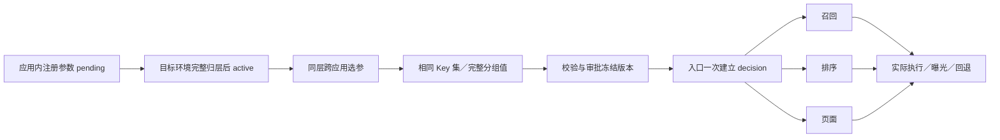

# 跨应用联动实验设计

设计 v1.2 · 2026-09-23｜实现基线：v23 前端原型

联动实验在同一合法参数层内选择多个应用参数，以同一实验分组控制整条业务链。v23 已实现配置与本地模拟；真实 Namespace、授权、SDK、上下文传播和发布均未实现。

## 1. 先区分边界

| 边界 | 职责 |
| --- | --- |
| Namespace | 完整资源与授权作用域，直接承接旧项目，不叠加 project／space |
| 应用／服务 | 参数维护与执行责任，不自动决定参数层 |
| 应用私有标签 | 搜索和分类，不授予权限、不决定实验运行参数 |
| 域 | 取得父层一部分流量，继承父层全部参数 |
| 参数层 | 管理本域互不重复的参数集合，承载实验或子域 |
| 实验／分组 | 固定参数集合，2–20 组配置取值，唯一对照 |
| 画像／受众 | 独立资格目录与固定条件版本，不作为实验参数下发 |

创建实验不再选择前端／后端／策略类型；涉及服务从参数归属推导。参数组合约束保持下线，不恢复组合规则编辑器。类型、JSON、作用域和生产服务兼容性校验仍保留。

## 2. Namespace 选择

单企业平台使用全局账号和多对多 Namespace 成员关系，不设租户。Namespace 不等同团队；平台账号不同于业务 `user_id`。

- 招聘、房产、本地生活的独立业务流程可各自管理 Namespace。
- 同一首页共用画像、混排和运行参数时，使用同一消费者 Namespace，再按资源向团队授权。
- 跨 Namespace 不能直接引用参数或层；同一运行参数不能由多个 Namespace 竞争控制。
- 分桶空间隔离不使用户流量互斥，也不使业务效果独立。

生产使用 `namespace_id` 与 `/namespaces/`。成员只准入，不能自动看全部资源；能用某层不代表能改它引用的参数。跨应用完整配置的编排、提交和发布需对应实验动作、目标层 use、全部参数／受众／指标的必要 read/use；未完成草稿和审批按各自规则检查，详见[Namespace 与权限设计](./服务端技术方案/05-Namespace与权限设计.md)。

## 3. 共享首页布局

```text
消费者 Namespace / 生产环境
根域 → 唯一根路由层
  ├ 日常实验域
  │ ├ 公共画像层：画像／特征策略
  │ ├ 混排层：跨业务配额、价值换算、多样性
  │ ├ 招聘层：招聘召回与业务内排序
  │ ├ 房产层：房产召回与业务内排序
  │ └ 本地生活层：本地召回与业务内排序
  ├ 联合实验域 → 完整参数层 → 联合实验
  └ 长期保留组域（可选）
```

根域不能增加普通业务层；三个分支在根路由中互斥，比例按样本和计划确定。每个子域创建时只生成一个完整初始层，日常域之后再按能力拆分。

| 参数示例 | 归属原则 |
| --- | --- |
| `profile.intent.model` | 公共画像能力；若与混排必须成套变化，应合层 |
| `home.mix.jobs_quota` | 改变所有业务展示机会，属于公共混排 |
| `jobs.recall.plan`、`jobs.rank.model` | 招聘内部策略 |
| 单一大对象 `home.strategy` | 整个顶层 Key 只能归一个层，内部路径不能分别归层 |

同域参数必须完整且唯一归层，实验不得越层。招聘层下面的子域只能继承招聘参数，也不会关闭兄弟混排层。强耦合全链路方案应放在根路由兄弟联合域的完整参数层。

## 4. 联合实验例子

问题：提高招聘配额和更换招聘排序模型，是否一起生效？在联合域中建立一个四分组实验：

| 组 | 混排配额 | 招聘模型 | 含义 |
| --- | --- | --- | --- |
| A，对照 | 当前值 | 当前模型 | 基线 |
| B | 新值 | 当前模型 | 只改混排 |
| C | 当前值 | 新模型 | 只改排序 |
| D | 新值 | 新模型 | 两者都改 |

四组声明相同的两个顶层参数 Key，分别配置完整值；其他研究条件预先固定。v23 能承载这套 2×2 配置与本地分流，不提供真实统计检验。若仅设“基线／全部改变”两组，只能比较整体方案。

[指标一期设计](./服务端技术方案/04-指标生产与分析.md)默认比较 B、C、D 各自对 A，并用 Holm 校正，不自动检验交互。正式交互分析需在启动前定义效应尺度、对比项（如加性均值尺度的 D − C − B + A）、标准误／区间、多重比较及样本方案，并扩展分析计划和计算实现。不能仅凭“一组显著、另一组不显著”或分别对照比较的结果认定存在交互。

日常域各层独立随机分配，估计的是当前其他实验组合下的平均效果。效果有交互不自动破坏该平均估计，但不能据此把收益相加或保证全量组合效果。记录全部 assignment，预先规定重要组合分析及样本要求。

## 5. 从参数到运行



前四项的目录、配置及本地校验已实现；审批冻结、生产 decision 与真实执行观测待实现。

- 标签筛选不改变已保存参数集合；批量加入保留旧值，仅为新增项填默认值。
- 各组参数含义、权重、资格和分析计划冻结到 run，变化时新建 run。
- 下游复用同一上下文，不因读取新配置再次 evaluate；同 user_id 本身不足以保证一致。
- 发布前验证全部服务的模型、索引、Schema 和 bundle；统一回退由业务编排定义。
- 业务缓存按影响结果的处理／模型版本隔离，缓存命中仍记录当前请求执行身份。
- assignment、处理前资格、execution、exposure 和业务结果分开；读取配置不算曝光。

## 6. 受众、画像反馈与供需干扰

| 风险 | 设计要求 |
| --- | --- |
| 实验后按“看见招聘帖／点击房产”筛人 | 主分析按处理前资格与首页机会定义，保留原分组 |
| 多业务意图重叠 | 不把画像标签天然视为互斥人群；AND／OR 完整条件可证明互斥才复用桶 |
| 画像被前序处理修改后再决定另一个实验入组 | 固定并记录资格时点，明确目标群体；不能直接按简单正交组合解释 |
| 共用训练数据／在线画像写回 | 明确反馈路径，必要时固定模型或隔离训练、状态与缓存 |
| 同一岗位、房源、商家服务多个用户 | 用户级随机化不能自动消除供需竞争；必要时另设计市场簇或时间切换实验 |
| 长期保留组跟随最新默认值 | 明确参考策略、允许同步的更新及稳定成员，否则不能测累计收益 |

固定资格只保证入组条件不漂移，不隔离后续学习反馈。根路由联合域只隔离本 Namespace 内的实验分配，不能自动隔离其他 Namespace、共享供给或模型训练。首期生产随机化单元为 user_id，集群／时间切换属于后续方案。

## 7. 验证与资料

当前每层固定 10,000 桶，可组合碎片且不搬旧桶。资格不符不换桶补量，名义比例不等于实测人数；配置校验不能替代因果设计。

生产验收检查：授权完整性、跨服务同组、实际参数版本、联合回退、缓存污染、处理前资格、数据质量及组合效应。接口和运行细节分别见[API](./服务端技术方案/02-接口协议.md)、[SDK 协议](./服务端技术方案/03-SDK与分流协议.md)、[指标分析](./服务端技术方案/04-指标生产与分析.md)。

现有交互见[使用手册](./平台文档/03-平台使用手册.md)，历史验证见 [VERIFICATION](./VERIFICATION.md)，旧服务参数设计见[历史规格](./superpowers/specs/2026-09-12-service-owned-parameters.md)。
